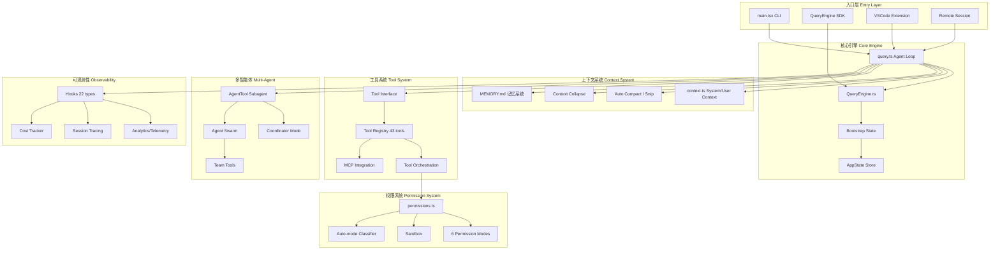
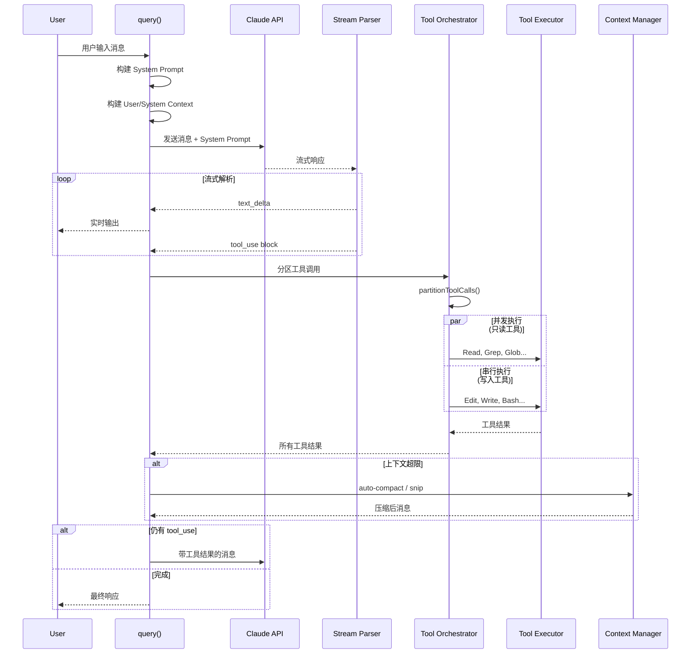
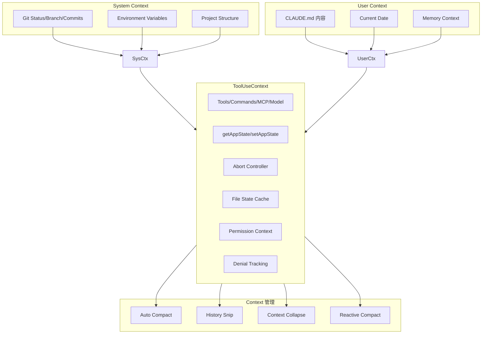
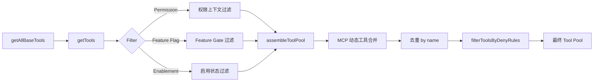
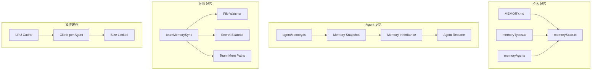
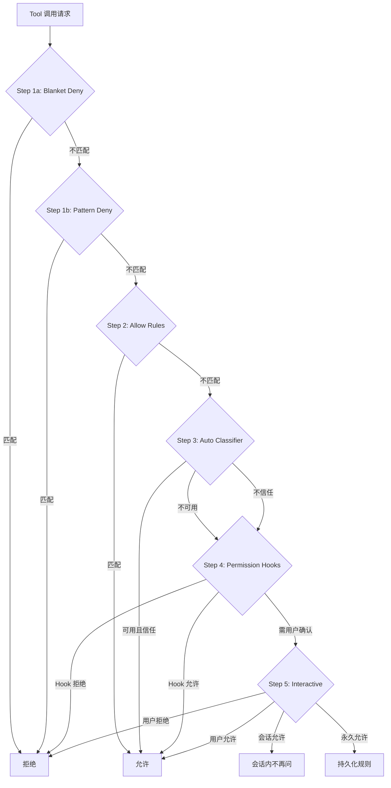
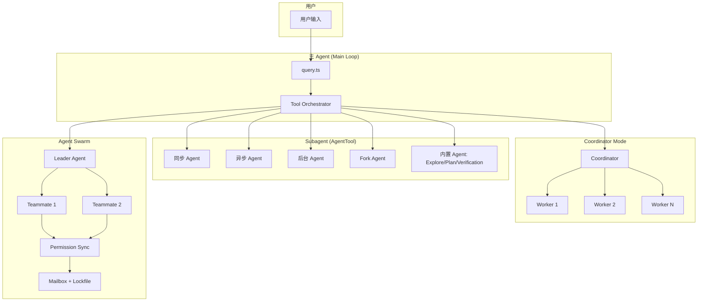
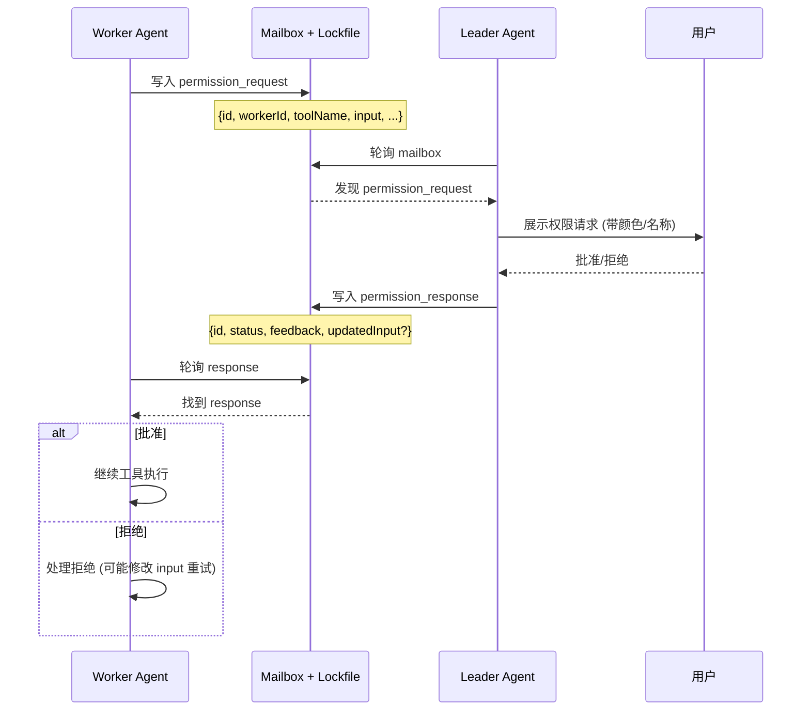

# Claude Code 源码深度解读：从 Agent Loop 到多智能体编排

> 基于对 Claude Code 源码的系统性分析，本文从 11 个维度拆解其架构设计，涵盖 Agent Loop、Context 管理、Tool 调用、Memory、权限安全、多智能体协作、可观测性等核心模块。

---

## 一、整体架构

Claude Code 是一个基于 TypeScript 的终端 Agent 应用，构建在 Bun 运行时之上，采用 React + Ink 渲染 TUI。其架构设计遵循**分层解耦、流式驱动、不可变状态**三大原则。

### 1.1 架构全景图



### 1.2 入口架构

```
src/main.tsx (~3000行)
├── 参数解析 (argparse)
├── Feature Flag 门控 (feature() from bun:bundle)
├── 环境检测 (USER_TYPE, CLAUDE_CODE_ENTRYPOINT)
├── 初始化 (迁移、设置、插件)
├── 交互式 REPL 模式
└── 无头模式 (-p/--print)
```

多客户端支持通过**入口点检测**实现：

| 客户端 | 检测方式 |
|--------|----------|
| CLI | 直接执行 |
| SDK | `CLAUDE_CODE_ENTRYPOINT=sdk` |
| VSCode | Extension 调用 |
| Desktop | Electron 进程 |
| Remote | WebSocket 会话 |
| GitHub Actions | CI 环境检测 |

### 1.3 状态管理

采用**双轨状态架构**：

```
Bootstrap State (全局单例, ~1758行)
├── 模块级 getter/setter
├── 会话生命周期管理
├── Feature Flag 状态
└── 全局配置

AppState Store (不可变状态, ~50+字段)
├── DeepImmutable<T> 类型约束
├── 函数式更新 setAppState(prev => ({...prev, ...}))
├── 选择器模式 (selectors)
└── 按 Agent 隔离 (每个 subagent 独立副本)
```

---

## 二、Agent Loop：流式驱动的核心循环

Agent Loop 是 Claude Code 的心脏，采用 **async generator** 模式实现流式处理。

### 2.1 Agent Loop 流程图



### 2.2 核心实现

`src/query.ts` (~1729行) 中的 `query()` 函数是一个 **async generator**：

```typescript
export async function* query(params: QueryParams): AsyncGenerator<
  StreamEvent | RequestStartEvent | Message | TombstoneMessage | ToolUseSummaryMessage,
  Terminal
> {
  const consumedCommandUuids: string[] = []
  const terminal = yield* queryLoop(params, consumedCommandUuids)
  // 完成后通知命令生命周期
  for (const uuid of consumedCommandUuids) {
    notifyCommandLifecycle(uuid, 'completed')
  }
  return terminal
}
```

**关键设计**：

| 特性 | 实现 | 说明 |
|------|------|------|
| **状态管理** | `State` 对象跨迭代携带 | messages, toolUseContext, autoCompactTracking 等 |
| **Token 预算** | `createBudgetTracker()` | 自动续接，+500k 自动继续 |
| **错误恢复** | MAX_OUTPUT_TOKENS_RECOVERY_LIMIT = 3 | 最多 3 次重试 |
| **Thinking 规则** | 严格排序要求 | thinking/redacted_thinking 块必须保留在 trajectory 中 |
| **命令队列** | `processQueueIfReady()` | 用户命令在 turn 之间处理 |

### 2.3 错误恢复机制

```
API 调用失败
├── Prompt Too Long
│   └── auto-compact / history snip / context collapse
├── Max Output Tokens
│   └── 重试 (最多3次) → 增加 max_tokens
├── API Error
│   └── 指数退避重试
└── Fallback Model
    └── 切换到备用模型
```

### 2.4 QueryEngine 封装

`src/QueryEngine.ts` (~1295行) 为 SDK/无头场景提供类封装：

```typescript
class QueryEngine {
  async *submitMessage(): AsyncGenerator<SDKMessage> {
    // 消息变异 → 转录记录 → 使用追踪 → 权限拒绝追踪 → 结构化输出
  }
  
  async ask(): Promise<SDKMessage> {
    // 一次性 prompt 执行的便捷包装
  }
}
```

---

## 三、Context 系统：上下文的全生命周期管理

### 3.1 Context 架构图



### 3.2 System Context 构建

```typescript
// src/context.ts - 带 memoization
getSystemContext()  // Git 状态、分支信息、最近提交
getUserContext()    // CLAUDE.md 内容、当前日期
```

**缓存失效策略**：可选的 system prompt injection（ant-only 调试场景）。

### 3.3 上下文压缩策略

| 策略 | 触发条件 | 实现 |
|------|----------|------|
| **Auto Compact** | 接近上下文窗口限制 | 自动压缩历史消息 |
| **History Snip** | Feature-gated | 消息级裁剪 |
| **Context Collapse** | Feature-gated | 激进上下文缩减 |
| **Reactive Compact** | 按需触发 | 上下文压力驱动 |

### 3.4 ToolUseContext：工具调用的丰富上下文

每个工具调用都会收到一个包含 ~15 类信息的上下文对象：

```
ToolUseContext
├── options: { tools, commands, mcpClients, model, thinking }
├── getAppState / setAppState
├── abortController
├── fileStateCache (LRU 缓存，每 agent 独立)
├── messages: Message[]
├── agentId / agentType
├── permissionContext
├── denialTracking
├── notificationHandlers
└── promptRequestFactory
```

---

## 四、Tool 调用机制：43 个工具的编排艺术

### 4.1 Tool 接口设计

```typescript
// src/Tool.ts - 泛型 Tool 接口 (~40个属性/方法)
interface Tool<Input, Output, Progress> {
  // 核心方法
  call(input: Input, context: ToolUseContext): Promise<Output>
  description(): string
  prompt(): string
  
  // 安全检查
  isReadOnly(): boolean
  isDestructive(): boolean
  isConcurrencySafe(input: Input): boolean
  
  // 权限
  checkPermissions(input, context): PermissionResult
  toAutoClassifierInput(): object
  
  // 渲染
  renderToolUseMessage(): ReactElement
  renderToolResultMessage(): ReactElement
  renderToolUseProgressMessage(): ReactElement
  
  // 验证
  validateInput(input): ValidationResult
  isEnabled(context): boolean
}
```

### 4.2 Tool 注册与过滤



### 4.3 工具分类 (43 个)

| 类别 | 工具 | 数量 |
|------|------|------|
| **核心** | Bash, FileRead, FileEdit, FileWrite, Glob, Grep | 6 |
| **网络** | WebSearch, WebFetch | 2 |
| **任务管理** | TaskCreate, TaskGet, TaskUpdate, TaskList, TaskStop, TaskOutput | 6 |
| **Agent** | AgentTool, TeamCreate, TeamDelete, SendMessage | 4 |
| **MCP** | MCPTool, ListMcpResources, ReadMcpResource, McpAuth | 4 |
| **规划** | EnterPlanMode, ExitPlanModeV2, TodoWrite | 3 |
| **特殊** | SkillTool, ConfigTool, LSPTool, WorkflowTool, ScheduleCron | 5 |
| **特性门控** | REPLTool, SleepTool, PushNotification, WebBrowser, SnipTool | 5+ |
| **其他** | NotebookEdit, BriefTool, Testing, Tungsten, AskUserQuestion 等 | 8+ |

### 4.4 工具编排：读写分离的并发策略

```typescript
// src/services/tools/toolOrchestration.ts

// 分区：连续只读工具并发，写入工具串行
function partitionToolCalls(toolUses: ToolUseBlock[]) {
  // 将连续的 isConcurrencySafe 工具分组为并发批次
  // 遇到非安全工具则独立为串行执行
}

async function runTools() {
  // 1. partitionToolCalls() - 分区
  // 2. 并发组 → runToolsConcurrently()
  // 3. 串行组 → runToolsSerially()
  // 4. 最大并发度: CLAUDE_CODE_MAX_TOOL_USE_CONCURRENCY (默认 10)
}
```

**并发控制策略**：

```
工具调用列表
├── [Read, Grep, Glob]  → 并发执行 (只读组)
├── [Edit]              → 串行执行 (写入)
├── [Read, Glob]        → 并发执行 (只读组)
└── [Bash]              → 串行执行 (潜在写入)
```

### 4.5 Tool Builder 模式

```typescript
// buildTool(def) 工厂函数 - 提供安全默认值
buildTool({
  name: 'MyTool',
  call: async (input, ctx) => { ... },
  // 以下方法有安全默认值 (fail-closed)
  // isEnabled: () => true
  // isConcurrencySafe: () => false  ← 默认不安全
  // isReadOnly: () => false
  // isDestructive: () => false
})
```

---

## 五、Memory 管理：从个人记忆到团队同步

### 5.1 Memory 架构图



### 5.2 MEMORY.md 系统

```typescript
// src/memdir/memdir.ts
const MAX_ENTRYPOINT_LINES = 200      // 200 行上限
const MAX_ENTRYPOINT_BYTES = 25_000   // ~25KB 上限

// 双重截断：先行截断，再字节截断
function truncateEntrypointContent(raw: string): EntrypointTruncation {
  // 行截断 → 字节截断 → 警告标记
}
```

### 5.3 记忆检索流程

```
用户输入
└── memoryScan.ts
    ├── 扫描记忆目录
    ├── 按相关性排序
    ├── 加载相关文件
    └── 过滤重复记忆附件
        └── 注入到 User Context
```

### 5.4 Agent 记忆继承

```
父 Agent
└── agentMemorySnapshot()
    ├── 捕获当前状态
    └── 传递给子 Agent
        ├── 同步 Agent: 共享快照
        ├── 异步 Agent: 独立快照
        └── Fork Agent: 继承父级 system prompt
```

### 5.5 团队记忆同步

```typescript
// src/services/teamMemorySync/
index.ts      // 团队记忆同步服务
watcher.ts    // 文件变更监听
secretScanner.ts    // 密钥检测
teamMemSecretGuard.ts  // 密钥防护
teamMemPaths.ts   // 团队记忆路径
teamMemPrompts.ts // 团队提示词
```

**安全特性**：团队记忆写入前经过密钥扫描，防止敏感信息泄露。

### 5.6 文件状态缓存

```typescript
// src/utils/fileStateCache.ts
// LRU 缓存，每个 agent 独立克隆
// 异步 agent 有大小限制，防止内存泄漏
```

---

## 六、权限与安全：五层决策引擎

### 6.1 权限决策流程图



### 6.2 权限模式 (6 种)

| 模式 | 行为 | 适用场景 |
|------|------|----------|
| **default** | 每次询问 | 默认安全模式 |
| **plan** | 只读，不允许编辑 | 规划阶段 |
| **acceptEdits** | 自动允许编辑 | 信任 Agent 的编辑能力 |
| **bypassPermissions** | 完全跳过权限检查 | 完全信任 |
| **dontAsk** | 拒绝而不询问 | 自动化场景 |
| **auto** | ML 分类器决策 | 智能权限判断 |

### 6.3 规则解析

```typescript
// permissionRuleParser.ts
// 支持模式匹配，如:
// "Bash(git *)"     → 允许所有 git 命令
// "Edit(src/**)"    → 允许编辑 src 目录下的文件
// "Bash(rm -rf *)"  → 拒绝危险删除操作
```

### 6.4 拒绝追踪与降级

```typescript
// denialTracking.ts
// 追踪连续拒绝次数
// 超过阈值后降级为交互式询问
const DENIAL_LIMITS = {
  // 连续拒绝 N 次后 fallback
}

function shouldFallbackToPrompting(state: DenialTrackingState): boolean {
  // 连续拒绝过多 → 自动模式不可信 → 回退到用户确认
}
```

### 6.5 安全层

```
权限系统
├── Sandbox (macOS Seatbelt)
│   └── sandbox-adapter.js
├── Auto-mode Classifier
│   ├── yoloClassifier.ts
│   └── classifierDecision.ts
├── Hook-based 权限检查
│   ├── PreToolUse
│   └── PostToolUse
├── 密钥扫描
│   └── teamMemSecretGuard.ts
├── MDM Policy 限制
│   └── 企业策略执行
└── Remote Managed Settings
    └── 管理员配置控制
```

---

## 七、多智能体系统：Subagent / Team / Swarm / Coordinator

### 7.1 多智能体架构全景



### 7.2 Agent 类型对比

| 类型 | 阻塞父级 | 共享 Abort | 执行方式 | 适用场景 |
|------|----------|------------|----------|----------|
| **Sync Agent** | ✅ | ✅ | 阻塞父 turn | 需要立即结果的子任务 |
| **Async Agent** | ❌ | ❌ | 独立运行，完成通知 | 长时间运行的后台任务 |
| **Background Agent** | 初始阻塞 → 自动后台 | ❌ | 120s 后自动转后台 | 超长时间任务 |
| **Fork Agent** | ✅ | ✅ | 缓存优化，继承父 prompt | 需要 cache-identical prefix 的场景 |
| **Built-in Agent** | 视类型 | 视类型 | 预定义行为 | Explore/Plan/Verification |

### 7.3 AgentTool 实现

```typescript
// src/tools/AgentTool/AgentTool.tsx (~1400行)
// src/tools/AgentTool/runAgent.ts (~973行)

// 核心能力
├── 子 Agent 生成
├── 独立 query loop
├── 工具池过滤 (deny rules)
├── MCP 需求过滤
├── Model 选择 (per-agent)
├── Worktree 管理
├── Agent 颜色管理
├── 进度追踪
├── 远程 Agent 支持
└── Agent 元数据持久化
```

### 7.4 Coordinator Mode

```typescript
// src/coordinator/coordinatorMode.ts
// 通过 CLAUDE_CODE_COORDINATOR_MODE 环境变量启用

// Worker 工具集 (受限)
const ASYNC_AGENT_ALLOWED_TOOLS = [
  // 只允许基础工具
]

// Coordinator 专属工具
const INTERNAL_WORKER_TOOLS = new Set([
  TEAM_CREATE_TOOL_NAME,
  TEAM_DELETE_TOOL_NAME,
  SEND_MESSAGE_TOOL_NAME,
  SYNTHETIC_OUTPUT_TOOL_NAME,
])
```

**工作流模式**：

```
Research (并行) → Synthesis (Coordinator) → Implementation → Verification
    ↓                    ↓                       ↓                ↓
 多个 Worker        汇总结果               实现代码          验证通过
 独立调研          制定计划               修改文件          测试通过
```

### 7.5 Agent Swarm

```
src/utils/swarm/ (~18+ 文件)
├── backends/
│   ├── TmuxBackend.ts      # Tmux 终端后端
│   ├── ITermBackend.ts     # iTerm2 终端后端
│   └── InProcessBackend.ts # 进程内后端
├── spawnInProcess.ts       # 进程内 teammate 生成
├── inProcessRunner.ts      # 进程内执行器
├── teammateInit.ts         # Teammate 初始化
├── teammateModel.ts        # 每个 teammate 的模型选择
├── teammateLayoutManager.ts # 终端面板布局
├── permissionSync.ts (~928行) # 跨 agent 权限协调
├── leaderPermissionBridge.ts # Leader 中介权限解析
├── teamHelpers.ts          # 团队文件操作
└── reconnection.ts         # 团队重连逻辑
```

### 7.6 Swarm 权限同步 (Mailbox 模式)



### 7.7 四种模式对比

| 维度 | Subagent | Coordinator | Swarm | Team |
|------|----------|-------------|-------|------|
| **复杂度** | 低 | 中 | 高 | 中高 |
| **通信** | 直接调用 | SendMessage | Mailbox | Team 文件 |
| **权限** | 继承/独立 | Coordinator 代理 | Leader 桥接 | 共享 |
| **终端** | 共享 | 共享 | 独立面板 | 独立面板 |
| **适用** | 子任务委托 | 多 worker 编排 | 并行探索 | 团队协作 |
| **后端** | 进程内 | 进程内 | Tmux/iTerm2/InProcess | Tmux/iTerm2 |

---

## 八、可观测性：22 种 Hook 与全链路追踪

### 8.1 Hook 系统架构

```mermaid
graph TB
    subgraph "Hook 类型 (22种)"
        Lifecycle[生命周期]
        Tool[工具]
        Agent[Agent]
        Context[上下文]
        Permission[权限]
        Custom[自定义]
    end

    subgraph "Hook 来源"
        Config[配置文件]
        Frontmatter[Agent Frontmatter]
        Plugin[Plugin Hooks]
        Session[Session Hooks]
    end

    subgraph "Hook 执行"
        Spawn[子进程执行]
        Timeout[超时控制]
        Async[异步注册]
        Parallel[并行执行]
    end

    subgraph "可观测性"
        Telemetry[Analytics]
        Tracing[OpenTelemetry]
        Perfetto[Perfetto Tracing]
        Cost[Cost Tracking]
    end

    Lifecycle --> SessionStart
    Lifecycle --> SessionEnd
    Lifecycle --> Stop
    Lifecycle --> StopFailure

    Tool --> PreToolUse
    Tool --> PostToolUse
    Tool --> PostToolUseFailure

    Agent --> SubagentStart
    Agent --> SubagentStop

    Context --> PreCompact
    Context --> PostCompact
    Context --> CwdChanged
    Context --> FileChanged

    Permission --> PermissionDenied
    Permission --> PermissionRequest

    Custom --> UserPromptSubmit
    Custom --> TaskCreated
    Custom --> TaskCompleted
    Custom --> Elicitation
    Custom --> ConfigChange
    Custom --> InstructionsLoaded
    Custom --> TeammateIdle

    Config --> Spawn
    Frontmatter --> Spawn
    Plugin --> Spawn
    Session --> Spawn

    Spawn --> Timeout
    Spawn --> Async
    Spawn --> Parallel

    Spawn --> Telemetry
    Telemetry --> Tracing
    Tracing --> Perfetto
    Tracing --> Cost
```



### 8.2 22 种 Hook 类型

| 类别 | Hook 类型 | 触发时机 |
|------|-----------|----------|
| **生命周期** | SessionStart | 会话开始 |
| | SessionEnd | 会话结束 |
| | Stop | 正常停止 |
| | StopFailure | 异常停止 |
| **工具** | PreToolUse | 工具执行前 |
| | PostToolUse | 工具执行后 |
| | PostToolUseFailure | 工具执行失败 |
| **Agent** | SubagentStart | 子 Agent 启动 |
| | SubagentStop | 子 Agent 停止 |
| **上下文** | PreCompact | 上下文压缩前 |
| | PostCompact | 上下文压缩后 |
| | CwdChanged | 工作目录变更 |
| | FileChanged | 文件变更 |
| **权限** | PermissionDenied | 权限被拒绝 |
| | PermissionRequest | 权限请求 |
| **自定义** | UserPromptSubmit | 用户 prompt 提交前 |
| | TaskCreated | 任务创建 |
| | TaskCompleted | 任务完成 |
| | Elicitation | MCP 诱导请求 |
| | ConfigChange | 配置变更 |
| | InstructionsLoaded | 指令加载完成 |
| | TeammateIdle | Teammate 空闲 |

### 8.3 Hook 执行模型

```typescript
// src/utils/hooks.ts (~5022行)

// Hook 作为子进程执行
const TOOL_HOOK_EXECUTION_TIMEOUT_MS = 10 * 60 * 1000  // 10 分钟
const SESSION_END_HOOK_TIMEOUT_MS_DEFAULT = 1500       // 1.5 秒

// 异步 Hook 注册表
class AsyncHookRegistry {
  // 追踪待完成的异步 Hook
}

// Hook 执行流程
executeHook(hookEvent, input) {
  // 1. 匹配 Hook (配置 + frontmatter + plugin + session)
  // 2. 构建输入 JSON
  // 3. 生成子进程
  // 4. 解析输出 (同步/异步)
  // 5. 处理响应 (消息注入/权限更新/...)
}
```

### 8.4 遥测与分析

```
src/services/analytics/
├── index.ts          // 核心 analytics, logEvent()
├── sink.ts           // 事件 sink 管理
├── sinkKillswitch.ts // sink 熔断
├── datadog.ts        // Datadog 集成
├── growthbook.ts     // Feature Flag 系统 (Statsig/GrowthBook)
├── firstPartyEventLogger.ts       // 第一方事件
└── firstPartyEventLoggingExporter.ts  // 事件导出
```

### 8.5 追踪系统

```typescript
// OpenTelemetry Session Tracing
startHookSpan(hookName)  // Hook span 开始
endHookSpan(span)        // Hook span 结束

// Perfetto Tracing (Agent 层级可视化)
// 可视化 Agent 父子关系、工具调用链、时间线
```

### 8.6 成本追踪

```typescript
// src/cost-tracker.ts
getModelUsage()      // 模型使用统计
getTotalCost()       // 总成本 (USD)
getTotalAPIDuration() // API 总耗时
```

---

## 九、调度系统：Cron、队列与 Loop 技能

### 9.1 调度架构

```mermaid
graph TB
    subgraph "用户接口"
        LoopCmd[/loop 命令]
        NaturalLang[自然语言间隔]
    end

    subgraph "调度引擎"
        LoopSkill[loop.ts Skill]
        IntervalParse[间隔解析]
        CronConvert[Cron 转换]
    end

    subgraph "Cron 工具"
        CronCreate[CronCreateTool]
        CronDelete[CronDeleteTool]
        CronList[CronListTool]
    end

    subgraph "队列系统"
        Queue[Message Queue]
        QueueMgr[Queue Manager]
        ProcessQueue[processQueueIfReady]
        AgentRoute[Agent 路由]
    end

    subgraph "远程触发"
        RemoteTrigger[RemoteTriggerTool]
    end

    LoopCmd --> LoopSkill
    NaturalLang --> LoopSkill
    LoopSkill --> IntervalParse
    IntervalParse --> CronConvert
    CronConvert --> CronCreate

    CronCreate --> CronList
    CronCreate --> CronDelete

    Queue --> QueueMgr
    QueueMgr --> ProcessQueue
    ProcessQueue --> AgentRoute

    RemoteTrigger --> Queue
```

### 9.2 Cron 调度

```typescript
// src/tools/ScheduleCronTool/
// 间隔解析: Ns, Nm, Nh, Nd → cron 表达式
// 自动过期: DEFAULT_MAX_AGE_DAYS

// 支持的间隔格式
"every 5 minutes"  → */5 * * * *
"every 2 hours"    → 0 */2 * * *
"every 3 days"     → 0 0 */3 * *
```

### 9.3 Loop 技能

```typescript
// src/skills/bundled/loop.ts
// /loop 命令 - 用户友好的循环任务调度
// 解析自然语言间隔
// 转换为 cron 表达式
// 通过 CronCreateTool 调度
```

### 9.4 消息队列

```typescript
// src/utils/queueProcessor.ts
// src/utils/messageQueueManager.ts

// 队列能力
├── 用户 prompt 排队
├── 任务通知排队
├── Bash 命令排队
├── 优先级队列
├── Slash 命令检测与路由
├── 非 slash 命令批量处理 (相同 mode)
└── Agent 路由 (通过 agentId 寻址)
```

**队列处理策略**：

```
消息队列
├── 非 slash 命令 + 相同 mode → 批量处理
├── Slash 命令 → 逐个处理
├── Bash 命令 → 逐个处理
└── 带 agentId → 路由到指定 Agent
```

---

## 十、复用模式：10 种架构模式总结

### 10.1 模式一览表

| # | 模式 | 应用场景 | 核心文件 |
|---|------|----------|----------|
| 1 | **Async Generator** | query/submitMessage/runAgent/runTools 统一流式 | query.ts, QueryEngine.ts |
| 2 | **Feature Flag** | 编译时死代码消除 | bun:bundle, feature() |
| 3 | **Context Injection** | ToolUseContext 统一注入 | Tool.ts |
| 4 | **Tool Builder** | 工厂 + 安全默认值 | buildTool(def) |
| 5 | **Immutable State** | DeepImmutable + 函数式更新 | AppStateStore.ts |
| 6 | **Mailbox** | 跨 Agent 协调 (lockfile) | permissionSync.ts |
| 7 | **Cache-Aware** | Prompt cache + content-hash | 多处 |
| 8 | **Lazy Schema** | 打破循环依赖 | lazySchema() |
| 9 | **Dead Code Elimination** | 条件导入 + 用户类型分支 | require() 动态加载 |
| 10 | **Hook Event** | 生命周期事件发射 | hooks.ts |

### 10.2 模式详解

#### 模式 1: Async Generator

```typescript
// 统一的流式处理模式
async function* query(): AsyncGenerator<Event, Terminal> { ... }
async function* submitMessage(): AsyncGenerator<SDKMessage> { ... }
async function* runAgent(): AsyncGenerator<Message> { ... }
async function* runTools(): AsyncGenerator<MessageUpdate> { ... }
```

**优势**：天然支持流式响应、增量处理、中间状态观察。

#### 模式 2: Feature Flag

```typescript
// 编译时死代码消除
const reactiveCompact = feature('REACTIVE_COMPACT')
  ? require('./reactiveCompact.js')
  : null

// Schema 门控
...(feature('TRANSCRIPT_CLASSIFIER') ? { auto: 'auto' } : {})
```

#### 模式 3: Context Injection

```typescript
// 每个 tool 接收统一的 ToolUseContext
call(input: Input, context: ToolUseContext): Promise<Output>

// Subagent 创建独立上下文
createSubagentContext(parent, { shareAppState: true })
```

#### 模式 4: Tool Builder

```typescript
buildTool({
  name: 'MyTool',
  call: async (input, ctx) => { ... },
  // 安全默认值 (fail-closed)
  // isConcurrencySafe: () => false  ← 默认不安全
  // isReadOnly: () => false
})
```

#### 模式 5: Immutable State

```typescript
type AppState = DeepImmutable<{
  messages: Message[]
  tools: Tools
  // ... 50+ 字段
}>

// 函数式更新
setAppState(prev => ({ ...prev, messages: [...prev.messages, newMsg] }))
```

#### 模式 6: Mailbox

```
文件级 Mailbox
├── 写入: 创建 .json 文件到 mailbox 目录
├── 读取: 扫描目录 + 解析 JSON
├── 锁: lockfile 保证并发安全
└── 清理: 处理后删除
```

#### 模式 7: Cache-Aware

```typescript
// Prompt cache break 检测
// Content-hash 临时文件路径 (避免 UUID 导致的 cache miss)
// Fork Agent 继承父级 system prompt (cache-identical prefix)
// Turn 开始时冻结渲染的 system prompt
```

---

## 十一、关键文件索引

| 组件 | 核心文件 | 行数 |
|------|----------|------|
| **入口** | `src/main.tsx` | ~3000+ |
| **Agent Loop** | `src/query.ts` | 1729 |
| **Query Engine** | `src/QueryEngine.ts` | 1295 |
| **Tool 接口** | `src/Tool.ts` | 792 |
| **Tool 注册** | `src/tools.ts` | 389 |
| **Tool 编排** | `src/services/tools/toolOrchestration.ts` | 188 |
| **权限引擎** | `src/utils/permissions/permissions.ts` | 1486 |
| **权限模式** | `src/utils/permissions/PermissionMode.ts` | 141 |
| **Hooks** | `src/utils/hooks.ts` | 5022 |
| **Agent Tool** | `src/tools/AgentTool/AgentTool.tsx` | ~1400 |
| **Run Agent** | `src/tools/AgentTool/runAgent.ts` | ~973 |
| **Coordinator** | `src/coordinator/coordinatorMode.ts` | 369 |
| **Swarm 权限** | `src/utils/swarm/permissionSync.ts` | 928 |
| **Memory** | `src/memdir/memdir.ts` | 507 |
| **State** | `src/bootstrap/state.ts` | ~1758 |
| **AppState** | `src/state/AppStateStore.ts` | 569 |

---

## 十二、总结

Claude Code 的架构设计体现了几个核心理念：

1. **流式优先**：从 Agent Loop 到 Tool 执行，全部采用 async generator，天然支持流式处理和增量渲染。

2. **安全默认**：Tool Builder 的 fail-closed 设计、权限系统的五层决策、Sandbox 隔离，处处体现安全优先。

3. **不可变状态**：DeepImmutable 类型约束 + 函数式更新，避免状态突变带来的难以追踪的 bug。

4. **模块化编排**：43 个工具通过统一的接口和编排器协同工作，读写分离的并发策略兼顾了性能和安全。

5. **多智能体层次**：从简单的 Subagent 到复杂的 Swarm，提供了不同复杂度的多智能体方案，适应不同场景需求。

6. **可观测性内建**：22 种 Hook 类型 + OpenTelemetry 追踪 + Perfetto 可视化，让系统行为完全可观测。

7. **Feature Flag 驱动**：通过 `bun:bundle` 的 feature() 实现编译时死代码消除，同时支持灰度发布和 A/B 测试。

这套架构不仅支撑了 Claude Code 作为终端 Agent 的核心功能，也为未来的扩展（如远程 Agent、更多 MCP 集成、更复杂的多智能体协作）预留了充分的空间。
