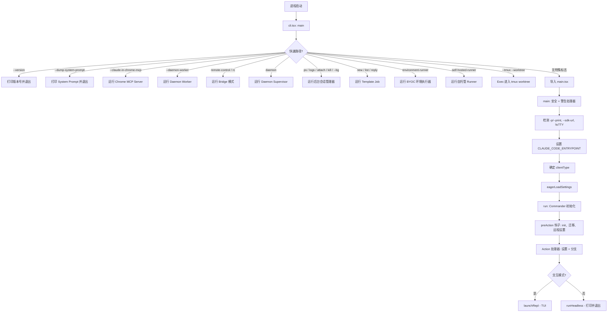
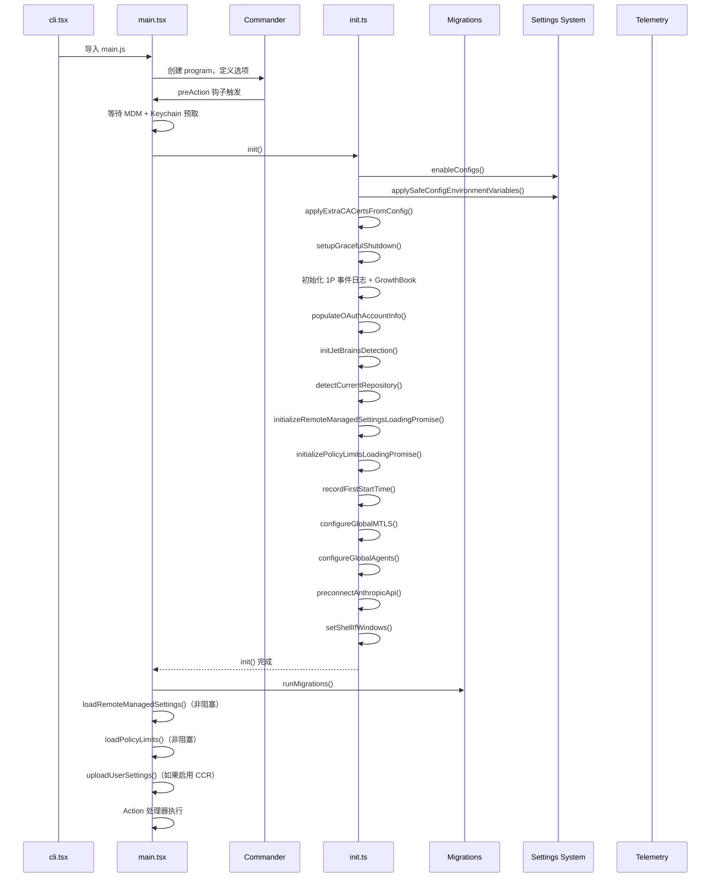

# 入口层 (Entry Layer)

> 入口层是 Claude Code 的最外层边界——当二进制文件启动时最先执行的代码，也是应用程序核心接管之前的最后一个控制点。它负责 CLI 参数解析、多客户端检测、Feature Flag 门控、环境初始化，以及交互式 REPL 与无头模式之间的分支路由。

## 模块概述

入口层负责以下核心职责：

- **进程引导 (Process Bootstrap)** — 最小化启动，支持快速路径退出（`--version`、`--dump-system-prompt` 等）
- **多客户端检测 (Multi-Client Detection)** — 识别 Claude Code 的调用方式（CLI、SDK、VSCode、Desktop、Remote、GitHub Actions）
- **Feature Flag 门控 (Feature Flag Gating)** — 通过 `bun:bundle` 实现编译时和运行时的特性开关
- **环境初始化 (Environment Initialization)** — 数据迁移、设置加载、插件注册、遥测初始化
- **模式分支 (Mode Branching)** — 交互式 REPL 与无头 `-p/--print` 执行路径的分流
- **特殊子命令路由 (Special Subcommand Routing)** — MCP Server、Daemon、Bridge、SSH、Assistant、Templates 等

### 关键设计原则

1. **快速路径优先 (Fast-Path First)** — 常用操作（如 `--version`）无需加载任何模块即可退出
2. **Feature-Gated 死代码消除 (DCE)** — `feature()` 函数在构建时实现死代码消除
3. **延迟导入 (Deferred Imports)** — 动态 `import()` 保持冷启动时的模块数量最小化
4. **性能分析检查点 (Profiling Checkpoints)** — 贯穿全局的 `profileCheckpoint()` 调用用于启动性能测量
5. **安全优先 (Security-First)** — Windows PATH 劫持防护、信任对话框门控、安全的环境变量应用

---

## 入口架构详解

### 文件结构

```
src/
├── main.tsx                          # CLI 入口点 (~4683 行)
├── entrypoints/
│   ├── cli.tsx                       # 引导分发器 (~302 行)
│   ├── init.ts                       # 初始化流水线 (~340 行)
│   ├── mcp.ts                        # MCP Server 入口 (~196 行)
│   ├── sandboxTypes.ts               # Sandbox 配置类型 (~156 行)
│   ├── agentSdkTypes.ts              # Agent SDK 公共 API 接口 (~443 行)
│   └── sdk/
│       ├── coreTypes.ts              # SDK 可序列化类型 (~62 行)
│       ├── coreSchemas.ts            # SDK 类型的 Zod Schema (~1889 行)
│       └── controlSchemas.ts         # SDK 控制协议 Schema (~663 行)
```

### 启动流程



### cli.tsx — 引导分发器 (Bootstrap Dispatcher)

`cli.tsx` 是实际的进程入口点。它在加载重量级的 `main.tsx` 模块之前执行一系列快速路径检查：

```typescript
// src/entrypoints/cli.tsx

async function main(): Promise<void> {
  const args = process.argv.slice(2);

  // 快速路径: --version（此文件之外零导入）
  if (args.length === 1 && (args[0] === '--version' || args[0] === '-v' || args[0] === '-V')) {
    console.log(`${MACRO.VERSION} (Claude Code)`);
    return;
  }

  // 快速路径: --daemon-worker（轻量级 Worker 进程）
  if (feature('DAEMON') && args[0] === '--daemon-worker') {
    const { runDaemonWorker } = await import('../daemon/workerRegistry.js');
    await runDaemonWorker(args[1]);
    return;
  }

  // 快速路径: remote-control / bridge 模式
  if (feature('BRIDGE_MODE') && (args[0] === 'remote-control' || ...)) {
    // 认证检查 → 策略检查 → bridgeMain()
    return;
  }

  // ... 更多快速路径 ...

  // 无特殊标志 — 加载完整 CLI
  const { main: cliMain } = await import('../main.js');
  await cliMain();
}
```

**核心特性：**

- 所有特殊子命令均使用**动态导入 (Dynamic Imports)** 避免加载不必要的模块
- 每个快速路径都由 `feature()` 门控保护，在构建时实现**死代码消除 (Dead Code Elimination, DCE)**
- `profileCheckpoint()` 调用对每个分支进行启动性能分析
- 完整的 `main.tsx`（~4683 行）仅在没有匹配到快速路径时才会加载

---

## 多客户端检测机制

Claude Code 可在多种宿主环境中运行。入口层通过环境变量和入口点信号来检测客户端类型。

### 检测逻辑

```typescript
// src/main.tsx:818-834
const clientType = (() => {
  if (isEnvTruthy(process.env.GITHUB_ACTIONS)) return 'github-action';
  if (process.env.CLAUDE_CODE_ENTRYPOINT === 'sdk-ts') return 'sdk-typescript';
  if (process.env.CLAUDE_CODE_ENTRYPOINT === 'sdk-py') return 'sdk-python';
  if (process.env.CLAUDE_CODE_ENTRYPOINT === 'sdk-cli') return 'sdk-cli';
  if (process.env.CLAUDE_CODE_ENTRYPOINT === 'claude-vscode') return 'claude-vscode';
  if (process.env.CLAUDE_CODE_ENTRYPOINT === 'local-agent') return 'local-agent';
  if (process.env.CLAUDE_CODE_ENTRYPOINT === 'claude-desktop') return 'claude-desktop';

  const hasSessionIngressToken = process.env.CLAUDE_CODE_SESSION_ACCESS_TOKEN
    || process.env.CLAUDE_CODE_WEBSOCKET_AUTH_FILE_DESCRIPTOR;
  if (process.env.CLAUDE_CODE_ENTRYPOINT === 'remote' || hasSessionIngressToken) {
    return 'remote';
  }
  return 'cli';
})();
setClientType(clientType);
```

### 客户端类型解析表

| 客户端类型 | 检测信号 | `CLAUDE_CODE_ENTRYPOINT` | 说明 |
|---|---|---|---|
| `cli` | 默认回退 | `'cli'`（由 `initializeEntrypoint(false)` 设置） | 标准交互式终端 |
| `sdk-cli` | `-p/--print`、`--init-only`、`--sdk-url` 或 `!isTTY` | `'sdk-cli'`（由 `initializeEntrypoint(true)` 设置） | 无头/脚本模式 |
| `sdk-typescript` | 环境变量 | `'sdk-ts'` | TypeScript SDK 消费者 |
| `sdk-python` | 环境变量 | `'sdk-py'` | Python SDK 消费者 |
| `claude-vscode` | 环境变量 | `'claude-vscode'` | VS Code 扩展宿主 |
| `claude-desktop` | 环境变量 | `'claude-desktop'` | 桌面应用宿主 |
| `remote` | 环境变量或 Session Ingress Token | `'remote'` | 远程会话 (CCR) |
| `github-action` | `GITHUB_ACTIONS=true` | `'claude-code-github-action'` | GitHub Actions 运行器 |
| `local-agent` | 环境变量（由 Agent 启动器设置） | `'local-agent'` | 本地 Agent 模式 |

### 入口点初始化

`CLAUDE_CODE_ENTRYPOINT` 环境变量由 `initializeEntrypoint()` 函数设置：

```typescript
// src/main.tsx:517-540
function initializeEntrypoint(isNonInteractive: boolean): void {
  if (process.env.CLAUDE_CODE_ENTRYPOINT) return; // 已设置

  const cliArgs = process.argv.slice(2);

  // MCP serve 命令
  const mcpIndex = cliArgs.indexOf('mcp');
  if (mcpIndex !== -1 && cliArgs[mcpIndex + 1] === 'serve') {
    process.env.CLAUDE_CODE_ENTRYPOINT = 'mcp';
    return;
  }

  // GitHub Action
  if (isEnvTruthy(process.env.CLAUDE_CODE_ACTION)) {
    process.env.CLAUDE_CODE_ENTRYPOINT = 'claude-code-github-action';
    return;
  }

  // 交互式 vs 非交互式
  process.env.CLAUDE_CODE_ENTRYPOINT = isNonInteractive ? 'sdk-cli' : 'cli';
}
```

### 非交互式检测

```typescript
const hasPrintFlag = cliArgs.includes('-p') || cliArgs.includes('--print');
const hasInitOnlyFlag = cliArgs.includes('--init-only');
const hasSdkUrl = cliArgs.some(arg => arg.startsWith('--sdk-url'));
const isNonInteractive = hasPrintFlag || hasInitOnlyFlag || hasSdkUrl || !process.stdout.isTTY;
```

---

## 环境检测与初始化流程

初始化流水线通过 Commander 的 `preAction` 钩子执行，确保仅在真正运行命令时才执行（而非显示帮助信息时）。



### 迁移系统 (Migration System)

同步迁移在启动时运行，由 `CURRENT_MIGRATION_VERSION` 门控：

```typescript
const CURRENT_MIGRATION_VERSION = 11;

function runMigrations(): void {
  if (getGlobalConfig().migrationVersion !== CURRENT_MIGRATION_VERSION) {
    migrateAutoUpdatesToSettings();
    migrateBypassPermissionsAcceptedToSettings();
    migrateEnableAllProjectMcpServersToSettings();
    resetProToOpusDefault();
    migrateSonnet1mToSonnet45();
    migrateLegacyOpusToCurrent();
    migrateSonnet45ToSonnet46();
    migrateOpusToOpus1m();
    migrateReplBridgeEnabledToRemoteControlAtStartup();
    if (feature('TRANSCRIPT_CLASSIFIER')) {
      resetAutoModeOptInForDefaultOffer();
    }
    if ("external" === 'ant') {
      migrateFennecToOpus();
    }
    saveGlobalConfig(prev => ({ ...prev, migrationVersion: CURRENT_MIGRATION_VERSION }));
  }
  // 异步迁移 — 触发后不等待
  migrateChangelogFromConfig().catch(() => {});
}
```

### init.ts — 初始化流水线

`init()` 函数被记忆化（仅运行一次），负责以下事项：

1. **配置验证** — `enableConfigs()` 验证并启用配置系统
2. **安全环境变量** — `applySafeConfigEnvironmentVariables()` 应用预信任的环境变量
3. **TLS 设置** — `applyExtraCACertsFromConfig()` 处理自定义 CA 证书
4. **优雅退出** — 注册信号处理器以实现干净退出
5. **分析系统** — 1P 事件日志和 GrowthBook 初始化（延迟加载）
6. **OAuth** — 如果未缓存则填充账户信息
7. **IDE 检测** — JetBrains 检测（异步，非阻塞）
8. **仓库检测** — GitHub 仓库检测（异步，非阻塞）
9. **远程设置** — 初始化企业托管设置的加载 Promise
10. **策略限制** — 初始化组织策略限制的加载 Promise
11. **网络配置** — mTLS 和代理/Agent 配置
12. **API 预连接** — 预热到 Anthropic API 的 TCP+TLS 连接
13. **上游代理** — CCR 上游代理初始化（如果设置了 `CLAUDE_CODE_REMOTE`）
14. **Shell 设置** — Windows 上的 git-bash 检测
15. **清理注册** — LSP 管理器关闭、会话团队清理
16. **Scratchpad** — 如果启用则初始化 Scratchpad 目录

### 信任后的遥测初始化

遥测在建立信任后单独初始化：

```typescript
export function initializeTelemetryAfterTrust(): void {
  if (isEligibleForRemoteManagedSettings()) {
    // 等待远程设置加载，然后在遥测之前重新应用环境变量
    void waitForRemoteManagedSettingsToLoad()
      .then(async () => {
        applyConfigEnvironmentVariables();
        await doInitializeTelemetry();
      });
  } else {
    void doInitializeTelemetry();
  }
}
```

---

## REPL 模式 vs 无头模式的分支逻辑

入口层根据交互性检测分流到两条执行路径。

### 决策矩阵

| 条件 | 模式 | 信任对话框 | 说明 |
|---|---|---|---|
| TTY，无标志 | REPL | 显示 | 标准交互式会话 |
| `-p` / `--print` | 无头模式 | 跳过 | 打印响应并退出 |
| `--init-only` | 无头模式 | 跳过 | 运行钩子并退出 |
| `--sdk-url=<url>` | 无头模式 | 跳过 | SDK 连接模式 |
| `!process.stdout.isTTY` | 无头模式 | 跳过 | 管道/非终端输入 |

### 无头模式 (`-p/--print`)

```typescript
if (isNonInteractiveSession) {
  applyConfigEnvironmentVariables();
  initializeTelemetryAfterTrust();

  const commandsHeadless = disableSlashCommands ? [] : commands.filter(
    command => command.type === 'prompt' && !command.disableNonInteractive
      || command.type === 'local' && command.supportsNonInteractive
  );

  // 运行无头模式：处理提示词，调用 API，打印结果，退出
  void runHeadless(inputPrompt, () => headlessStore.getState(), ...);
}
```

**无头模式特性：**
- 输出格式：`text`、`json`、`stream-json`
- JSON Schema 验证用于结构化输出
- 流式部分响应
- 会话持久化（可通过 `--no-session-persistence` 选择退出）
- 所有 Prompt 命令 + 受支持的本地命令

### REPL 模式 (交互式)

```typescript
if (!isNonInteractiveSession) {
  // 显示设置界面（信任对话框、引导流程）
  const setupResult = await showSetupScreens(...);

  // 信任后初始化遥测
  initializeTelemetryAfterTrust();

  // 启动基于 Ink 的 TUI
  await launchRepl(root, {
    commands,
    tools,
    agentDefinitions,
    // ... 广泛的配置项
  });
}
```

**REPL 模式特性：**
- 基于 Ink（终端版 React）的交互式 TUI
- 设置界面（信任对话框、引导流程）
- 完整命令面板（斜杠命令）
- 实时流式输出
- 会话管理（继续、恢复、分叉）
- 多模型支持
- Agent 集群 / 队友模式

---

## 关键代码示例

### 早期性能分析（顶层副作用）

```typescript
// src/main.tsx:1-20
// 这些副作用必须在所有其他导入之前运行：
// 1. profileCheckpoint 在重型模块求值之前标记入口点
// 2. startMdmRawRead 与剩余导入并行启动 MDM 子进程
// 3. startKeychainPrefetch 并行启动 keychain 读取
import { profileCheckpoint, profileReport } from './utils/startupProfiler.js';
profileCheckpoint('main_tsx_entry');
import { startMdmRawRead } from './utils/settings/mdm/rawRead.js';
startMdmRawRead();
import { ensureKeychainPrefetchCompleted, startKeychainPrefetch } from './utils/secureStorage/keychainPrefetch.js';
startKeychainPrefetch();
```

### Feature-Gated 条件导入

```typescript
// src/main.tsx:76-81
// 死代码消除：COORDINATOR_MODE 的条件导入
const coordinatorModeModule = feature('COORDINATOR_MODE')
  ? require('./coordinator/coordinatorMode.js')
  : null;

// 死代码消除：KAIROS（Assistant 模式）的条件导入
const assistantModule = feature('KAIROS')
  ? require('./assistant/index.js')
  : null;
const kairosGate = feature('KAIROS')
  ? require('./assistant/gate.js')
  : null;
```

### Commander Program 定义

```typescript
// src/main.tsx:902
const program = new CommanderCommand()
  .configureHelp(createSortedHelpConfig())
  .enablePositionalOptions()
  .name('claude')
  .description('Claude Code - 默认启动交互式会话，使用 -p/--print 进行非交互式输出')
  .argument('[prompt]', '你的提示词', String)
  .hook('preAction', async thisCommand => {
    await Promise.all([ensureMdmSettingsLoaded(), ensureKeychainPrefetchCompleted()]);
    await init();
    process.title = 'claude';
    initSinks();
    setInlinePlugins(pluginDir);
    runMigrations();
    void loadRemoteManagedSettings();
    void loadPolicyLimits();
  })
  // ... 选项和子命令 ...
  .action(async (prompt, options) => {
    // 主 Action 处理器：设置 + REPL/无头模式分支
  });
```

### 延迟预取 (Deferred Prefetches)

```typescript
// src/main.tsx:388-431
export function startDeferredPrefetches(): void {
  if (isEnvTruthy(process.env.CLAUDE_CODE_EXIT_AFTER_FIRST_RENDER) || isBareMode()) {
    return;
  }

  // 进程生成预取（在首次 API 调用时消费）
  void initUser();
  void getUserContext();
  prefetchSystemContextIfSafe();
  void getRelevantTips();
  void countFilesRoundedRg(getCwd(), AbortSignal.timeout(3000), []);

  // 分析系统和 Feature Flag 初始化
  void initializeAnalyticsGates();
  void prefetchOfficialMcpUrls();
  void refreshModelCapabilities();

  // 文件变更检测器
  void settingsChangeDetector.initialize();
  if (!isBareMode()) {
    void skillChangeDetector.initialize();
  }
}
```

### 早期 Profiling 检查点

```
main_tsx_entry
  → cli_entry
  → cli_after_main_import
  → main_function_start
  → main_client_type_determined
  → main_before_run
  → run_function_start
  → run_commander_initialized
  → preAction_start
  → preAction_after_mdm
  → preAction_after_init
  → preAction_after_sinks
  → preAction_after_migrations
  → preAction_after_remote_settings
  → preAction_after_settings_sync
  → action_handler_start
  → ...
```

---

## 文件索引

| 文件 | 行数 | 描述 |
|---|---|---|
| `src/main.tsx` | 4,683 | CLI 入口点 — Commander 设置、REPL/无头模式分支、所有 CLI 选项 |
| `src/entrypoints/cli.tsx` | 302 | 引导分发器 — 在加载 main.tsx 之前进行快速路径路由 |
| `src/entrypoints/init.ts` | 340 | 初始化流水线 — 配置、环境变量、网络、遥测、优雅退出 |
| `src/entrypoints/mcp.ts` | 196 | MCP Server 入口 — 通过 MCP 协议暴露 Claude Code 工具 |
| `src/entrypoints/sandboxTypes.ts` | 156 | Sandbox 配置类型 — 网络、文件系统、Sandbox 设置 Schema |
| `src/entrypoints/agentSdkTypes.ts` | 443 | Agent SDK 公共 API — 查询、会话、工具、远程控制原语 |
| `src/entrypoints/sdk/coreTypes.ts` | 62 | SDK 可序列化类型 — 重新导出生成的类型、Hook 事件、退出原因 |
| `src/entrypoints/sdk/coreSchemas.ts` | 1,889 | 所有 SDK 类型的 Zod Schema — 消息、Hook、权限、Agent、设置 |
| `src/entrypoints/sdk/controlSchemas.ts` | 663 | SDK 控制协议 Schema — SDK↔CLI 通信的请求/响应类型 |
| **总计** | **8,734** | |

---

## Feature Flag 系统

Claude Code 使用 Bun 内置的 `feature()` 函数（来自 `bun:bundle`）进行编译时的特性门控。这实现了**死代码消除 (Dead Code Elimination, DCE)** — 整个代码分支在外部（公开）构建中被移除，同时在内部（Anthropic/ant）构建中保持可用。

### 工作原理

```typescript
import { feature } from 'bun:bundle';

// 编译时：如果 feature('KAIROS') 为 false，则整个代码块将被消除
const assistantModule = feature('KAIROS')
  ? require('./assistant/index.js')
  : null;

// 运行时门控 + 编译时门控
if (feature('BRIDGE_MODE') && args[0] === 'remote-control') {
  // 仅存在于启用了 BRIDGE_MODE 的构建中
}
```

### 入口层中的活跃 Feature Flag

| Flag | 用途 | 使用位置 |
|---|---|---|
| `ABLATION_BASELINE` | Harness-science L0 消融基线 | cli.tsx |
| `DUMP_SYSTEM_PROMPT` | `--dump-system-prompt` 命令（ant 专属） | cli.tsx |
| `CHICAGO_MCP` | Computer Use MCP Server | cli.tsx, main.tsx |
| `DAEMON` | Daemon Supervisor + Worker 进程 | cli.tsx |
| `BG_SESSIONS` | 后台会话管理（ps/logs/attach/kill/--bg） | cli.tsx, main.tsx |
| `TEMPLATES` | Template Job 命令（new/list/reply） | cli.tsx |
| `BYOC_ENVIRONMENT_RUNNER` | 无头 BYOC 环境执行器 | cli.tsx |
| `SELF_HOSTED_RUNNER` | 面向 WorkerService API 的自托管 Runner | cli.tsx |
| `BRIDGE_MODE` | 远程控制 / Bridge 模式 | cli.tsx, main.tsx |
| `DIRECT_CONNECT` | cc:// URL 深度连接 | main.tsx |
| `LODESTONE` | Deep Link URI 处理器 | main.tsx |
| `KAIROS` | Assistant 模式 | main.tsx |
| `KAIROS_BRIEF` | Brief 模式变体 | main.tsx |
| `KAIROS_CHANNELS` | Assistant 频道 | main.tsx |
| `SSH_REMOTE` | SSH 远程会话 | main.tsx |
| `COORDINATOR_MODE` | Coordinator 模式 | main.tsx |
| `TRANSCRIPT_CLASSIFIER` | 自动模式 Transcript 分类 | main.tsx |
| `PROACTIVE` | 主动式功能 | main.tsx |
| `UDS_INBOX` | Unix Domain Socket 收件箱 | main.tsx |
| `UPLOAD_USER_SETTINGS` | 设置同步到云端 (CCR) | main.tsx |
| `AGENT_MEMORY_SNAPSHOT` | Agent 内存快照更新 | main.tsx |
| `HARD_FAIL` | 硬性失败模式 | main.tsx |
| `CCR_MIRROR` | CCR 镜像模式 | main.tsx |
| `WEB_BROWSER_TOOL` | Web 浏览器工具能力 | main.tsx |

### 构建时差异化

构建系统使用 `--define` 在编译时设置 `USER_TYPE`：

```typescript
// "external" !== 'ant' — 在外部构建中，此代码块将被消除
if ("external" !== 'ant' && isBeingDebugged()) {
  process.exit(1);
}

// process.env.USER_TYPE === 'ant' — 仅限内部构建
if (process.env.USER_TYPE === 'ant') {
  // 内部专属功能
}
```

---

## 模块依赖关系

### 入口层的依赖

```
入口层 (Entry Layer)
├── bun:bundle (Feature Flag)
├── @commander-js/extra-typings (CLI 参数解析)
├── React + Ink (TUI 渲染)
├── chalk (终端样式)
├── lodash-es (工具函数)
│
├── src/bootstrap/state.js (共享状态管理)
├── src/utils/startupProfiler.js (启动性能分析)
├── src/utils/config.js (配置系统)
├── src/utils/settings/ (设置加载与验证)
├── src/utils/model/ (模型解析)
├── src/utils/permissions/ (权限系统)
├── src/utils/telemetry/ (OpenTelemetry 遥测)
├── src/services/analytics/ (GrowthBook, 1P 事件日志)
├── src/services/mcp/ (MCP Server 管理)
├── src/services/policyLimits/ (组织策略限制)
├── src/services/remoteManagedSettings/ (企业设置)
├── src/plugins/ (插件系统)
├── src/skills/ (Skill 系统)
├── src/tools/ (工具定义)
├── src/commands/ (命令定义)
├── src/migrations/ (数据迁移)
├── src/state/ (Zustand Store)
└── src/utils/ (广泛的工具模块)
```

### 依赖入口层的模块

```
入口层 (Entry Layer)
├── src/replLauncher.js (REPL 启动)
├── src/interactiveHelpers.js (设置界面、错误处理)
├── src/print.ts (无头模式执行)
├── src/QueryEngine.ts (SDK 查询处理)
├── src/daemon/ (Daemon Supervisor 和 Worker)
├── src/bridge/ (远程控制 / Bridge 模式)
├── src/coordinator/ (Coordinator 模式)
├── src/assistant/ (Assistant 模式)
├── src/cli/ (子命令处理器)
├── src/environment-runner/ (BYOC 环境执行器)
├── src/self-hosted-runner/ (自托管 Runner)
├── src/server/ (直连 / SSH 会话)
├── SDK 消费者 (TypeScript, Python)
├── VS Code 扩展
├── 桌面应用
├── GitHub Action
└── 通过 MCP 的外部集成
```

---

## 环境变量

### 入口层环境变量

| 环境变量 | 用途 | 取值 |
|---|---|---|
| `CLAUDE_CODE_ENTRYPOINT` | 标识 Claude 的调用方式 | `cli`、`sdk-cli`、`sdk-ts`、`sdk-py`、`claude-vscode`、`claude-desktop`、`remote`、`local-agent`、`mcp`、`claude-code-github-action` |
| `USER_TYPE` | 构建时用户类型（编译时 `--define`） | `ant`（内部）、`external`（公开） |
| `CLAUDE_CODE_REMOTE` | CCR 远程模式标志 | `true`/`false` |
| `CLAUDE_CODE_SIMPLE` | 精简/最小模式 | `1`/未设置 |
| `CLAUDE_CODE_ACTION` | GitHub Action 模式 | 在 GitHub Actions 中运行时设置 |
| `GITHUB_ACTIONS` | GitHub Actions 检测 | `true`/`false` |
| `CLAUDE_CODE_SESSION_ACCESS_TOKEN` | 远程会话认证 | Token 字符串 |
| `CLAUDE_CODE_WEBSOCKET_AUTH_FILE_DESCRIPTOR` | 通过 FD 进行 WebSocket 认证 | FD 编号 |
| `CLAUDE_CODE_ENVIRONMENT_KIND` | 会话来源标记 | `bridge` 用于 remote-control |
| `CLAUDE_CODE_QUESTION_PREVIEW_FORMAT` | 问题预览格式 | `markdown`、`html` |
| `NoDefaultCurrentDirectoryInExePath` | Windows PATH 安全 | `1`（始终设置） |
| `COREPACK_ENABLE_AUTO_PIN` | Corepack 自动固定修复 | `0`（始终设置） |
| `NODE_OPTIONS` | Node.js 运行时选项 | CCR 中为 `--max-old-space-size=8192` |

---

## 性能考量

### 启动性能分析

入口层在每个关键路径上都配备了 `profileCheckpoint()` 调用：

```
main_tsx_entry
  → cli_entry
  → cli_after_main_import
  → main_function_start
  → main_client_type_determined
  → main_before_run
  → run_function_start
  → run_commander_initialized
  → preAction_start
  → preAction_after_mdm
  → preAction_after_init
  → preAction_after_sinks
  → preAction_after_migrations
  → preAction_after_remote_settings
  → preAction_after_settings_sync
  → action_handler_start
  → ...
```

### 优化技术

1. **并行子进程启动 (Parallel Subprocess Firing)** — MDM 读取和 Keychain 预取作为顶层副作用启动，在约 135ms 的模块导入期间完成
2. **延迟 Require (Lazy Requires)** — 通过函数内的 `require()` 而非顶层 `import` 避免循环依赖
3. **动态导入 (Dynamic Imports)** — 所有快速路径子命令使用 `await import()` 避免在需要之前加载模块
4. **记忆化 Init (Memoized Init)** — `init()` 被 `lodash-es/memoize` 包装以防止重复初始化
5. **触发后不等待的异步 (Fire-and-Forget Async)** — 非关键预取异步运行，不阻塞首次渲染
6. **Bare 模式优化 (Bare Mode Optimizations)** — `--bare` 跳过所有 Hook、LSP、插件同步、归因、自动内存、后台预取、Keychain 读取和 CLAUDE.md 自动发现

---

## 设计原则总结

入口层的设计体现了以下核心架构原则：

| 原则 | 说明 | 体现 |
|---|---|---|
| **快速路径优先** | 最常见的操作应该以最小的开销执行 | `--version` 零导入退出 |
| **编译时门控** | 通过 Feature Flag 在构建时消除不需要的代码 | `feature()` + `bun:bundle` DCE |
| **延迟加载** | 仅在需要时才加载模块，减少冷启动开销 | 动态 `import()`、函数内 `require()` |
| **并行初始化** | 独立操作并行执行，不阻塞关键路径 | MDM + Keychain 并行预取 |
| **安全优先** | 在信任建立之前限制敏感操作 | 信任对话框、安全环境变量 |
| **可观测性** | 全面的性能分析覆盖，支持持续优化 | `profileCheckpoint()` 全路径覆盖 |
| **单一职责** | 入口层只负责引导和路由，不处理业务逻辑 | 快速路径匹配后委托给子模块 |
| **环境隔离** | 通过环境变量和 Feature Flag 实现多环境支持 | 9 种客户端类型、25+ Feature Flag |
