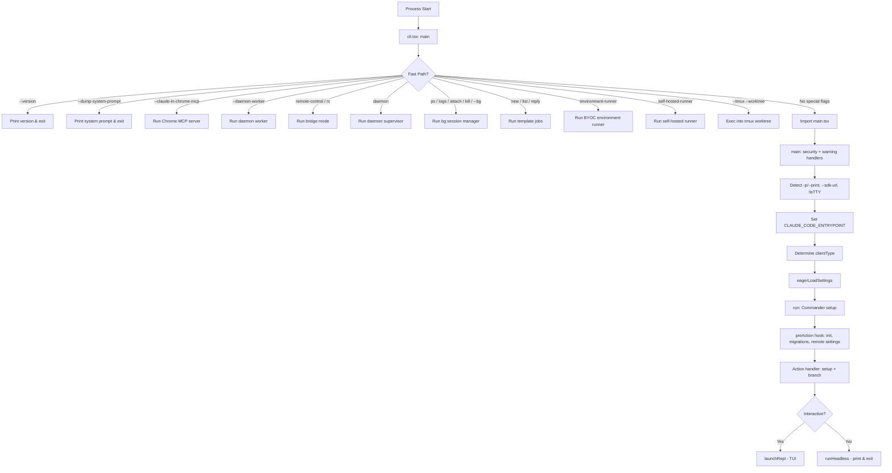
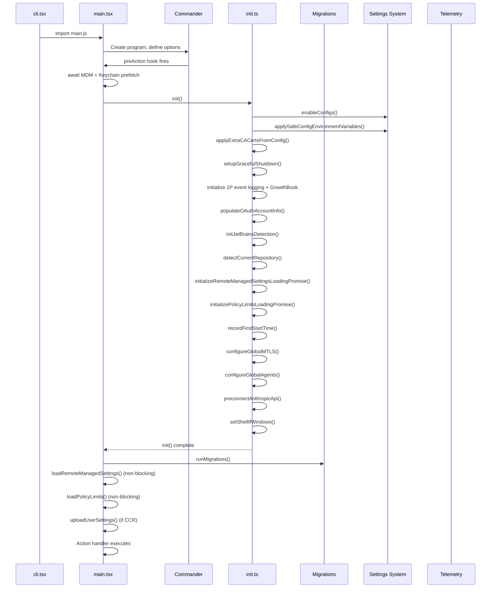

# Entry Layer

> The Entry Layer is the outermost boundary of Claude Code — the first code that executes when the binary starts, and the last point of control before the application core takes over. It handles CLI argument parsing, multi-client detection, feature flag gating, environment initialization, and the branching between interactive REPL and headless modes.

## Module Overview

The Entry Layer is responsible for:

- **Process bootstrap** — minimal startup with fast-path exits (`--version`, `--dump-system-prompt`, etc.)
- **Multi-client detection** — identifying how Claude Code was invoked (CLI, SDK, VSCode, Desktop, Remote, GitHub Actions)
- **Feature flag gating** — compile-time and runtime feature toggles via `bun:bundle`
- **Environment initialization** — migrations, settings loading, plugin registration, telemetry setup
- **Mode branching** — interactive REPL vs headless `-p/--print` execution paths
- **Special subcommand routing** — MCP server, daemon, bridge, SSH, assistant, templates, and more

### Key Design Principles

1. **Fast-path first** — common operations (`--version`) exit with zero module loading
2. **Feature-gated DCE** — `feature()` enables dead code elimination at build time
3. **Deferred imports** — dynamic `import()` keeps cold-start module count minimal
4. **Profiling checkpoints** — `profileCheckpoint()` calls throughout for startup measurement
5. **Security-first** — Windows PATH hijacking prevention, trust-dialog gating, safe env application

---

## Entry Point Architecture

### File Structure

```
src/
├── main.tsx                          # CLI entry point (~4683 lines)
├── entrypoints/
│   ├── cli.tsx                       # Bootstrap dispatcher (~302 lines)
│   ├── init.ts                       # Initialization pipeline (~340 lines)
│   ├── mcp.ts                        # MCP server entry (~196 lines)
│   ├── sandboxTypes.ts               # Sandbox configuration types (~156 lines)
│   ├── agentSdkTypes.ts              # Agent SDK public API surface (~443 lines)
│   └── sdk/
│       ├── coreTypes.ts              # SDK serializable types (~62 lines)
│       ├── coreSchemas.ts            # Zod schemas for SDK types (~1889 lines)
│       └── controlSchemas.ts         # SDK control protocol schemas (~663 lines)
```

### Startup Flow



### cli.tsx — Bootstrap Dispatcher

`cli.tsx` is the actual process entry point. It performs a series of fast-path checks before loading the heavy `main.tsx` module:

```typescript
// src/entrypoints/cli.tsx

async function main(): Promise<void> {
  const args = process.argv.slice(2);

  // Fast-path: --version (zero imports beyond this file)
  if (args.length === 1 && (args[0] === '--version' || args[0] === '-v' || args[0] === '-V')) {
    console.log(`${MACRO.VERSION} (Claude Code)`);
    return;
  }

  // Fast-path: --daemon-worker (lean worker process)
  if (feature('DAEMON') && args[0] === '--daemon-worker') {
    const { runDaemonWorker } = await import('../daemon/workerRegistry.js');
    await runDaemonWorker(args[1]);
    return;
  }

  // Fast-path: remote-control / bridge mode
  if (feature('BRIDGE_MODE') && (args[0] === 'remote-control' || ...)) {
    // Auth check → policy check → bridgeMain()
    return;
  }

  // ... more fast paths ...

  // No special flags — load full CLI
  const { main: cliMain } = await import('../main.js');
  await cliMain();
}
```

**Key characteristics:**

- All special subcommands use **dynamic imports** to avoid loading unnecessary modules
- Each fast path is guarded by a `feature()` gate for **dead code elimination** at build time
- `profileCheckpoint()` calls instrument every branch for startup profiling
- The full `main.tsx` (~4683 lines) is only loaded when no fast path matches

---

## Multi-Client Detection Mechanism

Claude Code runs in multiple hosting environments. The Entry Layer detects the client type through environment variables and entrypoint signals.

### Detection Logic

```typescript
// src/main.tsx:818-834
const clientType = (() => {
  if (isEnvTruthy(process.env.GITHUB_ACTIONS)) return 'github-action';
  if (process.env.CLAUDE_CODE_ENTRYPOINT === 'sdk-ts') return 'sdk-typescript';
  if (process.env.CLAUDE_CODE_ENTRYPOINT === 'sdk-py') return 'sdk-python';
  if (process.env.CLAUDE_CODE_ENTRYPOINT === 'sdk-cli') return 'sdk-cli';
  if (process.env.CLAUDE_CODE_ENTRYPOINT === 'claude-vscode') return 'claude-vscode';
  if (process.env.CLAUDE_CODE_ENTRYPOINT === 'local-agent') return 'local-agent';
  if (process.env.CLAUDE_CODE_ENTRYPOINT === 'claude-desktop') return 'claude-desktop';

  const hasSessionIngressToken = process.env.CLAUDE_CODE_SESSION_ACCESS_TOKEN
    || process.env.CLAUDE_CODE_WEBSOCKET_AUTH_FILE_DESCRIPTOR;
  if (process.env.CLAUDE_CODE_ENTRYPOINT === 'remote' || hasSessionIngressToken) {
    return 'remote';
  }
  return 'cli';
})();
setClientType(clientType);
```

### Client Type Resolution Table

| Client Type | Detection Signal | `CLAUDE_CODE_ENTRYPOINT` | Notes |
|---|---|---|---|
| `cli` | Default fallback | `'cli'` (set by `initializeEntrypoint(false)`) | Standard interactive terminal |
| `sdk-cli` | `-p/--print`, `--init-only`, `--sdk-url`, or `!isTTY` | `'sdk-cli'` (set by `initializeEntrypoint(true)`) | Headless/scripted mode |
| `sdk-typescript` | Env var | `'sdk-ts'` | TypeScript SDK consumer |
| `sdk-python` | Env var | `'sdk-py'` | Python SDK consumer |
| `claude-vscode` | Env var | `'claude-vscode'` | VS Code extension host |
| `claude-desktop` | Env var | `'claude-desktop'` | Desktop app host |
| `remote` | Env var or session ingress token | `'remote'` | Remote session (CCR) |
| `github-action` | `GITHUB_ACTIONS=true` | `'claude-code-github-action'` | GitHub Actions runner |
| `local-agent` | Env var (set by agent launcher) | `'local-agent'` | Local agent mode |

### Entrypoint Initialization

The `CLAUDE_CODE_ENTRYPOINT` env var is set by `initializeEntrypoint()`:

```typescript
// src/main.tsx:517-540
function initializeEntrypoint(isNonInteractive: boolean): void {
  if (process.env.CLAUDE_CODE_ENTRYPOINT) return; // Already set

  const cliArgs = process.argv.slice(2);

  // MCP serve command
  const mcpIndex = cliArgs.indexOf('mcp');
  if (mcpIndex !== -1 && cliArgs[mcpIndex + 1] === 'serve') {
    process.env.CLAUDE_CODE_ENTRYPOINT = 'mcp';
    return;
  }

  // GitHub Action
  if (isEnvTruthy(process.env.CLAUDE_CODE_ACTION)) {
    process.env.CLAUDE_CODE_ENTRYPOINT = 'claude-code-github-action';
    return;
  }

  // Interactive vs non-interactive
  process.env.CLAUDE_CODE_ENTRYPOINT = isNonInteractive ? 'sdk-cli' : 'cli';
}
```

### Non-Interactive Detection

```typescript
const hasPrintFlag = cliArgs.includes('-p') || cliArgs.includes('--print');
const hasInitOnlyFlag = cliArgs.includes('--init-only');
const hasSdkUrl = cliArgs.some(arg => arg.startsWith('--sdk-url'));
const isNonInteractive = hasPrintFlag || hasInitOnlyFlag || hasSdkUrl || !process.stdout.isTTY;
```

---

## Feature Flag System

Claude Code uses Bun's built-in `feature()` function from `bun:bundle` for compile-time feature gating. This enables **dead code elimination (DCE)** — entire code branches are removed from the external (public) build while remaining available in the internal (Anthropic/ant) build.

### How It Works

```typescript
import { feature } from 'bun:bundle';

// Compile-time: if feature('KAIROS') is false, this entire block is eliminated
const assistantModule = feature('KAIROS')
  ? require('./assistant/index.js')
  : null;

// Runtime gate + compile-time gate
if (feature('BRIDGE_MODE') && args[0] === 'remote-control') {
  // Only exists in builds where BRIDGE_MODE is enabled
}
```

### Active Feature Flags in Entry Layer

| Flag | Purpose | Used In |
|---|---|---|
| `ABLATION_BASELINE` | Harness-science L0 ablation baseline | cli.tsx |
| `DUMP_SYSTEM_PROMPT` | `--dump-system-prompt` command (ant-only) | cli.tsx |
| `CHICAGO_MCP` | Computer Use MCP server | cli.tsx, main.tsx |
| `DAEMON` | Daemon supervisor + worker processes | cli.tsx |
| `BG_SESSIONS` | Background session management (ps/logs/attach/kill/--bg) | cli.tsx, main.tsx |
| `TEMPLATES` | Template job commands (new/list/reply) | cli.tsx |
| `BYOC_ENVIRONMENT_RUNNER` | Headless BYOC environment runner | cli.tsx |
| `SELF_HOSTED_RUNNER` | Self-hosted runner targeting WorkerService API | cli.tsx |
| `BRIDGE_MODE` | Remote control / bridge mode | cli.tsx, main.tsx |
| `DIRECT_CONNECT` | cc:// URL deep connect | main.tsx |
| `LODESTONE` | Deep link URI handler | main.tsx |
| `KAIROS` | Assistant mode | main.tsx |
| `KAIROS_BRIEF` | Brief mode variant | main.tsx |
| `KAIROS_CHANNELS` | Assistant channels | main.tsx |
| `SSH_REMOTE` | SSH remote sessions | main.tsx |
| `COORDINATOR_MODE` | Coordinator mode | main.tsx |
| `TRANSCRIPT_CLASSIFIER` | Auto-mode transcript classification | main.tsx |
| `PROACTIVE` | Proactive features | main.tsx |
| `UDS_INBOX` | Unix domain socket inbox | main.tsx |
| `UPLOAD_USER_SETTINGS` | Settings sync to cloud (CCR) | main.tsx |
| `AGENT_MEMORY_SNAPSHOT` | Agent memory snapshot updates | main.tsx |
| `HARD_FAIL` | Hard failure mode | main.tsx |
| `CCR_MIRROR` | CCR mirror mode | main.tsx |
| `WEB_BROWSER_TOOL` | Web browser tool capability | main.tsx |

### Build-Time Differentiation

The build system uses `--define` to set `USER_TYPE` at compile time:

```typescript
// "external" !== 'ant' — in external builds, this block is eliminated
if ("external" !== 'ant' && isBeingDebugged()) {
  process.exit(1);
}

// process.env.USER_TYPE === 'ant' — gated to internal builds
if (process.env.USER_TYPE === 'ant') {
  // Internal-only features
}
```

---

## Initialization Flow

The initialization pipeline runs through the Commander `preAction` hook, ensuring it only executes when a command is actually run (not when displaying help).



### Migration System

Synchronous migrations run at startup, gated by `CURRENT_MIGRATION_VERSION`:

```typescript
const CURRENT_MIGRATION_VERSION = 11;

function runMigrations(): void {
  if (getGlobalConfig().migrationVersion !== CURRENT_MIGRATION_VERSION) {
    migrateAutoUpdatesToSettings();
    migrateBypassPermissionsAcceptedToSettings();
    migrateEnableAllProjectMcpServersToSettings();
    resetProToOpusDefault();
    migrateSonnet1mToSonnet45();
    migrateLegacyOpusToCurrent();
    migrateSonnet45ToSonnet46();
    migrateOpusToOpus1m();
    migrateReplBridgeEnabledToRemoteControlAtStartup();
    if (feature('TRANSCRIPT_CLASSIFIER')) {
      resetAutoModeOptInForDefaultOffer();
    }
    if ("external" === 'ant') {
      migrateFennecToOpus();
    }
    saveGlobalConfig(prev => ({ ...prev, migrationVersion: CURRENT_MIGRATION_VERSION }));
  }
  // Async migration - fire and forget
  migrateChangelogFromConfig().catch(() => {});
}
```

### init.ts — Initialization Pipeline

The `init()` function is memoized (runs once) and handles:

1. **Config validation** — `enableConfigs()` validates and enables the configuration system
2. **Safe env vars** — `applySafeConfigEnvironmentVariables()` applies pre-trust environment variables
3. **TLS setup** — `applyExtraCACertsFromConfig()` for custom CA certificates
4. **Graceful shutdown** — registers signal handlers for clean exit
5. **Analytics** — 1P event logging and GrowthBook initialization (lazy-loaded)
6. **OAuth** — populates account info if not cached
7. **IDE detection** — JetBrains detection (async, non-blocking)
8. **Repository detection** — GitHub repository detection (async, non-blocking)
9. **Remote settings** — initializes loading promises for enterprise managed settings
10. **Policy limits** — initializes loading promises for org policy limits
11. **Network config** — mTLS and proxy/agent configuration
12. **API preconnect** — warms TCP+TLS connection to Anthropic API
13. **Upstream proxy** — CCR upstream proxy initialization (if `CLAUDE_CODE_REMOTE`)
14. **Shell setup** — git-bash detection on Windows
15. **Cleanup registration** — LSP manager shutdown, session team cleanup
16. **Scratchpad** — initializes scratchpad directory if enabled

### Telemetry After Trust

Telemetry is initialized separately after trust is established:

```typescript
export function initializeTelemetryAfterTrust(): void {
  if (isEligibleForRemoteManagedSettings()) {
    // Wait for remote settings, then re-apply env vars before telemetry
    void waitForRemoteManagedSettingsToLoad()
      .then(async () => {
        applyConfigEnvironmentVariables();
        await doInitializeTelemetry();
      });
  } else {
    void doInitializeTelemetry();
  }
}
```

---

## REPL Mode vs Headless Mode

The Entry Layer branches into two execution paths based on interactivity detection.

### Decision Matrix

| Condition | Mode | Trust Dialog | Description |
|---|---|---|---|
| TTY, no flags | REPL | Shown | Standard interactive session |
| `-p` / `--print` | Headless | Skipped | Print response and exit |
| `--init-only` | Headless | Skipped | Run hooks and exit |
| `--sdk-url=<url>` | Headless | Skipped | SDK connection mode |
| `!process.stdout.isTTY` | Headless | Skipped | Piped/non-terminal input |

### Headless Mode (`-p/--print`)

```typescript
if (isNonInteractiveSession) {
  applyConfigEnvironmentVariables();
  initializeTelemetryAfterTrust();

  const commandsHeadless = disableSlashCommands ? [] : commands.filter(
    command => command.type === 'prompt' && !command.disableNonInteractive
      || command.type === 'local' && command.supportsNonInteractive
  );

  // Run headless: process prompt, call API, print result, exit
  void runHeadless(inputPrompt, () => headlessStore.getState(), ...);
}
```

**Headless features:**
- Output formats: `text`, `json`, `stream-json`
- JSON Schema validation for structured output
- Streaming partial responses
- Session persistence (opt-out via `--no-session-persistence`)
- All prompt commands + supported local commands

### REPL Mode (Interactive)

```typescript
if (!isNonInteractiveSession) {
  // Show setup screens (trust dialog, onboarding)
  const setupResult = await showSetupScreens(...);

  // Initialize telemetry after trust
  initializeTelemetryAfterTrust();

  // Launch the Ink-based TUI
  await launchRepl(root, {
    commands,
    tools,
    agentDefinitions,
    // ... extensive configuration
  });
}
```

**REPL features:**
- Interactive TUI via Ink (React for terminals)
- Setup screens (trust dialog, onboarding)
- Full command palette (slash commands)
- Real-time streaming output
- Session management (continue, resume, fork)
- Multi-model support
- Agent swarms / teammate mode

---

## Key Code Snippets

### Early Profiling (Top-Level Side Effects)

```typescript
// src/main.tsx:1-20
// These side-effects must run before all other imports:
// 1. profileCheckpoint marks entry before heavy module evaluation begins
// 2. startMdmRawRead fires MDM subprocesses in parallel with remaining imports
// 3. startKeychainPrefetch fires keychain reads in parallel
import { profileCheckpoint, profileReport } from './utils/startupProfiler.js';
profileCheckpoint('main_tsx_entry');
import { startMdmRawRead } from './utils/settings/mdm/rawRead.js';
startMdmRawRead();
import { ensureKeychainPrefetchCompleted, startKeychainPrefetch } from './utils/secureStorage/keychainPrefetch.js';
startKeychainPrefetch();
```

### Feature-Gated Conditional Imports

```typescript
// src/main.tsx:76-81
// Dead code elimination: conditional import for COORDINATOR_MODE
const coordinatorModeModule = feature('COORDINATOR_MODE')
  ? require('./coordinator/coordinatorMode.js')
  : null;

// Dead code elimination: conditional import for KAIROS (assistant mode)
const assistantModule = feature('KAIROS')
  ? require('./assistant/index.js')
  : null;
const kairosGate = feature('KAIROS')
  ? require('./assistant/gate.js')
  : null;
```

### Commander Program Definition

```typescript
// src/main.tsx:902
const program = new CommanderCommand()
  .configureHelp(createSortedHelpConfig())
  .enablePositionalOptions()
  .name('claude')
  .description('Claude Code - starts an interactive session by default, use -p/--print for non-interactive output')
  .argument('[prompt]', 'Your prompt', String)
  .hook('preAction', async thisCommand => {
    await Promise.all([ensureMdmSettingsLoaded(), ensureKeychainPrefetchCompleted()]);
    await init();
    process.title = 'claude';
    initSinks();
    setInlinePlugins(pluginDir);
    runMigrations();
    void loadRemoteManagedSettings();
    void loadPolicyLimits();
  })
  // ... options and subcommands ...
  .action(async (prompt, options) => {
    // Main action handler: setup + REPL/headless branching
  });
```

### Deferred Prefetches

```typescript
// src/main.tsx:388-431
export function startDeferredPrefetches(): void {
  if (isEnvTruthy(process.env.CLAUDE_CODE_EXIT_AFTER_FIRST_RENDER) || isBareMode()) {
    return;
  }

  // Process-spawning prefetches (consumed at first API call)
  void initUser();
  void getUserContext();
  prefetchSystemContextIfSafe();
  void getRelevantTips();
  void countFilesRoundedRg(getCwd(), AbortSignal.timeout(3000), []);

  // Analytics and feature flag initialization
  void initializeAnalyticsGates();
  void prefetchOfficialMcpUrls();
  void refreshModelCapabilities();

  // File change detectors
  void settingsChangeDetector.initialize();
  if (!isBareMode()) {
    void skillChangeDetector.initialize();
  }
}
```

---

## File Index

| File | Lines | Description |
|---|---|---|
| `src/main.tsx` | 4,683 | CLI entry point — Commander setup, REPL/headless branching, all CLI options |
| `src/entrypoints/cli.tsx` | 302 | Bootstrap dispatcher — fast-path routing before loading main.tsx |
| `src/entrypoints/init.ts` | 340 | Initialization pipeline — config, env, network, telemetry, graceful shutdown |
| `src/entrypoints/mcp.ts` | 196 | MCP server entry — exposes Claude Code tools via MCP protocol |
| `src/entrypoints/sandboxTypes.ts` | 156 | Sandbox configuration types — network, filesystem, sandbox settings schemas |
| `src/entrypoints/agentSdkTypes.ts` | 443 | Agent SDK public API — query, sessions, tools, remote control primitives |
| `src/entrypoints/sdk/coreTypes.ts` | 62 | SDK serializable types — re-exports generated types, hook events, exit reasons |
| `src/entrypoints/sdk/coreSchemas.ts` | 1,889 | Zod schemas for all SDK types — messages, hooks, permissions, agents, settings |
| `src/entrypoints/sdk/controlSchemas.ts` | 663 | SDK control protocol schemas — request/response types for SDK↔CLI communication |
| **Total** | **8,734** | |

---

## Module Dependencies

### What the Entry Layer Depends On

```
Entry Layer
├── bun:bundle (feature flags)
├── @commander-js/extra-typings (CLI argument parsing)
├── React + Ink (TUI rendering)
├── chalk (terminal styling)
├── lodash-es (utility functions)
│
├── src/bootstrap/state.js (shared state management)
├── src/utils/startupProfiler.js (startup profiling)
├── src/utils/config.js (configuration system)
├── src/utils/settings/ (settings loading and validation)
├── src/utils/model/ (model resolution)
├── src/utils/permissions/ (permission system)
├── src/utils/telemetry/ (OpenTelemetry instrumentation)
├── src/services/analytics/ (GrowthBook, 1P event logging)
├── src/services/mcp/ (MCP server management)
├── src/services/policyLimits/ (org policy limits)
├── src/services/remoteManagedSettings/ (enterprise settings)
├── src/plugins/ (plugin system)
├── src/skills/ (skill system)
├── src/tools/ (tool definitions)
├── src/commands/ (command definitions)
├── src/migrations/ (data migrations)
├── src/state/ (Zustand stores)
└── src/utils/ (extensive utility modules)
```

### What Depends on the Entry Layer

```
Entry Layer
├── src/replLauncher.js (REPL launching)
├── src/interactiveHelpers.js (setup screens, error handling)
├── src/print.ts (headless mode execution)
├── src/QueryEngine.ts (SDK query processing)
├── src/daemon/ (daemon supervisor and workers)
├── src/bridge/ (remote control / bridge mode)
├── src/coordinator/ (coordinator mode)
├── src/assistant/ (assistant mode)
├── src/cli/ (subcommand handlers)
├── src/environment-runner/ (BYOC environment runner)
├── src/self-hosted-runner/ (self-hosted runner)
├── src/server/ (direct connect / SSH sessions)
├── SDK consumers (TypeScript, Python)
├── VS Code extension
├── Desktop app
├── GitHub Action
└── External integrations via MCP
```

---

## Environment Variables

### Entry Layer Environment Variables

| Variable | Purpose | Values |
|---|---|---|
| `CLAUDE_CODE_ENTRYPOINT` | Identifies how Claude was invoked | `cli`, `sdk-cli`, `sdk-ts`, `sdk-py`, `claude-vscode`, `claude-desktop`, `remote`, `local-agent`, `mcp`, `claude-code-github-action` |
| `USER_TYPE` | Build-time user type (compile-time `--define`) | `ant` (internal), `external` (public) |
| `CLAUDE_CODE_REMOTE` | CCR remote mode flag | `true`/`false` |
| `CLAUDE_CODE_SIMPLE` | Bare/minimal mode | `1`/unset |
| `CLAUDE_CODE_ACTION` | GitHub Action mode | Set when running in GitHub Actions |
| `GITHUB_ACTIONS` | GitHub Actions detection | `true`/`false` |
| `CLAUDE_CODE_SESSION_ACCESS_TOKEN` | Remote session authentication | Token string |
| `CLAUDE_CODE_WEBSOCKET_AUTH_FILE_DESCRIPTOR` | WebSocket auth via FD | FD number |
| `CLAUDE_CODE_ENVIRONMENT_KIND` | Session source tagging | `bridge` for remote-control |
| `CLAUDE_CODE_QUESTION_PREVIEW_FORMAT` | Question preview format | `markdown`, `html` |
| `NoDefaultCurrentDirectoryInExePath` | Windows PATH security | `1` (always set) |
| `COREPACK_ENABLE_AUTO_PIN` | Corepack auto-pinning fix | `0` (always set) |
| `NODE_OPTIONS` | Node.js runtime options | `--max-old-space-size=8192` in CCR |

---

## Performance Considerations

### Startup Profiling

The Entry Layer is instrumented with `profileCheckpoint()` calls at every critical path:

```
main_tsx_entry
  → cli_entry
  → cli_after_main_import
  → main_function_start
  → main_client_type_determined
  → main_before_run
  → run_function_start
  → run_commander_initialized
  → preAction_start
  → preAction_after_mdm
  → preAction_after_init
  → preAction_after_sinks
  → preAction_after_migrations
  → preAction_after_remote_settings
  → preAction_after_settings_sync
  → action_handler_start
  → ...
```

### Optimization Techniques

1. **Parallel subprocess firing** — MDM reads and keychain prefetches start as top-level side effects, completing during the ~135ms of module imports
2. **Lazy requires** — Circular dependency avoidance via `require()` in functions instead of top-level `import`
3. **Dynamic imports** — All fast-path subcommands use `await import()` to avoid loading modules until needed
4. **Memoized init** — `init()` is wrapped in `lodash-es/memoize` to prevent double initialization
5. **Fire-and-forget async** — Non-critical prefetches run asynchronously without blocking first render
6. **Bare mode optimizations** — `--bare` skips all hooks, LSP, plugin sync, attribution, auto-memory, background prefetches, keychain reads, and CLAUDE.md auto-discovery
