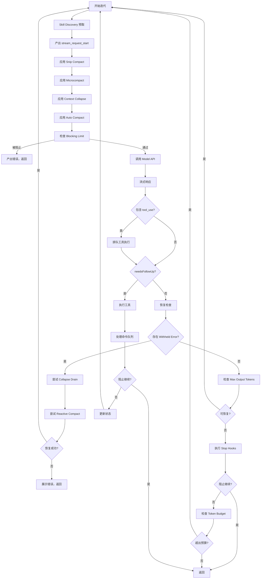
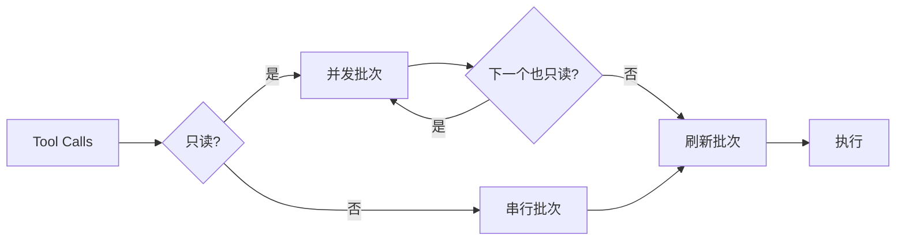
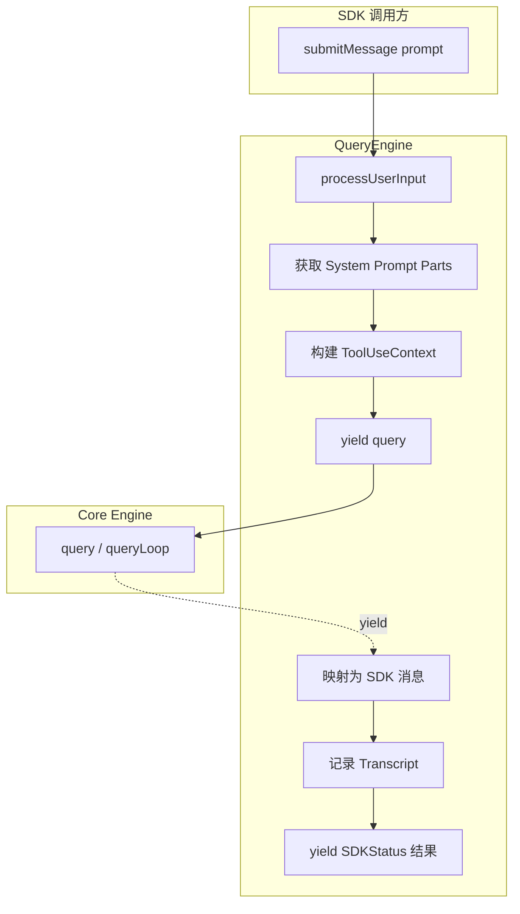
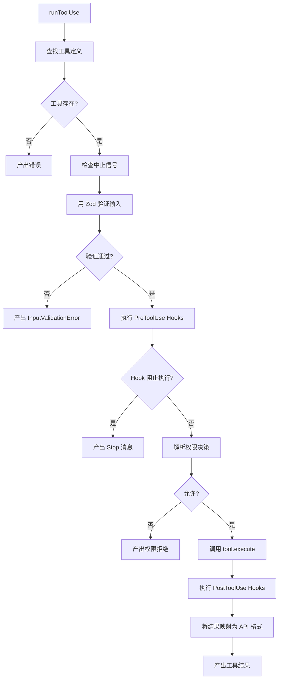
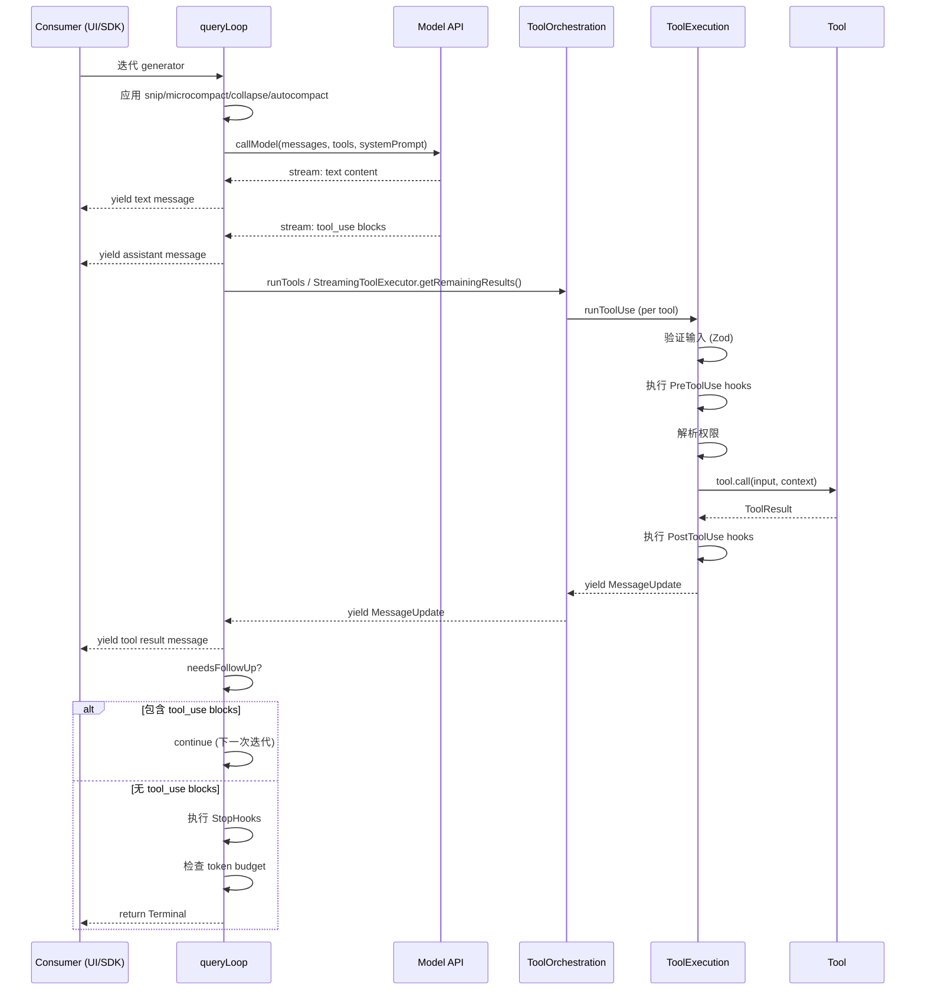
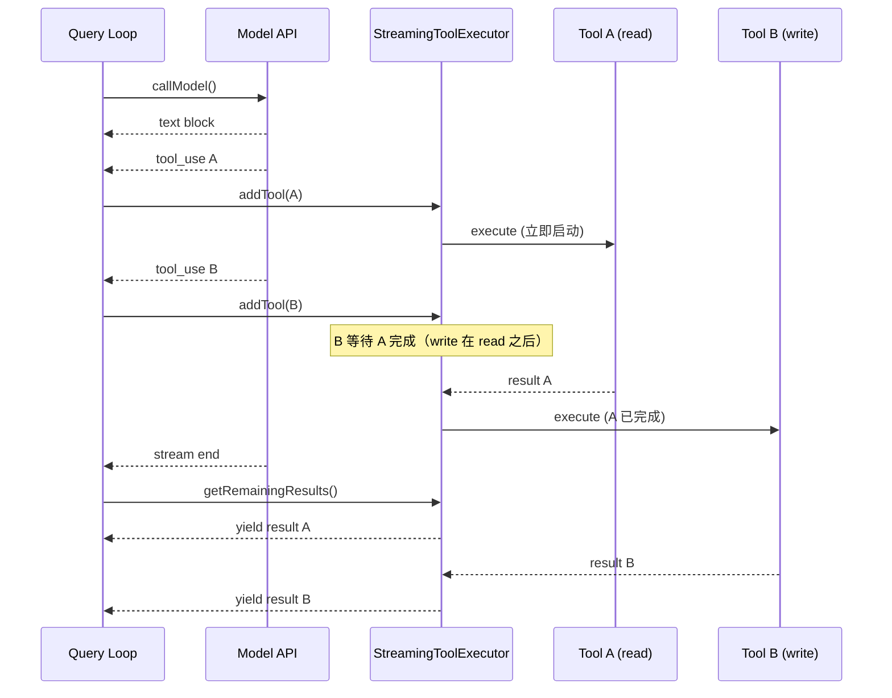
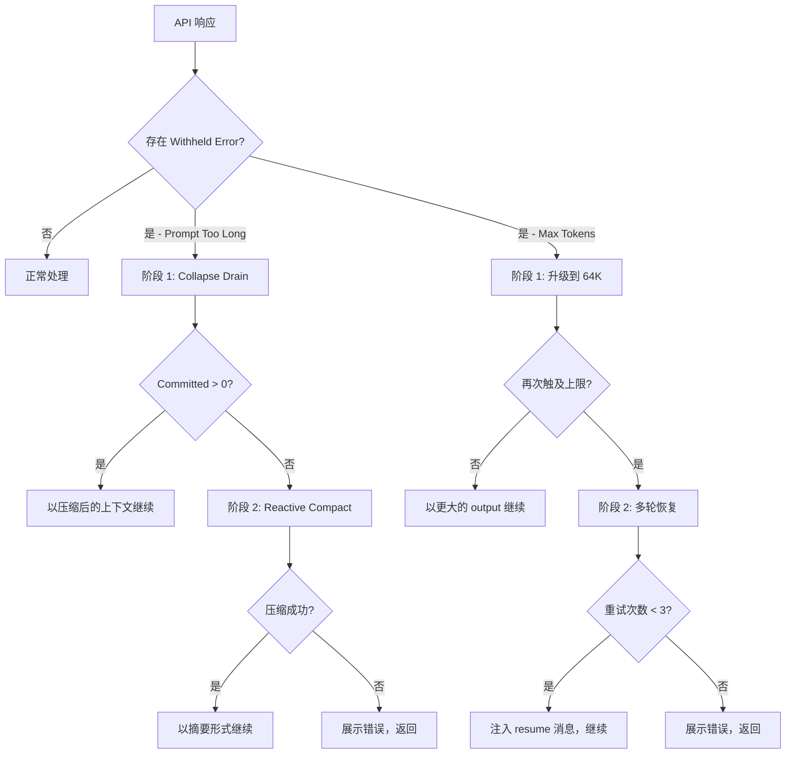

# Core Engine（核心引擎）

Core Engine（核心引擎）是 Claude Code 的心脏——它负责编排 Agent Loop、管理工具执行、处理流式 API 响应，以及协调整个对话生命周期。

## 模块概述

| 文件 | 行数 | 职责 |
|------|-------|------|
| `src/query.ts` | 1,729 | Agent Loop（async generator 模式）—— 核心编排 |
| `src/QueryEngine.ts` | 1,295 | SDK/无头场景封装 —— 管理对话生命周期 |
| `src/Task.ts` | 125 | Task 类型定义、状态追踪、ID 生成 |
| `src/Tool.ts` | 792 | Tool 接口、类型定义、验证契约 |
| `src/tools.ts` | 389 | Tool 注册中心 —— 组装所有可用工具 |
| `src/services/tools/toolOrchestration.ts` | 188 | 工具编排与并发控制 |
| `src/services/tools/toolExecution.ts` | 1,745 | 单个工具执行、权限管理、Hook 系统 |
| `src/services/tools/toolHooks.ts` | 650 | Pre/Post Tool Hook 生命周期管理 |
| `src/services/tools/StreamingToolExecutor.ts` | 530 | 流式感知的工具执行器，含队列管理 |
| **总计** | **7,318** | |

## Agent Loop 架构

### Async Generator 模式

整个 Agent Loop 采用嵌套的 async generator 链实现：

```
query() ──委托──▶ queryLoop() ──迭代──▶ while(true) { ... }
```

`query()` 是公共入口点，它将实际工作委托给 `queryLoop()`，并在循环结束后处理清理工作（通知已消费命令的生命周期）。`queryLoop()` 包含驱动 Agent 的真实 `while(true)` 循环。

```typescript
export async function* query(
  params: QueryParams,
): AsyncGenerator<
  | StreamEvent
  | RequestStartEvent
  | Message
  | TombstoneMessage
  | ToolUseSummaryMessage,
  Terminal
> {
  const consumedCommandUuids: string[] = []
  const terminal = yield* queryLoop(params, consumedCommandUuids)
  for (const uuid of consumedCommandUuids) {
    notifyCommandLifecycle(uuid, 'completed')
  }
  return terminal
}
```

Generator 向消费者（REPL UI 或 SDK）产出事件和消息，同时通过一个 `State` 对象在各次迭代之间维护内部状态。

### 状态管理

可变状态通过单一的 `State` 对象在循环迭代之间传递：

```typescript
type State = {
  messages: Message[]
  toolUseContext: ToolUseContext
  autoCompactTracking: AutoCompactTrackingState | undefined
  maxOutputTokensRecoveryCount: number
  hasAttemptedReactiveCompact: boolean
  maxOutputTokensOverride: number | undefined
  pendingToolUseSummary: Promise<ToolUseSummaryMessage | null> | undefined
  stopHookActive: boolean | undefined
  turnCount: number
  transition: Continue | undefined  // 上一次迭代为何继续
}
```

每个 `continue` 站点都会创建一个新的 `State` 对象，循环在每次迭代开始时解构它。这种模式使得所有退出点都是显式的且可测试的。

### 单次迭代流程

Agent Loop 的每次迭代遵循以下序列：



## query() 函数深度解析

### 函数签名

```typescript
export type QueryParams = {
  messages: Message[]
  systemPrompt: SystemPrompt
  userContext: { [k: string]: string }
  systemContext: { [k: string]: string }
  canUseTool: CanUseToolFn
  toolUseContext: ToolUseContext
  fallbackModel?: string
  querySource: QuerySource
  maxOutputTokensOverride?: number
  maxTurns?: number
  skipCacheWrite?: boolean
  taskBudget?: { total: number }
  deps?: QueryDeps
}

export async function* query(
  params: QueryParams,
): AsyncGenerator<
  | StreamEvent
  | RequestStartEvent
  | Message
  | TombstoneMessage
  | ToolUseSummaryMessage,
  Terminal
>
```

### 参数说明

| 参数 | 类型 | 说明 |
|------|------|------|
| `messages` | `Message[]` | 对话历史 |
| `systemPrompt` | `SystemPrompt` | System 指令 |
| `userContext` | `object` | 用户提供的上下文变量 |
| `systemContext` | `object` | 系统提供的上下文变量 |
| `canUseTool` | `CanUseToolFn` | 权限检查回调函数 |
| `toolUseContext` | `ToolUseContext` | 工具执行上下文 |
| `fallbackModel` | `string?` | 出错时回退的模型 |
| `querySource` | `QuerySource` | 查询来源（sdk, repl, agent 等） |
| `maxOutputTokensOverride` | `number?` | 覆盖 output token 限制 |
| `maxTurns` | `number?` | 最大迭代轮数 |
| `taskBudget` | `{ total: number }?` | 整个 Agent Turn 的 API task_budget |
| `deps` | `QueryDeps?` | 依赖注入（callModel, autocompact 等） |

### Yield 类型

| 类型 | 触发时机 |
|------|----------|
| `StreamEvent` | API 流式事件（message_start, content_block_start 等） |
| `RequestStartEvent` | `{ type: 'stream_request_start' }`，迭代开始时产出 |
| `Message` | Assistant、用户、进度和系统消息 |
| `TombstoneMessage` | 流式回退期间孤立消息的移除信号 |
| `ToolUseSummaryMessage` | 上一轮工具使用的摘要 |

### 返回值（Terminal）

| 原因 | 说明 |
|------|------|
| `completed` | 正常完成 —— 模型产生了最终文本响应 |
| `aborted_streaming` | 用户中断（Ctrl+C、新消息） |
| `prompt_too_long` | 上下文超限，恢复机制已耗尽 |
| `image_error` | 图片大小/缩放错误（被扣留，不可恢复） |
| `model_error` | 意外的 API/运行时错误 |
| `blocking_limit` | 触及硬性 token 阻塞限制 |
| `stop_hook_prevented` | StopHook 阻止了继续执行 |
| `token_budget_continuation` | Token Budget 自动继续被触发 |

## 流式解析与事件处理

模型 API 调用使用 `deps.callModel()`，它返回一个 async iterable。在流式处理期间，每个产出的消息都会被处理：

1. **Streaming Fallback 检测**：如果发生 `FallbackTriggeredError`，循环会清除所有累积状态（assistant 消息、工具结果、tool use 块），并使用 fallback model 重试。同时产出 Tombstone 消息以移除孤立的 UI 元素。

2. **消息回填（Message Backfilling）**：Tool Use 的输入会在克隆消息上回填可观察字段（例如展开的文件路径），然后才产出，这样 SDK 流输出能看到增强后的数据，而发送给 API 的原始消息保持 untouched 以确保 Prompt Caching 生效。

3. **Withheld Errors（扣留错误）**：可恢复的错误（prompt-too-long、max-output-tokens、媒体大小错误）在尝试恢复之前会被扣留，不立即产出到流中。这防止了 SDK 调用方过早地看到会终止其会话的中间错误。

4. **Tool Call 收集**：当 `tool_use` 块在 assistant 消息中到达时，它们被累积到 `toolUseBlocks` 中，同时 `needsFollowUp` 被设为 `true`。

```typescript
if (message.type === 'assistant') {
  assistantMessages.push(message)
  const msgToolUseBlocks = message.message.content.filter(
    content => content.type === 'tool_use',
  ) as ToolUseBlock[]
  if (msgToolUseBlocks.length > 0) {
    toolUseBlocks.push(...msgToolUseBlocks)
    needsFollowUp = true
  }
}
```

## 工具调用分区与并发策略

Tool Calls 根据并发安全性被分区为多个批次。分区算法将连续的只读工具归为一组，隔离写入工具：



### 分区逻辑（`toolOrchestration.ts:91-116`）

```typescript
function partitionToolCalls(
  toolUseMessages: ToolUseBlock[],
  toolUseContext: ToolUseContext,
): Batch[] {
  return toolUseMessages.reduce((acc: Batch[], toolUse) => {
    const tool = findToolByName(toolUseContext.options.tools, toolUse.name)
    const parsedInput = tool?.inputSchema.safeParse(toolUse.input)
    const isConcurrencySafe = parsedInput?.success
      ? tool?.isConcurrencySafe(parsedInput.data) ?? false
      : false
    if (isConcurrencySafe && acc[acc.length - 1]?.isConcurrencySafe) {
      acc[acc.length - 1]!.blocks.push(toolUse)
    } else {
      acc.push({ isConcurrencySafe, blocks: [toolUse] })
    }
  }, [])
}
```

**规则：**
- 连续的只读工具（FileRead, Glob, Grep）被批量归入同一组，进行并发执行
- 任何写入工具（FileEdit, FileWrite, Bash）各自启动一个串行批次
- 写入工具之后的只读工具启动一个新的并发批次

### 执行模式

| 模式 | 适用工具 | 并发策略 |
|------|----------|----------|
| `runToolsConcurrently` | 只读工具批次 | 并行执行，上限由 `CLAUDE_CODE_MAX_TOOL_USE_CONCURRENCY` 控制（默认：10） |
| `runToolsSerially` | 写入工具 | 逐个执行，调用之间传递上下文更新 |

## StreamingToolExecutor 详解

`StreamingToolExecutor` 类（`StreamingToolExecutor.ts`）提供了一种更精细的执行模型：它在流式到达时立即启动工具，而不是等待完整响应：

```mermaid
sequenceDiagram
    participant Loop as Query Loop
    participant API as Model API
    participant Executor as StreamingToolExecutor
    participant Tools as Tool Implementations

    Loop->>API: callModel()
    API-->>Loop: stream: text block
    Loop-->>Consumer: yield text
    API-->>Loop: stream: tool_use block #1
    Loop->>Executor: addTool(block #1)
    Executor->>Tools: execute #1 (starts)
    API-->>Loop: stream: tool_use block #2
    Loop->>Executor: addTool(block #2)
    Executor->>Tools: execute #2 (concurrent)
    API-->>Loop: stream end
    Loop->>Executor: getRemainingResults()
    Tools-->>Executor: result #1
    Executor-->>Loop: yield result #1
    Tools-->>Executor: result #2
    Executor-->>Loop: yield result #2
```

### 工具生命周期状态

每个被追踪的工具经历以下状态：

```
queued → executing → completed → yielded
```

### 错误级联（Error Cascading）

当 Bash 工具出错时，会触发级联反应：

1. `this.hasErrored = true` 被设置
2. `siblingAbortController.abort('sibling_error')` 触发
3. 所有其他排队/执行中的工具收到合成的取消错误
4. 父级 `toolUseContext.abortController` **不会**被中止 —— 只有兄弟子进程被终止

这种设计处理了隐式依赖链（例如 `mkdir` 失败 → 后续命令无意义），同时保持独立工具（read/webfetch）不受影响。

### 中断行为

工具通过 `interruptBehavior` 定义其中断行为：
- `'cancel'` —— 工具可被用户输入中断（例如长时间运行的 Bash）
- `'block'` —— 工具阻止中断（例如进行中的文件编辑）

## 错误恢复机制

### Prompt Too Long（413 错误）

两阶段恢复：

1. **Collapse Drain**：首先，排空所有已暂存的 context collapse（代价较低，保留细粒度上下文）
2. **Reactive Compact**：如果 collapse drain 不够或不可用，尝试 reactive compact（完整摘要）

```typescript
if (isWithheld413) {
  // 阶段 1：排空已暂存的 context collapse
  if (contextCollapse && state.transition?.reason !== 'collapse_drain_retry') {
    const drained = contextCollapse.recoverFromOverflow(messagesForQuery, querySource)
    if (drained.committed > 0) {
      state = { ...state, messages: drained.messages, transition: { reason: 'collapse_drain_retry' } }
      continue
    }
  }
}
// 阶段 2：Reactive Compact
if ((isWithheld413 || isWithheldMedia) && reactiveCompact) {
  const compacted = await reactiveCompact.tryReactiveCompact({ ... })
  if (compacted) {
    state = { ...state, messages: buildPostCompactMessages(compacted), transition: { reason: 'reactive_compact_retry' } }
    continue
  }
  // 无法恢复 —— 展示错误
  yield lastMessage
  return { reason: 'prompt_too_long' }
}
```

### Max Output Tokens

三阶段恢复：

1. **升级（Escalation）**：如果使用了默认的 8K 上限且 `tengu_otk_slot_v1` 特性已启用，则用 64K（`ESCALATED_MAX_TOKENS`）重试 —— 每轮仅触发一次
2. **多轮恢复（Multi-turn Recovery）**：注入一条 meta 消息告知模型从中途恢复思考，最多重试 `MAX_OUTPUT_TOKENS_RECOVERY_LIMIT`（3 次）
3. **展示错误**：如果所有恢复尝试耗尽，产出被扣留的错误

```typescript
const MAX_OUTPUT_TOKENS_RECOVERY_LIMIT = 3

if (isWithheldMaxOutputTokens(lastMessage)) {
  // 阶段 1：从 8K 升级到 64K
  if (capEnabled && maxOutputTokensOverride === undefined) {
    state = { ...state, maxOutputTokensOverride: ESCALATED_MAX_TOKENS, transition: { reason: 'max_output_tokens_escalate' } }
    continue
  }
  // 阶段 2：多轮恢复（最多 3 次重试）
  if (maxOutputTokensRecoveryCount < MAX_OUTPUT_TOKENS_RECOVERY_LIMIT) {
    state = {
      ...state,
      messages: [...messagesForQuery, ...assistantMessages, recoveryMessage],
      maxOutputTokensRecoveryCount: maxOutputTokensRecoveryCount + 1,
      transition: { reason: 'max_output_tokens_recovery', attempt: maxOutputTokensRecoveryCount + 1 }
    }
    continue
  }
  // 阶段 3：展示错误
  yield lastMessage
}
```

### API 错误与回退

- **`FallbackTriggeredError`**：切换到 `fallbackModel`，清除所有累积状态，剥离 thinking signature 块（model-bound），然后重试
- **`ImageSizeError` / `ImageResizeError`**：产出用户友好的错误信息，立即返回
- **通用错误**：为所有待处理的 tool call 产出缺失的 tool result 块，展示错误

### 死亡螺旋防护（Death Spiral Prevention）

当最后一条消息是 API 错误时，**跳过** Stop Hooks。在失败的响应上运行 Hooks 会引发死亡螺旋：错误 → Hook 阻塞 → 重试 → 错误 → ...

```typescript
if (lastMessage?.isApiErrorMessage) {
  void executeStopFailureHooks(lastMessage, toolUseContext)
  return { reason: 'completed' }
}
```

## Token Budget 追踪

Token Budget 系统（`query/tokenBudget.ts`）追踪 output token 使用量，并可触发自动继续：

```typescript
if (feature('TOKEN_BUDGET')) {
  const decision = checkTokenBudget(
    budgetTracker!,
    toolUseContext.agentId,
    getCurrentTurnTokenBudget(),
    getTurnOutputTokens(),
  )

  if (decision.action === 'continue') {
    incrementBudgetContinuationCount()
    state = {
      ...state,
      messages: [
        ...messagesForQuery,
        ...assistantMessages,
        createUserMessage({ content: decision.nudgeMessage, isMeta: true }),
      ],
      maxOutputTokensRecoveryCount: 0,
      hasAttemptedReactiveCompact: false,
      transition: { reason: 'token_budget_continuation' },
    }
    continue
  }
}
```

当预算被超出时，一条 nudge 消息被注入对话中，循环继续。`hasAttemptedReactiveCompact` 标志被重置，以便在需要时允许重新进行压缩。

## QueryEngine 类详解

`QueryEngine` 是 SDK/无头场景的封装类，管理完整的对话生命周期。每个对话一个 `QueryEngine` 实例；每次 `submitMessage()` 调用启动一个新的 Turn。

### 架构



### 核心职责

| 职责 | 方法/区域 |
|------|-----------|
| 对话状态管理 | `mutableMessages`, `totalUsage`, `permissionDenials` |
| Turn 生命周期 | `submitMessage()` —— 一次调用 = 一个 Turn |
| 输入处理 | `processUserInput()` —— 处理斜杠命令、附件 |
| Transcript 记录 | `recordTranscript()` —— 在 API 调用之前持久化，确保崩溃安全 |
| SDK 消息映射 | 将内部消息标准化为 `SDKMessage` 格式 |
| 用量追踪 | `accumulateUsage()`, `updateUsage()` 跨 Turn 追踪 |
| 中止处理 | 每个 engine 独立的 `AbortController`，跨 Turn 共享 |

### submitMessage() 流程

```typescript
async *submitMessage(
  prompt: string | ContentBlockParam[],
  options?: { uuid?: string; isMeta?: boolean },
): AsyncGenerator<SDKMessage, void, unknown>
```

1. 包装 `canUseTool` 以追踪权限拒绝情况，供 SDK 报告使用
2. 获取 system prompt parts（tools, model, MCP clients, working directories）
3. 构建 `processUserInputContext`，携带当前状态
4. 处理孤立权限（每个 engine 生命周期内仅一次）
5. 处理用户输入（斜杠命令、附件、模型切换）
6. 推送消息并立即记录 transcript（崩溃安全）
7. 加载 skills 和 plugins（仅缓存，非阻塞）
8. 产出系统初始化消息
9. 委托给 `query()` 并将所有产出的消息映射为 SDK 格式
10. 完成时，产出 `SDKStatus` 结果，包含用量、成本和 Turn 计数

## 工具编排与并发控制

### 并发控制

`CLAUDE_CODE_MAX_TOOL_USE_CONCURRENCY` 环境变量控制最大并发工具执行数（默认：10）：

```typescript
function getMaxToolUseConcurrency(): number {
  return (
    parseInt(process.env.CLAUDE_CODE_MAX_TOOL_USE_CONCURRENCY || '', 10) || 10
  )
}
```

该限制通过 `all()` 工具函数应用，它以有界并发运行 async generators：

```typescript
async function* runToolsConcurrently(...): AsyncGenerator<MessageUpdateLazy, void> {
  yield* all(
    toolUseMessages.map(async function* (toolUse) {
      // ... 执行工具
    }),
    getMaxToolUseConcurrency(),
  )
}
```

### 工具执行管线

每个工具经过以下管线：



## Hook 系统

三个 Hook 阶段围绕每次工具执行：

| 阶段 | 生成器 | 用途 |
|------|--------|------|
| PreToolUse | `runPreToolUseHooks()` | 修改输入、阻止执行、提供权限决策 |
| PostToolUse | `runPostToolUseHooks()` | 修改输出、添加上下文、阻止继续 |
| PostToolUseFailure | `runPostToolUseFailureHooks()` | 处理工具错误、提供恢复 |

PreToolUse Hooks 可产出多种结果类型：

| 类型 | 效果 |
|------|------|
| `message` | 产出进度或附件消息 |
| `hookPermissionResult` | 提供 allow/deny/ask 决策 |
| `hookUpdatedInput` | 修改工具输入（passthrough） |
| `preventContinuation` | 标记应阻止继续 |
| `stopReason` | 提供停止原因 |
| `additionalContext` | 以消息形式添加上下文 |
| `stop` | 立即中止执行 |

## 权限决策解析

`resolveHookPermissionDecision()` 函数封装了一个不变式：Hook 的 `allow` **不会**绕过 settings.json 中的 deny/ask 规则：

```typescript
export async function resolveHookPermissionDecision(
  hookPermissionResult: PermissionResult | undefined,
  tool: Tool,
  input: Record<string, unknown>,
  toolUseContext: ToolUseContext,
  canUseTool: CanUseToolFn,
  assistantMessage: AssistantMessage,
  toolUseID: string,
): Promise<{ decision: PermissionDecision; input: Record<string, unknown> }>
```

解析顺序：
1. Hook `allow` → 检查基于规则的权限 → 如果没有 deny/ask 规则，则允许
2. Hook `allow` + deny 规则 → deny 优先覆盖
3. Hook `allow` + ask 规则 → 仍需要交互式提示
4. Hook `deny` → 立即拒绝
5. 无 Hook 决策 → 走正常的 `canUseTool()` 流程

## 命令队列处理

在 Turn 之间，命令队列被处理以响应斜杠命令和其他排队操作：

```typescript
// query() 中，queryLoop 返回后：
for (const uuid of consumedCommandUuids) {
  notifyCommandLifecycle(uuid, 'completed')
}
```

命令在查询循环期间通过 `messageQueueManager` 的 `remove()` 和 `getCommandsByMaxPriority()` 从队列中消费。突变消息数组的斜杠命令（例如 `/force-snip`）调用 `setMessages(fn)`，在 SDK 模式下回写到 `mutableMessages`。

## 工具注册中心

工具注册中心（`src/tools.ts`）组装所有可用工具，采用特性门控的条件导入：

### 核心工具（始终可用）

| 工具 | 用途 |
|------|------|
| `BashTool` | 执行 Shell 命令 |
| `FileReadTool` | 读取文件内容 |
| `FileEditTool` | 对文件应用 diff |
| `FileWriteTool` | 创建/覆盖文件 |
| `GlobTool` | 文件模式匹配 |
| `GrepTool` | 内容搜索 |
| `WebFetchTool` | 获取 URL 内容 |
| `WebSearchTool` | 网络搜索 |
| `TodoWriteTool` | 任务追踪 |
| `TaskCreateTool` | 创建后台任务 |
| `TaskGetTool` | 获取任务输出 |
| `TaskUpdateTool` | 更新任务描述 |
| `TaskListTool` | 列出任务 |
| `TaskStopTool` | 停止任务 |
| `TaskOutputTool` | 任务输出流 |
| `AgentTool` | 委托给子 Agent |
| `SkillTool` | 执行 Skills |
| `AskUserQuestionTool` | 交互式用户提问 |
| `LSPTool` | 语言服务器协议 |
| `ConfigTool` | 配置管理 |
| `EnterPlanModeTool` | 切换到 Plan 模式 |
| `ExitPlanModeV2Tool` | 退出 Plan 模式 |
| `EnterWorktreeTool` | 进入 Git Worktree |
| `ExitWorktreeTool` | 退出 Git Worktree |
| `NotebookEditTool` | Jupyter Notebook 编辑 |
| `TungstenTool` | Tungsten 集成 |
| `ListMcpResourcesTool` | 列出 MCP 资源 |
| `ReadMcpResourceTool` | 读取 MCP 资源 |
| `ToolSearchTool` | 延迟工具发现 |

### 特性门控工具

| 工具 | 特性标志 | 用途 |
|------|----------|------|
| `REPLTool` | `USER_TYPE === 'ant'` | REPL 执行 |
| `SleepTool` | `PROACTIVE` 或 `KAIROS` | 睡眠/等待 |
| `CronCreateTool` | `AGENT_TRIGGERS` | 创建定时任务 |
| `CronDeleteTool` | `AGENT_TRIGGERS` | 删除定时任务 |
| `CronListTool` | `AGENT_TRIGGERS` | 列出定时任务 |
| `RemoteTriggerTool` | `AGENT_TRIGGERS_REMOTE` | 远程触发器 |
| `MonitorTool` | `MONITOR_TOOL` | 进程监控 |
| `SendUserFileTool` | `KAIROS` | 向用户发送文件 |
| `PushNotificationTool` | `KAIROS` 或 `KAIROS_PUSH_NOTIFICATION` | 推送通知 |
| `SubscribePRTool` | `KAIROS_GITHUB_WEBHOOKS` | GitHub PR 订阅 |
| `TeamCreateTool` | 延迟导入 | 创建 Team Agent |
| `TeamDeleteTool` | 延迟导入 | 删除 Team Agent |
| `SendMessageTool` | 延迟导入 | Agent 间消息传递 |
| `VerifyPlanExecutionTool` | `CLAUDE_CODE_VERIFY_PLAN` | Plan 执行验证 |

### 延迟导入（防止循环依赖）

创建循环依赖的工具采用 lazy-require：

```typescript
const getTeamCreateTool = () =>
  require('./tools/TeamCreateTool/TeamCreateTool.js').TeamCreateTool
const getTeamDeleteTool = () =>
  require('./tools/TeamDeleteTool/TeamDeleteTool.js').TeamDeleteTool
const getSendMessageTool = () =>
  require('./tools/SendMessageTool/SendMessageTool.js').SendMessageTool
```

## Task 管理

`Task.ts` 模块定义了用于后台操作的 Task 系统：

### Task 类型

```typescript
type TaskType =
  | 'local_bash'        // 后台 Shell 命令
  | 'local_agent'       // 本地子 Agent
  | 'remote_agent'      // 远程子 Agent
  | 'in_process_teammate' // 进程内 teammate
  | 'local_workflow'    // 本地工作流
  | 'monitor_mcp'       // MCP 监控器
  | 'dream'             // Dream/创意模式
```

### Task 状态

```typescript
type TaskStatus = 'pending' | 'running' | 'completed' | 'failed' | 'killed'
```

终止状态（`completed`, `failed`, `killed`）表示 Task 不会再发生状态转换。

### Task ID 生成

Task ID 使用类型特定的前缀加上 8 个随机字符（36 字符字母表）：

| 类型 | 前缀 | 示例 |
|------|------|------|
| `local_bash` | `b` | `b3k9x2m7` |
| `local_agent` | `a` | `a7f2p1q8` |
| `remote_agent` | `r` | `r5n8w3j6` |
| `in_process_teammate` | `t` | `t1m4k7x2` |
| `local_workflow` | `w` | `w9p3f6n1` |
| `monitor_mcp` | `m` | `m2x7k4j8` |
| `dream` | `d` | `d6w1n5p3` |

这提供了约 2.8 万亿种组合（36^8），足以抵御暴力符号链接攻击。

## 关键时序图

### 完整 Agent Turn



### 流式工具执行



### 错误恢复流程



## 文件索引

| 文件 | 行数 | 关键导出 |
|------|-------|----------|
| `src/query.ts` | 1,729 | `query()`, `queryLoop()`, `QueryParams`, `State` |
| `src/QueryEngine.ts` | 1,295 | `QueryEngine`, `QueryEngineConfig`, `submitMessage()` |
| `src/Task.ts` | 125 | `Task`, `TaskType`, `TaskStatus`, `TaskStateBase`, `generateTaskId()`, `createTaskStateBase()`, `isTerminalTaskStatus()` |
| `src/Tool.ts` | 792 | `Tool`, `Tools`, `ToolUseContext`, `ToolInputJSONSchema`, `ValidationResult`, `QueryChainTracking` |
| `src/tools.ts` | 389 | 工具注册中心组装, `getAllBaseTools()`, 特性门控工具导入 |
| `src/services/tools/toolOrchestration.ts` | 188 | `runTools()`, `partitionToolCalls()`, `getMaxToolUseConcurrency()` |
| `src/services/tools/toolExecution.ts` | 1,745 | `runToolUse()`, `checkPermissionsAndCallTool()`, `classifyToolError()`, `MessageUpdateLazy` |
| `src/services/tools/toolHooks.ts` | 650 | `runPreToolUseHooks()`, `runPostToolUseHooks()`, `runPostToolUseFailureHooks()`, `resolveHookPermissionDecision()` |
| `src/services/tools/StreamingToolExecutor.ts` | 530 | `StreamingToolExecutor` 类, `TrackedTool`, `ToolStatus` |
