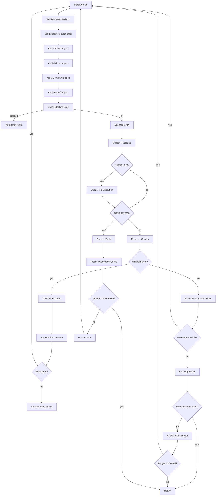
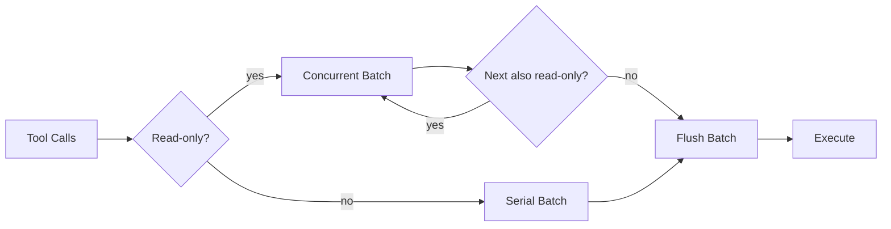
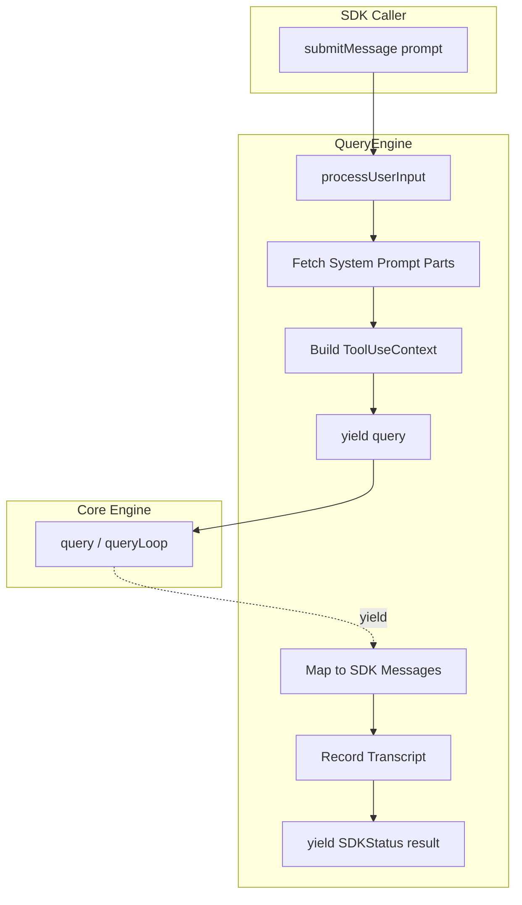
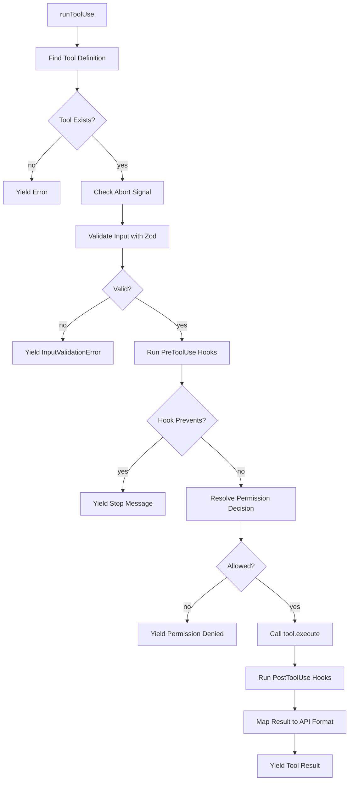
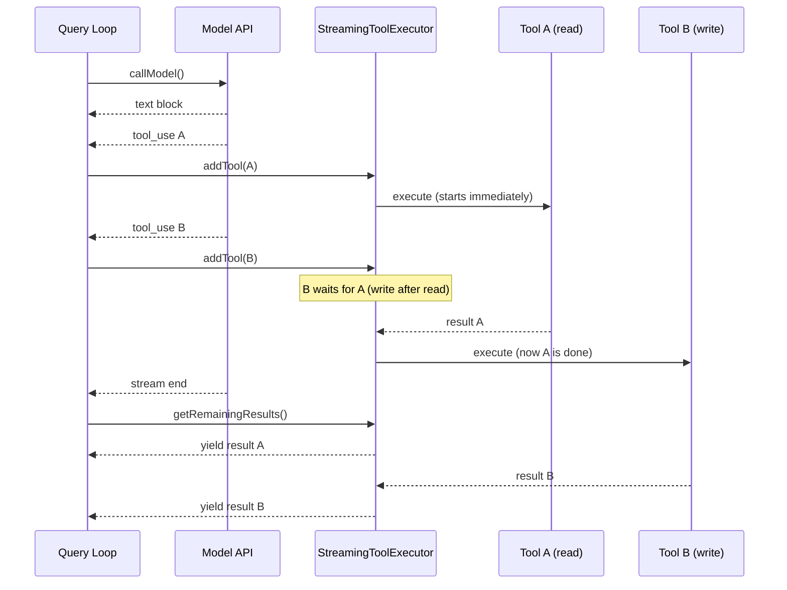
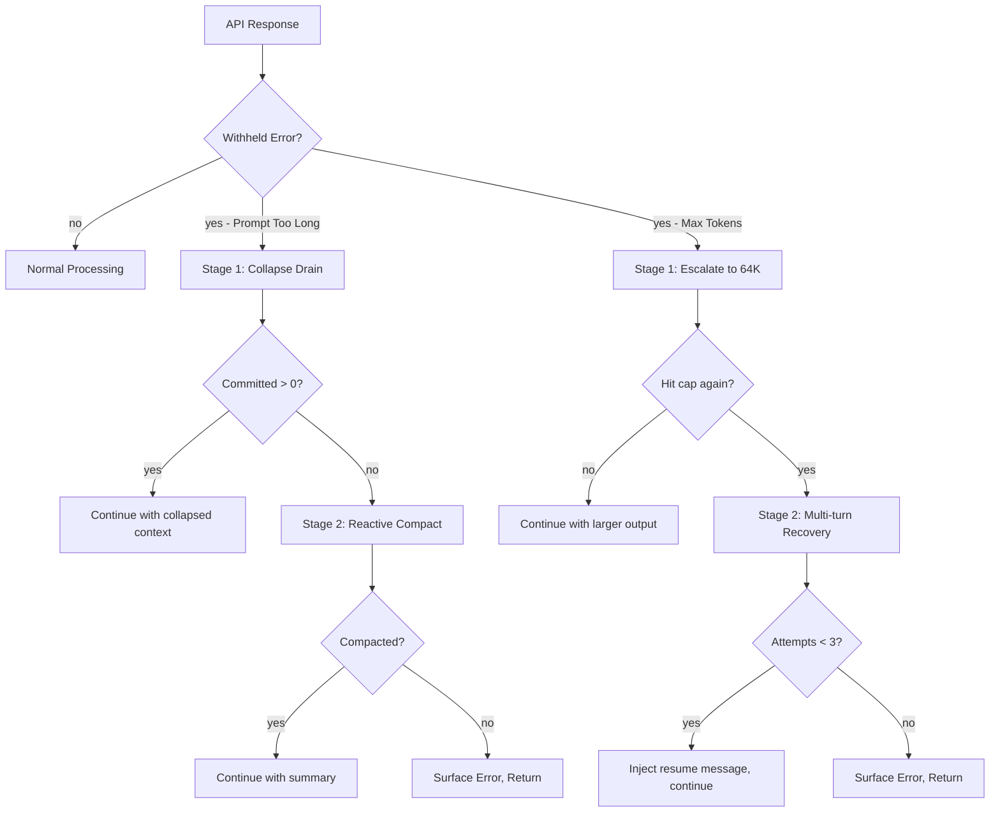

# Core Engine

The Core Engine is the heart of Claude Code — it orchestrates the agent loop, manages tool execution, handles streaming API responses, and coordinates the entire conversation lifecycle.

## Module Overview

| File | Lines | Responsibility |
|------|-------|----------------|
| `src/query.ts` | 1,729 | Agent Loop as async generator — the main orchestration |
| `src/QueryEngine.ts` | 1,295 | SDK/headless wrapper — manages conversation lifecycle |
| `src/Task.ts` | 125 | Task type definitions, status tracking, and ID generation |
| `src/Tool.ts` | 792 | Tool interface, types, and validation contracts |
| `src/tools.ts` | 389 | Tool registry — assembles all available tools |
| `src/services/tools/toolOrchestration.ts` | 188 | Tool orchestration with concurrency control |
| `src/services/tools/toolExecution.ts` | 1,745 | Individual tool execution, permissions, and hooks |
| `src/services/tools/toolHooks.ts` | 650 | Pre/Post tool hook lifecycle management |
| `src/services/tools/StreamingToolExecutor.ts` | 530 | Streaming-aware tool executor with queue management |
| **Total** | **7,318** | |

## Agent Loop Architecture

### Async Generator Pattern

The entire agent loop is implemented as a nested async generator chain:

```
query() ──delegates──▶ queryLoop() ──iterates──▶ while(true) { ... }
```

`query()` is the public entry point. It delegates to `queryLoop()` and handles post-loop cleanup (notifying command lifecycle for consumed commands). `queryLoop()` contains the actual `while(true)` loop that drives the agent.

```typescript
export async function* query(
  params: QueryParams,
): AsyncGenerator<
  | StreamEvent
  | RequestStartEvent
  | Message
  | TombstoneMessage
  | ToolUseSummaryMessage,
  Terminal
> {
  const consumedCommandUuids: string[] = []
  const terminal = yield* queryLoop(params, consumedCommandUuids)
  for (const uuid of consumedCommandUuids) {
    notifyCommandLifecycle(uuid, 'completed')
  }
  return terminal
}
```

The generator yields events and messages to the consumer (REPL UI or SDK) while maintaining internal state across iterations via a `State` object that is reconstructed at each `continue` site.

### State Management

Mutable state is carried between loop iterations through a single `State` object:

```typescript
type State = {
  messages: Message[]
  toolUseContext: ToolUseContext
  autoCompactTracking: AutoCompactTrackingState | undefined
  maxOutputTokensRecoveryCount: number
  hasAttemptedReactiveCompact: boolean
  maxOutputTokensOverride: number | undefined
  pendingToolUseSummary: Promise<ToolUseSummaryMessage | null> | undefined
  stopHookActive: boolean | undefined
  turnCount: number
  transition: Continue | undefined  // Why the previous iteration continued
}
```

Each `continue` site creates a new `State` object, and the loop destructures it at the top of each iteration. This pattern makes all exit points explicit and testable.

### Per-Iteration Flow

Each iteration of the agent loop follows this sequence:



## query() Function

### Signature

```typescript
export type QueryParams = {
  messages: Message[]
  systemPrompt: SystemPrompt
  userContext: { [k: string]: string }
  systemContext: { [k: string]: string }
  canUseTool: CanUseToolFn
  toolUseContext: ToolUseContext
  fallbackModel?: string
  querySource: QuerySource
  maxOutputTokensOverride?: number
  maxTurns?: number
  skipCacheWrite?: boolean
  taskBudget?: { total: number }
  deps?: QueryDeps
}

export async function* query(
  params: QueryParams,
): AsyncGenerator<
  | StreamEvent
  | RequestStartEvent
  | Message
  | TombstoneMessage
  | ToolUseSummaryMessage,
  Terminal
>
```

### Parameters

| Parameter | Type | Description |
|-----------|------|-------------|
| `messages` | `Message[]` | Conversation history |
| `systemPrompt` | `SystemPrompt` | System instructions |
| `userContext` | `object` | User-provided context variables |
| `systemContext` | `object` | System-provided context variables |
| `canUseTool` | `CanUseToolFn` | Permission check callback |
| `toolUseContext` | `ToolUseContext` | Tool execution context |
| `fallbackModel` | `string?` | Model to fall back to on errors |
| `querySource` | `QuerySource` | Origin of the query (sdk, repl, agent, etc.) |
| `maxOutputTokensOverride` | `number?` | Override for output token limit |
| `maxTurns` | `number?` | Maximum number of turns |
| `taskBudget` | `{ total: number }?` | API task_budget for the whole agentic turn |
| `deps` | `QueryDeps?` | Dependency injection (callModel, autocompact, etc.) |

### Yield Types

| Type | When |
|------|------|
| `StreamEvent` | API streaming events (message_start, content_block_start, etc.) |
| `RequestStartEvent` | `{ type: 'stream_request_start' }` at iteration start |
| `Message` | Assistant, user, progress, and system messages |
| `TombstoneMessage` | Orphaned message removal signal during streaming fallback |
| `ToolUseSummaryMessage` | Summary of previous turn's tool usage |

### Return Values (Terminal)

| Reason | Description |
|--------|-------------|
| `completed` | Normal completion — model produced final text response |
| `aborted_streaming` | User interrupted (Ctrl+C, new message) |
| `prompt_too_long` | Context exceeded limit, recovery exhausted |
| `image_error` | Image size/resize error (withheld, unrecoverable) |
| `model_error` | Unexpected API/runtime error |
| `blocking_limit` | Hard token blocking limit reached |
| `stop_hook_prevented` | StopHook blocked continuation |
| `token_budget_continuation` | Token budget auto-continue triggered |

## Stream Parsing and Event Handling

The model API call uses `deps.callModel()` which returns an async iterable. During streaming, each yielded message is processed:

1. **Streaming Fallback Detection**: If a `FallbackTriggeredError` occurs, the loop clears all accumulated state (assistant messages, tool results, tool use blocks) and retries with the fallback model. Tombstone messages are yielded to remove orphaned UI elements.

2. **Message Backfilling**: Tool use inputs are backfilled with observable fields (e.g., expanded file paths) on a cloned message before yielding, so SDK stream output sees enriched data while the original message sent to the API remains untouched for prompt caching.

3. **Withheld Errors**: Recoverable errors (prompt-too-long, max-output-tokens, media size errors) are withheld from the stream until recovery is attempted. This prevents SDK callers from seeing intermediate errors that would terminate their session prematurely.

4. **Tool Call Collection**: As `tool_use` blocks arrive in assistant messages, they are accumulated into `toolUseBlocks` and `needsFollowUp` is set to `true`.

```typescript
if (message.type === 'assistant') {
  assistantMessages.push(message)
  const msgToolUseBlocks = message.message.content.filter(
    content => content.type === 'tool_use',
  ) as ToolUseBlock[]
  if (msgToolUseBlocks.length > 0) {
    toolUseBlocks.push(...msgToolUseBlocks)
    needsFollowUp = true
  }
}
```

## Tool Call Partitioning

Tool calls are partitioned into batches based on concurrency safety. The partitioning algorithm groups consecutive read-only tools together and isolates write tools:



### Partition Logic (`toolOrchestration.ts:91-116`)

```typescript
function partitionToolCalls(
  toolUseMessages: ToolUseBlock[],
  toolUseContext: ToolUseContext,
): Batch[] {
  return toolUseMessages.reduce((acc: Batch[], toolUse) => {
    const tool = findToolByName(toolUseContext.options.tools, toolUse.name)
    const parsedInput = tool?.inputSchema.safeParse(toolUse.input)
    const isConcurrencySafe = parsedInput?.success
      ? tool?.isConcurrencySafe(parsedInput.data) ?? false
      : false
    if (isConcurrencySafe && acc[acc.length - 1]?.isConcurrencySafe) {
      acc[acc.length - 1]!.blocks.push(toolUse)
    } else {
      acc.push({ isConcurrencySafe, blocks: [toolUse] })
    }
  }, [])
}
```

**Rules:**
- Consecutive read-only tools (FileRead, Glob, Grep) are batched together for concurrent execution
- Any write tool (FileEdit, FileWrite, Bash) starts its own serial batch
- A read-only tool after a write tool starts a new concurrent batch

### Execution Modes

| Mode | Tools | Concurrency |
|------|-------|-------------|
| `runToolsConcurrently` | Read-only batch | Parallel, bounded by `CLAUDE_CODE_MAX_TOOL_USE_CONCURRENCY` (default: 10) |
| `runToolsSerially` | Write tools | One at a time, context updates propagate between calls |

## Streaming Tool Executor

The `StreamingToolExecutor` class (`StreamingToolExecutor.ts`) provides a more sophisticated execution model that starts tools as they stream in, rather than waiting for the full response:

```mermaid
sequenceDiagram
    participant Loop as Query Loop
    participant API as Model API
    participant Executor as StreamingToolExecutor
    participant Tools as Tool Implementations

    Loop->>API: callModel()
    API-->>Loop: stream: text block
    Loop-->>Consumer: yield text
    API-->>Loop: stream: tool_use block #1
    Loop->>Executor: addTool(block #1)
    Executor->>Tools: execute #1 (starts)
    API-->>Loop: stream: tool_use block #2
    Loop->>Executor: addTool(block #2)
    Executor->>Tools: execute #2 (concurrent)
    API-->>Loop: stream end
    Loop->>Executor: getRemainingResults()
    Tools-->>Executor: result #1
    Executor-->>Loop: yield result #1
    Tools-->>Executor: result #2
    Executor-->>Loop: yield result #2
```

### Tool Lifecycle States

Each tracked tool moves through these states:

```
queued → executing → completed → yielded
```

### Error Cascading

When a Bash tool errors, it triggers a cascade:

1. `this.hasErrored = true` is set
2. `siblingAbortController.abort('sibling_error')` fires
3. All other queued/executing tools receive synthetic cancellation errors
4. The parent `toolUseContext.abortController` is **not** aborted — only the sibling subprocesses die

This handles implicit dependency chains (e.g., `mkdir` fails → subsequent commands are pointless) while keeping independent tools (read/webfetch) unaffected.

### Interrupt Behavior

Tools define their `interruptBehavior` as either:
- `'cancel'` — tool can be interrupted by user input (e.g., long-running Bash)
- `'block'` — tool blocks interruption (e.g., file edits in progress)

## Error Recovery Mechanisms

### Prompt Too Long (413)

Two-stage recovery:

1. **Collapse Drain**: First, drain all staged context collapses (cheap, preserves granular context)
2. **Reactive Compact**: If collapse drain is insufficient or unavailable, attempt reactive compact (full summary)

```typescript
if (isWithheld413) {
  // Stage 1: Drain staged context collapses
  if (contextCollapse && state.transition?.reason !== 'collapse_drain_retry') {
    const drained = contextCollapse.recoverFromOverflow(messagesForQuery, querySource)
    if (drained.committed > 0) {
      state = { ...state, messages: drained.messages, transition: { reason: 'collapse_drain_retry' } }
      continue
    }
  }
}
// Stage 2: Reactive compact
if ((isWithheld413 || isWithheldMedia) && reactiveCompact) {
  const compacted = await reactiveCompact.tryReactiveCompact({ ... })
  if (compacted) {
    state = { ...state, messages: buildPostCompactMessages(compacted), transition: { reason: 'reactive_compact_retry' } }
    continue
  }
  // No recovery possible — surface error
  yield lastMessage
  return { reason: 'prompt_too_long' }
}
```

### Max Output Tokens

Three-stage recovery:

1. **Escalation**: If the default 8K cap was used and the `tengu_otk_slot_v1` feature is enabled, retry with 64K (`ESCALATED_MAX_TOKENS`) — fires once per turn
2. **Multi-turn Recovery**: Inject a meta message telling the model to resume mid-thought, up to `MAX_OUTPUT_TOKENS_RECOVERY_LIMIT` (3) times
3. **Surface Error**: If all recovery attempts exhausted, yield the withheld error

```typescript
const MAX_OUTPUT_TOKENS_RECOVERY_LIMIT = 3

if (isWithheldMaxOutputTokens(lastMessage)) {
  // Stage 1: Escalate from 8K to 64K
  if (capEnabled && maxOutputTokensOverride === undefined) {
    state = { ...state, maxOutputTokensOverride: ESCALATED_MAX_TOKENS, transition: { reason: 'max_output_tokens_escalate' } }
    continue
  }
  // Stage 2: Multi-turn recovery (up to 3 retries)
  if (maxOutputTokensRecoveryCount < MAX_OUTPUT_TOKENS_RECOVERY_LIMIT) {
    state = {
      ...state,
      messages: [...messagesForQuery, ...assistantMessages, recoveryMessage],
      maxOutputTokensRecoveryCount: maxOutputTokensRecoveryCount + 1,
      transition: { reason: 'max_output_tokens_recovery', attempt: maxOutputTokensRecoveryCount + 1 }
    }
    continue
  }
  // Stage 3: Surface error
  yield lastMessage
}
```

### API Errors and Fallbacks

- **`FallbackTriggeredError`**: Switches to `fallbackModel`, clears all accumulated state, strips thinking signature blocks (model-bound), and retries
- **`ImageSizeError` / `ImageResizeError`**: Yields user-friendly error, returns immediately
- **Generic errors**: Yields missing tool result blocks for any pending tool calls, surfaces the error

### Death Spiral Prevention

Stop hooks are **skipped** when the last message is an API error. Running hooks on a failed response creates a death spiral: error → hook blocking → retry → error → ...

```typescript
if (lastMessage?.isApiErrorMessage) {
  void executeStopFailureHooks(lastMessage, toolUseContext)
  return { reason: 'completed' }
}
```

## Token Budget Tracking

The token budget system (`query/tokenBudget.ts`) tracks output token usage and can trigger auto-continuation:

```typescript
if (feature('TOKEN_BUDGET')) {
  const decision = checkTokenBudget(
    budgetTracker!,
    toolUseContext.agentId,
    getCurrentTurnTokenBudget(),
    getTurnOutputTokens(),
  )

  if (decision.action === 'continue') {
    incrementBudgetContinuationCount()
    state = {
      ...state,
      messages: [
        ...messagesForQuery,
        ...assistantMessages,
        createUserMessage({ content: decision.nudgeMessage, isMeta: true }),
      ],
      maxOutputTokensRecoveryCount: 0,
      hasAttemptedReactiveCompact: false,
      transition: { reason: 'token_budget_continuation' },
    }
    continue
  }
}
```

When the budget is exceeded, a nudge message is injected into the conversation and the loop continues. The `hasAttemptedReactiveCompact` flag is reset to allow fresh compaction if needed.

## QueryEngine Class

`QueryEngine` is the SDK/headless wrapper that manages the full conversation lifecycle. One `QueryEngine` per conversation; each `submitMessage()` call starts a new turn.

### Architecture



### Key Responsibilities

| Responsibility | Method/Section |
|----------------|----------------|
| Conversation state | `mutableMessages`, `totalUsage`, `permissionDenials` |
| Turn lifecycle | `submitMessage()` — one call = one turn |
| Input processing | `processUserInput()` — handles slash commands, attachments |
| Transcript recording | `recordTranscript()` — persisted before API call for crash safety |
| SDK message mapping | Normalizes internal messages to `SDKMessage` format |
| Usage tracking | `accumulateUsage()`, `updateUsage()` across turns |
| Abort handling | Per-engine `AbortController`, shared across turns |

### submitMessage() Flow

```typescript
async *submitMessage(
  prompt: string | ContentBlockParam[],
  options?: { uuid?: string; isMeta?: boolean },
): AsyncGenerator<SDKMessage, void, unknown>
```

1. Wrap `canUseTool` to track permission denials for SDK reporting
2. Fetch system prompt parts (tools, model, MCP clients, working directories)
3. Build `processUserInputContext` with current state
4. Handle orphaned permissions (once per engine lifetime)
5. Process user input (slash commands, attachments, model changes)
6. Push messages and record transcript immediately (crash-safe)
7. Load skills and plugins (cache-only, non-blocking)
8. Yield system initialization message
9. Delegate to `query()` and map all yielded messages to SDK format
10. On completion, yield `SDKStatus` result with usage, cost, and turn count

## Tool Orchestration

### Concurrency Control

The `CLAUDE_CODE_MAX_TOOL_USE_CONCURRENCY` environment variable controls the maximum number of concurrent tool executions (default: 10):

```typescript
function getMaxToolUseConcurrency(): number {
  return (
    parseInt(process.env.CLAUDE_CODE_MAX_TOOL_USE_CONCURRENCY || '', 10) || 10
  )
}
```

This limit is applied via the `all()` utility function which runs async generators with bounded concurrency:

```typescript
async function* runToolsConcurrently(...): AsyncGenerator<MessageUpdateLazy, void> {
  yield* all(
    toolUseMessages.map(async function* (toolUse) {
      // ... execute tool
    }),
    getMaxToolUseConcurrency(),
  )
}
```

### Tool Execution Pipeline

Each tool goes through this pipeline:



### Hook System

Three hook phases surround each tool execution:

| Phase | Generator | Purpose |
|-------|-----------|---------|
| PreToolUse | `runPreToolUseHooks()` | Modify input, block execution, provide permission decisions |
| PostToolUse | `runPostToolUseHooks()` | Modify output, add context, block continuation |
| PostToolUseFailure | `runPostToolUseFailureHooks()` | Handle tool errors, provide recovery |

PreToolUse hooks can yield multiple result types:

| Type | Effect |
|------|--------|
| `message` | Emit progress or attachment message |
| `hookPermissionResult` | Provide allow/deny/ask decision |
| `hookUpdatedInput` | Modify tool input (passthrough) |
| `preventContinuation` | Flag that continuation should be prevented |
| `stopReason` | Provide reason for stopping |
| `additionalContext` | Add context as a message |
| `stop` | Halt execution immediately |

### Permission Resolution

The `resolveHookPermissionDecision()` function encapsulates the invariant that hook `allow` does **not** bypass settings.json deny/ask rules:

```typescript
export async function resolveHookPermissionDecision(
  hookPermissionResult: PermissionResult | undefined,
  tool: Tool,
  input: Record<string, unknown>,
  toolUseContext: ToolUseContext,
  canUseTool: CanUseToolFn,
  assistantMessage: AssistantMessage,
  toolUseID: string,
): Promise<{ decision: PermissionDecision; input: Record<string, unknown> }>
```

The resolution order:
1. Hook `allow` → check rule-based permissions → if no deny/ask rule, allow
2. Hook `allow` + deny rule → deny overrides
3. Hook `allow` + ask rule → still requires interactive prompt
4. Hook `deny` → deny immediately
5. No hook decision → normal `canUseTool()` flow

## Command Queue Processing

Between turns, the command queue is processed to handle slash commands and other queued operations:

```typescript
// In query() after queryLoop returns:
for (const uuid of consumedCommandUuids) {
  notifyCommandLifecycle(uuid, 'completed')
}
```

Commands are consumed from the queue during the query loop via `remove()` and `getCommandsByMaxPriority()` from `messageQueueManager`. Slash commands that mutate the message array (e.g., `/force-snip`) call `setMessages(fn)` which writes back to `mutableMessages` in SDK mode.

## Tool Registry

The tool registry (`src/tools.ts`) assembles all available tools with feature-gated conditional imports:

### Core Tools (Always Available)

| Tool | Purpose |
|------|---------|
| `BashTool` | Execute shell commands |
| `FileReadTool` | Read file contents |
| `FileEditTool` | Apply diffs to files |
| `FileWriteTool` | Create/overwrite files |
| `GlobTool` | File pattern matching |
| `GrepTool` | Content search |
| `WebFetchTool` | Fetch URL content |
| `WebSearchTool` | Web search |
| `TodoWriteTool` | Task tracking |
| `TaskCreateTool` | Create background tasks |
| `TaskGetTool` | Get task output |
| `TaskUpdateTool` | Update task description |
| `TaskListTool` | List tasks |
| `TaskStopTool` | Stop a task |
| `TaskOutputTool` | Task output streaming |
| `AgentTool` | Delegate to sub-agents |
| `SkillTool` | Execute skills |
| `AskUserQuestionTool` | Interactive user prompts |
| `LSPTool` | Language server protocol |
| `ConfigTool` | Configuration management |
| `EnterPlanModeTool` | Switch to plan mode |
| `ExitPlanModeV2Tool` | Exit plan mode |
| `EnterWorktreeTool` | Enter git worktree |
| `ExitWorktreeTool` | Exit git worktree |
| `NotebookEditTool` | Jupyter notebook editing |
| `TungstenTool` | Tungsten integration |
| `ListMcpResourcesTool` | List MCP resources |
| `ReadMcpResourceTool` | Read MCP resources |
| `ToolSearchTool` | Deferred tool discovery |

### Feature-Gated Tools

| Tool | Feature Flag | Purpose |
|------|-------------|---------|
| `REPLTool` | `USER_TYPE === 'ant'` | REPL execution |
| `SleepTool` | `PROACTIVE` or `KAIROS` | Sleep/wait |
| `CronCreateTool` | `AGENT_TRIGGERS` | Schedule cron jobs |
| `CronDeleteTool` | `AGENT_TRIGGERS` | Delete cron jobs |
| `CronListTool` | `AGENT_TRIGGERS` | List cron jobs |
| `RemoteTriggerTool` | `AGENT_TRIGGERS_REMOTE` | Remote triggers |
| `MonitorTool` | `MONITOR_TOOL` | Process monitoring |
| `SendUserFileTool` | `KAIROS` | Send files to user |
| `PushNotificationTool` | `KAIROS` or `KAIROS_PUSH_NOTIFICATION` | Push notifications |
| `SubscribePRTool` | `KAIROS_GITHUB_WEBHOOKS` | GitHub PR subscriptions |
| `TeamCreateTool` | Lazy import | Team agent creation |
| `TeamDeleteTool` | Lazy import | Team agent deletion |
| `SendMessageTool` | Lazy import | Inter-agent messaging |
| `VerifyPlanExecutionTool` | `CLAUDE_CODE_VERIFY_PLAN` | Plan verification |

### Lazy Imports (Circular Dependency Prevention)

Tools that create circular dependencies are lazy-required:

```typescript
const getTeamCreateTool = () =>
  require('./tools/TeamCreateTool/TeamCreateTool.js').TeamCreateTool
const getTeamDeleteTool = () =>
  require('./tools/TeamDeleteTool/TeamDeleteTool.js').TeamDeleteTool
const getSendMessageTool = () =>
  require('./tools/SendMessageTool/SendMessageTool.js').SendMessageTool
```

## Task Management

The `Task.ts` module defines the task system used for background operations:

### Task Types

```typescript
type TaskType =
  | 'local_bash'        // Background shell command
  | 'local_agent'       // Local sub-agent
  | 'remote_agent'      // Remote sub-agent
  | 'in_process_teammate' // In-process teammate
  | 'local_workflow'    // Local workflow
  | 'monitor_mcp'       // MCP monitor
  | 'dream'             // Dream/creative mode
```

### Task Statuses

```typescript
type TaskStatus = 'pending' | 'running' | 'completed' | 'failed' | 'killed'
```

Terminal statuses (`completed`, `failed`, `killed`) indicate the task will not transition further.

### Task ID Generation

Task IDs use a type-specific prefix plus 8 random characters from a 36-character alphabet:

| Type | Prefix | Example |
|------|--------|---------|
| `local_bash` | `b` | `b3k9x2m7` |
| `local_agent` | `a` | `a7f2p1q8` |
| `remote_agent` | `r` | `r5n8w3j6` |
| `in_process_teammate` | `t` | `t1m4k7x2` |
| `local_workflow` | `w` | `w9p3f6n1` |
| `monitor_mcp` | `m` | `m2x7k4j8` |
| `dream` | `d` | `d6w1n5p3` |

This provides ~2.8 trillion combinations (36^8), sufficient to resist brute-force symlink attacks.

## Key Sequence Diagrams

### Full Agent Turn


### Streaming Tool Execution



### Error Recovery Flow



## File Index

| File | Lines | Key Exports |
|------|-------|-------------|
| `src/query.ts` | 1,729 | `query()`, `queryLoop()`, `QueryParams`, `State` |
| `src/QueryEngine.ts` | 1,295 | `QueryEngine`, `QueryEngineConfig`, `submitMessage()` |
| `src/Task.ts` | 125 | `Task`, `TaskType`, `TaskStatus`, `TaskStateBase`, `generateTaskId()`, `createTaskStateBase()`, `isTerminalTaskStatus()` |
| `src/Tool.ts` | 792 | `Tool`, `Tools`, `ToolUseContext`, `ToolInputJSONSchema`, `ValidationResult`, `QueryChainTracking` |
| `src/tools.ts` | 389 | Tool registry assembly, `getAllBaseTools()`, feature-gated tool imports |
| `src/services/tools/toolOrchestration.ts` | 188 | `runTools()`, `partitionToolCalls()`, `getMaxToolUseConcurrency()` |
| `src/services/tools/toolExecution.ts` | 1,745 | `runToolUse()`, `checkPermissionsAndCallTool()`, `classifyToolError()`, `MessageUpdateLazy` |
| `src/services/tools/toolHooks.ts` | 650 | `runPreToolUseHooks()`, `runPostToolUseHooks()`, `runPostToolUseFailureHooks()`, `resolveHookPermissionDecision()` |
| `src/services/tools/StreamingToolExecutor.ts` | 530 | `StreamingToolExecutor` class, `TrackedTool`, `ToolStatus` |
