# Context 系统（上下文系统）

> Context 系统是 Claude Code 的核心基础设施——它负责构建、管理和压缩与模型 API 交互时的所有上下文信息。从 System Context 的 Git 状态到 ToolUseContext 的 ~15 类丰富信息，再到 Auto Compact、Context Collapse、Reactive Compact 等多种压缩策略，上下文系统确保 Claude 在有限的上下文窗口内保持最高的工作效率。

## 模块概述

| 文件 | 行数 | 职责 |
|------|-------|------|
| `src/context.ts` | 189 | System Context / User Context 构建（带 memoization） |
| `src/services/compact/compact.ts` | ~1,800 | 压缩核心逻辑（Auto Compact、Partial Compact、Forked Agent 缓存共享） |
| `src/services/compact/compactWarningState.ts` | ~50 | 压缩警告状态管理 |
| `src/services/compact/compactWarningHook.ts` | ~80 | 压缩警告 Hook |
| `src/commands/compact/compact.ts` | ~120 | `/compact` 命令入口 |
| `src/utils/context.ts` | ~60 | 上下文工具函数（COMPACT_MAX_OUTPUT_TOKENS 等） |
| `src/utils/contextAnalysis.ts` | ~200 | 上下文分析与遥测指标 |
| `src/utils/contextSuggestions.ts` | ~80 | 上下文建议生成 |
| **总计** | **~2,579** | |

## 上下文生命周期

上下文的完整生命周期可分为四个阶段：

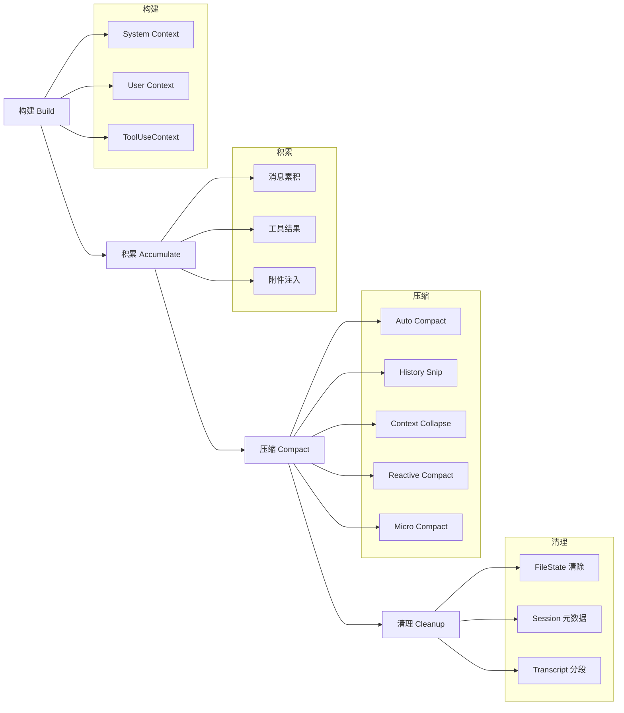

## System Context 构建详解

System Context 在对话开始时构建，通过 `memoize` 缓存，在整个对话生命周期内保持不变。

### 文件位置

```typescript
// src/context.ts
export const getSystemContext = memoize(async (): Promise<{ [k: string]: string }> => { ... })
```

### Git 状态采集

Git 状态通过并行执行 5 个 Git 命令获取：

```typescript
const [branch, mainBranch, status, log, userName] = await Promise.all([
  getBranch(),
  getDefaultBranch(),
  execFileNoThrow(gitExe(), ['--no-optional-locks', 'status', '--short'], {
    preserveOutputOnError: false,
  }).then(({ stdout }) => stdout.trim()),
  execFileNoThrow(
    gitExe(),
    ['--no-optional-locks', 'log', '--oneline', '-n', '5'],
    { preserveOutputOnError: false },
  ).then(({ stdout }) => stdout.trim()),
  execFileNoThrow(gitExe(), ['config', 'user.name'], {
    preserveOutputOnError: false,
  }).then(({ stdout }) => stdout.trim()),
])
```

**关键设计：**
- 使用 `--no-optional-locks` 避免与 Git 操作冲突
- 状态超过 `MAX_STATUS_CHARS`（2000 字符）时自动截断
- 在 CCR 远程模式或禁用 Git 指令时跳过 Git 状态采集

### 缓存破坏器注入（Cache Breaker）

仅用于 `ant` 内部构建的调试场景：

```typescript
const injection = feature('BREAK_CACHE_COMMAND')
  ? getSystemPromptInjection()
  : null

return {
  ...(gitStatus && { gitStatus }),
  ...(feature('BREAK_CACHE_COMMAND') && injection
    ? { cacheBreaker: `[CACHE_BREAKER: ${injection}]` }
    : {}),
}
```

当 `setSystemPromptInjection()` 被调用时，会立即清除 `getUserContext` 和 `getSystemContext` 的 memoization 缓存。

### System Context 结构

```
System Context
├── gitStatus (可选)
│   ├── "This is the git status at the start of the conversation..."
│   ├── Current branch
│   ├── Main branch
│   ├── Git user (可选)
│   ├── Status (截断至 2000 字符)
│   └── Recent commits (最近 5 条)
└── cacheBreaker (仅 ant 内部构建)
    └── [CACHE_BREAKER: <injection>]
```

## User Context 构建详解

User Context 同样通过 `memoize` 缓存，包含 CLAUDE.md 内容和当前日期。

### 文件位置

```typescript
// src/context.ts
export const getUserContext = memoize(async (): Promise<{ [k: string]: string }> => { ... })
```

### CLAUDE.md 内容加载

```typescript
const shouldDisableClaudeMd =
  isEnvTruthy(process.env.CLAUDE_CODE_DISABLE_CLAUDE_MDS) ||
  (isBareMode() && getAdditionalDirectoriesForClaudeMd().length === 0)

const claudeMd = shouldDisableClaudeMd
  ? null
  : getClaudeMds(filterInjectedMemoryFiles(await getMemoryFiles()))
```

**禁用条件：**
- `CLAUDE_CODE_DISABLE_CLAUDE_MDS` 环境变量设置为 `true`
- Bare 模式下且没有通过 `--add-dir` 显式指定额外目录

### 当前日期

```typescript
currentDate: `Today's date is ${getLocalISODate()}.`
```

### User Context 结构

```
User Context
├── claudeMd (可选)
│   └── CLAUDE.md 文件内容（含 Memory 文件）
└── currentDate
    └── "Today's date is <ISO 日期>."
```

## ToolUseContext 详解

ToolUseContext 是工具调用时传递的丰富上下文对象，包含约 15 类信息：

### ToolUseContext 结构

```
ToolUseContext
├── options
│   ├── tools: Tool[]              # 可用工具列表
│   ├── commands: Command[]        # 可用命令列表
│   ├── mcpClients: MCPClient[]    # MCP 客户端
│   ├── model: string              # 当前模型
│   ├── thinking: ThinkingConfig   # 思考配置
│   ├── mainLoopModel: string      # 主循环模型
│   ├── querySource: QuerySource   # 查询来源
│   ├── isNonInteractiveSession    # 是否非交互模式
│   ├── appendSystemPrompt         # 附加 System Prompt
│   └── agentDefinitions           # Agent 定义
├── getAppState() / setAppState()  # 应用状态读写
├── abortController                # 中止控制器
├── fileStateCache (LRU)           # 文件状态缓存（每 Agent 独立）
├── readFileState                  # 文件读取状态
├── loadedNestedMemoryPaths        # 已加载的嵌套 Memory 路径
├── messages: Message[]            # 当前消息历史
├── agentId / agentType            # Agent 标识
├── permissionContext              # 权限上下文
├── denialTracking                 # 拒绝追踪
├── notificationHandlers           # 通知处理器
├── promptRequestFactory           # Prompt 请求工厂
├── onCompactProgress              # 压缩进度回调
├── setStreamMode / setResponseLength  # UI 状态更新
├── setSDKStatus                   # SDK 状态设置
└── queryTracking                  # 查询追踪（chainId, depth）
```

### 上下文架构图

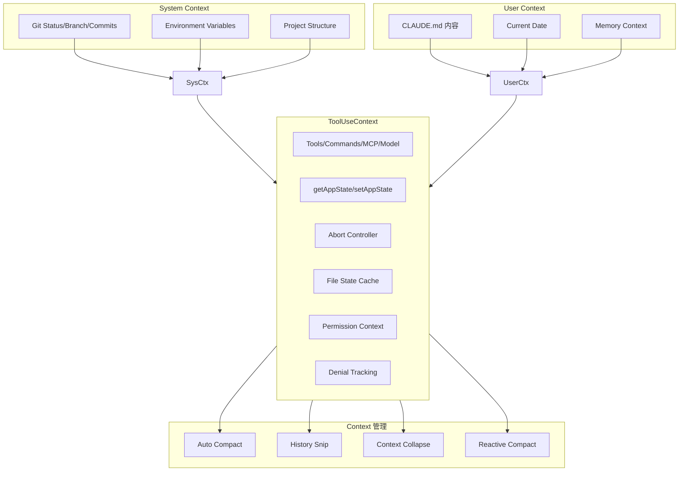

## 上下文压缩策略详解

Claude Code 实现了 7 种上下文压缩策略，按触发条件和激进程度排列：

| 策略 | 触发条件 | 实现方式 | 激进程度 |
|------|----------|----------|----------|
| **Micro Compact** | 按需 / 定时 | 渐进式消息裁剪 | 最低 |
| **History Snip** | Feature-gated | 消息级裁剪 | 低 |
| **Auto Compact** | 接近上下文窗口限制 | 自动压缩历史消息 | 中 |
| **Reactive Compact** | 上下文压力驱动 | 按需摘要压缩 | 中高 |
| **Context Collapse** | Feature-gated / 压力驱动 | 激进上下文缩减 | 高 |
| **Partial Compact** | 用户手动触发 | 部分对话压缩 | 定向 |
| **Session Memory** | 跨会话持久化 | 记忆摘要持久化 | 持久 |

### 压缩策略决策流程

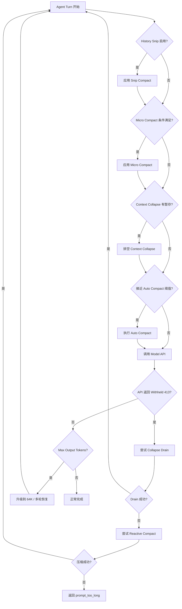

## Auto Compact 详细机制

Auto Compact 是最核心的自动压缩策略，在上下文接近窗口限制时自动触发。

### 触发条件

```typescript
// src/query.ts 中的 State 追踪
type State = {
  autoCompactTracking: AutoCompactTrackingState | undefined
  hasAttemptedReactiveCompact: boolean
  // ...
}
```

Auto Compact 在每次 Agent Turn 开始前检查：

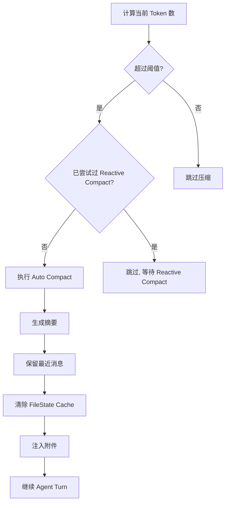

### 阈值计算

阈值基于模型的上下文窗口大小动态计算：

```
threshold = model_context_window - safety_margin
```

其中 `safety_margin` 包括：
- System Prompt 大小
- 工具定义（Tool Schema）大小
- User Context 大小
- 预留输出空间

### 执行流程

1. **Pre-Compact Hooks**：执行 `executePreCompactHooks()`，允许 Hook 修改输入或提供额外指令
2. **生成摘要**：调用 `compactConversation()`，使用 Forked Agent 或流式 API 生成对话摘要
3. **清除缓存**：`context.readFileState.clear()` 和 `context.loadedNestedMemoryPaths?.clear()`
4. **构建附件**：并行生成文件附件、Agent 附件、Plan 附件、Skill 附件
5. **Delta 重新注入**：重新宣布 Tools、Agents、MCP 指令的增量变更
6. **Session Start Hooks**：执行 `processSessionStartHooks('compact', ...)`
7. **Post-Compact Hooks**：执行 `executePostCompactHooks()`
8. **构建结果消息**：`buildPostCompactMessages()` 组装边界标记、摘要、附件

### 熔断器（Circuit Breaker）

Auto Compact 内置熔断器防止连续触发：

```typescript
// 压缩后检查是否会立即再次触发
const willRetriggerNextTurn = truePostCompactTokenCount >= autoCompactThreshold

logEvent('tengu_compact', {
  willRetriggerNextTurn,
  // ...
})
```

当 `willRetriggerNextTurn` 为 `true` 时，系统会在遥测中标记，但不会立即阻止压缩——而是依赖 `hasAttemptedReactiveCompact` 标志来避免循环。

### 警告阈值

压缩过程中通过 `onCompactProgress` 回调通知 UI：

```typescript
context.onCompactProgress?.({ type: 'hooks_start', hookType: 'pre_compact' })
context.onCompactProgress?.({ type: 'compact_start' })
context.onCompactProgress?.({ type: 'hooks_start', hookType: 'session_start' })
context.onCompactProgress?.({ type: 'hooks_start', hookType: 'post_compact' })
context.onCompactProgress?.({ type: 'compact_end' })
```

### Prompt-Too-Long 重试

当压缩请求本身触发 prompt-too-long 时，使用 `truncateHeadForPTLRetry()` 逐步丢弃最旧的消息：

```typescript
const MAX_PTL_RETRIES = 3
const PTL_RETRY_MARKER = '[earlier conversation truncated for compaction retry]'

function truncateHeadForPTLRetry(messages: Message[], ptlResponse: AssistantMessage): Message[] | null {
  // 按 API Round 分组消息
  const groups = groupMessagesByApiRound(input)
  // 计算需要丢弃的组数以覆盖 token gap
  // 或回退到丢弃 20% 的组
  // 确保至少保留一组用于摘要
}
```

## Context Collapse 详细机制

Context Collapse 是一种激进的上下文缩减策略，通常作为 Auto Compact 的补充。

### 工作原理

Context Collapse 通过暂存（stage）压缩操作，在需要时一次性排空（drain）：

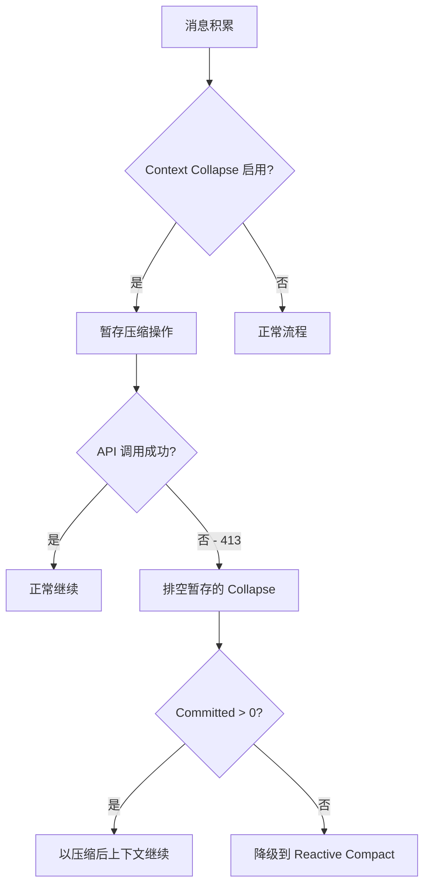

### 关键特性

- **暂存式压缩**：Collapse 操作不立即应用，而是暂存等待需要时排空
- **低成本恢复**：相比 Reactive Compact 的完整摘要，Collapse 排空代价更低
- **细粒度保留**：保留更多细粒度的上下文信息

### 与其他策略的交互

```typescript
// query.ts 中的恢复顺序
if (isWithheld413) {
  // 阶段 1：首先尝试排空已暂存的 context collapse
  if (contextCollapse && state.transition?.reason !== 'collapse_drain_retry') {
    const drained = contextCollapse.recoverFromOverflow(messagesForQuery, querySource)
    if (drained.committed > 0) {
      state = { ...state, messages: drained.messages, transition: { reason: 'collapse_drain_retry' } }
      continue
    }
  }
  // 阶段 2：如果 collapse drain 不够，尝试 reactive compact
  if (reactiveCompact) {
    const compacted = await reactiveCompact.tryReactiveCompact({ ... })
    // ...
  }
}
```

## Reactive Compact 详细机制

Reactive Compact 是按需触发的上下文压缩策略，作为 Auto Compact 耗尽后的后备方案。

### 工作原理

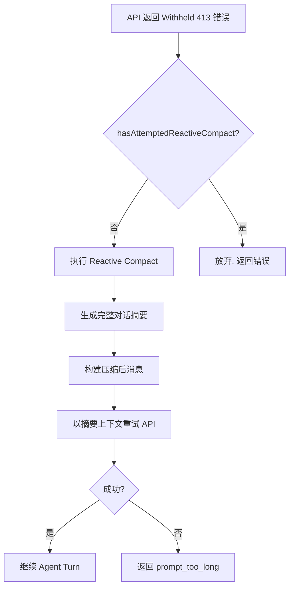

### Feature Flag 交互

Reactive Compact 受 Feature Flag 门控：

```typescript
if (feature('REACTIVE_COMPACT') && reactiveCompact) {
  // 执行 reactive compact
}
```

### Withheld Prompt-Too-Long 处理

```typescript
// 扣留错误不立即展示给用户
if (isWithheld413 && reactiveCompact && !state.hasAttemptedReactiveCompact) {
  const compacted = await reactiveCompact.tryReactiveCompact({
    messages: messagesForQuery,
    context,
    cacheSafeParams,
    // ...
  })
  if (compacted) {
    state = {
      ...state,
      messages: buildPostCompactMessages(compacted),
      hasAttemptedReactiveCompact: true,
      transition: { reason: 'reactive_compact_retry' },
    }
    continue
  }
  // 无法恢复 —— 展示错误
  yield lastMessage
  return { reason: 'prompt_too_long' }
}
```

## History Snip 详细机制

History Snip 是一种轻量级的消息裁剪策略，通过 Feature Flag 门控。

### 工作原理

History Snip 在每次 Agent Turn 开始前检查是否需要裁剪最旧的消息：

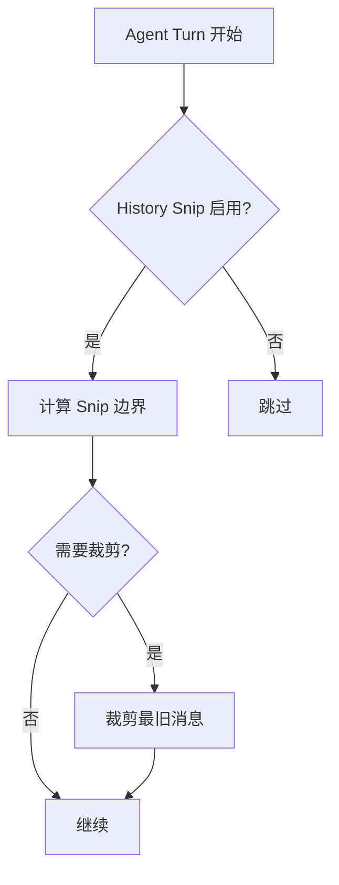

### 关键特性

- **消息级裁剪**：按消息边界裁剪，不会截断单条消息
- **Feature-Gated**：通过 Feature Flag 控制启用
- **轻量级**：不涉及 API 调用，仅删除旧消息

### Snip 边界结构

```typescript
// Snip 边界标记裁剪位置
interface SnipBoundary {
  type: 'snip'
  snippedMessages: number    // 被裁剪的消息数
  snippedTokens: number      // 被裁剪的 token 数
  timestamp: number          // 裁剪时间戳
}
```

## Micro Compact 详细机制

Micro Compact 是一种渐进式的轻量压缩策略，有两种变体。

### 两种变体

#### 时间驱动变体（Time-Driven）

基于消息数量或 Turn 数触发：

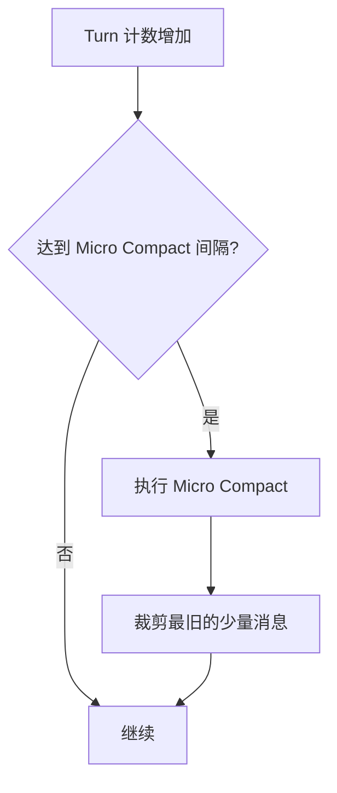

#### 缓存驱动变体（Cache-Driven）

基于 Prompt Cache 状态触发：

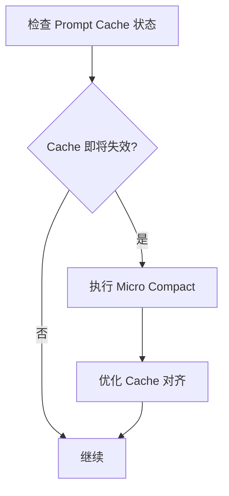

### API 侧实现

Micro Compact 在 API 调用前执行，不触发完整的压缩流程：

```typescript
// query.ts 中的压缩顺序
// 1. Snip Compact
// 2. Micro Compact
// 3. Context Collapse
// 4. Auto Compact
```

## 记忆化与缓存策略

### Memoization 缓存

System Context 和 User Context 使用 `lodash-es/memoize` 进行记忆化：

```typescript
export const getSystemContext = memoize(async (): Promise<{ [k: string]: string }> => { ... })
export const getUserContext = memoize(async (): Promise<{ [k: string]: string }> => { ... })
```

**缓存失效：**
- `setSystemPromptInjection()` 调用时立即清除两个缓存
- 缓存贯穿整个对话生命周期

### FileState Cache

每个 Agent 独立的 LRU 文件状态缓存：

```typescript
context.readFileState          // LRU 缓存
context.loadedNestedMemoryPaths // 已加载的嵌套 Memory 路径
```

**压缩时清除：**
```typescript
// 压缩前保存快照
const preCompactReadFileState = cacheToObject(context.readFileState)
// 清除缓存
context.readFileState.clear()
context.loadedNestedMemoryPaths?.clear()
```

### Prompt Cache 共享

压缩时使用 Forked Agent 复用主对话的 Prompt Cache：

```typescript
const promptCacheSharingEnabled = getFeatureValue_CACHED_MAY_BE_STALE(
  'tengu_compact_cache_prefix',
  true,  // 3P 默认启用
)

if (promptCacheSharingEnabled) {
  const result = await runForkedAgent({
    promptMessages: [summaryRequest],
    cacheSafeParams,
    canUseTool: createCompactCanUseTool(),
    querySource: 'compact',
    forkLabel: 'compact',
    maxTurns: 1,
    skipCacheWrite: true,
    overrides: { abortController: context.abortController },
  })
}
```

**关键设计：**
- 不设置 `maxOutputTokens`，避免 thinking config 不匹配导致 Cache 失效
- 通过 `cacheSafeParams` 传递 System Prompt、Tools、Model、Messages 前缀等 Cache Key 参数
- 失败时回退到流式 API 路径

## 上下文注入模式

### 压缩后附件增量模式（Post-Compact Attachment Delta）

压缩后需要重新注入模型所需的上下文信息：

```typescript
// 1. 文件附件（最近访问的文件）
const fileAttachments = await createPostCompactFileAttachments(
  preCompactReadFileState,
  context,
  POST_COMPACT_MAX_FILES_TO_RESTORE,  // 5 个
)

// 2. Agent 附件
const asyncAgentAttachments = await createAsyncAgentAttachmentsIfNeeded(context)

// 3. Plan 附件
const planAttachment = createPlanAttachmentIfNeeded(context.agentId)

// 4. Skill 附件
const skillAttachment = createSkillAttachmentIfNeeded(context.agentId)

// 5. Delta 重新宣布（对比空历史，注入完整集合）
for (const att of getDeferredToolsDeltaAttachment(context.options.tools, ..., [])) {
  postCompactFileAttachments.push(createAttachmentMessage(att))
}
for (const att of getAgentListingDeltaAttachment(context, [])) {
  postCompactFileAttachments.push(createAttachmentMessage(att))
}
for (const att of getMcpInstructionsDeltaAttachment(...)) {
  postCompactFileAttachments.push(createAttachmentMessage(att))
}
```

### 紧凑提示词设计（Compact Prompt Design）

压缩使用的提示词通过 `getCompactPrompt()` 生成：

```typescript
const compactPrompt = getCompactPrompt(customInstructions)
const summaryRequest = createUserMessage({ content: compactPrompt })
```

压缩 API 调用配置：
- System Prompt: `"You are a helpful AI assistant tasked with summarizing conversations."`
- Thinking: 禁用
- 工具: 仅 `FileReadTool`（或加上 `ToolSearchTool` + MCP 工具）
- `maxOutputTokensOverride`: `Math.min(COMPACT_MAX_OUTPUT_TOKENS, getMaxOutputTokensForModel(model))`

### 压缩后清理（Post-Compaction Cleanup）

```typescript
// 1. 重置 Prompt Cache 基线
if (feature('PROMPT_CACHE_BREAK_DETECTION')) {
  notifyCompaction(context.options.querySource ?? 'compact', context.agentId)
}
markPostCompaction()

// 2. 重新追加 Session 元数据（保持 16KB 尾部窗口内）
reAppendSessionMetadata()

// 3. 写入 Transcript 分段（仅 Assistant 模式）
if (feature('KAIROS')) {
  void sessionTranscriptModule?.writeSessionTranscriptSegment(messages)
}
```

## 压缩后上下文恢复

### 文件状态恢复

压缩前保存的文件状态快照用于恢复最近访问的文件：

```typescript
const POST_COMPACT_MAX_FILES_TO_RESTORE = 5
const POST_COMPACT_TOKEN_BUDGET = 50_000
const POST_COMPACT_MAX_TOKENS_PER_FILE = 5_000
```

**预算控制：**
- 最多恢复 5 个文件
- 每个文件最多 5,000 tokens
- 总预算 50,000 tokens

### Skill 附件预算

```typescript
export const POST_COMPACT_MAX_TOKENS_PER_SKILL = 5_000
export const POST_COMPACT_SKILLS_TOKEN_BUDGET = 25_000
```

每个 Skill 最多 5,000 tokens，总预算 25,000 tokens（约 5 个 Skills）。

## 消息按 API 轮分组

`groupMessagesByApiRound()` 函数将消息按 API Round 分组，用于 `truncateHeadForPTLRetry()`：

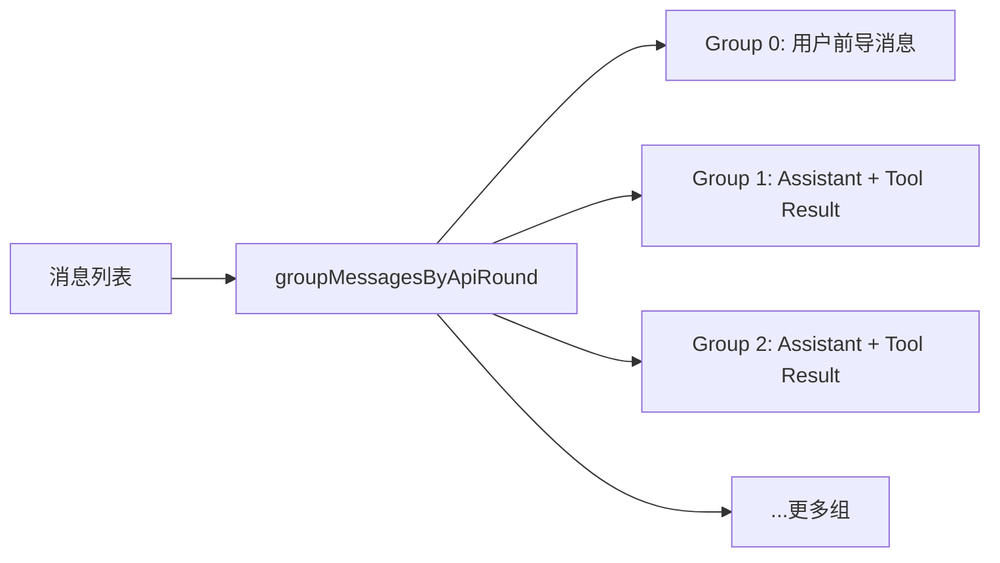

**关键特性：**
- Group 0 包含用户前导消息（preamble）
- 后续每组以 Assistant 消息开始
- 用于计算需要丢弃多少组以覆盖 token gap

## 压缩期间的 Prompt 缓存共享

### Forked Agent 路径

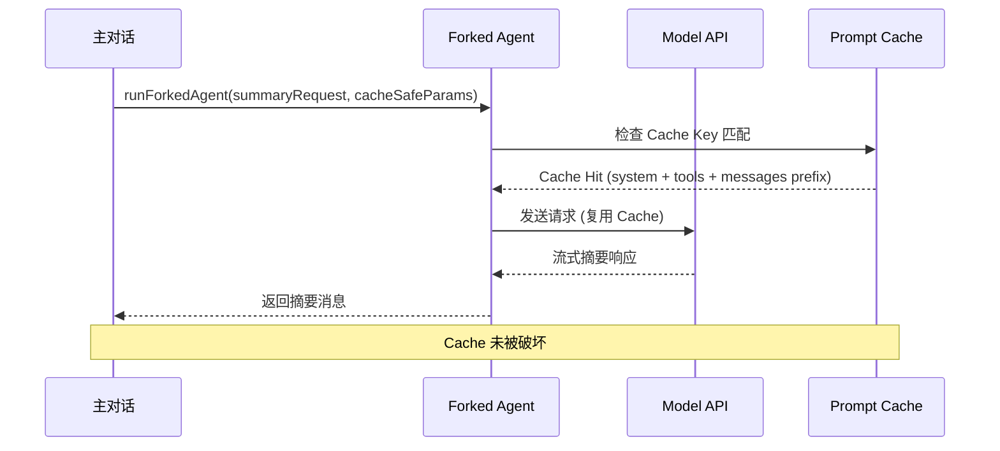

### 流式回退路径

当 Forked Agent 失败时回退到流式 API：

```typescript
// 流式回退路径
const retryEnabled = getFeatureValue_CACHED_MAY_BE_STALE(
  'tengu_compact_streaming_retry',
  false,  // 默认禁用
)
const maxAttempts = retryEnabled ? MAX_COMPACT_STREAMING_RETRIES : 1  // MAX = 2
```

### 保活机制

压缩期间发送保活信号防止 WebSocket 超时：

```typescript
const activityInterval = isSessionActivityTrackingActive()
  ? setInterval(
      (statusSetter) => {
        sendSessionActivitySignal()      // PUT /worker heartbeat
        statusSetter?.('compacting')      // 重新发射 'compacting' 状态
      },
      30_000,  // 每 30 秒
      context.setSDKStatus,
    )
  : undefined
```

## 关键设计模式

### 1. Feature Flag 门控

所有压缩策略均受 Feature Flag 控制：

```typescript
feature('REACTIVE_COMPACT')      // Reactive Compact
feature('BREAK_CACHE_COMMAND')   // 缓存破坏器注入
feature('PROMPT_CACHE_BREAK_DETECTION')  // Prompt Cache 破坏检测
feature('KAIROS')                // Assistant 模式（Transcript 分段）
feature('EXPERIMENTAL_SKILL_SEARCH')     // 实验性 Skill 搜索
```

### 2. 熔断器

`hasAttemptedReactiveCompact` 标志防止压缩循环：

```typescript
type State = {
  hasAttemptedReactiveCompact: boolean
  maxOutputTokensRecoveryCount: number
  // ...
}
```

### 3. Require-Imports

压缩模块使用条件性 require 避免循环依赖：

```typescript
const sessionTranscriptModule = feature('KAIROS')
  ? require('../sessionTranscript/sessionTranscript.js')
  : null
```

### 4. 死代码消除（DCE）

通过 `feature()` 函数实现编译时死代码消除：

```typescript
// 在外部构建中，整个 KAIROS 分支被消除
if (feature('KAIROS')) {
  void sessionTranscriptModule?.writeSessionTranscriptSegment(messages)
}
```

### 5. 压缩后附件增量模式

压缩后通过 Delta 机制重新注入上下文：

```typescript
// 对比空历史 [] → 注入完整集合
getDeferredToolsDeltaAttachment(tools, model, [], { callSite: 'compact_full' })
// Partial Compact 对比 messagesToKeep → 仅注入缺失部分
getDeferredToolsDeltaAttachment(tools, model, messagesToKeep, { callSite: 'compact_partial' })
```

### 6. Prompt-Too-Long 重试

三阶段重试机制：

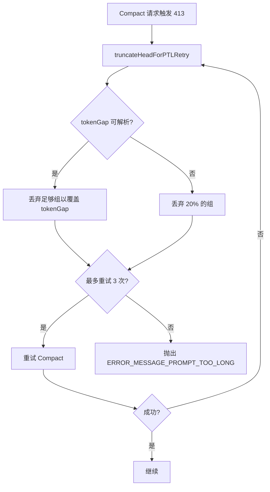

### 7. Withheld Errors（扣留错误）

可恢复错误在尝试恢复前不展示给用户：

```typescript
// 扣留 413 错误，先尝试恢复
if (isWithheld413) {
  // 尝试 Collapse Drain → Reactive Compact
  // 只有所有恢复机制耗尽才展示错误
}
```

### 8. 图像剥离

压缩前从消息中剥离图像块，减少 token 使用：

```typescript
export function stripImagesFromMessages(messages: Message[]): Message[] {
  // image → [image] 文本标记
  // document → [document] 文本标记
  // 包括 tool_result 内容中的嵌套图像
}
```

### 9. 重新注入附件剥离

剥离在压缩后会被重新注入的附件，避免浪费 token：

```typescript
export function stripReinjectedAttachments(messages: Message[]): Message[] {
  // 移除 skill_discovery / skill_listing 附件
  // 这些会在压缩后通过 resetSentSkillNames() 重新注入
}
```

## 最佳实践

### 1. 压缩阈值调优

- Auto Compact 阈值应设置为 `model_context_window - safety_margin`
- `safety_margin` 需包含 System Prompt、Tools、User Context 和输出预留
- 监控 `willRetriggerNextTurn` 指标判断阈值是否合理

### 2. Prompt Cache 优化

- 启用 `tengu_compact_cache_prefix` Feature Flag 以复用 Prompt Cache
- 压缩时不设置 `maxOutputTokens`，避免 Cache Key 不匹配
- 压缩后通过 `notifyCompaction()` 重置 Cache 基线

### 3. 文件恢复策略

- `POST_COMPACT_MAX_FILES_TO_RESTORE = 5` 是经验值
- 每个文件 5,000 tokens 上限防止单个大文件占用过多预算
- 总预算 50,000 tokens 平衡了上下文恢复和 token 效率

### 4. 错误处理

- Auto Compact 失败不显示通知（`!isAutoCompact` 时才显示）
- 手动 `/compact` 失败立即显示错误通知
- Withheld Errors 在恢复机制耗尽后才展示

### 5. 性能监控

关键遥测事件：

| 事件 | 用途 |
|------|------|
| `tengu_compact` | 压缩完成，包含 token 统计和缓存命中率 |
| `tengu_compact_failed` | 压缩失败，记录原因 |
| `tengu_compact_ptl_retry` | Prompt-Too-Long 重试 |
| `tengu_compact_cache_sharing_success` | Forked Agent 缓存共享成功 |
| `tengu_compact_cache_sharing_fallback` | 回退到流式路径 |
| `tengu_compact_streaming_retry` | 流式重试 |
| `tengu_partial_compact` | 部分压缩 |

### 6. 压缩后状态

- `markPostCompaction()` 标记压缩后状态，影响后续的 Cache 破坏检测
- `reAppendSessionMetadata()` 保持 Session 元数据在 16KB 尾部窗口内
- 不重置 `sentSkillNames`，节省约 4,000 tokens/次压缩

## 文件索引

| 文件 | 行数 | 关键导出 |
|------|-------|----------|
| `src/context.ts` | 189 | `getSystemContext()`, `getUserContext()`, `getGitStatus()`, `setSystemPromptInjection()` |
| `src/services/compact/compact.ts` | ~1,800 | `compactConversation()`, `partialCompactConversation()`, `buildPostCompactMessages()`, `stripImagesFromMessages()`, `truncateHeadForPTLRetry()` |
| `src/services/compact/compactWarningState.ts` | ~50 | 压缩警告状态 |
| `src/services/compact/compactWarningHook.ts` | ~80 | 压缩警告 Hook |
| `src/commands/compact/compact.ts` | ~120 | `/compact` 命令处理器 |
| `src/utils/context.ts` | ~60 | `COMPACT_MAX_OUTPUT_TOKENS` |
| `src/utils/contextAnalysis.ts` | ~200 | `analyzeContext()`, `tokenStatsToStatsigMetrics()` |
| `src/utils/contextSuggestions.ts` | ~80 | 上下文建议生成 |
