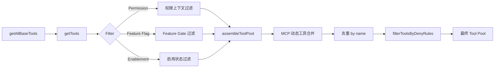
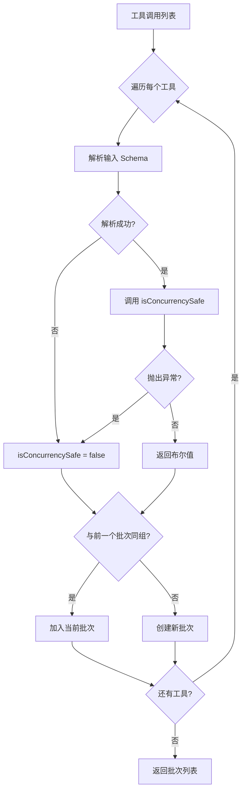
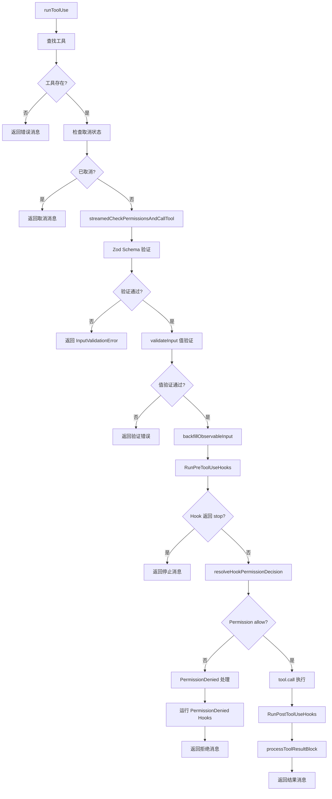

# Tool 系统（工具系统）

> Tool 系统是 Claude Code 与外部世界交互的唯一通道——从文件系统读写、Shell 命令执行、网络搜索，到 Agent 编排、MCP 协议集成、Hook 生命周期管理，43+ 个工具通过统一的泛型接口、读写分离的并发策略、三层权限检查和 fail-closed 的 Builder 模式，构建了一个安全、高效、可扩展的工具执行引擎。

## 模块概述

| 文件 | 行数 | 职责 |
|------|-------|------|
| `src/Tool.ts` | 792 | 泛型 Tool 接口定义、ToolUseContext、buildTool 工厂函数、TOOL_DEFAULTS |
| `src/tools.ts` | 389 | 工具注册中心、getAllBaseTools、getTools、assembleToolPool、filterToolsByDenyRules |
| `src/services/tools/toolOrchestration.ts` | 188 | 工具编排、partitionToolCalls 分区算法、并发/串行执行 |
| `src/services/tools/toolExecution.ts` | ~1,600 | 工具执行引擎、权限检查、Hook 流水线、Analytics 日志、StreamingToolExecutor |
| `src/services/tools/toolHooks.ts` | 650 | PreToolUse/PostToolUse/PostToolUseFailure Hook 执行、resolveHookPermissionDecision |
| `src/utils/toolPool.ts` | ~100 | Tool Pool 管理工具 |
| `src/utils/toolSearch.ts` | ~200 | Tool 搜索与延迟加载逻辑 |
| `src/utils/toolErrors.ts` | ~80 | 工具错误格式化 |
| `src/utils/toolResultStorage.ts` | ~150 | 工具结果存储与大小控制 |
| `src/utils/toolSchemaCache.ts` | ~60 | 工具 Schema 缓存 |
| `src/constants/tools.ts` | ~100 | 工具常量定义（允许/拒绝列表） |
| `src/constants/toolLimits.ts` | ~30 | 工具限制配置 |
| **总计** | **~4,339** | |

## Tool 接口设计详解

### 泛型 Tool 接口

```typescript
// src/Tool.ts - 泛型 Tool 接口 (~40个属性/方法)
export type Tool<
  Input extends AnyObject = AnyObject,
  Output = unknown,
  P extends ToolProgressData = ToolProgressData,
> = {
  // ===== 核心方法 =====
  call(
    args: z.infer<Input>,
    context: ToolUseContext,
    canUseTool: CanUseToolFn,
    parentMessage: AssistantMessage,
    onProgress?: ToolCallProgress<P>,
  ): Promise<ToolResult<Output>>
  description(input: z.infer<Input>, options: {...}): Promise<string>
  prompt(options: {...}): Promise<string>
  readonly inputSchema: Input
  readonly inputJSONSchema?: ToolInputJSONSchema
  outputSchema?: z.ZodType<unknown>

  // ===== 安全检查 =====
  isConcurrencySafe(input: z.infer<Input>): boolean
  isReadOnly(input: z.infer<Input>): boolean
  isDestructive?(input: z.infer<Input>): boolean
  isEnabled(): boolean

  // ===== 权限 =====
  checkPermissions(input, context): Promise<PermissionResult>
  toAutoClassifierInput(input): unknown
  preparePermissionMatcher?(input): Promise<(pattern: string) => boolean>
  validateInput?(input, context): Promise<ValidationResult>

  // ===== 渲染 =====
  renderToolUseMessage(input, options): React.ReactNode
  renderToolResultMessage(content, progress, options): React.ReactNode
  renderToolUseProgressMessage(progress, options): React.ReactNode
  renderToolUseQueuedMessage?(): React.ReactNode
  renderToolUseRejectedMessage?(input, options): React.ReactNode
  renderToolUseErrorMessage?(result, options): React.ReactNode
  renderGroupedToolUse?(toolUses, options): React.ReactNode | null
  renderToolUseTag?(input): React.ReactNode

  // ===== 辅助方法 =====
  userFacingName(input): string
  getActivityDescription?(input): string | null
  getToolUseSummary?(input): string | null
  isSearchOrReadCommand?(input): { isSearch: boolean; isRead: boolean; isList?: boolean }
  isResultTruncated?(output): boolean
  isTransparentWrapper?(): boolean
  getPath?(input): string
  inputsEquivalent?(a, b): boolean
  interruptBehavior?(): 'cancel' | 'block'
  isOpenWorld?(input): boolean
  requiresUserInteraction?(): boolean
  backfillObservableInput?(input): void
  extractSearchText?(out): string
  mapToolResultToToolResultBlockParam(content, toolUseID): ToolResultBlockParam

  // ===== 元数据 =====
  readonly name: string
  aliases?: string[]
  searchHint?: string
  isMcp?: boolean
  isLsp?: boolean
  readonly shouldDefer?: boolean
  readonly alwaysLoad?: boolean
  readonly strict?: boolean
  mcpInfo?: { serverName: string; toolName: string }
  maxResultSizeChars: number
}
```

### ToolUseContext（工具使用上下文）

ToolUseContext 是工具执行时传入的丰富上下文，包含约 50+ 类信息：

```typescript
export type ToolUseContext = {
  // 配置选项
  options: {
    commands: Command[]
    debug: boolean
    mainLoopModel: string
    tools: Tools
    verbose: boolean
    thinkingConfig: ThinkingConfig
    mcpClients: MCPServerConnection[]
    mcpResources: Record<string, ServerResource[]>
    isNonInteractiveSession: boolean
    agentDefinitions: AgentDefinitionsResult
    maxBudgetUsd?: number
    customSystemPrompt?: string
    appendSystemPrompt?: string
    querySource?: QuerySource
    refreshTools?: () => Tools
  }
  abortController: AbortController
  readFileState: FileStateCache
  getAppState(): AppState
  setAppState(f: (prev: AppState) => AppState): void
  setAppStateForTasks?: (f: (prev: AppState) => AppState) => void
  handleElicitation?: (...) => Promise<ElicitResult>
  setToolJSX?: SetToolJSXFn
  addNotification?: (notif: Notification) => void
  appendSystemMessage?: (...) => void
  sendOSNotification?: (...) => void
  nestedMemoryAttachmentTriggers?: Set<string>
  loadedNestedMemoryPaths?: Set<string>
  dynamicSkillDirTriggers?: Set<string>
  discoveredSkillNames?: Set<string>
  userModified?: boolean
  setInProgressToolUseIDs: (f: (prev: Set<string>) => Set<string>) => void
  setHasInterruptibleToolInProgress?: (v: boolean) => void
  setResponseLength: (f: (prev: number) => number) => void
  pushApiMetricsEntry?: (ttftMs: number) => void
  setStreamMode?: (mode: SpinnerMode) => void
  onCompactProgress?: (event: CompactProgressEvent) => void
  setSDKStatus?: (status: SDKStatus) => void
  openMessageSelector?: () => void
  updateFileHistoryState: (...) => void
  updateAttributionState: (...) => void
  setConversationId?: (id: UUID) => void
  agentId?: AgentId
  agentType?: string
  requireCanUseTool?: boolean
  messages: Message[]
  fileReadingLimits?: { maxTokens?: number; maxSizeBytes?: number }
  globLimits?: { maxResults?: number }
  toolDecisions?: Map<string, { source: string; decision: 'accept' | 'reject'; timestamp: number }>
  queryTracking?: QueryChainTracking
  requestPrompt?: (sourceName: string, toolInputSummary?: string | null) => (request: PromptRequest) => Promise<PromptResponse>
  toolUseId?: string
  criticalSystemReminder_EXPERIMENTAL?: string
  preserveToolUseResults?: boolean
  localDenialTracking?: DenialTrackingState
  contentReplacementState?: ContentReplacementState
  renderedSystemPrompt?: SystemPrompt
}
```

### ToolResult（工具结果）

```typescript
export type ToolResult<T> = {
  data: T
  newMessages?: (UserMessage | AssistantMessage | AttachmentMessage | SystemMessage)[]
  // contextModifier 仅对非并发安全的工具生效
  contextModifier?: (context: ToolUseContext) => ToolUseContext
  // MCP 协议元数据透传
  mcpMeta?: {
    _meta?: Record<string, unknown>
    structuredContent?: Record<string, unknown>
  }
}
```

## Tool 注册与过滤流程

### 注册流程图



### 过滤步骤详解

1. **getAllBaseTools()** — 获取所有基础工具（受 `process.env` 和 `feature()` 门控）
2. **getTools(permissionContext)** — 根据权限上下文过滤
   - `CLAUDE_CODE_SIMPLE` 模式：仅返回 Bash、Read、Edit
   - REPL 模式：隐藏 REPL_ONLY_TOOLS（Bash、FileRead、FileEdit、FileWrite、Glob、Grep）
   - 调用 `filterToolsByDenyRules()` 按拒绝规则过滤
   - 调用 `isEnabled()` 按启用状态过滤
3. **assembleToolPool(permissionContext, mcpTools)** — 组装最终工具池
   - 获取内置工具 `getTools()`
   - 过滤 MCP 工具的拒绝规则
   - 按名称排序（prompt 缓存稳定性）
   - `uniqBy` 去重（内置工具优先）
4. **filterToolsByDenyRules(tools, permissionContext)** — 运行时拒绝规则匹配
   - 支持 MCP 服务器前缀规则（如 `mcp__server` 批量拒绝）
   - 支持 blanket deny（无 ruleContent 的完全拒绝）

### 代码实现

```typescript
// src/tools.ts

// 获取所有基础工具（受环境变量和 Feature Gate 控制）
export function getAllBaseTools(): Tools {
  return [
    AgentTool,
    TaskOutputTool,
    BashTool,
    ...(hasEmbeddedSearchTools() ? [] : [GlobTool, GrepTool]),
    ExitPlanModeV2Tool,
    FileReadTool,
    FileEditTool,
    FileWriteTool,
    NotebookEditTool,
    WebFetchTool,
    TodoWriteTool,
    WebSearchTool,
    TaskStopTool,
    AskUserQuestionTool,
    SkillTool,
    EnterPlanModeTool,
    // ... 更多条件注入的工具
  ]
}

// 按权限上下文获取工具
export const getTools = (permissionContext: ToolPermissionContext): Tools => {
  if (isEnvTruthy(process.env.CLAUDE_CODE_SIMPLE)) {
    // 简单模式：仅 Bash, Read, Edit
    const simpleTools: Tool[] = [BashTool, FileReadTool, FileEditTool]
    return filterToolsByDenyRules(simpleTools, permissionContext)
  }

  const tools = getAllBaseTools().filter(tool => !specialTools.has(tool.name))
  let allowedTools = filterToolsByDenyRules(tools, permissionContext)

  // REPL 模式下隐藏原始工具
  if (isReplModeEnabled()) {
    const replEnabled = allowedTools.some(tool => toolMatchesName(tool, REPL_TOOL_NAME))
    if (replEnabled) {
      allowedTools = allowedTools.filter(tool => !REPL_ONLY_TOOLS.has(tool.name))
    }
  }

  const isEnabled = allowedTools.map(_ => _.isEnabled())
  return allowedTools.filter((_, i) => isEnabled[i])
}

// 组装最终工具池（内置 + MCP）
export function assembleToolPool(
  permissionContext: ToolPermissionContext,
  mcpTools: Tools,
): Tools {
  const builtInTools = getTools(permissionContext)
  const allowedMcpTools = filterToolsByDenyRules(mcpTools, permissionContext)

  const byName = (a: Tool, b: Tool) => a.name.localeCompare(b.name)
  return uniqBy(
    [...builtInTools].sort(byName).concat(allowedMcpTools.sort(byName)),
    'name',
  )
}
```

## 工具分类详解

### 完整分类表（43+ 个工具）

| 类别 | 工具 | 数量 | 说明 |
|------|------|------|------|
| **核心文件** | Bash, FileRead, FileEdit, FileWrite, Glob, Grep | 6 | 文件系统与 Shell 操作 |
| **网络** | WebSearch, WebFetch | 2 | 网络搜索与内容获取 |
| **任务管理** | TaskCreate, TaskGet, TaskUpdate, TaskList, TaskStop, TaskOutput | 6 | 子任务生命周期管理 |
| **Agent** | AgentTool, TeamCreate, TeamDelete, SendMessage | 4 | Agent 编排与团队管理 |
| **MCP** | MCPTool, ListMcpResources, ReadMcpResource, McpAuth | 4 | Model Context Protocol 集成 |
| **规划** | EnterPlanMode, ExitPlanModeV2, TodoWrite | 3 | 计划模式与任务列表 |
| **特殊** | SkillTool, ConfigTool, LSPTool, WorkflowTool, ScheduleCron | 5 | 技能、配置、LSP、工作流、定时任务 |
| **特性门控** | REPLTool, SleepTool, PushNotification, WebBrowser, SnipTool | 5+ | 受 Feature Gate 控制 |
| **其他** | NotebookEdit, BriefTool, Testing, Tungsten, AskUserQuestion, ToolSearch, EnterWorktree, ExitWorktree, MonitorTool, RemoteTriggerTool, OverflowTestTool, CtxInspectTool, TerminalCaptureTool, ListPeersTool, PowerShellTool, VerifyPlanExecutionTool, SuggestBackgroundPRTool, SubscribePRTool, SendUserFileTool | 18+ | 笔记本、简报、测试、工单、用户交互等 |

### 特性门控工具

| 工具 | 门控条件 | 说明 |
|------|----------|------|
| REPLTool | `USER_TYPE === 'ant'` | REPL 虚拟机模式 |
| SleepTool | `feature('PROACTIVE') \|\| feature('KAIROS')` | 定时休眠 |
| CronCreate/Delete/List | `feature('AGENT_TRIGGERS')` | 定时任务管理 |
| RemoteTriggerTool | `feature('AGENT_TRIGGERS_REMOTE')` | 远程触发 |
| MonitorTool | `feature('MONITOR_TOOL')` | 监控工具 |
| PushNotificationTool | `feature('KAIROS') \|\| feature('KAIROS_PUSH_NOTIFICATION')` | 推送通知 |
| WebBrowserTool | `feature('WEB_BROWSER_TOOL')` | 浏览器自动化 |
| SnipTool | `feature('HISTORY_SNIP')` | 历史裁剪 |
| WorkflowTool | `feature('WORKFLOW_SCRIPTS')` | 工作流脚本 |
| LSPTool | `ENABLE_LSP_TOOL` 环境变量 | 语言服务器协议 |
| CtxInspectTool | `feature('CONTEXT_COLLAPSE')` | 上下文检查 |
| TerminalCaptureTool | `feature('TERMINAL_PANEL')` | 终端捕获 |
| ListPeersTool | `feature('UDS_INBOX')` | 对等体列表 |

## 工具编排机制

### 读写分离的并发策略

```typescript
// src/services/tools/toolOrchestration.ts

// 分区：连续只读工具并发，写入工具串行
function partitionToolCalls(toolUses: ToolUseBlock[], toolUseContext: ToolUseContext): Batch[] {
  return toolUseMessages.reduce((acc: Batch[], toolUse) => {
    const tool = findToolByName(toolUseContext.options.tools, toolUse.name)
    const parsedInput = tool?.inputSchema.safeParse(toolUse.input)
    const isConcurrencySafe = parsedInput?.success
      ? (() => {
          try {
            return Boolean(tool?.isConcurrencySafe(parsedInput.data))
          } catch {
            // 如果 isConcurrencySafe 抛出异常（如 shell-quote 解析失败），
            // 保守地视为非并发安全
            return false
          }
        })()
      : false
    if (isConcurrencySafe && acc[acc.length - 1]?.isConcurrencySafe) {
      acc[acc.length - 1]!.blocks.push(toolUse)
    } else {
      acc.push({ isConcurrencySafe, blocks: [toolUse] })
    }
    return acc
  }, [])
}

async function* runTools(
  toolUseMessages: ToolUseBlock[],
  assistantMessages: AssistantMessage[],
  canUseTool: CanUseToolFn,
  toolUseContext: ToolUseContext,
): AsyncGenerator<MessageUpdate, void> {
  let currentContext = toolUseContext
  for (const { isConcurrencySafe, blocks } of partitionToolCalls(toolUseMessages, currentContext)) {
    if (isConcurrencySafe) {
      // 并发执行只读工具组
      for await (const update of runToolsConcurrently(blocks, assistantMessages, canUseTool, currentContext)) {
        // 收集 contextModifier 并在组执行完毕后应用
        ...
      }
      // 按顺序应用 contextModifier
      for (const block of blocks) {
        const modifiers = queuedContextModifiers[block.id]
        if (!modifiers) continue
        for (const modifier of modifiers) {
          currentContext = modifier(currentContext)
        }
      }
      yield { newContext: currentContext }
    } else {
      // 串行执行非只读工具
      for await (const update of runToolsSerially(blocks, assistantMessages, canUseTool, currentContext)) {
        if (update.newContext) {
          currentContext = update.newContext
        }
        yield { message: update.message, newContext: currentContext }
      }
    }
  }
}
```

### 并发控制策略

```
工具调用列表
├── [Read, Grep, Glob]  → 并发执行 (只读组)
├── [Edit]              → 串行执行 (写入)
├── [Read, Glob]        → 并发执行 (只读组)
└── [Bash]              → 串行执行 (潜在写入)
```

### 最大并发度控制

```typescript
function getMaxToolUseConcurrency(): number {
  return (
    parseInt(process.env.CLAUDE_CODE_MAX_TOOL_USE_CONCURRENCY || '', 10) || 10
  )
}

async function* runToolsConcurrently(
  toolUseMessages: ToolUseBlock[],
  assistantMessages: AssistantMessage[],
  canUseTool: CanUseToolFn,
  toolUseContext: ToolUseContext,
): AsyncGenerator<MessageUpdateLazy, void> {
  yield* all(
    toolUseMessages.map(async function* (toolUse) {
      toolUseContext.setInProgressToolUseIDs(prev => new Set(prev).add(toolUse.id))
      yield* runToolUse(toolUse, assistantMessages.find(...)!, canUseTool, toolUseContext)
      markToolUseAsComplete(toolUseContext, toolUse.id)
    }),
    getMaxToolUseConcurrency(), // 最大并发度
  )
}
```

### 分区算法（Partition Algorithm）



## Tool Builder 模式

### buildTool 工厂函数

```typescript
// src/Tool.ts

// TOOL_DEFAULTS 提供安全默认值
const TOOL_DEFAULTS = {
  isEnabled: () => true,
  isConcurrencySafe: (_input?: unknown) => false,
  isReadOnly: (_input?: unknown) => false,
  isDestructive: (_input?: unknown) => false,
  checkPermissions: (
    input: { [key: string]: unknown },
    _ctx?: ToolUseContext,
  ): Promise<PermissionResult> =>
    Promise.resolve({ behavior: 'allow', updatedInput: input }),
  toAutoClassifierInput: (_input?: unknown) => '',
  userFacingName: (_input?: unknown) => '',
}

// buildTool 工厂函数 - 提供安全默认值
export function buildTool<D extends AnyToolDef>(def: D): BuiltTool<D> {
  return {
    ...TOOL_DEFAULTS,
    userFacingName: () => def.name,
    ...def,
  } as BuiltTool<D>
}
```

### Fail-Closed 设计原则

| 方法 | 默认值 | 安全含义 |
|------|--------|----------|
| `isEnabled` | `() => true` | 默认启用 |
| `isConcurrencySafe` | `() => false` | **默认不安全**（保守） |
| `isReadOnly` | `() => false` | **默认非只读**（保守） |
| `isDestructive` | `() => false` | 默认非破坏性 |
| `checkPermissions` | `{ behavior: 'allow' }` | 交由通用权限系统处理 |
| `toAutoClassifierInput` | `''` | 跳过分类器（安全相关工具必须覆写） |
| `userFacingName` | `name` | 使用工具名称 |

### ToolDef 类型

```typescript
// 可省略的方法键
type DefaultableToolKeys =
  | 'isEnabled'
  | 'isConcurrencySafe'
  | 'isReadOnly'
  | 'isDestructive'
  | 'checkPermissions'
  | 'toAutoClassifierInput'
  | 'userFacingName'

// ToolDef 允许省略上述方法
export type ToolDef<
  Input extends AnyObject = AnyObject,
  Output = unknown,
  P extends ToolProgressData = ToolProgressData,
> = Omit<Tool<Input, Output, P>, DefaultableToolKeys> &
  Partial<Pick<Tool<Input, Output, P>, DefaultableToolKeys>>
```

## 工具执行流水线

### 完整执行流程



### 权限检查与工具调用（streamedCheckPermissionsAndCallTool）

```typescript
async function checkPermissionsAndCallTool(
  tool: Tool,
  toolUseID: string,
  input: { [key: string]: boolean | string | number },
  toolUseContext: ToolUseContext,
  canUseTool: CanUseToolFn,
  assistantMessage: AssistantMessage,
  messageId: string,
  requestId: string | undefined,
  mcpServerType: McpServerType,
  mcpServerBaseUrl: string | undefined,
  onToolProgress: (progress: ToolProgress<ToolProgressData> | ProgressMessage<HookProgress>) => void,
): Promise<MessageUpdateLazy[]> {
  // 1. Zod Schema 验证
  const parsedInput = tool.inputSchema.safeParse(input)
  if (!parsedInput.success) {
    // 返回 InputValidationError
    // 对 deferred tool 附加 schema-not-sent 提示
  }

  // 2. 值验证
  const isValidCall = await tool.validateInput?.(parsedInput.data, toolUseContext)
  if (isValidCall?.result === false) {
    // 返回验证错误
  }

  // 3. 投机性启动 Bash 分类器检查（与 PreToolUse Hooks 并行）
  if (tool.name === BASH_TOOL_NAME && 'command' in parsedInput.data) {
    startSpeculativeClassifierCheck(...)
  }

  // 4. 防御性深度：剥离 _simulatedSedEdit 字段
  // 5. backfillObservableInput（浅克隆）
  // 6. 运行 PreToolUse Hooks
  for await (const result of runPreToolUseHooks(...)) {
    switch (result.type) {
      case 'message': ...
      case 'hookPermissionResult': ...
      case 'hookUpdatedInput': ...
      case 'preventContinuation': ...
      case 'stopReason': ...
      case 'additionalContext': ...
      case 'stop': return resultingMessages
    }
  }

  // 7. 解析 Hook 权限决定
  const resolved = await resolveHookPermissionDecision(
    hookPermissionResult, tool, processedInput, toolUseContext, canUseTool, ...
  )

  // 8. 权限决策 OTel 事件记录
  // 9. 如果权限拒绝 → 返回错误消息
  // 10. 如果权限通过 → 执行 tool.call()
  const result = await tool.call(callInput, { ...toolUseContext, toolUseId: toolUseID }, canUseTool, ...)

  // 11. 记录工具执行时长和遥测
  // 12. 运行 PostToolUse Hooks
  // 13. 处理工具结果并返回
}
```

## 工具 Hook 生命周期

### Hook 类型

| Hook 类型 | 时机 | 能力 | 文件 |
|-----------|------|------|------|
| **PreToolUse** | 工具执行前 | 修改输入、阻止执行、权限决策、附加上下文 | `toolHooks.ts:435` |
| **PostToolUse** | 工具执行后 | 修改输出、阻止继续、附加上下文 | `toolHooks.ts:39` |
| **PostToolUseFailure** | 工具执行失败后 | 附加上下文、错误处理 | `toolHooks.ts:193` |
| **PermissionDenied** | 权限被拒绝后 | 重试指示 | `toolExecution.ts:1075` |

### PreToolUse Hook 结果类型

```typescript
export async function* runPreToolUseHooks(
  toolUseContext: ToolUseContext,
  tool: Tool,
  processedInput: Record<string, unknown>,
  toolUseID: string,
  messageId: string,
  requestId: string | undefined,
  mcpServerType: McpServerType,
  mcpServerBaseUrl: string | undefined,
): AsyncGenerator<
  | { type: 'message'; message: MessageUpdateLazy<AttachmentMessage | ProgressMessage<HookProgress>> }
  | { type: 'hookPermissionResult'; hookPermissionResult: PermissionResult }
  | { type: 'hookUpdatedInput'; updatedInput: Record<string, unknown> }
  | { type: 'preventContinuation'; shouldPreventContinuation: boolean }
  | { type: 'stopReason'; stopReason: string }
  | { type: 'additionalContext'; message: MessageUpdateLazy<AttachmentMessage> }
  | { type: 'stop' }
>
```

### PostToolUse Hook 结果类型

```typescript
export type PostToolUseHooksResult<Output> =
  | MessageUpdateLazy<AttachmentMessage | ProgressMessage<HookProgress>>
  | { updatedMCPToolOutput: Output }
```

### resolveHookPermissionDecision

```typescript
// src/services/tools/toolHooks.ts:332

export async function resolveHookPermissionDecision(
  hookPermissionResult: PermissionResult | undefined,
  tool: Tool,
  input: Record<string, unknown>,
  toolUseContext: ToolUseContext,
  canUseTool: CanUseToolFn,
  assistantMessage: AssistantMessage,
  toolUseID: string,
): Promise<{ decision: PermissionDecision; input: Record<string, unknown> }> {
  // Hook allow 不绕过 settings.json 的 deny/ask 规则
  if (hookPermissionResult?.behavior === 'allow') {
    const hookInput = hookPermissionResult.updatedInput ?? input
    // 检查是否需要用户交互或 canUseTool
    if ((requiresInteraction && !interactionSatisfied) || requireCanUseTool) {
      return { decision: await canUseTool(...), input: hookInput }
    }
    // Hook allow 仍需检查基于规则的权限
    const ruleCheck = await checkRuleBasedPermissions(tool, hookInput, toolUseContext)
    if (ruleCheck === null) return { decision: hookPermissionResult, input: hookInput }
    if (ruleCheck.behavior === 'deny') return { decision: ruleCheck, input: hookInput }
    // ask 规则仍需对话框
    return { decision: await canUseTool(...), input: hookInput }
  }

  if (hookPermissionResult?.behavior === 'deny') {
    return { decision: hookPermissionResult, input }
  }

  // 无 Hook 决定或 'ask' → 正常权限流程
  const forceDecision = hookPermissionResult?.behavior === 'ask' ? hookPermissionResult : undefined
  return {
    decision: await canUseTool(tool, askInput, toolUseContext, assistantMessage, toolUseID, forceDecision),
    input: askInput,
  }
}
```

## StreamingToolExecutor

### Stream 模式执行

```typescript
// src/services/tools/toolExecution.ts:492

function streamedCheckPermissionsAndCallTool(
  tool: Tool,
  toolUseID: string,
  input: { [key: string]: boolean | string | number },
  toolUseContext: ToolUseContext,
  canUseTool: CanUseToolFn,
  assistantMessage: AssistantMessage,
  messageId: string,
  requestId: string | undefined,
  mcpServerType: McpServerType,
  mcpServerBaseUrl: string | undefined,
): AsyncIterable<MessageUpdateLazy> {
  // 使用 Stream 类将异步操作转换为 AsyncIterable
  const stream = new Stream<MessageUpdateLazy>()
  checkPermissionsAndCallTool(
    tool, toolUseID, input, toolUseContext, canUseTool, assistantMessage,
    messageId, requestId, mcpServerType, mcpServerBaseUrl,
    progress => {
      // 进度事件入队
      stream.enqueue({ message: createProgressMessage({ ... }) })
    },
  )
    .then(results => {
      // 结果入队
      for (const result of results) {
        stream.enqueue(result)
      }
    })
    .catch(error => { stream.error(error) })
    .finally(() => { stream.done() })
  return stream
}
```

### 消息更新类型

```typescript
export type MessageUpdateLazy<M extends Message = Message> = {
  message: M
  contextModifier?: {
    toolUseID: string
    modifyContext: (context: ToolUseContext) => ToolUseContext
  }
}
```

## 并发控制

### 并发控制层级

| 层级 | 机制 | 默认值 | 环境变量 |
|------|------|--------|----------|
| **工具级** | `isConcurrencySafe(input)` | `false` | - |
| **批次级** | `partitionToolCalls()` 分区算法 | - | - |
| **全局级** | `getMaxToolUseConcurrency()` | `10` | `CLAUDE_CODE_MAX_TOOL_USE_CONCURRENCY` |
| **状态级** | `setInProgressToolUseIDs` 追踪 | - | - |

### 并发安全矩阵

| 工具 | isConcurrencySafe | isReadOnly | 执行模式 |
|------|-------------------|------------|----------|
| FileRead | `true` | `true` | 并发 |
| Glob | `true` | `true` | 并发 |
| Grep | `true` | `true` | 并发 |
| WebSearch | `true` | `true` | 并发 |
| WebFetch | `true` | `true` | 并发 |
| FileEdit | `false` | `false` | 串行 |
| FileWrite | `false` | `false` | 串行 |
| Bash | `false` | `false` | 串行 |
| AgentTool | `false` | `false` | 串行 |
| TodoWrite | `false` | `false` | 串行 |

### Context Modifier 延迟应用

对于并发执行的只读工具组，`contextModifier` 不会立即应用，而是收集到 `queuedContextModifiers` 映射中，在整个并发组完成后按原始顺序应用：

```typescript
// 并发执行期间收集 contextModifier
const queuedContextModifiers: Record<string, ((context: ToolUseContext) => ToolUseContext)[]> = {}
for await (const update of runToolsConcurrently(...)) {
  if (update.contextModifier) {
    const { toolUseID, modifyContext } = update.contextModifier
    if (!queuedContextModifiers[toolUseID]) {
      queuedContextModifiers[toolUseID] = []
    }
    queuedContextModifiers[toolUseID].push(modifyContext)
  }
}
// 组完成后按顺序应用
for (const block of blocks) {
  const modifiers = queuedContextModifiers[block.id]
  if (!modifiers) continue
  for (const modifier of modifiers) {
    currentContext = modifier(currentContext)
  }
}
```

## 工具错误处理

### 错误分类

```typescript
// src/services/tools/toolExecution.ts:150

export function classifyToolError(error: unknown): string {
  if (error instanceof TelemetrySafeError_I_VERIFIED_THIS_IS_NOT_CODE_OR_FILEPATHS) {
    return error.telemetryMessage.slice(0, 200)
  }
  if (error instanceof Error) {
    const errnoCode = getErrnoCode(error)
    if (typeof errnoCode === 'string') return `Error:${errnoCode}`
    if (error.name && error.name !== 'Error' && error.name.length > 3) {
      return error.name.slice(0, 60)
    }
    return 'Error'
  }
  return 'UnknownError'
}
```

### 错误类型

| 错误类型 | 来源 | 处理方式 |
|----------|------|----------|
| `InputValidationError` | Zod Schema 验证失败 | 返回错误消息，附加 deferred tool 提示 |
| `ValidationResult` | `validateInput()` 返回 false | 返回工具执行错误 |
| `PermissionResult` | 权限拒绝 | 返回错误消息，运行 PermissionDenied Hooks |
| `AbortError` | `abortController.signal.aborted` | 返回取消消息 |
| `ShellError` | Bash 命令执行失败 | 返回标准输出/错误 |
| `McpAuthError` | MCP 认证失败 | 触发 MCP 认证流程 |
| `McpToolCallError` | MCP 工具调用失败 | 返回错误消息 |

## 工具搜索与延迟加载

### Deferred Tool 机制

```typescript
// Tool 接口中的延迟加载属性
readonly shouldDefer?: boolean   // 延迟加载，需要 ToolSearch
readonly alwaysLoad?: boolean    // 永不延迟，始终加载完整 Schema

// Schema 未发送时的提示
export function buildSchemaNotSentHint(
  tool: Tool,
  messages: Message[],
  tools: readonly { name: string }[],
): string | null {
  if (!isToolSearchEnabledOptimistic()) return null
  if (!isToolSearchToolAvailable(tools)) return null
  if (!isDeferredTool(tool)) return null
  const discovered = extractDiscoveredToolNames(messages)
  if (discovered.has(tool.name)) return null
  return `\n\nThis tool's schema was not sent to the API...`
}
```

## 工具结果处理

### 结果大小控制

```typescript
// Tool 接口
maxResultSizeChars: number  // 结果最大字符数，超出则持久化到磁盘

// processToolResultBlock 处理逻辑
// src/utils/toolResultStorage.ts
// - 结果超过 maxResultSizeChars → 保存到临时文件
// - 返回预览内容 + 文件路径
// - Infinity 表示永不持久化（如 Read 工具）
```

### 结果内容替换状态

```typescript
// ToolUseContext 中的内容替换状态
contentReplacementState?: ContentReplacementState
// 用于跟踪每个对话线程的工具结果预算
// 主线程：REPL 一次性配置（不重置）
// 子 Agent：默认克隆父状态（缓存共享）
```

## 文件索引表格

### 核心文件

| 文件 | 行数 | 关键导出 | 职责 |
|------|-------|----------|------|
| `src/Tool.ts` | 792 | `Tool`, `ToolUseContext`, `buildTool`, `TOOL_DEFAULTS`, `ValidationResult`, `ToolResult`, `ToolPermissionContext` | 泛型工具接口、上下文类型、Builder 工厂 |
| `src/tools.ts` | 389 | `getAllBaseTools`, `getTools`, `assembleToolPool`, `filterToolsByDenyRules`, `getMergedTools` | 工具注册、过滤、合并 |
| `src/services/tools/toolOrchestration.ts` | 188 | `runTools`, `partitionToolCalls`, `runToolsConcurrently`, `runToolsSerially` | 工具编排、并发控制 |
| `src/services/tools/toolExecution.ts` | ~1,600 | `runToolUse`, `streamedCheckPermissionsAndCallTool`, `classifyToolError` | 工具执行引擎 |
| `src/services/tools/toolHooks.ts` | 650 | `runPreToolUseHooks`, `runPostToolUseHooks`, `runPostToolUseFailureHooks`, `resolveHookPermissionDecision` | Hook 生命周期管理 |

### 工具常量

| 文件 | 行数 | 关键导出 | 职责 |
|------|-------|----------|------|
| `src/constants/tools.ts` | ~100 | `ALL_AGENT_DISALLOWED_TOOLS`, `CUSTOM_AGENT_DISALLOWED_TOOLS`, `ASYNC_AGENT_ALLOWED_TOOLS`, `COORDINATOR_MODE_ALLOWED_TOOLS` | 工具允许/拒绝列表 |
| `src/constants/toolLimits.ts` | ~30 | 工具限制配置 | 工具执行限制 |

### 工具工具函数

| 文件 | 行数 | 关键导出 | 职责 |
|------|-------|----------|------|
| `src/utils/toolPool.ts` | ~100 | Tool Pool 管理 | 工具池管理 |
| `src/utils/toolSearch.ts` | ~200 | `isToolSearchEnabledOptimistic`, `extractDiscoveredToolNames`, `isDeferredTool` | 工具搜索与延迟加载 |
| `src/utils/toolErrors.ts` | ~80 | `formatError`, `formatZodValidationError` | 工具错误格式化 |
| `src/utils/toolResultStorage.ts` | ~150 | `processToolResultBlock`, `processPreMappedToolResultBlock` | 工具结果存储与大小控制 |
| `src/utils/toolSchemaCache.ts` | ~60 | 工具 Schema 缓存 | 工具 Schema 缓存管理 |

### 工具渲染

| 文件 | 行数 | 关键导出 | 职责 |
|------|-------|----------|------|
| `src/utils/computerUse/toolRendering.tsx` | ~100 | 计算机使用工具渲染 | Computer Use 工具 UI 渲染 |
| `src/utils/claudeInChrome/toolRendering.tsx` | ~100 | Chrome 工具渲染 | Chrome 工具 UI 渲染 |

### 工具名称常量

| 文件 | 行数 | 关键导出 | 职责 |
|------|-------|----------|------|
| `src/tools/BashTool/toolName.ts` | ~10 | `BASH_TOOL_NAME` | Bash 工具名称常量 |
| `src/tools/PowerShellTool/toolName.ts` | ~10 | `POWERSHELL_TOOL_NAME` | PowerShell 工具名称常量 |

## 工具权限上下文

```typescript
export type ToolPermissionContext = DeepImmutable<{
  mode: PermissionMode
  additionalWorkingDirectories: Map<string, AdditionalWorkingDirectory>
  alwaysAllowRules: ToolPermissionRulesBySource
  alwaysDenyRules: ToolPermissionRulesBySource
  alwaysAskRules: ToolPermissionRulesBySource
  isBypassPermissionsModeAvailable: boolean
  isAutoModeAvailable?: boolean
  strippedDangerousRules?: ToolPermissionRulesBySource
  shouldAvoidPermissionPrompts?: boolean
  awaitAutomatedChecksBeforeDialog?: boolean
  prePlanMode?: PermissionMode
}>

export const getEmptyToolPermissionContext: () => ToolPermissionContext = () => ({
  mode: 'default',
  additionalWorkingDirectories: new Map(),
  alwaysAllowRules: {},
  alwaysDenyRules: {},
  alwaysAskRules: {},
  isBypassPermissionsModeAvailable: false,
})
```

## 工具进度

### 进度类型

```typescript
export type ToolProgressData  // 基础进度数据
export type HookProgress     // Hook 进度
export type Progress = ToolProgressData | HookProgress

export type ToolProgress<P extends ToolProgressData> = {
  toolUseID: string
  data: P
}

export type ToolCallProgress<P extends ToolProgressData = ToolProgressData> = (
  progress: ToolProgress<P>
) => void
```

### 进度过滤

```typescript
export function filterToolProgressMessages(
  progressMessagesForMessage: ProgressMessage[],
): ProgressMessage<ToolProgressData>[] {
  return progressMessagesForMessage.filter(
    (msg): msg is ProgressMessage<ToolProgressData> =>
      msg.data?.type !== 'hook_progress',
  )
}
```

## 工具匹配与查找

```typescript
// 按名称或别名匹配工具
export function toolMatchesName(
  tool: { name: string; aliases?: string[] },
  name: string,
): boolean {
  return tool.name === name || (tool.aliases?.includes(name) ?? false)
}

// 从工具列表中按名称查找
export function findToolByName(tools: Tools, name: string): Tool | undefined {
  return tools.find(t => toolMatchesName(t, name))
}
```

## 工具集类型

```typescript
/**
 * 工具集合。使用此类型而非 `Tool[]`，以便更容易
 * 追踪工具集在代码库中的组装、传递和过滤位置。
 */
export type Tools = readonly Tool[]
```
