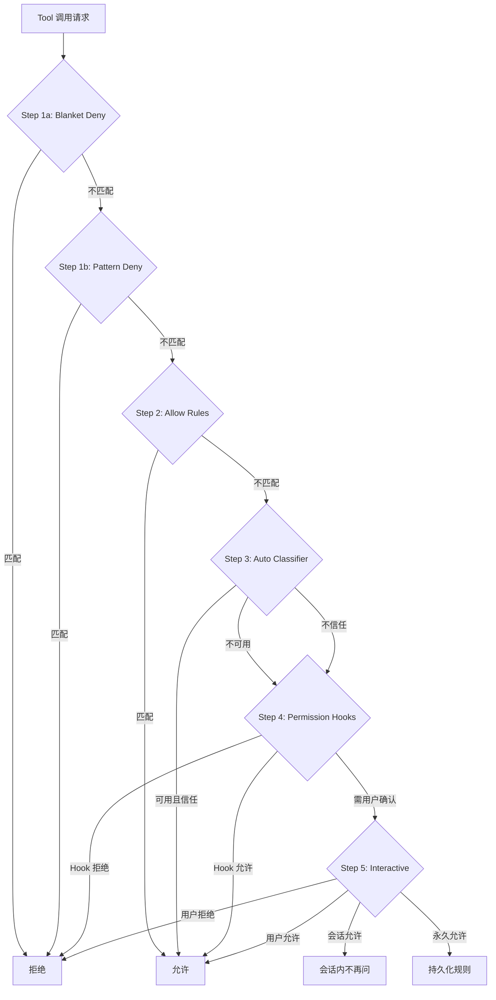

# Permission System（权限系统）

> 权限系统是 Claude Code 的安全决策引擎——通过五层渐进式决策流水线、6 种权限模式、模式匹配规则解析、拒绝追踪降级机制，以及 Sandbox / Classifier / Hook / 密钥扫描 / MDM Policy 等多层安全防线，构建了一个既安全又灵活的权限控制体系。每次 Tool 调用请求都必须经过这套引擎的审查，确保 Agent 的行为始终在用户的掌控之中。

## 模块概述

| 文件 | 行数 | 职责 |
|------|------|------|
| `src/utils/permissions/permissions.ts` | 1,486 | 核心权限决策引擎、五层决策流水线、规则匹配、Classifier 集成 |
| `src/utils/permissions/yoloClassifier.ts` | 1,495 | Auto Mode 分类器、ML 权限决策、Prompt 构建、重试逻辑 |
| `src/utils/permissions/classifierDecision.ts` | 98 | 安全工具白名单（SAFE_YOLO_ALLOWLISTED_TOOLS）、isAutoModeAllowlistedTool |
| `src/utils/permissions/denialTracking.ts` | 45 | 拒绝追踪状态机、连续拒绝计数、降级阈值判定 |
| `src/utils/permissions/permissionRuleParser.ts` | 198 | 规则字符串解析、转义/反转义、Legacy Tool Name 别名映射 |
| `src/utils/permissions/shellRuleMatching.ts` | 228 | Shell 命令规则匹配、精确/前缀/通配符匹配、Permission Suggestion 生成 |
| `src/utils/permissions/dangerousPatterns.ts` | 80 | 危险命令模式列表（CROSS_PLATFORM_CODE_EXEC、DANGEROUS_BASH_PATTERNS） |
| `src/utils/permissions/PermissionMode.ts` | 141 | 权限模式配置、标题/符号/颜色映射、External 模式转换 |
| `src/utils/permissions/PermissionRule.ts` | 40 | PermissionBehavior/PermissionRuleValue/PermissionRule 类型与 Schema |
| `src/utils/permissions/PermissionResult.ts` | 35 | PermissionDecision 类型、Rule Behavior 描述 |
| `src/utils/permissions/PermissionUpdate.ts` | 389 | 权限更新应用、持久化、规则添加/删除 |
| `src/utils/permissions/permissionsLoader.ts` | 296 | 规则加载、Managed Settings 策略、Always Allow 选项控制 |
| `src/utils/permissions/getNextPermissionMode.ts` | 101 | Shift+Tab 模式切换循环逻辑、cyclePermissionMode |
| `src/utils/permissions/permissionSetup.ts` | ~600 | 权限模式初始化、Auto Mode Gate 验证、危险规则剥离 |
| `src/utils/permissions/autoModeState.ts` | ~200 | Auto Mode 状态管理、会话级缓存 |
| `src/utils/permissions/classifierShared.ts` | ~100 | Classifier 共享工具函数、Tool Use Block 提取 |
| `src/utils/permissions/bashClassifier.ts` | ~300 | Bash 专用分类器、Allow/Deny Prompt 规则 |
| `src/utils/permissions/pathValidation.ts` | ~250 | 路径验证、Allowlist 管理、Sandbox 集成 |
| `src/utils/permissions/filesystem.ts` | ~200 | 文件系统权限工具、Claude Temp 目录管理 |
| `src/utils/permissions/permissionExplainer.ts` | ~150 | 权限决策解释、用户友好提示 |
| `src/utils/permissions/shadowedRuleDetection.ts` | ~100 | 阴影规则检测、规则冲突识别 |
| `src/utils/permissions/permissionSetup.ts` | ~200 | 权限模式转换、Auto Mode 门控 |
| `src/utils/permissions/bypassPermissionsKillswitch.ts` | ~50 | Bypass 权限紧急关闭开关 |
| `src/utils/sandbox/sandbox-adapter.ts` | 985 | Sandbox 适配器、Seatbelt 集成、路径模式解析、网络策略 |
| `src/hooks/toolPermission/PermissionContext.ts` | 388 | 权限上下文工厂、Hook 执行、User Allow/Deny 处理、Classifier 集成 |
| `src/hooks/toolPermission/permissionLogging.ts` | ~150 | 权限决策日志、Analytics 事件记录 |
| `src/hooks/toolPermission/handlers/interactiveHandler.ts` | ~200 | 交互式权限处理器 |
| `src/hooks/toolPermission/handlers/coordinatorHandler.ts` | ~150 | 协调器权限处理器 |
| `src/hooks/toolPermission/handlers/swarmWorkerHandler.ts` | ~150 | Swarm Worker 权限处理器 |
| `src/services/teamMemorySync/teamMemSecretGuard.ts` | 44 | 团队记忆密钥防护、Secret 扫描 |
| `src/types/permissions.ts` | 441 | 权限类型定义、PermissionMode 枚举、PermissionRule 类型 |
| `src/components/permissions/PermissionRequest.tsx` | ~300 | 权限请求 UI 组件 |
| `src/components/permissions/PermissionPrompt.tsx` | ~200 | 权限提示 UI 组件 |
| `src/components/permissions/PermissionDialog.tsx` | ~150 | 权限对话框 UI 组件 |
| `src/components/permissions/BashPermissionRequest/BashPermissionRequest.tsx` | ~200 | Bash 权限请求组件 |
| `src/components/permissions/SandboxPermissionRequest.tsx` | ~100 | Sandbox 权限请求组件 |
| `src/components/permissions/PermissionDecisionDebugInfo.tsx` | ~150 | 权限决策调试信息组件 |
| `src/components/permissions/rules/AddPermissionRules.tsx` | ~200 | 添加权限规则 UI |
| `src/components/permissions/rules/PermissionRuleList.tsx` | ~150 | 权限规则列表 UI |
| **总计** | **~10,000+** | |

## 权限决策引擎详解

### 五层决策流程图



### 每层详解

#### Step 1a: Blanket Deny（全局拒绝）

最高优先级的拒绝规则。如果工具调用匹配了全局拒绝规则，立即拒绝，不进入后续流程。

```typescript
// src/utils/permissions/permissions.ts
// getDenyRuleForTool() — 检查工具是否被列入全局拒绝列表
export function getDenyRuleForTool(
  context: ToolPermissionContext,
  tool: Pick<Tool, 'name' | 'mcpInfo'>,
): PermissionRule | null {
  return getDenyRules(context).find(rule => toolMatchesRule(tool, rule)) || null
}
```

**规则来源**：`userSettings`、`projectSettings`、`localSettings`、`policySettings`、`cliArg`、`command`、`session`

#### Step 1b: Pattern Deny（模式拒绝）

检查工具调用内容是否匹配危险模式。例如 `Bash(rm -rf *)` 会被此层拦截。

```typescript
// src/utils/permissions/dangerousPatterns.ts
// 危险命令模式列表
export const CROSS_PLATFORM_CODE_EXEC = [
  'python', 'python3', 'node', 'deno', 'tsx', 'ruby', 'perl', 'php', 'lua',
  'npx', 'bunx', 'npm run', 'yarn run', 'pnpm run', 'bun run',
  'bash', 'sh', 'ssh',
]

export const DANGEROUS_BASH_PATTERNS = [
  ...CROSS_PLATFORM_CODE_EXEC,
  'zsh', 'fish', 'eval', 'exec', 'env', 'xargs', 'sudo',
  // Ant 专属模式
  'fa run', 'coo', 'gh', 'gh api', 'curl', 'wget',
  'git', 'kubectl', 'aws', 'gcloud', 'gsutil',
]
```

#### Step 2: Allow Rules（允许规则）

检查是否匹配已配置的允许规则。支持三种匹配方式：

- **精确匹配**：`Bash(npm install)` — 仅允许该命令
- **前缀匹配**：`Bash(git:*)` — 允许所有以 `git` 开头的命令（旧语法 `:*`）
- **通配符匹配**：`Bash(git *)` — 允许所有以 `git` 开头的命令（新语法）

```typescript
// src/utils/permissions/permissions.ts
// getAllowRules() — 获取所有允许规则
export function getAllowRules(
  context: ToolPermissionContext,
): PermissionRule[] {
  return PERMISSION_RULE_SOURCES.flatMap(source =>
    (context.alwaysAllowRules[source] || []).map(ruleString => ({
      source,
      ruleBehavior: 'allow',
      ruleValue: permissionRuleValueFromString(ruleString),
    })),
  )
}
```

#### Step 3: Auto Classifier（自动分类器）

当没有显式规则匹配时，调用 ML 分类器进行智能判断。仅在 `auto` 权限模式下激活。

```typescript
// src/utils/permissions/permissions.ts
// classifyYoloAction() — 调用 YOLO 分类器
const classifierDecision = await classifyYoloAction(
  tool,
  input,
  toolUseContext,
  // ...
)
```

分类器返回三种结果：
- **allow** — 自动允许执行
- **deny** — 自动拒绝
- **ask** — 需要用户确认

#### Step 4: Permission Hooks（Hook 权限检查）

执行 `PreToolUse` Hook，允许外部插件介入权限决策。

```typescript
// src/hooks/toolPermission/PermissionContext.ts
// runHooks() — 执行 PermissionRequest Hooks
async runHooks(
  permissionMode: string | undefined,
  suggestions: PermissionUpdate[] | undefined,
): Promise<PermissionDecision | null> {
  for await (const hookResult of executePermissionRequestHooks(
    tool.name,
    toolUseID,
    input,
    toolUseContext,
    permissionMode,
    suggestions,
    toolUseContext.abortController.signal,
  )) {
    if (hookResult.permissionRequestResult) {
      // Hook 可返回 allow / deny / ask
    }
  }
  return null
}
```

#### Step 5: Interactive（交互式确认）

最终回退到用户交互式确认。用户可选择：

- **允许一次** — 仅本次允许
- **会话允许** — 本次会话内不再询问
- **永久允许** — 持久化为永久规则（写入 `settings.json`）
- **拒绝** — 拒绝执行

## 6 种权限模式详解

### 模式定义

```typescript
// src/types/permissions.ts
export const EXTERNAL_PERMISSION_MODES = [
  'acceptEdits',
  'bypassPermissions',
  'default',
  'dontAsk',
  'plan',
] as const

// Internal 用户可用的模式（含 auto）
export const INTERNAL_PERMISSION_MODES = [
  ...EXTERNAL_PERMISSION_MODES,
  ...(feature('TRANSCRIPT_CLASSIFIER') ? (['auto'] as const) : ([] as const)),
] as const
```

### 模式配置表

| 模式 | 标题 | 符号 | 行为 | 适用场景 |
|------|------|------|------|----------|
| **default** | Default | | 每次操作都询问用户 | 默认安全模式，适合初次使用或不信任 Agent 时 |
| **plan** | Plan Mode | ⏸️ | 只读模式，不允许任何编辑操作 | 规划阶段，让 Agent 分析代码但不修改 |
| **acceptEdits** | Accept edits | ⏵⏵ | 自动允许 CWD 内的编辑操作 | 信任 Agent 的编辑能力，减少交互频率 |
| **bypassPermissions** | Bypass Permissions | ⏵⏵ | 完全跳过权限检查 | 完全信任 Agent，适合自动化/CI 场景 |
| **dontAsk** | Don't Ask | ⏵⏵ | 拒绝操作而不询问用户 | 自动化场景，不希望任何交互打断 |
| **auto** | Auto mode | ⏵⏵ | ML 分类器智能判断（仅 Ant 内部） | 智能权限判断，平衡安全与效率 |

### 模式切换机制

通过 `Shift+Tab` 循环切换权限模式：

```typescript
// src/utils/permissions/getNextPermissionMode.ts
export function getNextPermissionMode(
  toolPermissionContext: ToolPermissionContext,
): PermissionMode {
  switch (toolPermissionContext.mode) {
    case 'default':
      // Ant 用户跳过 acceptEdits 和 plan，auto 模式替代它们
      if (process.env.USER_TYPE === 'ant') {
        if (toolPermissionContext.isBypassPermissionsModeAvailable) {
          return 'bypassPermissions'
        }
        if (canCycleToAuto(toolPermissionContext)) {
          return 'auto'
        }
        return 'default'
      }
      return 'acceptEdits'

    case 'acceptEdits':
      return 'plan'

    case 'plan':
      if (toolPermissionContext.isBypassPermissionsModeAvailable) {
        return 'bypassPermissions'
      }
      if (canCycleToAuto(toolPermissionContext)) {
        return 'auto'
      }
      return 'default'

    case 'bypassPermissions':
      if (canCycleToAuto(toolPermissionContext)) {
        return 'auto'
      }
      return 'default'

    case 'dontAsk':
      return 'default'

    default:
      // auto / bubble 等未来模式 — 回退到 default
      return 'default'
  }
}
```

**切换循环（External 用户）**：
```
default → acceptEdits → plan → bypassPermissions → default
```

**切换循环（Ant 内部用户）**：
```
default → bypassPermissions → auto → default
```

### 模式转换清理

切换模式时，`transitionPermissionMode()` 会清理危险的权限规则：

```typescript
// 进入 auto 模式时，剥离危险的 allow 规则
// 例如 Bash(python:*) 会被移除，因为它允许任意代码执行
```

## 规则解析系统

### 模式匹配语法

权限规则使用 `ToolName(content)` 格式：

```
ToolName              → 适用于整个工具
ToolName(pattern)     → 匹配工具调用的内容
```

### 规则解析器

```typescript
// src/utils/permissions/permissionRuleParser.ts

// 解析规则字符串
export function permissionRuleValueFromString(
  ruleString: string,
): PermissionRuleValue {
  // 查找第一个未转义的左括号
  const openParenIndex = findFirstUnescapedChar(ruleString, '(')
  if (openParenIndex === -1) {
    // 无括号 — 仅工具名
    return { toolName: normalizeLegacyToolName(ruleString) }
  }

  // 查找最后一个未转义的右括号
  const closeParenIndex = findLastUnescapedChar(ruleString, ')')
  // ... 提取 toolName 和 ruleContent
}

// 转义规则内容中的特殊字符
export function escapeRuleContent(content: string): string {
  return content
    .replace(/\\/g, '\\\\')   // 先转义反斜杠
    .replace(/\(/g, '\\(')    // 转义左括号
    .replace(/\)/g, '\\)')    // 转义右括号
}

// 反转义
export function unescapeRuleContent(content: string): string {
  return content
    .replace(/\\\(/g, '(')    // 先反转义括号
    .replace(/\\\)/g, ')')
    .replace(/\\\\/g, '\\')   // 最后反转义反斜杠
}
```

### 规则匹配示例

| 规则 | 含义 | 匹配 | 不匹配 |
|------|------|------|--------|
| `Bash` | 允许所有 Bash 命令 | `git status` | — |
| `Bash(git *)` | 允许所有 git 命令 | `git status`, `git commit -m "fix"` | `npm install` |
| `Bash(npm install)` | 仅允许 npm install | `npm install` | `npm install --save lodash` |
| `Edit(src/**)` | 允许编辑 src 目录下文件 | `src/index.ts` | `test/index.ts` |
| `Bash(rm -rf *)` | 拒绝危险删除 | `rm -rf /tmp/foo` | `rm file.txt` |
| `Bash(python -c "print\(1\)")` | 含转义括号的命令 | 精确匹配该命令 | 其他 python 命令 |

### Legacy Tool Name 别名映射

```typescript
// src/utils/permissions/permissionRuleParser.ts
// 旧工具名到新工具名的映射，确保旧规则仍然有效
const LEGACY_TOOL_NAME_ALIASES: Record<string, string> = {
  Task: AGENT_TOOL_NAME,
  KillShell: TASK_STOP_TOOL_NAME,
  AgentOutputTool: TASK_OUTPUT_TOOL_NAME,
  BashOutputTool: TASK_OUTPUT_TOOL_NAME,
}

export function normalizeLegacyToolName(name: string): string {
  return LEGACY_TOOL_NAME_ALIASES[name] ?? name
}
```

### Shell 规则匹配

```typescript
// src/utils/permissions/shellRuleMatching.ts
// 三种匹配类型
export type ShellPermissionRule =
  | { type: 'exact'; command: string }       // 精确匹配
  | { type: 'prefix'; prefix: string }       // 前缀匹配
  | { type: 'wildcard'; pattern: string }    // 通配符匹配

// 旧版 :* 前缀语法提取
export function permissionRuleExtractPrefix(
  permissionRule: string,
): string | null {
  const match = permissionRule.match(/^(.+):\*$/)
  return match?.[1] ?? null
}
```

## 拒绝追踪与降级机制

### DenialTrackingState

```typescript
// src/utils/permissions/denialTracking.ts

export type DenialTrackingState = {
  consecutiveDenials: number  // 连续拒绝次数
  totalDenials: number        // 总拒绝次数
}

export const DENIAL_LIMITS = {
  maxConsecutive: 3,   // 连续拒绝 3 次后降级
  maxTotal: 20,        // 总拒绝 20 次后降级
} as const

// 创建初始状态
export function createDenialTrackingState(): DenialTrackingState {
  return { consecutiveDenials: 0, totalDenials: 0 }
}

// 记录拒绝
export function recordDenial(state: DenialTrackingState): DenialTrackingState {
  return {
    ...state,
    consecutiveDenials: state.consecutiveDenials + 1,
    totalDenials: state.totalDenials + 1,
  }
}

// 记录成功（重置连续拒绝计数）
export function recordSuccess(state: DenialTrackingState): DenialTrackingState {
  if (state.consecutiveDenials === 0) return state
  return { ...state, consecutiveDenials: 0 }
}

// 判断是否需要降级到交互式询问
export function shouldFallbackToPrompting(state: DenialTrackingState): boolean {
  return (
    state.consecutiveDenials >= DENIAL_LIMITS.maxConsecutive ||
    state.totalDenials >= DENIAL_LIMITS.maxTotal
  )
}
```

### 降级逻辑

```
Auto Mode 分类器决策
    │
    ├── 允许 → recordSuccess() → 重置连续拒绝计数
    │
    └── 拒绝 → recordDenial()
                │
                ├── consecutiveDenials < 3 → 继续使用分类器
                │
                └── consecutiveDenials >= 3 → shouldFallbackToPrompting() = true
                                              ↓
                                        降级为交互式询问
                                        （不再信任分类器）
```

**设计意图**：当 Auto Classifier 连续拒绝多次时，说明分类器的判断与用户期望不一致，此时自动模式不再可信，需要回退到用户手动确认，避免 Agent 被反复拒绝而卡死。

## 安全层架构

```
权限系统
├── Sandbox (macOS Seatbelt)
│   ├── sandbox-adapter.ts (985 行)
│   ├── 路径模式解析（//path, /path, ~/path）
│   ├── 网络策略（NetworkHostPattern）
│   ├── 文件系统限制（FsReadRestriction/FsWriteRestriction）
│   └── 违规事件记录（SandboxViolationEvent）
│
├── Auto-mode Classifier
│   ├── yoloClassifier.ts (1,495 行) — ML 分类器核心
│   ├── classifierDecision.ts (98 行) — 安全工具白名单
│   ├── classifierShared.ts — 共享工具函数
│   ├── bashClassifier.ts — Bash 专用分类器
│   ├── autoModeState.ts — 会话级状态缓存
│   └── Prompt 模板
│       ├── auto_mode_system_prompt.txt
│       ├── permissions_external.txt
│       └── permissions_anthropic.txt
│
├── Hook-based 权限检查
│   ├── PreToolUse — 工具执行前拦截
│   ├── PostToolUse — 工具执行后处理
│   ├── PostToolUseFailure — 工具失败后处理
│   └── executePermissionRequestHooks()
│
├── 密钥扫描
│   ├── teamMemSecretGuard.ts (44 行)
│   ├── secretScanner.ts — Secret 模式检测
│   └── 团队记忆路径保护
│
├── MDM Policy 限制
│   ├── policySettings — 企业策略配置
│   ├── allowManagedPermissionRulesOnly — 仅允许托管规则
│   └── shouldShowAlwaysAllowOptions() — 控制 UI 选项
│
├── Remote Managed Settings
│   ├── managedPath.ts — 托管设置目录
│   ├── 管理员配置控制
│   └── 设置变更监听（settingsChangeDetector）
│
└── 危险模式防护
    ├── dangerousPatterns.ts — 危险命令模式列表
    ├── bypassPermissionsKillswitch.ts — 紧急关闭开关
    └── shadowedRuleDetection.ts — 阴影规则检测
```

### Sandbox（沙箱）

基于 macOS Seatbelt 的沙箱隔离，通过 `@anthropic-ai/sandbox-runtime` 包实现。

```typescript
// src/utils/sandbox/sandbox-adapter.ts
// 桥接 sandbox-runtime 与 Claude Code 设置系统
import {
  SandboxManager as BaseSandboxManager,
  SandboxRuntimeConfigSchema,
  SandboxViolationStore,
} from '@anthropic-ai/sandbox-runtime'

// Claude Code 专属路径模式解析
// //path → 绝对路径（从文件系统根目录）
// /path → 相对路径（相对于 settings 文件目录）
// ~/path → 用户主目录（sandbox-runtime 处理）
// ./path 或 path → 相对路径（sandbox-runtime 处理）
export function resolvePathPatternForSandbox(
  pattern: string,
  source: SettingSource,
): string { ... }
```

**Sandbox 核心能力**：
- 文件系统读写限制（FsReadRestriction / FsWriteRestriction）
- 网络访问控制（NetworkHostPattern / NetworkRestrictionConfig）
- 违规事件记录与展示（SandboxViolationEvent）
- 依赖检查（SandboxDependencyCheck）
- 托管域名白名单（shouldAllowManagedSandboxDomainsOnly）

### Auto-mode Classifier（自动模式分类器）

#### 安全工具白名单

```typescript
// src/utils/permissions/classifierDecision.ts
// 无需分类器检查的安全工具列表
const SAFE_YOLO_ALLOWLISTED_TOOLS = new Set([
  // 只读文件操作
  FILE_READ_TOOL_NAME,
  // 搜索/只读
  GREP_TOOL_NAME, GLOB_TOOL_NAME, LSP_TOOL_NAME,
  TOOL_SEARCH_TOOL_NAME, LIST_MCP_RESOURCES_TOOL_NAME,
  'ReadMcpResourceTool',
  // 任务管理（仅元数据）
  TODO_WRITE_TOOL_NAME, TASK_CREATE_TOOL_NAME, TASK_GET_TOOL_NAME,
  TASK_UPDATE_TOOL_NAME, TASK_LIST_TOOL_NAME, TASK_STOP_TOOL_NAME,
  TASK_OUTPUT_TOOL_NAME,
  // Plan Mode / UI
  ASK_USER_QUESTION_TOOL_NAME, ENTER_PLAN_MODE_TOOL_NAME, EXIT_PLAN_MODE_TOOL_NAME,
  // Swarm 协调（子 Agent 有独立权限检查）
  TEAM_CREATE_TOOL_NAME, TEAM_DELETE_TOOL_NAME, SEND_MESSAGE_TOOL_NAME,
  // 工作流编排（子 Agent 单独走 canUseTool）
  ...(WORKFLOW_TOOL_NAME ? [WORKFLOW_TOOL_NAME] : []),
  // 其他安全工具
  SLEEP_TOOL_NAME,
  // Ant 专属安全工具
  ...(TERMINAL_CAPTURE_TOOL_NAME ? [TERMINAL_CAPTURE_TOOL_NAME] : []),
  ...(OVERFLOW_TEST_TOOL_NAME ? [OVERFLOW_TEST_TOOL_NAME] : []),
  ...(VERIFY_PLAN_EXECUTION_TOOL_NAME ? [VERIFY_PLAN_EXECUTION_TOOL_NAME] : []),
  // 内部分类器工具
  YOLO_CLASSIFIER_TOOL_NAME,
])

export function isAutoModeAllowlistedTool(toolName: string): boolean {
  return SAFE_YOLO_ALLOWLISTED_TOOLS.has(toolName)
}
```

#### YOLO Classifier

```typescript
// src/utils/permissions/yoloClassifier.ts
// YOLO 分类器 — 通过 LLM API 判断工具调用是否安全
export type AutoModeRules = {
  allow: string[]       // 允许规则
  soft_deny: string[]   // 软拒绝规则
  environment: string[] // 环境相关规则
}

// 分类器结果
export type YoloClassifierResult = {
  decision: 'allow' | 'deny' | 'ask'
  reason: string
  classifier: 'yolo' | 'bash'
}
```

**Classifier 工作流程**：
1. 检查工具是否在白名单中 → 是则直接允许
2. 构建分类器 Prompt（系统提示 + 工具调用信息 + 用户规则）
3. 调用 LLM API 进行分类判断
4. 解析响应，返回 allow/deny/ask 决策
5. 支持重试和缓存优化

### Hook-based 权限检查

```typescript
// src/utils/hooks.js
// PreToolUse / PostToolUse / PostToolUseFailure Hook 执行
export async function* executePermissionRequestHooks(
  toolName: string,
  toolUseID: string,
  input: Record<string, unknown>,
  toolUseContext: ToolUseContext,
  permissionMode?: string,
  suggestions?: PermissionUpdate[],
  signal?: AbortSignal,
): AsyncIterable<HookResult> {
  // 执行所有注册的 PermissionRequest Hooks
  // Hook 可返回: allow / deny / ask
}
```

**Hook 类型**：

| Hook 类型 | 触发时机 | 用途 |
|-----------|----------|------|
| `PreToolUse` | 工具执行前 | 拦截/修改工具调用 |
| `PostToolUse` | 工具执行后 | 处理工具结果 |
| `PostToolUseFailure` | 工具执行失败后 | 错误处理/重试决策 |
| `PermissionRequest` | 权限请求时 | 自定义权限逻辑 |

### 密钥扫描（Secret Guard）

```typescript
// src/services/teamMemorySync/teamMemSecretGuard.ts
// 防止 Agent 将密钥写入团队记忆文件
export function checkTeamMemSecrets(
  filePath: string,
  content: string,
): string | null {
  if (feature('TEAMMEM')) {
    if (!isTeamMemPath(filePath)) {
      return null  // 非团队记忆路径，不检查
    }

    const matches = scanForSecrets(content)
    if (matches.length === 0) {
      return null  // 未检测到密钥
    }

    const labels = matches.map(m => m.label).join(', ')
    return (
      `Content contains potential secrets (${labels}) and cannot be written to team memory. ` +
      'Team memory is shared with all repository collaborators. ' +
      'Remove the sensitive content and try again.'
    )
  }
  return null
}
```

**调用点**：`FileWriteTool` 和 `FileEditTool` 的 `validateInput` 阶段

### MDM Policy（企业策略）

```typescript
// src/utils/permissions/permissionsLoader.ts
// 当 allowManagedPermissionRulesOnly 启用时，
// 仅尊重来自 managed settings 的权限规则
export function shouldAllowManagedPermissionRulesOnly(): boolean {
  return (
    getSettingsForSource('policySettings')?.allowManagedPermissionRulesOnly ===
    true
  )
}

// 启用时隐藏 "Always Allow" 选项
export function shouldShowAlwaysAllowOptions(): boolean {
  return !shouldAllowManagedPermissionRulesOnly()
}
```

### Remote Managed Settings（远程托管设置）

```typescript
// src/utils/settings/managedPath.ts
// 获取托管设置的 Drop-in 目录
export function getManagedSettingsDropInDir(): string | null { ... }

// src/utils/settings/changeDetector.ts
// 设置变更检测器
export const settingsChangeDetector = { ... }
```

### Bypass Killswitch（紧急关闭开关）

```typescript
// src/utils/permissions/bypassPermissionsKillswitch.ts
// 紧急关闭 bypassPermissions 模式
// 当检测到安全风险时，可远程禁用完全信任模式
```

## 权限上下文传递

### ToolPermissionContext

```typescript
// src/Tool.ts
// 权限上下文 — 贯穿整个权限决策流程
export type ToolPermissionContext = {
  mode: PermissionMode                          // 当前权限模式
  alwaysAllowRules: Record<PermissionRuleSource, string[]>   // 允许规则
  alwaysDenyRules: Record<PermissionRuleSource, string[]>    // 拒绝规则
  alwaysAskRules: Record<PermissionRuleSource, string[]>     // 询问规则
  isBypassPermissionsModeAvailable: boolean       // bypass 模式是否可用
  isAutoModeAvailable: boolean                    // auto 模式是否可用
  // ...
}
```

### PermissionContext 工厂

```typescript
// src/hooks/toolPermission/PermissionContext.ts
// 创建权限上下文操作对象
function createPermissionContext(
  tool: ToolType,
  input: Record<string, unknown>,
  toolUseContext: ToolUseContext,
  assistantMessage: AssistantMessage,
  toolUseID: string,
  setToolPermissionContext: (context: ToolPermissionContext) => void,
  queueOps?: PermissionQueueOps,
) {
  return {
    // 决策日志
    logDecision(args: PermissionDecisionArgs, opts?) { ... },
    logCancelled() { ... },

    // 权限持久化
    async persistPermissions(updates: PermissionUpdate[]) { ... },

    // 取消与中止
    cancelAndAbort(feedback?, isAbort?, contentBlocks?): PermissionDecision { ... },

    // Classifier 集成（BASH_CLASSIFIER 特性）
    async tryClassifier(pendingClassifierCheck?): Promise<PermissionDecision | null> { ... },

    // Hook 执行
    async runHooks(permissionMode?, suggestions?): Promise<PermissionDecision | null> { ... },

    // 决策构建
    buildAllow(updatedInput, opts?): PermissionAllowDecision { ... },
    buildDeny(message, decisionReason): PermissionDenyDecision { ... },

    // 用户允许处理
    async handleUserAllow(updatedInput, permissionUpdates, feedback?): Promise<PermissionAllowDecision> { ... },

    // Hook 允许处理
    async handleHookAllow(finalInput, permissionUpdates): Promise<PermissionAllowDecision> { ... },

    // 队列操作
    pushToQueue(item: ToolUseConfirm) { ... },
    removeFromQueue() { ... },
    updateQueueItem(patch: Partial<ToolUseConfirm>) { ... },
  }
}
```

### 权限决策类型

```typescript
// src/types/permissions.ts
// 权限决策来源
type PermissionApprovalSource =
  | { type: 'hook'; permanent?: boolean }      // Hook 批准
  | { type: 'user'; permanent: boolean }       // 用户批准
  | { type: 'classifier' }                     // 分类器批准

type PermissionRejectionSource =
  | { type: 'hook' }                           // Hook 拒绝
  | { type: 'user_abort' }                     // 用户中止
  | { type: 'user_reject'; hasFeedback: boolean }  // 用户拒绝（可带反馈）
```

### 权限更新持久化

```typescript
// src/utils/permissions/PermissionUpdate.ts
// 应用单个权限更新
export function applyPermissionUpdate(
  context: ToolPermissionContext,
  update: PermissionUpdate,
): ToolPermissionContext {
  switch (update.type) {
    case 'setMode':
      return { ...context, mode: update.mode }
    case 'addRules':
      // 根据 behavior 添加到 alwaysAllowRules / alwaysDenyRules / alwaysAskRules
      // ...
  }
}

// 持久化权限更新到 settings.json
export function persistPermissionUpdates(updates: PermissionUpdate[]) { ... }
```

## 自动模式分类器详解

### Classifier 决策类型

```typescript
// 分类器决策原因
export type PermissionDecisionReason =
  | { type: 'classifier'; classifier: string; reason: string }
  | { type: 'hook'; hookName: string; reason?: string }
  | { type: 'rule'; rule: PermissionRule }
  | { type: 'mode'; mode: PermissionMode }
  | { type: 'sandboxOverride' }
  | { type: 'workingDir'; reason: string }
  | { type: 'safetyCheck'; reason: string }
  | { type: 'subcommandResults'; reasons: Map<string, PermissionResult> }
  | { type: 'permissionPromptTool'; permissionPromptToolName: string }
  | { type: 'asyncAgent'; reason: string }
  | { type: 'other'; reason: string }
```

### Classifier 缓存机制

```typescript
// src/utils/permissions/permissions.ts
// Classifier 失败后的冷却时间：30 分钟
const CLASSIFIER_FAIL_CLOSED_REFRESH_MS = 30 * 60 * 1000

// src/bootstrap/state.ts
// 全局状态缓存 — 避免循环依赖
// yoloClassifier.ts 读取此缓存，而不是直接导入 filesystem/permissions
```

### Auto Mode Gate（门控检查）

```typescript
// src/utils/permissions/permissionSetup.ts
// 验证是否有权访问 Auto Mode Gate
export function isAutoModeGateEnabled(): boolean { ... }
export function getAutoModeUnavailableReason(): string | null { ... }

// 进入 auto 模式时剥离危险规则
export function transitionPermissionMode(
  fromMode: PermissionMode,
  toMode: PermissionMode,
  context: ToolPermissionContext,
): ToolPermissionContext {
  // 如果目标是 auto 模式，移除危险的 allow 规则
  // 如 Bash(python:*) 等允许任意代码执行的规则
}
```

## 权限请求消息生成

```typescript
// src/utils/permissions/permissions.ts
// 根据决策原因生成用户友好的权限请求消息
export function createPermissionRequestMessage(
  toolName: string,
  decisionReason?: PermissionDecisionReason,
): string {
  if (decisionReason) {
    if (decisionReason.type === 'classifier') {
      return `Classifier '${decisionReason.classifier}' requires approval for this ${toolName} command: ${decisionReason.reason}`
    }
    switch (decisionReason.type) {
      case 'hook':
        return `Hook '${decisionReason.hookName}' requires approval for this ${toolName} command`
      case 'rule':
        const ruleString = permissionRuleValueToString(decisionReason.rule.ruleValue)
        const sourceString = permissionRuleSourceDisplayString(decisionReason.rule.source)
        return `Permission rule '${ruleString}' from ${sourceString} requires approval`
      case 'subcommandResults':
        return `This ${toolName} command contains multiple operations that require approval`
      case 'sandboxOverride':
        return 'Run outside of the sandbox'
      case 'mode':
        const modeTitle = permissionModeTitle(decisionReason.mode)
        return `Current permission mode (${modeTitle}) requires approval`
      // ...
    }
  }
  return `Claude requested permissions to use ${toolName}, but you haven't granted it yet.`
}
```

## 文件索引

### 核心权限引擎

| 文件 | 行数 | 职责 |
|------|------|------|
| `src/utils/permissions/permissions.ts` | 1,486 | 核心决策引擎、五层流水线、规则匹配 |
| `src/utils/permissions/yoloClassifier.ts` | 1,495 | Auto Mode ML 分类器 |
| `src/utils/permissions/classifierDecision.ts` | 98 | 安全工具白名单 |
| `src/utils/permissions/denialTracking.ts` | 45 | 拒绝追踪与降级 |
| `src/utils/permissions/permissionRuleParser.ts` | 198 | 规则解析与转义 |
| `src/utils/permissions/shellRuleMatching.ts` | 228 | Shell 规则匹配 |
| `src/utils/permissions/dangerousPatterns.ts` | 80 | 危险模式列表 |
| `src/utils/permissions/PermissionMode.ts` | 141 | 模式配置与转换 |
| `src/utils/permissions/PermissionUpdate.ts` | 389 | 权限更新与持久化 |
| `src/utils/permissions/permissionsLoader.ts` | 296 | 规则加载与策略 |
| `src/utils/permissions/getNextPermissionMode.ts` | 101 | 模式切换循环 |
| `src/utils/permissions/autoModeState.ts` | ~200 | Auto Mode 状态 |
| `src/utils/permissions/classifierShared.ts` | ~100 | Classifier 共享工具 |
| `src/utils/permissions/bashClassifier.ts` | ~300 | Bash 专用分类器 |
| `src/utils/permissions/pathValidation.ts` | ~250 | 路径验证 |
| `src/utils/permissions/filesystem.ts` | ~200 | 文件系统权限 |
| `src/utils/permissions/permissionExplainer.ts` | ~150 | 决策解释 |
| `src/utils/permissions/shadowedRuleDetection.ts` | ~100 | 阴影规则检测 |
| `src/utils/permissions/bypassPermissionsKillswitch.ts` | ~50 | 紧急关闭开关 |

### 类型定义

| 文件 | 行数 | 职责 |
|------|------|------|
| `src/types/permissions.ts` | 441 | 权限类型定义、Mode 枚举、Rule 类型 |
| `src/utils/permissions/PermissionRule.ts` | 40 | Rule 类型与 Schema |
| `src/utils/permissions/PermissionResult.ts` | 35 | Decision 类型 |
| `src/utils/permissions/PermissionUpdateSchema.ts` | ~100 | Update Schema |
| `src/utils/permissions/PermissionPromptToolResultSchema.ts` | ~50 | Prompt Result Schema |

### 沙箱与安全

| 文件 | 行数 | 职责 |
|------|------|------|
| `src/utils/sandbox/sandbox-adapter.ts` | 985 | Sandbox 适配器 |
| `src/utils/sandbox/sandbox-ui-utils.ts` | ~100 | Sandbox UI 工具 |
| `src/services/teamMemorySync/teamMemSecretGuard.ts` | 44 | 密钥防护 |

### Hook 与上下文

| 文件 | 行数 | 职责 |
|------|------|------|
| `src/hooks/toolPermission/PermissionContext.ts` | 388 | 权限上下文工厂 |
| `src/hooks/toolPermission/permissionLogging.ts` | ~150 | 权限决策日志 |
| `src/hooks/toolPermission/handlers/interactiveHandler.ts` | ~200 | 交互式处理器 |
| `src/hooks/toolPermission/handlers/coordinatorHandler.ts` | ~150 | 协调器处理器 |
| `src/hooks/toolPermission/handlers/swarmWorkerHandler.ts` | ~150 | Swarm Worker 处理器 |

### UI 组件

| 文件 | 行数 | 职责 |
|------|------|------|
| `src/components/permissions/PermissionRequest.tsx` | ~300 | 权限请求组件 |
| `src/components/permissions/PermissionPrompt.tsx` | ~200 | 权限提示组件 |
| `src/components/permissions/PermissionDialog.tsx` | ~150 | 权限对话框 |
| `src/components/permissions/PermissionExplanation.tsx` | ~100 | 权限解释组件 |
| `src/components/permissions/PermissionDecisionDebugInfo.tsx` | ~150 | 决策调试信息 |
| `src/components/permissions/BashPermissionRequest/BashPermissionRequest.tsx` | ~200 | Bash 权限请求 |
| `src/components/permissions/SandboxPermissionRequest.tsx` | ~100 | Sandbox 权限请求 |
| `src/components/permissions/FilePermissionDialog/FilePermissionDialog.tsx` | ~200 | 文件权限对话框 |
| `src/components/permissions/FileWritePermissionRequest/FileWritePermissionRequest.tsx` | ~150 | 文件写入权限请求 |
| `src/components/permissions/FileEditPermissionRequest/FileEditPermissionRequest.tsx` | ~150 | 文件编辑权限请求 |
| `src/components/permissions/rules/AddPermissionRules.tsx` | ~200 | 添加规则 UI |
| `src/components/permissions/rules/PermissionRuleList.tsx` | ~150 | 规则列表 UI |
| `src/components/permissions/rules/PermissionRuleDescription.tsx` | ~100 | 规则描述 |
| `src/components/permissions/rules/WorkspaceTab.tsx` | ~100 | 工作区标签页 |
| `src/components/permissions/rules/RecentDenialsTab.tsx` | ~100 | 最近拒绝标签页 |
