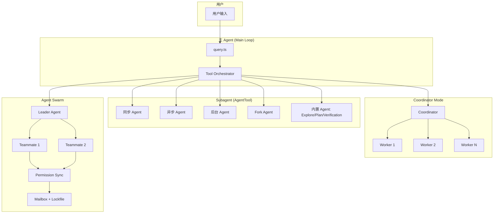
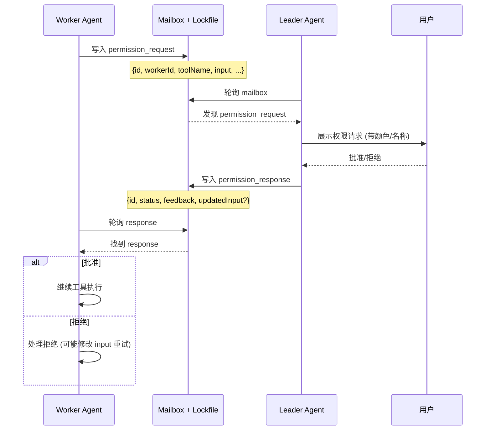

# Multi-Agent System（多智能体系统）

> 多智能体系统是 Claude Code 实现并行任务处理与复杂工作流编排的核心架构——通过 Subagent、Coordinator、Swarm 三种多智能体模式，以及 AgentTool 统一抽象层，构建了一个从简单子任务委托到大规模并行探索的完整多智能体生态。每种模式在复杂度、通信机制、权限管理和适用场景上各有侧重，用户可根据任务需求灵活选择。

## 模块概述

| 文件 | 行数 | 职责 |
|------|------|------|
| `src/tools/AgentTool/AgentTool.tsx` | ~1,400 | AgentTool 核心组件、子 Agent 生成、工具池过滤、MCP 过滤 |
| `src/tools/AgentTool/runAgent.ts` | ~973 | Agent 执行引擎、Query Loop、Model 选择、Worktree 管理 |
| `src/coordinator/coordinatorMode.ts` | ~500 | Coordinator Mode 实现、Worker 工具集管理 |
| `src/utils/swarm/permissionSync.ts` | ~928 | 跨 Agent 权限协调、Mailbox 模式 |
| `src/utils/swarm/backends/TmuxBackend.ts` | ~400 | Tmux 终端后端 |
| `src/utils/swarm/backends/ITermBackend.ts` | ~300 | iTerm2 终端后端 |
| `src/utils/swarm/backends/InProcessBackend.ts` | ~200 | 进程内后端 |
| `src/utils/swarm/spawnInProcess.ts` | ~250 | 进程内 Teammate 生成 |
| `src/utils/swarm/inProcessRunner.ts` | ~300 | 进程内执行器 |
| `src/utils/swarm/teammateInit.ts` | ~200 | Teammate 初始化 |
| `src/utils/swarm/teammateModel.ts` | ~150 | 每个 Teammate 的 Model 选择 |
| `src/utils/swarm/teammateLayoutManager.ts` | ~200 | 终端面板布局管理 |
| `src/utils/swarm/leaderPermissionBridge.ts` | ~200 | Leader 中介权限解析 |
| `src/utils/swarm/teamHelpers.ts` | ~150 | 团队文件操作 |
| `src/utils/swarm/reconnection.ts` | ~150 | 团队重连逻辑 |
| `src/tools/AgentTool/agentTypes.ts` | ~100 | Agent 类型定义 |
| `src/tools/AgentTool/agentColors.ts` | ~50 | Agent 颜色管理 |
| `src/tools/AgentTool/agentMetadata.ts` | ~100 | Agent 元数据持久化 |
| `src/coordinator/coordinatorTypes.ts` | ~80 | Coordinator 类型定义 |
| `src/coordinator/workerTools.ts` | ~150 | Worker 专属工具集 |
| **总计** | **~6,000+** | |

## 多智能体架构全景



**架构说明**：

- **主 Agent (Main Loop)**：用户输入经过 `query.ts` 进入主循环，由 Tool Orchestrator 统一调度
- **Subagent (AgentTool)**：通过 AgentTool 统一抽象，支持 5 种子 Agent 类型，适用于子任务委托
- **Coordinator Mode**：通过 `CLAUDE_CODE_COORDINATOR_MODE` 环境变量启用，适用于多 Worker 编排
- **Agent Swarm**：通过 Leader-Teammate 架构实现并行探索，使用 Mailbox + Lockfile 进行权限同步

## Agent 类型对比详解

### 5 种 Agent 类型完整对比

| 类型 | 阻塞父级 | 共享 Abort | 执行方式 | 适用场景 |
|------|----------|------------|----------|----------|
| **Sync Agent** | ✅ | ✅ | 阻塞父 turn | 需要立即结果的子任务 |
| **Async Agent** | ❌ | ❌ | 独立运行，完成通知 | 长时间运行的后台任务 |
| **Background Agent** | 初始阻塞 → 自动后台 | ❌ | 120s 后自动转后台 | 超长时间任务 |
| **Fork Agent** | ✅ | ✅ | 缓存优化，继承父 prompt | 需要 cache-identical prefix 的场景 |
| **Built-in Agent** | 视类型 | 视类型 | 预定义行为 | Explore/Plan/Verification |

### Sync Agent（同步 Agent）

Sync Agent 是最基础的子 Agent 类型，执行时会阻塞父级 turn，直到子任务完成。

**核心特性**：
- 父级 Agent 等待子 Agent 完成才继续执行
- 共享 Abort 信号，父级中止时子级同步中止
- 适合需要立即获取结果的子任务

```typescript
// 典型使用场景
// 父 Agent 需要子 Agent 的分析结果才能继续下一步
const result = await runSyncAgent({
  query: "分析 src/utils/ 目录下的工具函数",
  model: "sonnet",
  allowedTools: ["Read", "Glob", "Grep"],
})
// 父 Agent 使用 result 继续执行
```

### Async Agent（异步 Agent）

Async Agent 独立运行，不阻塞父级 turn，完成后主动通知父级。

**核心特性**：
- 父级 Agent 启动子 Agent 后立即继续执行
- 不共享 Abort 信号，父子级生命周期独立
- 适合长时间运行的后台任务

```typescript
// 典型使用场景
// 启动多个异步 Agent 并行处理不同任务
await startAsyncAgent({
  query: "重构 src/components/ 下的所有组件",
  model: "opus",
  allowedTools: ["Read", "Edit", "Write"],
})
// 父 Agent 继续执行其他任务
// 子 Agent 完成后通过通知机制告知结果
```

### Background Agent（后台 Agent）

Background Agent 是 Async Agent 的增强版，具有自动降级机制。

**核心特性**：
- 初始阶段短暂阻塞父级（等待初始化完成）
- 120 秒后自动转为后台运行
- 适合超长时间任务，避免一直占用终端

```typescript
// Background Agent 状态转换
// 初始状态: 阻塞父级，等待初始化
// 120s 后: 自动转为后台运行
// 完成后: 通过通知机制告知用户
```

**状态流转**：
```
启动 → 初始化（阻塞）→ 120s 超时 → 后台运行（非阻塞）→ 完成通知
```

### Fork Agent（Fork Agent）

Fork Agent 是针对缓存优化的特殊 Agent 类型，继承父级 prompt 前缀。

**核心特性**：
- 继承父级 prompt 的 cache-identical prefix
- 利用 LLM API 的 prompt caching 机制，降低 token 消耗
- 适合需要多次调用相同上下文子任务的场景

```typescript
// Fork Agent 缓存优化
// 父 prompt 前缀相同，LLM API 可复用缓存
// 显著降低延迟和成本
const forkResult = await runForkAgent({
  query: "基于相同的上下文分析不同文件",
  // 自动继承父级 prompt 前缀
})
```

### Built-in Agent（内置 Agent）

Built-in Agent 是预定义行为的专用 Agent，包括 Explore、Plan、Verification 三种。

**核心特性**：
- 预定义的工具集和行为模式
- 针对特定任务类型优化
- 阻塞/Abort 行为视具体类型而定

```typescript
// 三种内置 Agent
// Explore: 代码探索，使用只读工具遍历代码库
// Plan: 规划模式，制定详细执行计划
// Verification: 验证模式，检查实现是否符合预期
```

## AgentTool 实现详解

### 核心能力

```typescript
// src/tools/AgentTool/AgentTool.tsx (~1400行)
// src/tools/AgentTool/runAgent.ts (~973行)

// 核心能力
├── 子 Agent 生成
├── 独立 query loop
├── 工具池过滤 (deny rules)
├── MCP 需求过滤
├── Model 选择 (per-agent)
├── Worktree 管理
├── Agent 颜色管理
├── 进度追踪
├── 远程 Agent 支持
└── Agent 元数据持久化
```

### 子 Agent 生成

AgentTool 是 Subagent 模式的统一入口，通过 `AgentTool.tsx` 组件实现子 Agent 的创建和管理。

```typescript
// 子 Agent 创建流程
// 1. 解析用户请求，确定 Agent 类型
// 2. 过滤工具池（应用 deny rules）
// 3. 过滤 MCP 需求
// 4. 选择 Model（支持 per-agent 配置）
// 5. 创建独立 query loop
// 6. 启动执行
```

### 工具池过滤

每个子 Agent 拥有独立的工具池，通过 deny rules 进行过滤。

```typescript
// 工具池过滤逻辑
// 父 Agent 的工具池 → 应用 deny rules → 子 Agent 工具池
// 确保子 Agent 只能使用被授权的工具
const filteredTools = parentToolPool.filter(tool =>
  !denyRules.some(rule => toolMatchesRule(tool, rule))
)
```

### MCP 需求过滤

```typescript
// MCP 需求过滤
// 根据子 Agent 的任务需求，过滤不必要的 MCP 连接
// 减少资源占用，提高执行效率
const requiredMCPs = analyzeMCPRequirements(query)
const filteredMCPs = allMCPs.filter(mcp => requiredMCPs.includes(mcp.name))
```

### Model 选择

支持为每个子 Agent 独立配置 Model。

```typescript
// per-agent Model 选择
// 不同任务使用不同 Model，平衡成本与质量
const modelConfig = {
  simple: "haiku",    // 简单任务
  normal: "sonnet",   // 常规任务
  complex: "opus",    // 复杂任务
}
```

### Worktree 管理

```typescript
// Worktree 管理
// 子 Agent 可在独立的 git worktree 中工作
// 避免与父 Agent 的工作区冲突
const worktree = await createWorktree({
  branch: `agent-task-${taskId}`,
  baseBranch: "main",
})
```

### Agent 颜色管理

```typescript
// src/tools/AgentTool/agentColors.ts
// 每个 Agent 分配唯一颜色，便于终端输出区分
const agentColors = [
  "cyan", "magenta", "green", "yellow", "blue", "red",
]
```

### 进度追踪

```typescript
// 进度追踪
// 实时报告子 Agent 执行进度
// 支持进度条、步骤计数等多种展示方式
const progress = {
  currentStep: 3,
  totalSteps: 10,
  description: "正在分析组件依赖...",
}
```

### 远程 Agent 支持

```typescript
// 远程 Agent 支持
// 子 Agent 可在远程机器上执行
// 通过 RPC 机制进行通信
const remoteAgent = await connectRemoteAgent({
  host: "remote-server",
  port: 8080,
})
```

### Agent 元数据持久化

```typescript
// src/tools/AgentTool/agentMetadata.ts
// Agent 元数据持久化
// 记录 Agent 类型、创建时间、执行状态、结果等
const metadata = {
  id: "agent-001",
  type: "sync",
  model: "sonnet",
  createdAt: Date.now(),
  status: "completed",
  result: "...",
}
```

## Coordinator Mode 详解

### 环境变量

通过 `CLAUDE_CODE_COORDINATOR_MODE` 环境变量启用 Coordinator Mode。

```typescript
// src/coordinator/coordinatorMode.ts
// 通过 CLAUDE_CODE_COORDINATOR_MODE 环境变量启用
const coordinatorMode = process.env.CLAUDE_CODE_COORDINATOR_MODE

if (coordinatorMode) {
  // 进入 Coordinator Mode
  // Coordinator 负责编排多个 Worker
  // Worker 拥有受限的工具集
}
```

### Worker 工具集（受限）

Worker Agent 只能使用基础工具，无法直接访问完整工具池。

```typescript
// src/coordinator/workerTools.ts
// Worker 工具集 (受限)
const ASYNC_AGENT_ALLOWED_TOOLS = [
  // 只允许基础工具
  // Read, Write, Edit, Bash 等核心工具
  // 不包括高级工具如 AgentTool、Coordinator 工具等
]
```

### Coordinator 专属工具

Coordinator 拥有专属的内部工具，用于管理 Worker 生命周期和通信。

```typescript
// src/coordinator/coordinatorMode.ts
// Coordinator 专属工具
const INTERNAL_WORKER_TOOLS = new Set([
  TEAM_CREATE_TOOL_NAME,      // 创建 Worker
  TEAM_DELETE_TOOL_NAME,      // 删除 Worker
  SEND_MESSAGE_TOOL_NAME,     // 发送消息给 Worker
  SYNTHETIC_OUTPUT_TOOL_NAME, // 合成输出
])
```

### 工作流模式

```
Research (并行) → Synthesis (Coordinator) → Implementation → Verification
    ↓                    ↓                       ↓                ↓
 多个 Worker        汇总结果               实现代码          验证通过
 独立调研          制定计划               修改文件          测试通过
```

**工作流详解**：

1. **Research（并行调研）**：多个 Worker 独立执行调研任务，互不干扰
2. **Synthesis（Coordinator 汇总）**：Coordinator 收集所有 Worker 结果，制定统一计划
3. **Implementation（实现）**：根据计划修改代码、实现功能
4. **Verification（验证）**：验证实现是否符合预期，测试通过即完成

## Agent Swarm 详解

### 目录结构

```
src/utils/swarm/ (~18+ 文件)
├── backends/
│   ├── TmuxBackend.ts      # Tmux 终端后端
│   ├── ITermBackend.ts     # iTerm2 终端后端
│   └── InProcessBackend.ts # 进程内后端
├── spawnInProcess.ts       # 进程内 teammate 生成
├── inProcessRunner.ts      # 进程内执行器
├── teammateInit.ts         # Teammate 初始化
├── teammateModel.ts        # 每个 teammate 的模型选择
├── teammateLayoutManager.ts # 终端面板布局
├── permissionSync.ts (~928行) # 跨 agent 权限协调
├── leaderPermissionBridge.ts # Leader 中介权限解析
├── teamHelpers.ts          # 团队文件操作
└── reconnection.ts         # 团队重连逻辑
```

### 后端系统

Swarm 支持三种后端，用于管理 Teammate 的终端会话。

#### TmuxBackend

```typescript
// src/utils/swarm/backends/TmuxBackend.ts
// 基于 Tmux 的终端后端
// 每个 Teammate 拥有独立的 Tmux pane
// 支持面板分割、窗口管理等高级功能
```

#### ITermBackend

```typescript
// src/utils/swarm/backends/ITermBackend.ts
// 基于 iTerm2 的终端后端
// 仅 macOS 可用
// 利用 iTerm2 API 实现面板管理
```

#### InProcessBackend

```typescript
// src/utils/swarm/backends/InProcessBackend.ts
// 进程内后端
// Teammate 在同一进程中运行
// 适合轻量级场景，无需外部终端
```

### Teammate 初始化

```typescript
// src/utils/swarm/teammateInit.ts
// Teammate 初始化流程
// 1. 分配唯一 ID 和颜色
// 2. 选择 Model
// 3. 配置工具池
// 4. 建立通信通道
// 5. 启动独立 query loop
```

### Teammate Model 选择

```typescript
// src/utils/swarm/teammateModel.ts
// 每个 Teammate 可独立配置 Model
// Leader 根据任务复杂度分配 Model
const teammateModel = (taskComplexity: string) => {
  switch (taskComplexity) {
    case "low": return "haiku"
    case "medium": return "sonnet"
    case "high": return "opus"
  }
}
```

### 终端面板布局管理

```typescript
// src/utils/swarm/teammateLayoutManager.ts
// 管理终端面板布局
// 根据 Teammate 数量自动调整分割方案
// 支持水平/垂直分割、网格布局等
```

### 团队文件操作

```typescript
// src/utils/swarm/teamHelpers.ts
// 团队文件操作工具
// 协调多 Agent 对同一文件的访问
// 避免写入冲突
```

### 团队重连逻辑

```typescript
// src/utils/swarm/reconnection.ts
// 团队重连逻辑
// 当 Teammate 意外断开时自动重连
// 保存/恢复会话状态
```

## Swarm 权限同步机制（Mailbox 模式）

### 架构设计

Swarm 使用 Mailbox + Lockfile 模式进行跨 Agent 权限同步。



### 权限请求格式

```typescript
// permission_request 格式
interface PermissionRequest {
  id: string              // 唯一请求 ID
  workerId: string        // 发起请求的 Worker ID
  toolName: string        // 请求使用的工具
  input: Record<string, unknown>  // 工具输入参数
  timestamp: number       // 请求时间戳
}
```

### 权限响应格式

```typescript
// permission_response 格式
interface PermissionResponse {
  id: string              // 对应请求 ID
  status: 'approved' | 'denied'  // 批准/拒绝
  feedback?: string       // 用户反馈
  updatedInput?: Record<string, unknown>  // 修改后的输入
}
```

### Leader 中介权限解析

```typescript
// src/utils/swarm/leaderPermissionBridge.ts
// Leader 中介权限解析
// Leader 作为中间人，接收 Worker 的权限请求
// 展示给用户（带颜色/名称标识）
// 将用户决策写回 Mailbox
```

### 轮询机制

```typescript
// 轮询机制
// Worker 和 Leader 都通过轮询检查 Mailbox
// 使用 Lockfile 避免竞态条件
// 轮询间隔可配置，平衡响应速度与资源消耗
```

## 四种模式对比表

| 维度 | Subagent | Coordinator | Swarm | Team |
|------|----------|-------------|-------|------|
| **复杂度** | 低 | 中 | 高 | 中高 |
| **通信** | 直接调用 | SendMessage | Mailbox | Team 文件 |
| **权限** | 继承/独立 | Coordinator 代理 | Leader 桥接 | 共享 |
| **终端** | 共享 | 共享 | 独立面板 | 独立面板 |
| **适用** | 子任务委托 | 多 Worker 编排 | 并行探索 | 团队协作 |
| **后端** | 进程内 | 进程内 | Tmux/iTerm2/InProcess | Tmux/iTerm2 |

### 模式选择指南

```
任务类型判断
    │
    ├── 简单子任务委托 → Subagent
    │   ├── 需要立即结果 → Sync Agent
    │   ├── 长时间后台任务 → Async Agent
    │   ├── 超长时间任务 → Background Agent
    │   ├── 需要缓存优化 → Fork Agent
    │   └── 预定义行为 → Built-in Agent
    │
    ├── 多 Worker 编排 → Coordinator Mode
    │   ├── Research → Synthesis → Implementation → Verification
    │   └── 适合结构化工作流
    │
    ├── 大规模并行探索 → Swarm
    │   ├── 需要独立终端面板
    │   ├── 需要 Leader 权限桥接
    │   └── 适合探索性任务
    │
    └── 团队协作 → Team
        ├── 需要团队文件通信
        ├── 需要共享权限
        └── 适合多人协作场景
```

## 文件索引

### AgentTool 核心

| 文件 | 行数 | 职责 |
|------|------|------|
| `src/tools/AgentTool/AgentTool.tsx` | ~1,400 | AgentTool 核心组件、子 Agent 生成 |
| `src/tools/AgentTool/runAgent.ts` | ~973 | Agent 执行引擎、Query Loop |
| `src/tools/AgentTool/agentTypes.ts` | ~100 | Agent 类型定义 |
| `src/tools/AgentTool/agentColors.ts` | ~50 | Agent 颜色管理 |
| `src/tools/AgentTool/agentMetadata.ts` | ~100 | Agent 元数据持久化 |

### Coordinator Mode

| 文件 | 行数 | 职责 |
|------|------|------|
| `src/coordinator/coordinatorMode.ts` | ~500 | Coordinator Mode 实现 |
| `src/coordinator/coordinatorTypes.ts` | ~80 | Coordinator 类型定义 |
| `src/coordinator/workerTools.ts` | ~150 | Worker 专属工具集 |

### Swarm 核心

| 文件 | 行数 | 职责 |
|------|------|------|
| `src/utils/swarm/permissionSync.ts` | ~928 | 跨 Agent 权限协调 |
| `src/utils/swarm/leaderPermissionBridge.ts` | ~200 | Leader 中介权限解析 |
| `src/utils/swarm/teammateInit.ts` | ~200 | Teammate 初始化 |
| `src/utils/swarm/teammateModel.ts` | ~150 | Teammate Model 选择 |
| `src/utils/swarm/teammateLayoutManager.ts` | ~200 | 终端面板布局管理 |
| `src/utils/swarm/teamHelpers.ts` | ~150 | 团队文件操作 |
| `src/utils/swarm/reconnection.ts` | ~150 | 团队重连逻辑 |

### Swarm 后端

| 文件 | 行数 | 职责 |
|------|------|------|
| `src/utils/swarm/backends/TmuxBackend.ts` | ~400 | Tmux 终端后端 |
| `src/utils/swarm/backends/ITermBackend.ts` | ~300 | iTerm2 终端后端 |
| `src/utils/swarm/backends/InProcessBackend.ts` | ~200 | 进程内后端 |
| `src/utils/swarm/spawnInProcess.ts` | ~250 | 进程内 Teammate 生成 |
| `src/utils/swarm/inProcessRunner.ts` | ~300 | 进程内执行器 |

### Hook 处理器

| 文件 | 行数 | 职责 |
|------|------|------|
| `src/hooks/toolPermission/handlers/coordinatorHandler.ts` | ~150 | Coordinator 权限处理器 |
| `src/hooks/toolPermission/handlers/swarmWorkerHandler.ts` | ~150 | Swarm Worker 权限处理器 |
