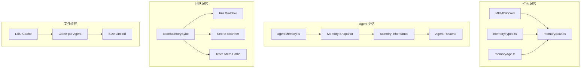
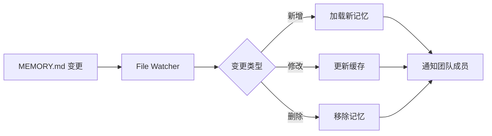

# Memory System（记忆系统）

> 记忆系统是 Claude Code 实现跨会话知识积累与团队协作的核心架构——通过 MEMORY.md 文件作为记忆入口点，结合记忆扫描、Agent 记忆继承、团队记忆同步和文件状态缓存，构建了一个从个人记忆到团队共享记忆的多层次记忆生态。记忆系统在每次交互中自动检索相关上下文，确保 Agent 能够记住项目约定、用户偏好和历史决策。

## 模块概述

| 文件 | 行数 | 职责 |
|------|------|------|
| `src/memdir/memdir.ts` | ~200 | MEMORY.md 入口点管理、内容截断、大小限制 |
| `src/memdir/memoryScan.ts` | ~350 | 记忆扫描、相关性排序、记忆加载 |
| `src/memdir/memoryTypes.ts` | ~100 | 记忆类型定义、记忆分类 |
| `src/memdir/memoryAge.ts` | ~150 | 记忆年龄管理、时效性衰减 |
| `src/services/agentMemory/agentMemory.ts` | ~300 | Agent 记忆快照、记忆继承 |
| `src/services/agentMemory/memorySnapshot.ts` | ~200 | 记忆快照捕获、状态序列化 |
| `src/services/agentMemory/memoryInheritance.ts` | ~150 | 记忆继承机制、父子 Agent 状态传递 |
| `src/services/agentMemory/agentResume.ts` | ~180 | Agent 恢复、记忆重建 |
| `src/services/teamMemorySync/index.ts` | ~250 | 团队记忆同步服务主入口 |
| `src/services/teamMemorySync/watcher.ts` | ~200 | 文件变更监听、实时同步 |
| `src/services/teamMemorySync/secretScanner.ts` | ~180 | 密钥检测、敏感信息扫描 |
| `src/services/teamMemorySync/teamMemSecretGuard.ts` | ~120 | 密钥防护、写入拦截 |
| `src/services/teamMemorySync/teamMemPaths.ts` | ~80 | 团队记忆路径管理 |
| `src/services/teamMemorySync/teamMemPrompts.ts` | ~100 | 团队提示词管理 |
| `src/utils/fileStateCache.ts` | ~250 | 文件状态 LRU 缓存、Agent 独立克隆 |
| `src/utils/memoryLruCache.ts` | ~150 | 通用记忆 LRU 缓存实现 |
| **总计** | **~2,800+** | |

## 记忆系统架构全景



## MEMORY.md 系统详解

### 文件结构与入口点

MEMORY.md 是 Claude Code 的记忆入口点文件，位于项目根目录或用户配置目录中。它作为 Agent 在每次会话启动时首先读取的上下文文件，承载着项目约定、用户偏好、历史决策等关键信息。

```typescript
// src/memdir/memdir.ts
const MAX_ENTRYPOINT_LINES = 200      // 200 行上限
const MAX_ENTRYPOINT_BYTES = 25_000   // ~25KB 上限
```

### 双重截断机制

为防止过大的记忆文件消耗过多 Context Window，系统实现了双重截断策略：

```typescript
// src/memdir/memdir.ts
// 双重截断：先行截断，再字节截断
function truncateEntrypointContent(raw: string): EntrypointTruncation {
  // 行截断 → 字节截断 → 警告标记
  const lineTruncated = raw.split('\n').slice(0, MAX_ENTRYPOINT_LINES).join('\n');
  const byteTruncated = encoder.encode(lineTruncated).slice(0, MAX_ENTRYPOINT_BYTES);
  const wasTruncated = raw.length !== decoder.decode(byteTruncated).length;
  return { content: decoder.decode(byteTruncated), wasTruncated };
}
```

**截断流程**：

```
原始 MEMORY.md 内容
├── 行截断（200 行上限）
│   └── 按换行符分割 → 取前 200 行 → 重新拼接
├── 字节截断（25KB 上限）
│   └── UTF-8 编码 → 取前 25,000 字节 → 解码回字符串
└── 警告标记
    └── 如果发生截断，在末尾添加截断警告提示
```

### 大小限制设计 rationale

| 限制类型 | 数值 | 原因 |
|----------|------|------|
| 行数限制 | 200 行 | 防止单个记忆文件过长，保持可读性 |
| 字节限制 | ~25KB | 控制 Context Window 占用，为对话留出空间 |
| 编码安全 | UTF-8 边界处理 | 避免在 multi-byte 字符中间截断 |

## 记忆检索流程

记忆检索是每次用户输入时的自动化流程，确保 Agent 能够获取最相关的历史上下文。

```
用户输入
└── memoryScan.ts
    ├── 扫描记忆目录
    │   ├── 项目根目录 MEMORY.md
    │   ├── 用户全局目录 MEMORY.md
    │   └── 子目录记忆文件
    ├── 按相关性排序
    │   ├── 记忆年龄衰减
    │   ├── 关键词匹配度
    │   └── 使用频率权重
    ├── 加载相关文件
    │   ├── 读取记忆内容
    │   ├── 应用截断策略
    │   └── 解析记忆元数据
    └── 过滤重复记忆附件
        ├── 去重已加载的记忆
        ├── 合并冲突内容
        └── 注入到 User Context
```

### 检索阶段详解

| 阶段 | 核心逻辑 | 关键文件 |
|------|----------|----------|
| 扫描 | 遍历记忆目录树，发现所有 MEMORY.md 及相关文件 | `memoryScan.ts` |
| 排序 | 基于年龄、相关性、频率计算权重分数 | `memoryAge.ts`, `memoryTypes.ts` |
| 加载 | 读取文件内容，应用大小限制和截断 | `memdir.ts` |
| 去重 | 识别并消除重复或冲突的记忆条目 | `memoryScan.ts` |
| 注入 | 将筛选后的记忆附加到 User Context | `memoryScan.ts` |

## Agent 记忆继承机制

在多 Agent 协作场景中，记忆需要在父子 Agent 之间正确传递，确保子 Agent 能够继承父 Agent 的上下文和决策历史。

### 快照捕获

```
父 Agent
└── agentMemorySnapshot()
    ├── 捕获当前对话历史
    ├── 捕获工具使用记录
    ├── 捕获当前任务状态
    └── 捕获用户偏好与约束
```

### 记忆传递流程

```typescript
// src/services/agentMemory/agentMemory.ts
// 快照捕获 → 状态序列化 → 传递给子 Agent
async function createAgentSnapshot(agent: Agent): Promise<MemorySnapshot> {
  return {
    conversationHistory: agent.history,
    toolUsageLog: agent.toolLog,
    taskState: agent.currentTask,
    userPreferences: agent.preferences,
    timestamp: Date.now(),
  };
}
```

### 三种 Agent 类型的继承方式

```
父 Agent 快照
├── 同步 Agent (Sync Agent)
│   └── 共享快照引用
│       └── 父子 Agent 共享同一份记忆快照
│       └── 适用于简单子任务委托
│
├── 异步 Agent (Async Agent)
│   └── 独立快照副本
│       └── 创建快照的深拷贝
│       └── 子 Agent 可独立修改记忆
│       └── 适用于长时间运行的后台任务
│
└── Fork Agent
    └── 继承父级 System Prompt
        └── 复制父级的完整系统提示
        └── 包含所有已加载的记忆附件
        └── 适用于需要完整上下文的复杂任务
```

### Agent Resume（恢复）

当 Agent 从断点恢复时，系统会重建其记忆状态：

```typescript
// src/services/agentMemory/agentResume.ts
// 从快照重建 Agent 状态
async function resumeAgentFromSnapshot(snapshot: MemorySnapshot): Promise<Agent> {
  const agent = createEmptyAgent();
  agent.history = snapshot.conversationHistory;
  agent.toolLog = snapshot.toolUsageLog;
  agent.currentTask = snapshot.taskState;
  agent.preferences = snapshot.userPreferences;
  return agent;
}
```

## 团队记忆同步

团队记忆同步服务确保多个开发者在同一项目中协作时，能够共享和同步记忆内容。

### 文件结构

```typescript
// src/services/teamMemorySync/
index.ts                  // 团队记忆同步服务主入口
watcher.ts                // 文件变更监听
secretScanner.ts          // 密钥检测
teamMemSecretGuard.ts     // 密钥防护
teamMemPaths.ts           // 团队记忆路径
teamMemPrompts.ts         // 团队提示词
```

### 文件监听机制



### 密钥扫描与防护

**安全特性**：团队记忆写入前经过密钥扫描，防止敏感信息泄露。

```typescript
// src/services/teamMemorySync/secretScanner.ts
interface SecretPattern {
  name: string;
  regex: RegExp;
  severity: 'high' | 'medium' | 'low';
}

const SECRET_PATTERNS: SecretPattern[] = [
  { name: 'AWS Access Key', regex: /AKIA[0-9A-Z]{16}/, severity: 'high' },
  { name: 'Private Key', regex: /-----BEGIN (RSA |EC )?PRIVATE KEY-----/, severity: 'high' },
  { name: 'GitHub Token', regex: /ghp_[A-Za-z0-9_]{36}/, severity: 'high' },
  // ... 更多模式
];
```

### 密钥防护流程

```
团队记忆写入请求
└── teamMemSecretGuard.ts
    ├── secretScanner.ts 扫描内容
    │   ├── 匹配已知密钥模式
    │   ├── 检测高熵字符串
    │   └── 识别常见密钥格式
    ├── 发现密钥？
    │   ├── 是 → 拦截写入
    │   │   ├── 记录安全事件
    │   │   ├── 通知用户
    │   │   └── 返回错误
    │   └── 否 → 允许写入
    │       └── 更新团队记忆
    └── 同步到团队成员
```

### 路径管理与提示词

```typescript
// src/services/teamMemorySync/teamMemPaths.ts
// 团队记忆路径配置
const TEAM_MEMORY_PATHS = {
  projectRoot: '.claude/team-memory/',
  sharedMemory: 'shared.md',
  teamConventions: 'conventions.md',
  deploymentNotes: 'deployment.md',
};

// src/services/teamMemorySync/teamMemPrompts.ts
// 团队提示词模板
const TEAM_PROMPTS = {
  onboarding: '项目初始化提示词',
  codeReview: '代码审查提示词',
  deployment: '部署流程提示词',
};
```

## 文件状态缓存

为提高记忆检索效率，系统使用 LRU 缓存来存储文件状态，避免重复读取磁盘。

### LRU 缓存架构

```typescript
// src/utils/fileStateCache.ts
// LRU 缓存，每个 agent 独立克隆
// 异步 agent 有大小限制，防止内存泄漏

class FileStateCache {
  private cache: Map<string, FileState>;
  private maxSize: number;
  private maxEntries: number;

  constructor(maxEntries = 1000, maxSize = 10 * 1024 * 1024) {
    this.cache = new Map();
    this.maxEntries = maxEntries;
    this.maxSize = maxSize;
  }

  // 获取文件状态（带缓存）
  async getState(filePath: string): Promise<FileState> {
    if (this.cache.has(filePath)) {
      return this.cache.get(filePath)!;
    }
    const state = await readStateFromDisk(filePath);
    this.set(filePath, state);
    return state;
  }

  // 设置缓存条目，触发 LRU 淘汰
  private set(key: string, value: FileState): void {
    this.cache.set(key, value);
    this.evictIfNeeded();
  }

  // LRU 淘汰策略
  private evictIfNeeded(): void {
    while (this.cache.size > this.maxEntries || this.currentSize > this.maxSize) {
      const oldestKey = this.cache.keys().next().value;
      this.cache.delete(oldestKey);
    }
  }
}
```

### Agent 独立克隆

```
主进程缓存
├── Agent A 缓存克隆
│   └── 独立读写，互不干扰
├── Agent B 缓存克隆
│   └── 独立读写，互不干扰
└── Agent C 缓存克隆
    └── 独立读写，互不干扰
```

**设计 rationale**：每个 Agent 拥有独立的缓存克隆，确保：
- 并发安全：多个 Agent 同时操作不会互相影响
- 状态隔离：Agent 的文件状态修改不会污染其他 Agent
- 内存可控：每个克隆有独立的大小限制

### 大小限制策略

| Agent 类型 | 缓存大小限制 | 原因 |
|------------|-------------|------|
| 同步 Agent | 无严格限制 | 生命周期短，任务完成后即释放 |
| 异步 Agent | 10MB / 1000 条目 | 长时间运行，防止内存泄漏 |
| 后台 Agent | 5MB / 500 条目 | 资源受限环境，严格控制内存 |
| Fork Agent | 继承父级限制 | 与父级保持一致 |

## 记忆类型与年龄管理

### 记忆类型定义

```typescript
// src/memdir/memoryTypes.ts
enum MemoryType {
  PROJECT_CONVENTION = 'project_convention',   // 项目约定
  USER_PREFERENCE = 'user_preference',         // 用户偏好
  HISTORICAL_DECISION = 'historical_decision', // 历史决策
  TOOL_CONFIGURATION = 'tool_configuration',   // 工具配置
  DOMAIN_KNOWLEDGE = 'domain_knowledge',       // 领域知识
  TEAM_CONVENTION = 'team_convention',         // 团队约定
}
```

### 记忆年龄衰减

```typescript
// src/memdir/memoryAge.ts
interface MemoryAge {
  createdAt: number;       // 创建时间戳
  lastAccessedAt: number;  // 最后访问时间戳
  accessCount: number;     // 访问次数
  decayFactor: number;     // 衰减因子
}

// 计算记忆相关性分数
function calculateRelevanceScore(memory: MemoryAge): number {
  const ageInDays = (Date.now() - memory.createdAt) / (1000 * 60 * 60 * 24);
  const recencyBonus = Math.exp(-ageInDays * memory.decayFactor);
  const frequencyBonus = Math.log1p(memory.accessCount);
  return recencyBonus * frequencyBonus;
}
```

### 年龄衰减策略

```
新记忆（0-7 天）
├── 衰减因子低
├── 相关性分数高
└── 优先加载

中期记忆（7-30 天）
├── 衰减因子中等
├── 相关性分数中等
└── 按需要加载

陈旧记忆（30+ 天）
├── 衰减因子高
├── 相关性分数低
└── 仅在强匹配时加载
```

## 安全特性

### 密钥扫描与防护

团队记忆系统内置了多层安全防护机制，确保敏感信息不会通过记忆系统泄露。

| 安全层 | 机制 | 触发时机 |
|--------|------|----------|
| 写入前扫描 | `secretScanner.ts` 正则匹配 | 记忆写入前 |
| 高熵检测 | 检测随机字符串模式 | 写入前扫描 |
| 写入拦截 | `teamMemSecretGuard.ts` 阻断 | 发现密钥时 |
| 审计日志 | 记录安全事件 | 每次拦截 |
| 用户通知 | 提示用户移除敏感信息 | 拦截后 |

### 防护覆盖的密钥类型

| 密钥类型 | 检测模式 | 严重级别 |
|----------|----------|----------|
| AWS Access Key | `AKIA[0-9A-Z]{16}` | High |
| AWS Secret Key | 40 字符 Base64 字符串 | High |
| GitHub Token | `ghp_[A-Za-z0-9_]{36}` | High |
| Private Key | `-----BEGIN.*PRIVATE KEY-----` | High |
| Generic API Key | 高熵字符串 + 关键词 | Medium |
| Database URL | 包含密码的 URI | Medium |
| JWT Secret | 高熵字符串 + jwt 关键词 | Low |

## 文件索引

| 文件路径 | 行数 | 核心职责 |
|----------|------|----------|
| `src/memdir/memdir.ts` | ~200 | MEMORY.md 入口点管理、内容截断 |
| `src/memdir/memoryScan.ts` | ~350 | 记忆扫描、相关性排序、加载与注入 |
| `src/memdir/memoryTypes.ts` | ~100 | 记忆类型枚举与分类 |
| `src/memdir/memoryAge.ts` | ~150 | 记忆年龄计算与衰减策略 |
| `src/services/agentMemory/agentMemory.ts` | ~300 | Agent 记忆核心逻辑 |
| `src/services/agentMemory/memorySnapshot.ts` | ~200 | 记忆快照捕获与序列化 |
| `src/services/agentMemory/memoryInheritance.ts` | ~150 | 记忆继承机制实现 |
| `src/services/agentMemory/agentResume.ts` | ~180 | Agent 状态恢复与重建 |
| `src/services/teamMemorySync/index.ts` | ~250 | 团队记忆同步服务 |
| `src/services/teamMemorySync/watcher.ts` | ~200 | 文件变更监听与通知 |
| `src/services/teamMemorySync/secretScanner.ts` | ~180 | 密钥模式检测 |
| `src/services/teamMemorySync/teamMemSecretGuard.ts` | ~120 | 密钥防护与写入拦截 |
| `src/services/teamMemorySync/teamMemPaths.ts` | ~80 | 团队记忆路径配置 |
| `src/services/teamMemorySync/teamMemPrompts.ts` | ~100 | 团队提示词管理 |
| `src/utils/fileStateCache.ts` | ~250 | 文件状态 LRU 缓存 |
| `src/utils/memoryLruCache.ts` | ~150 | 通用记忆 LRU 缓存 |
| **总计** | **~2,800+** | 记忆系统完整实现 |
