# Observability（可观测性）

> 可观测性模块是 Claude Code 的全链路追踪与事件响应中枢——通过 22 种 Hook 覆盖从会话生命周期到工具执行、Agent 调度、上下文管理、权限控制的全方位事件节点，结合 Analytics 遥测、OpenTelemetry 追踪、Perfetto 可视化与成本追踪，构建了一个从事件触发到数据分析的完整可观测性体系。

## 模块概述

| 文件 | 行数 | 职责 |
|------|------|------|
| `src/utils/hooks.ts` | ~5022 | Hook 系统核心实现、22 种 Hook 定义、执行引擎 |
| `src/services/analytics/index.ts` | ~400 | 核心 Analytics 服务、logEvent() 入口 |
| `src/services/analytics/sink.ts` | ~150 | 事件 Sink 管理、事件路由 |
| `src/services/analytics/sinkKillswitch.ts` | ~100 | Sink 熔断机制 |
| `src/services/analytics/datadog.ts` | ~200 | Datadog 集成、指标上报 |
| `src/services/analytics/growthbook.ts` | ~180 | Feature Flag 系统 (Statsig/GrowthBook) |
| `src/services/analytics/firstPartyEventLogger.ts` | ~250 | 第一方事件记录 |
| `src/services/analytics/firstPartyEventLoggingExporter.ts` | ~150 | 事件导出器 |
| `src/services/telemetry/` | ~300 | OpenTelemetry 集成、Session Tracing |
| `src/services/perfetto/` | ~200 | Perfetto Tracing、Agent 层级可视化 |
| `src/cost-tracker.ts` | ~250 | 成本追踪、模型使用统计 |
| **总计** | **~7,200+** | |

## 可观测性架构全景

```mermaid
graph TB
    subgraph "Hook 类型 (22种)"
        Lifecycle[生命周期]
        Tool[工具]
        Agent[Agent]
        Context[上下文]
        Permission[权限]
        Custom[自定义]
    end

    subgraph "Hook 来源"
        Config[配置文件]
        Frontmatter[Agent Frontmatter]
        Plugin[Plugin Hooks]
        Session[Session Hooks]
    end

    subgraph "Hook 执行"
        Spawn[子进程执行]
        Timeout[超时控制]
        Async[异步注册]
        Parallel[并行执行]
    end

    subgraph "可观测性"
        Telemetry[Analytics]
        Tracing[OpenTelemetry]
        Perfetto[Perfetto Tracing]
        Cost[Cost Tracking]
    end

    Lifecycle --> SessionStart
    Lifecycle --> SessionEnd
    Lifecycle --> Stop
    Lifecycle --> StopFailure

    Tool --> PreToolUse
    Tool --> PostToolUse
    Tool --> PostToolUseFailure

    Agent --> SubagentStart
    Agent --> SubagentStop

    Context --> PreCompact
    Context --> PostCompact
    Context --> CwdChanged
    Context --> FileChanged

    Permission --> PermissionDenied
    Permission --> PermissionRequest

    Custom --> UserPromptSubmit
    Custom --> TaskCreated
    Custom --> TaskCompleted
    Custom --> Elicitation
    Custom --> ConfigChange
    Custom --> InstructionsLoaded
    Custom --> TeammateIdle

    Config --> Spawn
    Frontmatter --> Spawn
    Plugin --> Spawn
    Session --> Spawn

    Spawn --> Timeout
    Spawn --> Async
    Spawn --> Parallel

    Spawn --> Telemetry
    Telemetry --> Tracing
    Tracing --> Perfetto
    Tracing --> Cost
```



## Hook 系统架构

Hook 系统是 Claude Code 可观测性的核心基础设施，提供了在关键事件节点注入自定义逻辑的能力。系统支持 22 种 Hook 类型，覆盖会话生命周期的每一个重要阶段。

### 六大 Hook 类别

| 类别 | 包含 Hook 数量 | 覆盖范围 |
|------|---------------|----------|
| **生命周期** | 4 | 会话启动、结束、正常停止、异常停止 |
| **工具** | 3 | 工具执行前、执行后、执行失败 |
| **Agent** | 2 | 子 Agent 启动、子 Agent 停止 |
| **上下文** | 4 | 上下文压缩前/后、工作目录变更、文件变更 |
| **权限** | 2 | 权限被拒绝、权限请求 |
| **自定义** | 7 | 用户 Prompt 提交、任务创建/完成、Elicitation、配置变更、指令加载、Teammate 空闲 |

## 22 种 Hook 类型详解

### 生命周期 Hook

| Hook 类型 | 触发时机 | 说明 |
|-----------|----------|------|
| `SessionStart` | 会话开始 | 用户启动新会话时触发，可用于初始化环境、加载自定义配置 |
| `SessionEnd` | 会话结束 | 用户主动结束会话时触发，可用于清理资源、保存状态 |
| `Stop` | 正常停止 | Agent 正常完成任务后停止时触发 |
| `StopFailure` | 异常停止 | Agent 因错误或异常而停止时触发，可用于错误报告与恢复 |

### 工具 Hook

| Hook 类型 | 触发时机 | 说明 |
|-----------|----------|------|
| `PreToolUse` | 工具执行前 | 在实际调用工具前触发，可用于参数校验、权限预检、参数修改 |
| `PostToolUse` | 工具执行后 | 工具成功执行后触发，可用于结果处理、日志记录、后续动作 |
| `PostToolUseFailure` | 工具执行失败 | 工具执行失败后触发，可用于错误处理、重试逻辑、告警通知 |

### Agent Hook

| Hook 类型 | 触发时机 | 说明 |
|-----------|----------|------|
| `SubagentStart` | 子 Agent 启动 | 创建并启动子 Agent 时触发，可用于注入上下文、配置子 Agent 行为 |
| `SubagentStop` | 子 Agent 停止 | 子 Agent 完成任务或被终止时触发，可用于结果收集、资源清理 |

### 上下文 Hook

| Hook 类型 | 触发时机 | 说明 |
|-----------|----------|------|
| `PreCompact` | 上下文压缩前 | 在执行 Context Compaction 前触发，可用于保存重要上下文、自定义压缩策略 |
| `PostCompact` | 上下文压缩后 | 上下文压缩完成后触发，可用于验证压缩结果、注入补充信息 |
| `CwdChanged` | 工作目录变更 | 当前工作目录发生变化时触发，可用于更新路径引用、重新加载配置 |
| `FileChanged` | 文件变更 | 项目文件被外部修改时触发，可用于缓存失效、重新索引 |

### 权限 Hook

| Hook 类型 | 触发时机 | 说明 |
|-----------|----------|------|
| `PermissionDenied` | 权限被拒绝 | 用户或系统拒绝权限请求时触发，可用于记录审计日志、触发回退逻辑 |
| `PermissionRequest` | 权限请求 | 系统向用户请求权限时触发，可用于自定义权限提示、自动审批策略 |

### 自定义 Hook

| Hook 类型 | 触发时机 | 说明 |
|-----------|----------|------|
| `UserPromptSubmit` | 用户 Prompt 提交前 | 用户输入被发送给模型前触发，可用于 Prompt 增强、安全审查、模板注入 |
| `TaskCreated` | 任务创建 | 新任务被创建时触发，可用于任务初始化、分配标签、设置优先级 |
| `TaskCompleted` | 任务完成 | 任务成功完成时触发，可用于结果汇总、通知发送、后续任务触发 |
| `Elicitation` | MCP 诱导请求 | MCP Server 请求诱导用户提供信息时触发，可用于自定义诱导流程 |
| `ConfigChange` | 配置变更 | 运行时配置发生变化时触发，可用于热重载、配置验证 |
| `InstructionsLoaded` | 指令加载完成 | CLAUDE.md 等指令文件加载完成后触发，可用于指令增强、冲突检测 |
| `TeammateIdle` | Teammate 空闲 | 协作者 Agent 进入空闲状态时触发，可用于任务分配、状态同步 |

## Hook 执行模型

### 子进程执行

每个 Hook 都作为独立的子进程执行，确保隔离性与安全性：

```typescript
// src/utils/hooks.ts (~5022行)

// Hook 作为子进程执行
const TOOL_HOOK_EXECUTION_TIMEOUT_MS = 10 * 60 * 1000  // 10 分钟
const SESSION_END_HOOK_TIMEOUT_MS_DEFAULT = 1500       // 1.5 秒
```

**设计 rationale**：
- 子进程隔离：Hook 脚本运行在独立进程中，无法直接访问主进程内存
- 资源控制：通过超时机制防止 Hook 无限期阻塞
- 语言无关：支持任何可执行脚本（bash、python、node 等）

### 超时控制

不同类型的 Hook 有不同的超时策略：

| Hook 类型 | 默认超时 | 原因 |
|-----------|----------|------|
| 工具 Hook | 10 分钟 | 工具执行可能耗时较长（如编译、部署） |
| 会话结束 Hook | 1.5 秒 | 会话结束时需快速完成，避免阻塞退出 |
| 其他 Hook | 可配置 | 根据具体场景在配置文件中指定 |

### 异步注册表

```typescript
// 异步 Hook 注册表
class AsyncHookRegistry {
  // 追踪待完成的异步 Hook
  private pendingHooks: Map<string, HookPromise> = new Map();

  // 注册异步 Hook
  register(hookId: string, promise: Promise<HookResult>): void {
    this.pendingHooks.set(hookId, promise);
    promise.finally(() => this.pendingHooks.delete(hookId));
  }

  // 等待所有待完成 Hook
  async waitForAll(): Promise<void> {
    await Promise.allSettled(this.pendingHooks.values());
  }
}
```

### 并行执行

同一 Hook 事件可能匹配多个 Hook 配置，系统支持并行执行：

```
Hook 事件触发
├── 匹配 Hook 列表
│   ├── Hook A (配置文件)
│   ├── Hook B (Frontmatter)
│   └── Hook C (Plugin)
├── 并行执行
│   ├── 子进程 A (异步)
│   ├── 子进程 B (异步)
│   └── 子进程 C (异步)
└── 结果合并
    ├── 收集所有输出
    ├── 按优先级排序
    └── 注入到主流程
```

### Hook 执行流程

```typescript
// Hook 执行流程
executeHook(hookEvent, input) {
  // 1. 匹配 Hook (配置 + frontmatter + plugin + session)
  // 2. 构建输入 JSON
  // 3. 生成子进程
  // 4. 解析输出 (同步/异步)
  // 5. 处理响应 (消息注入/权限更新/...)
}
```

**执行流程详解**：

```
事件触发
└── executeHook(hookEvent, input)
    ├── 1. 匹配 Hook
    │   ├── 扫描 .claude/settings.json 中的 hooks 配置
    │   ├── 扫描 Agent Frontmatter 中的 hooks 声明
    │   ├── 收集已安装 Plugin 注册的 hooks
    │   └── 合并 Session 级别的 hooks
    │
    ├── 2. 构建输入 JSON
    │   ├── 注入事件类型 (hookEvent)
    │   ├── 注入事件上下文 (input)
    │   ├── 注入会话状态
    │   └── 注入环境变量
    │
    ├── 3. 生成子进程
    │   ├── 解析命令 (command)
    │   ├── 设置工作目录
    │   ├── 配置超时
    │   └── 启动进程
    │
    ├── 4. 解析输出
    │   ├── 读取 stdout (JSON 格式)
    │   ├── 读取 stderr (日志/错误)
    │   ├── 检查退出码
    │   └── 区分同步/异步响应
    │
    └── 5. 处理响应
        ├── 消息注入 (追加到对话历史)
        ├── 权限更新 (修改权限决策)
        ├── 参数修改 (修改工具调用参数)
        └── 状态更新 (更新会话状态)
```

## Hook 来源

Hook 配置可以来自多个来源，系统按优先级合并处理：

### 配置文件

```json
// .claude/settings.json
{
  "hooks": {
    "PreToolUse": {
      "matcher": ".*",
      "command": "echo '{\"approve\": true}'"
    },
    "SessionEnd": {
      "command": "./scripts/session-cleanup.sh"
    }
  }
}
```

### Agent Frontmatter

```markdown
---
name: code-reviewer
description: 代码审查 Agent
hooks:
  SubagentStart:
    command: "./scripts/setup-review-context.sh"
  SubagentStop:
    command: "./scripts/collect-review-results.sh"
---
```

### Plugin Hooks

Plugin 可以在安装时注册 Hook：

```typescript
// Plugin 注册 Hook
plugin.registerHook({
  event: 'PostToolUse',
  matcher: 'Bash',
  command: 'node ./plugin-scripts/log-tool-usage.js'
});
```

### Session Hooks

会话运行时的动态 Hook 注册：

```typescript
// 会话中动态注册 Hook
session.registerHook({
  event: 'FileChanged',
  handler: async (event) => {
    // 处理文件变更
  }
});
```

### Hook 来源优先级

```
Hook 匹配优先级（从高到低）
├── Session Hooks (运行时动态注册)
│   └── 最高优先级，可覆盖其他来源
│
├── Plugin Hooks (插件注册)
│   └── 插件级别的 Hook 配置
│
├── Frontmatter Hooks (Agent 声明)
│   └── Agent 文件中声明的 Hook
│
└── Config Hooks (配置文件)
    └── .claude/settings.json 中的全局配置
```

## 遥测与分析服务

### Analytics 架构

```
src/services/analytics/
├── index.ts          // 核心 analytics, logEvent()
├── sink.ts           // 事件 sink 管理
├── sinkKillswitch.ts // sink 熔断
├── datadog.ts        // Datadog 集成
├── growthbook.ts     // Feature Flag 系统 (Statsig/GrowthBook)
├── firstPartyEventLogger.ts       // 第一方事件
└── firstPartyEventLoggingExporter.ts  // 事件导出
```

### 核心 Analytics 服务

```typescript
// src/services/analytics/index.ts
// 核心事件记录入口
function logEvent(eventName: string, properties: Record<string, any>): void {
  // 1. 事件验证
  // 2. 事件增强 (会话 ID, 用户 ID, 时间戳)
  // 3. 路由到所有注册的 Sink
  // 4. 异步发送，不阻塞主流程
}
```

### Datadog 集成

```typescript
// src/services/analytics/datadog.ts
// Datadog 指标上报
interface DatadogMetrics {
  reportCounter(metric: string, value: number, tags: string[]): void;
  reportGauge(metric: string, value: number, tags: string[]): void;
  reportDistribution(metric: string, value: number, tags: string[]): void;
}
```

**上报指标类型**：

| 指标类型 | 说明 | 示例 |
|----------|------|------|
| Counter | 累计计数器 | 会话总数、工具调用次数 |
| Gauge | 瞬时值 | 当前活跃会话数、Context Window 使用率 |
| Distribution | 分布统计 | 响应延迟、Token 消耗量 |

### GrowthBook Feature Flag 系统

```typescript
// src/services/analytics/growthbook.ts
// Feature Flag 评估
interface FeatureFlag {
  key: string;
  value: boolean | string | number;
  rules: FlagRule[];
}

// 支持 Statsig 和 GrowthBook 双后端
```

**Feature Flag 应用场景**：

| 场景 | 说明 |
|------|------|
| 灰度发布 | 按比例逐步 rollout 新功能 |
| A/B 测试 | 对比不同策略的效果 |
| 紧急回滚 | 快速关闭有问题的功能 |
| 用户分群 | 针对不同用户群体启用不同功能 |

### 第一方事件记录

```typescript
// src/services/analytics/firstPartyEventLogger.ts
// 第一方事件记录器
class FirstPartyEventLogger {
  // 记录用户交互事件
  logInteraction(type: string, metadata: Record<string, any>): void;

  // 记录工具使用事件
  logToolUsage(toolName: string, result: 'success' | 'failure'): void;

  // 记录会话事件
  logSessionEvent(event: 'start' | 'end' | 'error'): void;
}
```

### Sink 管理

```typescript
// src/services/analytics/sink.ts
// 事件 Sink 管理
interface AnalyticsSink {
  name: string;
  enabled: boolean;
  sendEvent(event: AnalyticsEvent): Promise<void>;
  flush(): Promise<void>;
}

class SinkManager {
  private sinks: Map<string, AnalyticsSink> = new Map();

  register(sink: AnalyticsSink): void;
  unregister(name: string): void;
  dispatch(event: AnalyticsEvent): void;
}
```

### Sink 熔断机制

```typescript
// src/services/analytics/sinkKillswitch.ts
// Sink 熔断器
class SinkKillswitch {
  private failureCount: number = 0;
  private readonly MAX_FAILURES = 5;
  private circuitOpen: boolean = false;

  recordFailure(): void {
    this.failureCount++;
    if (this.failureCount >= this.MAX_FAILURES) {
      this.circuitOpen = true;  // 熔断打开，停止发送
    }
  }

  recordSuccess(): void {
    this.failureCount = 0;
    this.circuitOpen = false;  // 重置熔断器
  }

  isOpen(): boolean {
    return this.circuitOpen;
  }
}
```

**熔断流程**：

```
Sink 发送
├── 成功
│   └── 重置失败计数器
│   └── 保持电路关闭
│
└── 失败
    ├── 失败计数 +1
    ├── 失败次数 < 阈值
    │   └── 继续尝试
    └── 失败次数 >= 阈值
        └── 熔断打开
            ├── 停止向该 Sink 发送事件
            ├── 记录告警
            └── 等待冷却期后尝试半开状态
```

## 追踪系统

### OpenTelemetry Session Tracing

```typescript
// OpenTelemetry Session Tracing
startHookSpan(hookName)  // Hook span 开始
endHookSpan(span)        // Hook span 结束
```

**追踪层级**：

```
Session Trace
├── Session Start Span
│   ├── Hook Spans
│   │   ├── PreToolUse Span
│   │   ├── PostToolUse Span
│   │   └── ...
│   ├── Tool Call Spans
│   │   ├── Bash Span
│   │   ├── Read Span
│   │   ├── Write Span
│   │   └── ...
│   └── Model Request Spans
│       ├── Token Usage
│       ├── Latency
│       └── Cost
│
└── Session End Span
```

**Span 属性**：

| 属性 | 说明 | 示例值 |
|------|------|--------|
| `hook.name` | Hook 名称 | `PreToolUse` |
| `hook.status` | 执行状态 | `success`, `failure`, `timeout` |
| `hook.duration_ms` | 执行耗时 | `1250` |
| `tool.name` | 工具名称 | `Bash`, `Read`, `Write` |
| `model.name` | 模型名称 | `claude-sonnet-4-20250514` |
| `session.id` | 会话 ID | `abc123...` |

### Perfetto Tracing

```typescript
// Perfetto Tracing (Agent 层级可视化)
// 可视化 Agent 父子关系、工具调用链、时间线
```

**Perfetto 追踪能力**：

| 能力 | 说明 |
|------|------|
| Agent 层级可视化 | 展示父 Agent 与子 Agent 的树状关系 |
| 工具调用链 | 追踪完整的工具调用序列与依赖关系 |
| 时间线分析 | 以时间轴展示各组件的执行时间与重叠 |
| 性能瓶颈定位 | 识别耗时最长的操作与等待时间 |
| 并发分析 | 展示并行任务的执行重叠与资源竞争 |

**Perfetto 追踪流程**：

```
Perfetto Trace 生成
├── 开始追踪
│   └── 初始化 Trace Session
│
├── 记录事件
│   ├── Agent 生命周期事件
│   ├── 工具调用事件
│   ├── Hook 执行事件
│   └── 模型请求事件
│
├── 结束追踪
│   └── 序列化 Trace 数据
│
└── 导出
    ├── 生成 .perfetto-trace 文件
    └── 可在 Perfetto UI 中可视化
```

## 成本追踪

```typescript
// src/cost-tracker.ts
getModelUsage()      // 模型使用统计
getTotalCost()       // 总成本 (USD)
getTotalAPIDuration() // API 总耗时
```

### 成本追踪接口

```typescript
// src/cost-tracker.ts
interface CostTracker {
  // 获取模型使用统计
  getModelUsage(): ModelUsageReport;

  // 获取总成本（美元）
  getTotalCost(): number;

  // 获取 API 总耗时（毫秒）
  getTotalAPIDuration(): number;
}

interface ModelUsageReport {
  inputTokens: number;      // 输入 Token 数
  outputTokens: number;     // 输出 Token 数
  cacheReadTokens: number;  // 缓存读取 Token 数
  cacheWriteTokens: number; // 缓存写入 Token 数
  totalCost: number;        // 总成本 (USD)
  requests: number;         // 请求次数
}
```

### 成本计算维度

| 维度 | 说明 | 计算方式 |
|------|------|----------|
| 输入 Token | Prompt 消耗的 Token | `inputTokens × inputPrice` |
| 输出 Token | 响应生成的 Token | `outputTokens × outputPrice` |
| 缓存读取 | Context Cache 命中 | `cacheReadTokens × cacheReadPrice` |
| 缓存写入 | Context Cache 写入 | `cacheWriteTokens × cacheWritePrice` |
| 总成本 | 所有费用汇总 | 上述四项之和 |

### 成本追踪数据流

```
模型请求
├── 记录请求开始时间
├── 发送 API 请求
├── 接收响应
│   ├── 解析 Token 使用量
│   │   ├── input_tokens
│   │   ├── output_tokens
│   │   ├── cache_read_input_tokens
│   │   └── cache_creation_input_tokens
│   ├── 计算本次请求成本
│   └── 更新累计统计
├── 记录请求结束时间
└── 更新 API 耗时统计
```

## 文件索引

| 文件路径 | 行数 | 核心职责 |
|----------|------|----------|
| `src/utils/hooks.ts` | ~5022 | Hook 系统核心、22 种 Hook 定义与执行引擎 |
| `src/services/analytics/index.ts` | ~400 | Analytics 核心服务、logEvent() 入口 |
| `src/services/analytics/sink.ts` | ~150 | 事件 Sink 管理与路由 |
| `src/services/analytics/sinkKillswitch.ts` | ~100 | Sink 熔断机制 |
| `src/services/analytics/datadog.ts` | ~200 | Datadog 指标集成与上报 |
| `src/services/analytics/growthbook.ts` | ~180 | Feature Flag 系统 (Statsig/GrowthBook) |
| `src/services/analytics/firstPartyEventLogger.ts` | ~250 | 第一方事件记录器 |
| `src/services/analytics/firstPartyEventLoggingExporter.ts` | ~150 | 事件导出器 |
| `src/services/telemetry/` | ~300 | OpenTelemetry Session Tracing |
| `src/services/perfetto/` | ~200 | Perfetto Tracing 与可视化 |
| `src/cost-tracker.ts` | ~250 | 成本追踪与模型使用统计 |
| **总计** | **~7,200+** | 可观测性系统完整实现 |
