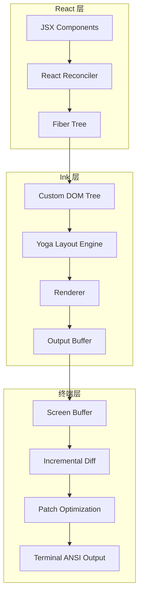
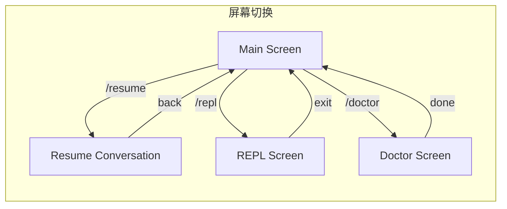
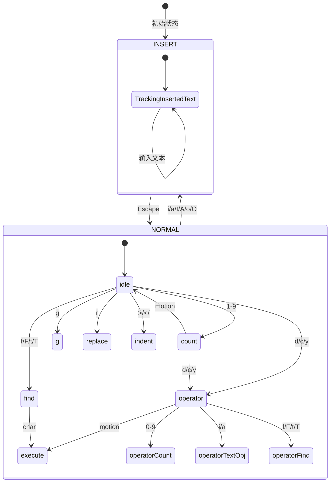
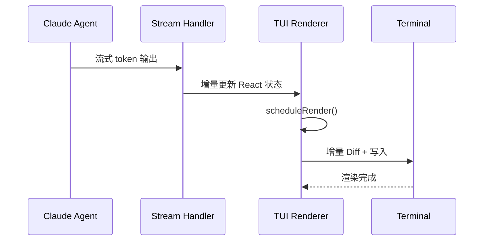

# TUI（Terminal User Interface）系统

> Claude Code 的 TUI 系统是基于 **React + Ink** 构建的终端渲染引擎——采用自定义 fork 的 Ink 框架（React for CLI），通过 Yoga 布局引擎实现 Flexbox 布局，结合 Alt-Screen 双缓冲渲染机制、增量 Diff 算法与 Kitty Keyboard Protocol，构建了一个高性能、低闪烁、支持鼠标交互的终端用户界面。

## 模块概述

| 子模块 | 文件数 | 行数 | 职责 |
|--------|--------|------|------|
| `ink/` | 96 | 19,842 | Ink TUI 渲染引擎（自定义 fork） |
| `components/` | 389 | 81,546 | React UI 组件库 |
| `hooks/` | 104 | 19,204 | React Hooks 库 |
| `screens/` | 3 | 5,977 | 屏幕级组件 |
| `keybindings/` | 14 | 3,159 | 键盘快捷键系统 |
| `vim/` | 5 | 1,513 | Vim 模式模拟 |
| `outputStyles/` | 1 | 98 | 输出样式定义 |
| `moreright/` | 1 | 25 | UI 工具 |
| `voice/` | 1 | 54 | 语音功能 UI |
| **总计** | **614** | **~131,418** | |

## Ink TUI 引擎详解

### 框架特性

Claude Code 使用**自定义 fork 的 Ink 框架**，在开源 Ink（React for CLI）基础上进行了深度定制，核心特性包括：

| 特性 | 说明 |
|------|------|
| **React Reconciler** | 基于 `react-reconciler` 构建自定义 Host Environment，使用 Concurrent Root 模式 |
| **Yoga 布局引擎** | 通过 WASM 编译的 Yoga 库实现 Flexbox 布局，支持 `width/height/flex/padding/margin` |
| **Alt-Screen 渲染** | 使用终端 Alternate Screen Buffer 实现全屏 TUI，保留主屏幕 scrollback |
| **双缓冲帧** | `frontFrame` / `backFrame` 双缓冲机制，避免渲染闪烁 |
| **增量 Diff** | 基于 cell 级别的增量 Diff 算法，仅输出变化的 ANSI 序列 |
| **Kitty Keyboard Protocol** | 支持扩展键盘协议，区分 `Ctrl+Shift+Letter` 与 `Ctrl+Letter` |
| **鼠标追踪** | 支持 DEC 1003 模式鼠标追踪，实现点击、悬停、拖拽选择 |
| **文本选择** | 原生终端文本选择 + 复制到剪贴板（OSC 52） |
| **搜索高亮** | 全文搜索高亮，支持基于位置的高亮（黄色当前匹配） |
| **IME 支持** | 通过 `useDeclaredCursor` 声明光标位置，使 CJK 输入法内联显示 |

### 终端渲染原理



**渲染管线详解**：

```
React Commit Phase
├── resetAfterCommit()
│   ├── onComputeLayout() — 计算 Yoga 布局
│   └── onRender() — 触发 scheduleRender()
│
├── scheduleRender() — throttle(deferredRender, FRAME_INTERVAL_MS)
│   └── queueMicrotask(onRender) — 在 layout effects 之后执行
│
└── onRender() — 主渲染循环
    ├── flushInteractionTime() — 批量刷新交互时间
    ├── renderer() — 渲染 React 树到 Frame
    │   ├── createScreen() — 创建 Screen Buffer
    │   └── renderNodeToOutput() — 递归渲染 DOM 节点
    │
    ├── Selection Overlay — 应用文本选择反色
    ├── Search Highlight — 应用搜索高亮
    ├── Damage Tracking — 标记需要重绘的区域
    │
    ├── log.render(prevFrame, frame) — 增量 Diff
    │   └── diffEach() — cell 级别的差异计算
    │
    ├── Buffer Swap — backFrame → frontFrame
    ├── optimize(diff) — 优化 ANSI 补丁序列
    ├── Cursor Positioning — 声明光标位置写入
    └── writeDiffToTerminal() — 写入终端
```

### Ink 核心类

```typescript
// src/ink/ink.tsx — Ink 主类
export default class Ink {
  // 双缓冲帧
  private frontFrame: Frame;
  private backFrame: Frame;

  // 对象池（避免频繁分配）
  private stylePool: StylePool;
  private charPool: CharPool;
  private hyperlinkPool: HyperlinkPool;

  // React Reconciler
  private container: FiberRoot;
  private rootNode: dom.DOMElement;
  private renderer: Renderer;

  // 终端
  private terminal: Terminal;
  private log: LogUpdate;

  // 文本选择
  readonly selection: SelectionState;

  // 搜索高亮
  private searchHighlightQuery = '';
  private searchPositions: { positions: MatchPosition[]; rowOffset: number; currentIdx: number } | null = null;

  // 光标声明
  private cursorDeclaration: CursorDeclaration | null = null;
  private displayCursor: { x: number; y: number } | null = null;

  // 渲染调度
  private scheduleRender: (() => void) & { cancel?: () => void };
  private drainTimer: ReturnType<typeof setTimeout> | null = null;

  // 状态标记
  private altScreenActive = false;
  private altScreenMouseTracking = false;
  private prevFrameContaminated = false;
  private needsEraseBeforePaint = false;
}
```

### 布局系统

Ink 使用 **Yoga 布局引擎**（通过 WASM 编译的 `src/native-ts/yoga-layout/`）实现 Flexbox 布局：

```typescript
// src/ink/layout/engine.ts — Yoga 布局计算
// 在 React commit phase 调用
rootNode.onComputeLayout = () => {
  const t0 = performance.now();
  this.rootNode.yogaNode.setWidth(this.terminalColumns);
  this.rootNode.yogaNode.calculateLayout(this.terminalColumns);
  const ms = performance.now() - t0;
  recordYogaMs(ms);
};
```

**布局属性支持**：

| 属性类别 | 支持属性 |
|----------|----------|
| **Flexbox** | `flexDirection`, `flexGrow`, `flexShrink`, `flexWrap`, `alignItems`, `alignSelf`, `justifyContent` |
| **尺寸** | `width`, `height`, `minWidth`, `minHeight`, `maxWidth`, `maxHeight` |
| **边距** | `paddingTop/Right/Bottom/Left`, `marginTop/Right/Bottom/Left` |
| **定位** | `position: 'absolute' | 'relative'`, `top`, `right`, `bottom`, `left` |
| **文本** | `textWrap: 'wrap' | 'truncate' | 'truncate-start' | 'truncate-middle' | 'truncate-end'` |
| **溢出** | `overflowX: 'visible' | 'hidden'`, `overflowY: 'visible' | 'hidden'` |

### 自定义 Fork 说明

Claude Code 对开源 Ink 框架进行了以下关键定制：

| 定制项 | 说明 |
|--------|------|
| **Concurrent Root** | 使用 `ConcurrentRoot` 而非 Legacy Root，支持并发渲染 |
| **Alt-Screen 支持** | 完整的 Alternate Screen 生命周期管理（enter/exit/resize/SIGCONT） |
| **双缓冲渲染** | `frontFrame` / `backFrame` 机制，避免闪烁 |
| **增量 Diff** | 自定义 `log-update` 实现 cell 级别的增量差异计算 |
| **对象池** | `StylePool` / `CharPool` / `HyperlinkPool` 避免频繁 GC |
| **鼠标支持** | DEC 1003 鼠标追踪 + 点击/悬停/拖拽事件 |
| **文本选择** | 原生终端文本选择 + OSC 52 剪贴板复制 |
| **搜索高亮** | 全文搜索 + 基于位置的高亮 |
| **IME 支持** | `useDeclaredCursor` 声明光标位置 |
| **Kitty Keyboard** | 扩展键盘协议支持 |
| **滚动优化** | ScrollBox 组件 + DECSTBM 滚动区域 + drain 机制 |
| **性能分析** | 详细的 render phase 计时（renderer/diff/optimize/write/yoga/commit） |
| **SIGCONT 恢复** | 进程挂起/恢复后的终端状态自愈 |
| **Resize 处理** | 同步处理 resize 避免 flicker |

## React 组件系统详解

### 组件层次结构

```
App (FpsMetricsProvider > StatsProvider > AppStateProvider)
├── FullscreenLayout
│   ├── MainScreen
│   │   ├── MessageList (VirtualMessageList)
│   │   │   └── MessageRow (×N)
│   │   │       ├── MessageResponse
│   │   │       │   ├── ToolUse (Bash/Read/Write/Grep/...)
│   │   │       │   ├── ToolResult
│   │   │       │   ├── ThinkingBlock
│   │   │       │   └── TextContent
│   │   │       └── StatusIcon
│   │   ├── PromptInput
│   │   │   ├── VoiceIndicator
│   │   │   ├── PromptInputModeIndicator
│   │   │   ├── PromptInputFooterSuggestions
│   │   │   ├── PromptInputQueuedCommands
│   │   │   └── Notifications
│   │   └── StatusLine
│   ├── ExpandedView (Tasks/Teammates)
│   │   ├── TodoList
│   │   └── TeammateSpinner
│   └── StatusBar
│       ├── CostDisplay
│       ├── ModelDisplay
│       └── TokenUsage
├── Dialogs (Overlay)
│   ├── Dialog (Settings/Confirmation/Permission)
│   ├── FuzzyPicker
│   ├── ThemePicker
│   └── ModelPicker
└── LogoV2 (Welcome/Feed/Notices)
```

### 消息组件库

消息系统是 TUI 的核心展示组件，负责渲染 Agent 的回复、工具调用和状态：

| 组件 | 职责 |
|------|------|
| `VirtualMessageList` | 虚拟滚动消息列表，仅渲染可见区域的消息 |
| `MessageRow` | 单条消息行，包含头像、时间戳、内容 |
| `MessageResponse` | Agent 回复容器，管理 thinking/toolUse/text 的渲染 |
| `ToolUse` | 工具调用展示（Bash/Read/Write/Grep/Glob 等） |
| `ToolResult` | 工具执行结果展示（成功/失败/截断） |
| `ThinkingBlock` | 思维链过程展示（可折叠） |
| `TextContent` | 纯文本/Markdown 内容渲染 |

### 工具输出组件

| 组件 | 职责 |
|------|------|
| `ShellProgressMessage` | Shell 命令进度展示 |
| `ShellTimeDisplay` | Shell 命令耗时展示 |
| `OutputLine` | 单行输出 |
| `FileEditToolDiff` | 文件编辑 Diff 展示 |
| `FileEditToolUpdatedMessage` | 文件更新通知 |
| `HighlightedCode/Fallback` | 代码高亮 + 降级方案 |

### 状态栏

| 组件 | 职责 |
|------|------|
| `StatusLine` | 主状态栏（模型、成本、Token 使用量） |
| `StatusNotices` | 状态通知（警告、提示） |
| `EffortIndicator` | 模型努力程度指示器 |
| `FastIcon` | Fast Mode 指示器 |
| `Spinner` | 加载动画 |

### 对话框系统

| 组件 | 职责 |
|------|------|
| `Dialog` | 通用对话框容器 |
| `Settings/Settings` | 设置面板 |
| `Settings/Config` | 配置列表 |
| `Settings/Usage` | 使用情况展示 |
| `FuzzyPicker` | 模糊搜索选择器 |
| `ThemePicker` | 主题选择器 |
| `LanguagePicker` | 语言选择器 |
| `MCPServerMultiselectDialog` | MCP 服务器多选对话框 |
| `MCPServerApprovalDialog` | MCP 服务器审批对话框 |
| `QuickOpenDialog` | 快速打开文件对话框 |
| `InvalidSettingsDialog` | 无效设置提示 |
| `InvalidConfigDialog` | 无效配置提示 |
| `ClaudeMdExternalIncludesDialog` | CLAUDE.md 外部包含对话框 |

### Design System

Claude Code 内置了一套设计系统组件：

| 组件 | 职责 |
|------|------|
| `color.ts` | 颜色定义与转换 |
| `ThemedBox` | 主题化容器 |
| `ThemedText` | 主题化文本 |
| `ThemeProvider` | 主题上下文提供者 |
| `ProgressBar` | 进度条 |
| `Pane` | 面板容器 |
| `Tabs` | 标签页 |
| `LoadingState` | 加载状态 |
| `KeyboardShortcutHint` | 快捷键提示 |
| `ListItem` | 列表项 |
| `Divider` | 分割线 |
| `Byline` | 副标题 |
| `StatusIcon` | 状态图标 |
| `Ratchet` | 棘轮指示器 |

## React Hooks 库详解

### 状态 Hook

| Hook | 职责 |
|------|------|
| `useAppState<T>(selector)` | 订阅 AppState 状态切片，仅在选择值变化时重新渲染 |
| `useSetAppState()` | 获取 setAppState 更新器，不订阅任何状态 |
| `useAppStateStore()` | 获取完整 Store 实例，用于传递给非 React 代码 |
| `useAppStateMaybeOutsideOfProvider<T>()` | 安全版本，在 Provider 外部调用时返回 undefined |
| `useSettings()` | 订阅设置状态 |
| `useSettingsChange()` | 监听设置变更 |
| `useMainLoopModel()` | 订阅主循环模型 |
| `useMemoryUsage()` | 内存使用情况 |

### 效果 Hook

| Hook | 职责 |
|------|------|
| `useTerminalSize()` | 监听终端尺寸变化 |
| `useTimeout()` | 延迟执行 |
| `useAfterFirstRender()` | 首次渲染后执行一次 |
| `useMinDisplayTime()` | 确保最小显示时间 |
| `useElapsedTime()` | 已过时间计算 |
| `useBlink()` | 闪烁效果 |
| `useCopyOnSelect()` | 选择时复制到剪贴板 |

### 键盘处理 Hook

| Hook | 职责 |
|------|------|
| `useInput()` | Ink 原生输入 Hook，处理字符输入和特殊键 |
| `useGlobalKeybindings()` | 全局快捷键绑定 |
| `useCommandKeybindings()` | 命令级快捷键绑定 |
| `useExitOnCtrlCD()` | Ctrl+C/D 退出处理 |
| `useExitOnCtrlCDWithKeybindings()` | 带快捷键的 Ctrl+C/D 处理 |
| `useArrowKeyHistory()` | 方向键历史记录导航 |
| `useDoublePress()` | 双击检测 |
| `useInputBuffer()` | 输入缓冲 |
| `useTextInput()` | 文本输入处理 |
| `useVimInput()` | Vim 模式输入处理 |

### 动画 Hook

| Hook | 职责 |
|------|------|
| `useAnimationFrame()` | Ink 动画帧 Hook |
| `useInterval()` | Ink 定时器 Hook |
| `useBlink()` | 文本闪烁效果 |

### 业务 Hook

| Hook | 职责 |
|------|------|
| `useVoice()` | 语音功能 |
| `useVoiceEnabled()` | 语音可用性检查 |
| `useVoiceIntegration()` | 语音集成 |
| `useVirtualScroll()` | 虚拟滚动 |
| `useTypeahead()` | 自动补全 |
| `useTurnDiffs()` | Turn 级 Diff 数据 |
| `useUpdateNotification()` | 更新通知 |
| `useTaskListWatcher()` | 任务列表监视器 |
| `useTeleportResume()` | Teleport 恢复 |
| `useTasksV2()` | 任务 V2 状态 |
| `useTeammateViewAutoExit()` | Teammate 视图自动退出 |
| `useSwarmPermissionPoller()` | Swarm 权限轮询 |
| `useSwarmInitialization()` | Swarm 初始化 |
| `useQueueProcessor()` | 队列处理器 |
| `useSSHSession()` | SSH 会话 |
| `useScheduledTasks()` | 定时任务 |
| `useRemoteSession()` | 远程会话 |
| `usePromptSuggestion()` | Prompt 建议 |
| `useReplBridge()` | REPL Bridge |
| `usePrStatus()` | PR 状态 |
| `useMergedTools()` | 合并工具定义 |
| `usePasteHandler()` | 粘贴处理 |
| `useOfficialMarketplaceNotification()` | 官方市场通知 |
| `usePluginRecommendationBase()` | 插件推荐 |
| `useNotifyAfterTimeout()` | 超时后通知 |
| `useLspPluginRecommendation()` | LSP 插件推荐 |
| `useIssueFlagBanner()` | Issue 标志横幅 |
| `useMailboxBridge()` | 邮箱桥接 |
| `useInboxPoller()` | 邮箱轮询 |
| `useManagePlugins()` | 插件管理 |
| `useIdeConnectionStatus()` | IDE 连接状态 |
| `useIdeLogging()` | IDE 日志 |
| `useIdeAtMentioned()` | IDE @提及 |
| `useIdeSelection()` | IDE 选择 |
| `useIDEIntegration()` | IDE 集成 |
| `useHistorySearch()` | 历史搜索 |
| `useFileHistorySnapshotInit()` | 文件历史快照 |
| `useDiffData()` | Diff 数据 |
| `useDiffInIDE()` | IDE 中查看 Diff |
| `useDynamicConfig()` | 动态配置 |
| `useCommandQueue()` | 命令队列 |
| `useDeferredHookMessages()` | 延迟 Hook 消息 |
| `useClaudeCodeHintRecommendation()` | Claude Code 提示推荐 |
| `useCancelRequest()` | 取消请求 |
| `useClipboardImageHint()` | 剪贴板图片提示 |
| `useCanUseTool()` | 工具可用性检查 |
| `useChromeExtensionNotification()` | Chrome 扩展通知 |
| `useBackgroundTaskNavigation()` | 后台任务导航 |
| `useAwaySummary()` | 离开摘要 |
| `useApiKeyVerification()` | API Key 验证 |
| `useAssistantHistory()` | 助手历史 |

### 通知 Hook

| Hook | 职责 |
|------|------|
| `usePluginInstallationStatus()` | 插件安装状态 |
| `useStartupNotification()` | 启动通知 |
| `useRateLimitWarningNotification()` | 速率限制警告 |
| `useTeammateShutdownNotification()` | Teammate 关闭通知 |
| `useSettingsErrors()` | 设置错误 |
| `useModelMigrationNotifications()` | 模型迁移通知 |
| `useInstallMessages()` | 安装消息 |
| `useNpmDeprecationNotification()` | NPM 弃用通知 |
| `usePluginAutoupdateNotification()` | 插件自动更新通知 |
| `useMcpConnectivityStatus()` | MCP 连接状态 |
| `useIDEStatusIndicator()` | IDE 状态指示器 |
| `useFastModeNotification()` | Fast Mode 通知 |
| `useLspInitializationNotification()` | LSP 初始化通知 |
| `useCanSwitchToExistingSubscription()` | 可切换订阅通知 |
| `useDeprecationWarningNotification()` | 弃用警告通知 |
| `useAutoModeUnavailableNotification()` | Auto Mode 不可用通知 |

## 屏幕级组件

| 屏幕 | 文件 | 行数 | 职责 |
|------|------|------|------|
| **ResumeConversation** | `screens/ResumeConversation.tsx` | ~3,000 | 恢复会话屏幕，处理中断后的会话恢复 |
| **REPL** | `screens/REPL.tsx` | ~2,000 | REPL 交互屏幕，支持代码执行与即时反馈 |
| **Doctor** | `screens/Doctor.tsx` | ~977 | 诊断屏幕，检查环境配置与连接状态 |



## 键盘快捷键系统

### 键映射定义

快捷键系统采用**上下文感知**的设计，不同上下文有不同的键绑定：

```typescript
// src/keybindings/defaultBindings.ts
export const DEFAULT_BINDINGS: KeybindingBlock[] = [
  {
    context: 'Global',
    bindings: {
      'ctrl+c': 'app:interrupt',
      'ctrl+d': 'app:exit',
      'ctrl+l': 'app:redraw',
      'ctrl+t': 'app:toggleTodos',
      'ctrl+o': 'app:toggleTranscript',
      'ctrl+shift+o': 'app:toggleTeammatePreview',
      'ctrl+r': 'history:search',
      'ctrl+shift+f': 'app:globalSearch',
      'ctrl+shift+p': 'app:quickOpen',
      'meta+j': 'app:toggleTerminal',
    },
  },
  {
    context: 'Chat',
    bindings: {
      escape: 'chat:cancel',
      'ctrl+x ctrl+k': 'chat:killAgents',
      'shift+tab': 'chat:cycleMode',
      'meta+p': 'chat:modelPicker',
      'meta+o': 'chat:fastMode',
      'meta+t': 'chat:thinkingToggle',
      enter: 'chat:submit',
      up: 'history:previous',
      down: 'history:next',
      'ctrl+_': 'chat:undo',
      'ctrl+shift+-': 'chat:undo',
      'ctrl+x ctrl+e': 'chat:externalEditor',
      'ctrl+g': 'chat:externalEditor',
      'ctrl+s': 'chat:stash',
      'ctrl+v': 'chat:imagePaste',
      space: 'voice:pushToTalk',
    },
  },
  // ... 更多上下文
];
```

### 快捷键上下文

| 上下文 | 说明 | 关键快捷键 |
|--------|------|------------|
| **Global** | 全局快捷键，始终生效 | `Ctrl+C` 中断, `Ctrl+D` 退出, `Ctrl+L` 重绘 |
| **Chat** | 聊天输入上下文 | `Enter` 提交, `Esc` 取消, `Up/Down` 历史 |
| **Autocomplete** | 自动补全上下文 | `Tab` 接受, `Esc` 关闭, `Up/Down` 选择 |
| **Settings** | 设置面板上下文 | `Esc` 关闭, `Enter` 保存, `/` 搜索 |
| **Confirmation** | 确认对话框上下文 | `Y` 确认, `N` 拒绝, `Tab` 切换字段 |
| **Tabs** | 标签页导航 | `Tab` 下一个, `Shift+Tab` 上一个 |
| **Transcript** | 转录查看器 | `Q`/`Esc` 退出, `Ctrl+E` 显示全部 |
| **HistorySearch** | 历史搜索 | `Ctrl+R` 下一个, `Enter` 执行 |
| **Scroll** | 滚动上下文 | `PageUp/Down`, `Ctrl+Home/End`, `Ctrl+Shift+C` 复制 |
| **Select** | 选择组件 | `Up/Down/J/K` 导航, `Enter` 接受, `Esc` 取消 |
| **DiffDialog** | Diff 对话框 | `Esc` 关闭, `Left/Right` 切换源 |
| **ModelPicker** | 模型选择器 | `Left/Right` 调整 Effort |
| **MessageSelector** | 消息选择器 | `Up/Down/J/K` 导航, `Ctrl+Up` 顶部 |
| **MessageActions** | 消息操作 | `Up/Down` 导航, `C` 复制, `P` 固定 |
| **Footer** | 页脚导航 | `Up/Down` 导航, `Enter` 打开 |
| **Attachments** | 附件导航 | `Right/Left` 切换, `Backspace` 删除 |
| **Plugin** | 插件管理 | `Space` 切换, `I` 安装 |
| **Help** | 帮助菜单 | `Esc` 关闭 |
| **ThemePicker** | 主题选择器 | `Ctrl+T` 切换语法高亮 |
| **Task** | 任务上下文 | `Ctrl+B` 后台运行 |

### 和弦处理

系统支持**和弦快捷键**（Chord），即按键序列：

```typescript
// 和弦快捷键示例
'ctrl+x ctrl+k': 'chat:killAgents'     // 先按 Ctrl+X，再按 Ctrl+K
'ctrl+x ctrl+e': 'chat:externalEditor' // 先按 Ctrl+X，再按 Ctrl+E
```

**和弦解析流程**：

```
按键输入
├── 解析为 Key 对象（key, ctrl, shift, meta, alt）
├── 检查和弦前缀
│   ├── 匹配和弦前缀（如 ctrl+x）
│   │   ├── 启动和弦超时
│   │   └── 等待下一个按键
│   └── 非和弦前缀
│       └── 直接匹配快捷键
│
├── 和弦超时
│   └── 取消和弦，回退到单键匹配
│
└── 完整和弦匹配
    └── 触发动作
```

### 快捷键优先级

```
快捷键匹配优先级（从高到低）
├── 当前焦点组件的快捷键
│   └── 最具体的上下文优先
│
├── 父组件的快捷键
│   └── 冒泡机制，子组件可 stopImmediatePropagation()
│
├── 全局快捷键
│   └── 始终可匹配，除非被更具体的上下文拦截
│
└── 保留快捷键
    └── Ctrl+C / Ctrl+D 不可重新绑定（reservedShortcuts.ts 验证）
```

### 快捷键系统架构

```
src/keybindings/
├── defaultBindings.ts    // 默认快捷键定义
├── schema.ts             // 快捷键 Schema 验证
├── parser.ts             // 快捷键字符串解析
├── resolver.ts           // 快捷键解析与匹配
├── match.ts              // 快捷键匹配逻辑
├── template.ts           // 快捷键模板
├── validate.ts           // 快捷键验证
├── reservedShortcuts.ts  // 保留快捷键（不可重新绑定）
├── loadUserBindings.ts   // 加载用户自定义快捷键
├── shortcutFormat.ts     // 快捷键格式化显示
├── useShortcutDisplay.ts // 快捷键显示 Hook
├── useKeybinding.ts      // 快捷键绑定 Hook
├── KeybindingContext.tsx // 快捷键上下文
└── KeybindingProviderSetup.tsx // 快捷键提供者设置
```

## Vim 模式模拟

### Vim 状态机

Vim 模式实现为一个**类型安全的状态机**，使用 TypeScript 判别联合类型确保状态转换的完备性：



### Vim 键绑定

| 模式 | 键 | 动作 |
|------|-----|------|
| **INSERT** | `Escape` | 切换到 NORMAL 模式 |
| **NORMAL** | `i` | 在光标前插入 |
| **NORMAL** | `a` | 在光标后插入 |
| **NORMAL** | `I` | 在行首插入 |
| **NORMAL** | `A` | 在行尾插入 |
| **NORMAL** | `o` | 在下方新开一行插入 |
| **NORMAL** | `O` | 在上方新开一行插入 |
| **NORMAL** | `h/j/k/l` | 左/下/上/右移动 |
| **NORMAL** | `w/b/e` | 词首/词尾移动 |
| **NORMAL** | `0/^/$` | 行首/行首非空白/行尾 |
| **NORMAL** | `d{motion}` | 删除 |
| **NORMAL** | `c{motion}` | 修改（删除并插入） |
| **NORMAL** | `y{motion}` | 复制 |
| **NORMAL** | `p` | 粘贴 |
| **NORMAL** | `x` | 删除字符 |
| **NORMAL** | `u` | 撤销 |
| **NORMAL** | `Ctrl+R` | 重做 |
| **NORMAL** | `.` | 重复上次修改 |
| **NORMAL** | `f{char}` | 向前查找字符 |
| **NORMAL** | `F{char}` | 向后查找字符 |
| **NORMAL** | `t{char}` | 向前查找到字符前 |
| **NORMAL** | `T{char}` | 向后查找到字符前 |
| **NORMAL** | `;` | 重复上次查找 |
| **NORMAL** | `,` | 反向重复上次查找 |
| **NORMAL** | `gg` | 跳转到首行 |
| **NORMAL** | `G` | 跳转到末行 |
| **NORMAL** | `{count}G` | 跳转到指定行 |
| **NORMAL** | `>{motion}` | 缩进 |
| **NORMAL** | `<{motion}` | 反缩进 |

### 命令模式状态

```typescript
// src/vim/types.ts — CommandState 判别联合
export type CommandState =
  | { type: 'idle' }                                    // 空闲，等待命令
  | { type: 'count'; digits: string }                   // 等待计数（如 3d 中的 3）
  | { type: 'operator'; op: Operator; count: number }   // 操作符等待动作（如 d 等待 motion）
  | { type: 'operatorCount'; op: Operator; count: number; digits: string } // 操作符+计数
  | { type: 'operatorFind'; op: Operator; count: number; find: FindType }  // 操作符+查找
  | { type: 'operatorTextObj'; op: Operator; count: number; scope: TextObjScope } // 操作符+文本对象
  | { type: 'find'; find: FindType; count: number }     // 查找等待字符
  | { type: 'g'; count: number }                        // g 前缀
  | { type: 'operatorG'; op: Operator; count: number }  // 操作符+g 前缀
  | { type: 'replace'; count: number }                  // r 替换
  | { type: 'indent'; dir: '>' | '<'; count: number }   // 缩进等待 motion
```

### 持久状态

```typescript
// src/vim/types.ts — PersistentState
export type PersistentState = {
  lastChange: RecordedChange | null;      // 上次修改（用于 . 重复）
  lastFind: { type: FindType; char: string } | null; // 上次查找（用于 ; 重复）
  register: string;                        // 寄存器内容
  registerIsLinewise: boolean;             // 寄存器是否为行模式
}
```

### Vim 模块架构

```
src/vim/
├── types.ts        // 状态机类型定义（VimState, CommandState, PersistentState）
├── motions.ts      // 运动命令实现（h/j/k/l, w/b/e, 0/^/$, f/F/t/T, gg/G）
├── operators.ts    // 操作符实现（d/c/y, x, >/<, r）
├── transitions.ts  // 状态转换逻辑（输入 → 状态机推进）
└── textObjects.ts  // 文本对象（iw/aw, i"/a", i(/a(, i{/a{）
```

## 输出样式与主题

### 输出样式定义

```
src/outputStyles/
└── index.ts  // 输出样式配置（98 行）
```

输出样式定义了不同消息类型的渲染格式：

| 样式类型 | 说明 |
|----------|------|
| **工具输出** | Bash 命令输出、文件读写、Grep 结果等 |
| **Agent 消息** | 文本回复、思维链、工具调用 |
| **系统通知** | 权限请求、错误提示、状态变更 |
| **用户输入** | 用户 Prompt、命令输入 |

### 主题系统

主题系统通过 `ThemeProvider` 和 Design System 组件实现：

```
src/components/design-system/
├── color.ts           // 颜色定义与转换
├── ThemeProvider.tsx  // 主题上下文提供者
├── ThemedBox.tsx      // 主题化容器
├── ThemedText.tsx     // 主题化文本
└── ...
```

**主题特性**：

| 特性 | 说明 |
|------|------|
| **颜色方案** | 支持多种预设主题（亮色、暗色、高对比度） |
| **语法高亮** | 代码块的语法着色 |
| **语义颜色** | 成功/失败/警告/错误的颜色映射 |
| **动态切换** | 运行时切换主题，无需重启 |

### 颜色系统

```typescript
// src/components/design-system/color.ts
// 颜色定义与转换工具
```

| 颜色类别 | 用途 |
|----------|------|
| **语义色** | 成功（绿）、失败（红）、警告（黄）、信息（蓝） |
| **品牌色** | Claude Code 品牌色 |
| **中性色** | 文本、边框、背景的中性色调 |
| **工具色** | 不同工具类型的区分颜色 |

## 流式输出渲染

### 实时文本流

Claude Code 的 TUI 支持**流式渲染**，Agent 的回复是逐步生成的：



**流式渲染流程**：

```
流式输出
├── Token 到达
│   ├── 更新消息状态（append to message buffer）
│   ├── 触发 React 状态更新
│   └── scheduleRender()
│
├── 渲染调度
│   ├── throttle(deferredRender, FRAME_INTERVAL_MS)
│   └── queueMicrotask(onRender)
│
├── 增量渲染
│   ├── Yoga 布局重新计算（仅受影响的部分）
│   ├── renderNodeToOutput() — 递归渲染
│   └── 增量 Diff — 仅输出变化的 cell
│
└── 终端更新
    ├── 计算 diff（prevFrame vs currentFrame）
    ├── 优化 ANSI 补丁序列
    └── 写入终端
```

### 工具结果渲染

工具执行结果的渲染支持多种模式：

| 工具类型 | 渲染方式 |
|----------|----------|
| **Bash** | 命令 + 输出（stdout/stderr）+ 退出码 + 耗时 |
| **Read** | 文件路径 + 内容预览（带语法高亮） |
| **Write** | 文件路径 + Diff 视图（新增/删除行） |
| **Grep** | 匹配结果列表（文件路径 + 行号 + 匹配内容） |
| **Glob** | 匹配文件列表 |
| **TodoWrite** | Todo 列表更新视图 |

### 进度指示

| 指示器 | 说明 |
|--------|------|
| **Spinner** | 加载动画，表示 Agent 正在处理 |
| **ProgressBar** | 进度条，用于长时间任务 |
| **ShellProgressMessage** | Shell 命令进度 |
| **ShellTimeDisplay** | Shell 命令耗时 |
| **EffortIndicator** | 模型努力程度指示器 |

## 性能优化

### 渲染优化

Claude Code 的 TUI 系统采用了多层次的性能优化：

| 优化策略 | 说明 |
|----------|------|
| **Concurrent Root** | 使用 React Concurrent 模式，避免阻塞渲染 |
| **Throttle 渲染** | `throttle(deferredRender, FRAME_INTERVAL_MS)` 限制渲染频率 |
| **Microtask 调度** | `queueMicrotask(onRender)` 在 layout effects 之后执行，避免光标滞后 |
| **增量 Diff** | 仅输出变化的 cell，减少终端写入量 |
| **对象池** | `StylePool` / `CharPool` / `HyperlinkPool` 避免频繁 GC |
| **引用优化** | `Object.is(next, prev)` 比较，避免不必要的更新 |
| **选择器模式** | `useAppState(selector)` 仅在选择值变化时重新渲染 |

### 虚拟滚动

`VirtualMessageList` 组件实现了虚拟滚动，仅渲染可见区域的消息：

```
虚拟滚动原理
├── 计算可见区域（viewport top/bottom）
├── 仅渲染可见消息 + 缓冲区
├── 使用 placeholder 保持滚动高度
└── 滚动时动态更新可见区域
```

**虚拟滚动 Hook**：

```typescript
// src/hooks/useVirtualScroll.ts
// 虚拟滚动实现
```

### 增量更新

```
增量更新策略
├── 状态更新
│   ├── setAppState(prev => ({...prev, ...})) — 函数式更新
│   └── Object.is 比较，跳过相同引用
│
├── 布局更新
│   ├── Yoga 布局仅重新计算受影响的节点
│   └── 缓存布局结果（getYogaCounters）
│
├── 渲染更新
│   ├── 增量 Diff — 仅比较变化的区域
│   ├── Damage Tracking — 标记需要重绘的区域
│   └── Blit 优化 — 安全时复制未变化区域
│
└── 终端更新
    ├── 优化 ANSI 补丁序列
    ├── 跳过空 diff（zero-write fast path）
    └── 批量写入终端
```

### Ink 内部 Hooks

Ink 框架自身提供了一系列底层 Hooks：

| Hook | 职责 |
|------|------|
| `useInput()` | 处理用户输入（字符 + 特殊键） |
| `useApp()` | 获取 App 上下文 |
| `useStdin()` | 标准输入控制（raw mode） |
| `useInterval()` | 定时器 Hook |
| `useAnimationFrame()` | 动画帧 Hook |
| `useTerminalFocus()` | 终端焦点状态 |
| `useTerminalTitle()` | 终端标题设置 |
| `useTerminalViewport()` | 终端视口信息 |
| `useDeclaredCursor()` | 声明光标位置（用于 IME 支持） |
| `useSelection()` | 文本选择状态 |
| `useTabStatus()` | Tab 状态 |
| `useSearchHighlight()` | 搜索高亮 |

### Ink 核心组件

| 组件 | 职责 |
|------|------|
| `Box` | Flexbox 布局容器（类似 `<div style="display: flex">`） |
| `Text` | 文本组件，支持颜色、粗体、斜体、下划线等 |
| `Spacer` | 弹性间距组件 |
| `Link` | 可点击链接（支持 OSC 8 超链接） |
| `Newline` | 换行组件 |
| `RawAnsi` | 原始 ANSI 序列输出 |
| `ScrollBox` | 可滚动容器（支持 DECSTBM 滚动区域） |
| `Button` | 可点击按钮 |
| `NoSelect` | 禁止文本选择的容器 |
| `ErrorOverview` | 错误概览组件 |
| `AlternateScreen` | Alt-Screen 包装器 |
| `App` | Ink App 容器 |
| `TerminalFocusContext` | 终端焦点上下文 |
| `TerminalSizeContext` | 终端尺寸上下文 |
| `StdinContext` | 标准输入上下文 |
| `ClockContext` | 时钟上下文 |
| `AppContext` | App 上下文 |
| `CursorDeclarationContext` | 光标声明上下文 |

### Ink 事件系统

```
src/ink/events/
├── emitter.ts          // 事件发射器
├── dispatcher.ts       // 事件分发器（支持离散/连续更新）
├── event.ts            // 事件基类
├── input-event.ts      // 输入事件
├── keyboard-event.ts   // 键盘事件
├── click-event.ts      // 点击事件
├── focus-event.ts      // 焦点事件
├── terminal-event.ts   // 终端事件
├── terminal-focus-event.ts // 终端焦点事件
└── event-handlers.ts   // 事件处理器定义
```

**事件处理流程**：

```
终端输入
├── stdin.on('data') — 原始字节流
├── parseKeypress() — 解析为 Key 对象
├── InputEvent — 包装为 Ink 事件
├── Dispatcher — 分发事件
│   ├── dispatchDiscrete() — 离散更新（高优先级）
│   └── dispatchContinuous() — 连续更新
│
├── Event Handlers — 注册的处理器
│   ├── useInput() — 字符输入处理
│   ├── onKeyDown — 键盘按下处理
│   ├── onClick — 点击处理
│   └── onFocus/onBlur — 焦点处理
│
└── React 状态更新
    └── 触发重新渲染
```

### Ink 终端协议支持

| 协议 | 说明 |
|------|------|
| **Kitty Keyboard Protocol** | 扩展键盘协议，支持区分修饰键组合 |
| **Modify Other Keys** | xterm 修改其他键协议 |
| **DEC 1003 (Mouse Tracking)** | 鼠标移动追踪 |
| **DEC 1049 (Alternate Screen)** | 备用屏幕缓冲区 |
| **DEC 2026 (Synchronized Output)** | 同步输出（BSU/ESU 原子块） |
| **Focus Reporting** | 焦点变化报告（DEC 1004） |
| **OSC 52 (Clipboard)** | 剪贴板操作 |
| **OSC 8 (Hyperlinks)** | 终端超链接 |
| **CSI (Control Sequence Introducer)** | 控制序列（光标移动、颜色等） |
| **DEC Private Modes** | DEC 私有模式 |

### Ink 屏幕管理

```
src/ink/screen.ts
├── createScreen() — 创建屏幕缓冲区
├── CellWidth — 字符宽度池
├── CharPool — 字符对象池
├── HyperlinkPool — 超链接对象池
└── StylePool — 样式对象池
```

**Screen Buffer 结构**：

```
Screen Buffer
├── cells[] — 二维字符数组（行 × 列）
│   └── Cell { char, styleId, hyperlinkId, width }
├── damage — 损坏区域（用于增量渲染）
│   └── { x, y, width, height }
├── width — 屏幕宽度（终端列数）
└── height — 屏幕高度（终端行数）
```

### Ink 渲染到输出

```
src/ink/render-node-to-output.ts
├── renderNodeToOutput() — 递归渲染 DOM 节点到 Output
├── getScrollDrainNode() — 获取待排空的滚动节点
├── getScrollHint() — 获取滚动提示
├── didLayoutShift() — 检测布局偏移
├── resetLayoutShifted() — 重置布局偏移标记
├── resetScrollHint() — 重置滚动提示
└── resetScrollDrainNode() — 重置滚动排空节点
```

### Ink 输出优化

```
src/ink/output.ts
├── Output — 输出缓冲区
├── get() — 获取渲染结果（Screen）
├── reset() — 重置输出缓冲区
└── setCellAt() — 设置单元格
```

### Ink 日志更新

```
src/ink/log-update.ts
├── LogUpdate — 日志更新管理器
├── render() — 渲染帧差异，返回 ANSI 补丁序列
├── reset() — 重置状态
└── diffEach() — cell 级别的差异计算
```

## 文件索引表格

### Ink TUI 引擎（ink/）

| 文件 | 行数 | 核心职责 |
|------|------|----------|
| `ink/ink.tsx` | ~1,300 | Ink 主类、双缓冲渲染、事件循环、终端管理 |
| `ink/renderer.ts` | ~178 | 渲染器工厂、Yoga 布局集成、Frame 生成 |
| `ink/reconciler.ts` | ~512 | React Reconciler 实现、DOM 操作、事件处理 |
| `ink/optimizer.ts` | ~100 | ANSI 补丁序列优化 |
| `ink/output.ts` | ~200 | 输出缓冲区管理 |
| `ink/screen.ts` | ~300 | Screen Buffer、对象池（StylePool/CharPool/HyperlinkPool） |
| `ink/render-node-to-output.ts` | ~400 | 递归渲染 DOM 节点到 Output |
| `ink/render-to-screen.ts` | ~100 | 渲染到屏幕、搜索高亮应用 |
| `ink/log-update.ts` | ~300 | 增量 Diff、帧差异计算 |
| `ink/frame.ts` | ~100 | Frame 类型定义 |
| `ink/dom.ts` | ~300 | 自定义 DOM 节点创建与管理 |
| `ink/focus.ts` | ~200 | FocusManager 焦点管理 |
| `ink/selection.ts` | ~400 | 文本选择状态管理 |
| `ink/searchHighlight.ts` | ~100 | 搜索高亮应用 |
| `ink/parse-keypress.ts` | ~200 | 按键解析 |
| `ink/terminal.ts` | ~200 | 终端抽象、写入封装 |
| `ink/colorize.ts` | ~100 | 颜色化处理 |
| `ink/bidi.ts` | ~100 | 双向文本支持 |
| `ink/Ansi.tsx` | ~100 | ANSI 序列组件 |
| `ink/constants.ts` | ~50 | 常量定义（FRAME_INTERVAL_MS 等） |
| `ink/styles.ts` | ~200 | 样式类型定义与应用 |
| `ink/hit-test.ts` | ~100 | 命中测试（鼠标点击定位） |
| `ink/node-cache.ts` | ~100 | 节点缓存 |
| `ink/instances.ts` | ~50 | Ink 实例管理 |
| `ink/line-width-cache.ts` | ~50 | 行宽缓存 |
| `ink/measure-element.ts` | ~50 | 元素测量 |
| `ink/measure-text.ts` | ~100 | 文本测量 |
| `ink/stringWidth.ts` | ~100 | 字符串宽度计算 |
| `ink/widest-line.ts` | ~50 | 最宽行计算 |
| `ink/wrap-text.ts` | ~100 | 文本换行 |
| `ink/wrapAnsi.ts` | ~100 | ANSI 文本换行 |
| `ink/squash-text-nodes.ts` | ~50 | 文本节点压缩 |
| `ink/tabstops.ts` | ~50 | 制表位管理 |
| `ink/supports-hyperlinks.ts` | ~50 | 超链接支持检测 |
| `ink/terminal-focus-state.ts` | ~50 | 终端焦点状态 |
| `ink/terminal-querier.ts` | ~50 | 终端查询器 |
| `ink/useTerminalNotification.ts` | ~100 | 终端通知 Hook |
| `ink/warn.ts` | ~50 | 警告工具 |
| `ink/clearTerminal.ts` | ~50 | 清屏工具 |
| **ink/layout/** | | |
| `ink/layout/engine.ts` | ~100 | Yoga 布局引擎集成 |
| `ink/layout/node.ts` | ~100 | Yoga 节点封装 |
| `ink/layout/yoga.ts` | ~50 | Yoga WASM 绑定 |
| `ink/layout/geometry.ts` | ~50 | 布局几何计算 |
| **ink/termio/** | | |
| `ink/termio/parser.ts` | ~200 | 终端协议解析器 |
| `ink/termio/tokenize.ts` | ~100 | 终端令牌化 |
| `ink/termio/ansi.ts` | ~100 | ANSI 序列处理 |
| `ink/termio/csi.ts` | ~100 | CSI 控制序列 |
| `ink/termio/dec.ts` | ~100 | DEC 私有模式 |
| `ink/termio/esc.ts` | ~50 | ESC 序列 |
| `ink/termio/osc.ts` | ~100 | OSC 序列（剪贴板、超链接等） |
| `ink/termio/sgr.ts` | ~50 | SGR 选择图形渲染 |
| `ink/termio/types.ts` | ~50 | 终端协议类型 |
| **ink/events/** | | |
| `ink/events/emitter.ts` | ~150 | 事件发射器 |
| `ink/events/dispatcher.ts` | ~200 | 事件分发器 |
| `ink/events/event.ts` | ~50 | 事件基类 |
| `ink/events/input-event.ts` | ~100 | 输入事件 |
| `ink/events/keyboard-event.ts` | ~100 | 键盘事件 |
| `ink/events/click-event.ts` | ~50 | 点击事件 |
| `ink/events/focus-event.ts` | ~50 | 焦点事件 |
| `ink/events/terminal-event.ts` | ~50 | 终端事件 |
| `ink/events/terminal-focus-event.ts` | ~50 | 终端焦点事件 |
| `ink/events/event-handlers.ts` | ~100 | 事件处理器定义 |
| **ink/hooks/** | | |
| `ink/hooks/use-input.ts` | ~92 | 输入处理 Hook |
| `ink/hooks/use-app.ts` | ~50 | App 上下文 Hook |
| `ink/hooks/use-stdin.ts` | ~100 | 标准输入 Hook |
| `ink/hooks/use-interval.ts` | ~50 | 定时器 Hook |
| `ink/hooks/use-animation-frame.ts` | ~50 | 动画帧 Hook |
| `ink/hooks/use-terminal-focus.ts` | ~50 | 终端焦点 Hook |
| `ink/hooks/use-terminal-title.ts` | ~50 | 终端标题 Hook |
| `ink/hooks/use-terminal-viewport.ts` | ~50 | 终端视口 Hook |
| `ink/hooks/use-declared-cursor.ts` | ~50 | 光标声明 Hook |
| `ink/hooks/use-selection.ts` | ~100 | 文本选择 Hook |
| `ink/hooks/use-tab-status.ts` | ~50 | Tab 状态 Hook |
| `ink/hooks/use-search-highlight.ts` | ~50 | 搜索高亮 Hook |
| **ink/components/** | | |
| `ink/components/App.tsx` | ~50 | Ink App 容器 |
| `ink/components/Box.tsx` | ~214 | Flexbox 布局容器 |
| `ink/components/Text.tsx` | ~254 | 文本组件 |
| `ink/components/Spacer.tsx` | ~50 | 弹性间距 |
| `ink/components/Link.tsx` | ~100 | 超链接组件 |
| `ink/components/Newline.tsx` | ~50 | 换行组件 |
| `ink/components/RawAnsi.tsx` | ~50 | 原始 ANSI 输出 |
| `ink/components/ScrollBox.tsx` | ~200 | 可滚动容器 |
| `ink/components/Button.tsx` | ~100 | 按钮组件 |
| `ink/components/NoSelect.tsx` | ~50 | 禁止选择容器 |
| `ink/components/ErrorOverview.tsx` | ~100 | 错误概览 |
| `ink/components/AlternateScreen.tsx` | ~100 | Alt-Screen 包装器 |
| `ink/components/AppContext.ts` | ~50 | App 上下文 |
| `ink/components/StdinContext.ts` | ~50 | Stdin 上下文 |
| `ink/components/ClockContext.tsx` | ~50 | 时钟上下文 |
| `ink/components/CursorDeclarationContext.ts` | ~50 | 光标声明上下文 |
| `ink/components/TerminalFocusContext.tsx` | ~50 | 终端焦点上下文 |
| `ink/components/TerminalSizeContext.tsx` | ~50 | 终端尺寸上下文 |

### React 组件库（components/）

| 文件/目录 | 行数 | 核心职责 |
|-----------|------|----------|
| `components/App.tsx` | ~56 | 顶层 App 包装器（FpsMetricsProvider/StatsProvider/AppStateProvider） |
| `components/FullscreenLayout.tsx` | ~200 | 全屏布局容器 |
| `components/VirtualMessageList.tsx` | ~300 | 虚拟滚动消息列表 |
| `components/MessageRow.tsx` | ~200 | 消息行组件 |
| `components/MessageResponse.tsx` | ~300 | Agent 回复容器 |
| `components/Spinner.tsx` | ~100 | 加载动画 |
| `components/StatusLine.tsx` | ~150 | 状态行 |
| `components/StatusNotices.tsx` | ~100 | 状态通知 |
| `components/EffortIndicator.ts` | ~50 | 努力程度指示器 |
| `components/FastIcon.tsx` | ~50 | Fast Mode 指示器 |
| **components/PromptInput/** | ~1,000 | 用户输入组件（PromptInput、VoiceIndicator、Suggestions 等） |
| **components/Settings/** | ~800 | 设置面板（Settings、Config、Usage、Status） |
| **components/LogoV2/** | ~1,500 | 欢迎页、Feed、通知（WelcomeV2、Feed、Clawd 等） |
| **components/FeedbackSurvey/** | ~500 | 反馈调查（FeedbackSurvey、TranscriptSharePrompt 等） |
| **components/HighlightedCode/** | ~200 | 代码高亮（Fallback 等） |
| **components/design-system/** | ~1,000 | 设计系统（ThemedBox、ThemedText、ProgressBar、Dialog 等） |
| **components/shell/** | ~300 | Shell 输出（ShellProgressMessage、ShellTimeDisplay、OutputLine） |
| **components/ui/** | ~300 | UI 组件（OrderedList、OrderedListItem、TreeSelect） |
| 其他组件 | ~5,000 | 对话框、选择器、通知等辅助组件 |

### React Hooks 库（hooks/）

| 文件/目录 | 行数 | 核心职责 |
|-----------|------|----------|
| `hooks/useVoice.ts` | ~100 | 语音功能 Hook |
| `hooks/useVoiceEnabled.ts` | ~50 | 语音可用性检查 |
| `hooks/useVoiceIntegration.tsx` | ~150 | 语音集成 |
| `hooks/useVirtualScroll.ts` | ~200 | 虚拟滚动 |
| `hooks/useTypeahead.tsx` | ~150 | 自动补全 |
| `hooks/useTurnDiffs.ts` | ~100 | Turn 级 Diff |
| `hooks/useTerminalSize.ts` | ~50 | 终端尺寸监听 |
| `hooks/useTimeout.ts` | ~50 | 延迟执行 |
| `hooks/useTextInput.ts` | ~100 | 文本输入处理 |
| `hooks/useVimInput.ts` | ~200 | Vim 模式输入 |
| `hooks/useSettings.ts` | ~100 | 设置订阅 |
| `hooks/useSettingsChange.ts` | ~50 | 设置变更监听 |
| `hooks/useMainLoopModel.ts` | ~50 | 主循环模型 |
| `hooks/useMemoryUsage.ts` | ~50 | 内存使用 |
| `hooks/useGlobalKeybindings.tsx` | ~150 | 全局快捷键 |
| `hooks/useCommandKeybindings.tsx` | ~100 | 命令快捷键 |
| `hooks/useDoublePress.ts` | ~100 | 双击检测 |
| `hooks/useInputBuffer.ts` | ~100 | 输入缓冲 |
| `hooks/useBlink.ts` | ~50 | 闪烁效果 |
| `hooks/useCopyOnSelect.ts` | ~50 | 选择复制 |
| `hooks/useElapsedTime.ts` | ~50 | 已过时间 |
| `hooks/useAfterFirstRender.ts` | ~50 | 首次渲染后执行 |
| `hooks/useMinDisplayTime.ts` | ~50 | 最小显示时间 |
| `hooks/useArrowKeyHistory.tsx` | ~100 | 方向键历史导航 |
| `hooks/useExitOnCtrlCD.ts` | ~100 | Ctrl+C/D 退出 |
| `hooks/useExitOnCtrlCDWithKeybindings.tsx` | ~100 | 带快捷键的 Ctrl+C/D |
| `hooks/useDeferredHookMessages.ts` | ~100 | 延迟 Hook 消息 |
| `hooks/useCommandQueue.ts` | ~100 | 命令队列 |
| `hooks/useQueueProcessor.ts` | ~100 | 队列处理器 |
| `hooks/useDynamicConfig.ts` | ~100 | 动态配置 |
| `hooks/useCancelRequest.ts` | ~50 | 取消请求 |
| `hooks/notifs/` | ~1,000 | 通知 Hooks（15+ 个通知相关 Hook） |
| `hooks/toolPermission/` | ~100 | 工具权限 Hook |
| 其他业务 Hook | ~5,000 | IDE 集成、远程会话、插件管理等 |

### 屏幕级组件（screens/）

| 文件 | 行数 | 核心职责 |
|------|------|----------|
| `screens/ResumeConversation.tsx` | ~3,000 | 恢复会话屏幕 |
| `screens/REPL.tsx` | ~2,000 | REPL 交互屏幕 |
| `screens/Doctor.tsx` | ~977 | 诊断屏幕 |

### 键盘快捷键系统（keybindings/）

| 文件 | 行数 | 核心职责 |
|------|------|----------|
| `keybindings/defaultBindings.ts` | ~340 | 默认快捷键定义（18 个上下文） |
| `keybindings/schema.ts` | ~100 | 快捷键 Schema 验证 |
| `keybindings/parser.ts` | ~150 | 快捷键字符串解析 |
| `keybindings/resolver.ts` | ~200 | 快捷键解析与匹配 |
| `keybindings/match.ts` | ~100 | 快捷键匹配逻辑 |
| `keybindings/template.ts` | ~100 | 快捷键模板 |
| `keybindings/validate.ts` | ~150 | 快捷键验证 |
| `keybindings/reservedShortcuts.ts` | ~100 | 保留快捷键（不可重新绑定） |
| `keybindings/loadUserBindings.ts` | ~150 | 加载用户自定义快捷键 |
| `keybindings/shortcutFormat.ts` | ~100 | 快捷键格式化显示 |
| `keybindings/useShortcutDisplay.ts` | ~100 | 快捷键显示 Hook |
| `keybindings/useKeybinding.ts` | ~200 | 快捷键绑定 Hook |
| `keybindings/KeybindingContext.tsx` | ~100 | 快捷键上下文 |
| `keybindings/KeybindingProviderSetup.tsx` | ~100 | 快捷键提供者设置 |

### Vim 模式模拟（vim/）

| 文件 | 行数 | 核心职责 |
|------|------|----------|
| `vim/types.ts` | ~199 | 状态机类型定义（VimState, CommandState, PersistentState） |
| `vim/motions.ts` | ~400 | 运动命令实现（h/j/k/l, w/b/e, f/F/t/T, gg/G 等） |
| `vim/operators.ts` | ~300 | 操作符实现（d/c/y, x, >/<, r 等） |
| `vim/transitions.ts` | ~400 | 状态转换逻辑 |
| `vim/textObjects.ts` | ~214 | 文本对象（iw/aw, i"/a", i(/a(, i{/a{ 等） |

### 输出样式与主题

| 文件 | 行数 | 核心职责 |
|------|------|----------|
| `outputStyles/index.ts` | 98 | 输出样式配置 |

### 其他 UI 模块

| 文件 | 行数 | 核心职责 |
|------|------|----------|
| `moreright/index.ts` | 25 | UI 工具 |
| `voice/index.ts` | 54 | 语音功能 UI |

## 设计模式总结

### 1. React + Ink 渲染架构

- **React Reconciler** 构建自定义 Host Environment
- **Concurrent Root** 支持并发渲染
- **Yoga 布局引擎** 实现 Flexbox 布局
- **Alt-Screen 双缓冲** 避免渲染闪烁

### 2. 增量 Diff 优化

- **Cell 级别差异计算** — 仅输出变化的 ANSI 序列
- **对象池** — StylePool/CharPool/HyperlinkPool 避免 GC
- **Damage Tracking** — 标记需要重绘的区域
- **Blit 优化** — 安全时复制未变化区域

### 3. 上下文感知快捷键

- **18 个上下文** — 不同场景有不同的键绑定
- **和弦快捷键** — 支持按键序列（如 `ctrl+x ctrl+k`）
- **冒泡机制** — 子组件可 `stopImmediatePropagation()`
- **保留快捷键** — Ctrl+C/D 不可重新绑定

### 4. 类型安全 Vim 状态机

- **判别联合类型** — TypeScript 确保状态转换完备性
- **CommandState 状态机** — 11 种命令状态
- **PersistentState** — 跨命令持久化（寄存器、上次修改、上次查找）
- **Dot-repeat** — 重复上次修改

### 5. 性能优化

- **Throttle 渲染** — 限制渲染频率
- **Microtask 调度** — 避免光标滞后
- **虚拟滚动** — 仅渲染可见区域
- **选择器模式** — 避免不必要的重新渲染
- **函数式状态更新** — `setAppState(prev => ({...prev, ...}))`

### 6. 终端协议支持

- **Kitty Keyboard Protocol** — 扩展键盘协议
- **DEC 1003/1049** — 鼠标追踪/备用屏幕
- **OSC 52/8** — 剪贴板/超链接
- **DEC 2026** — 同步输出（原子块）
- **Focus Reporting** — 焦点变化报告
