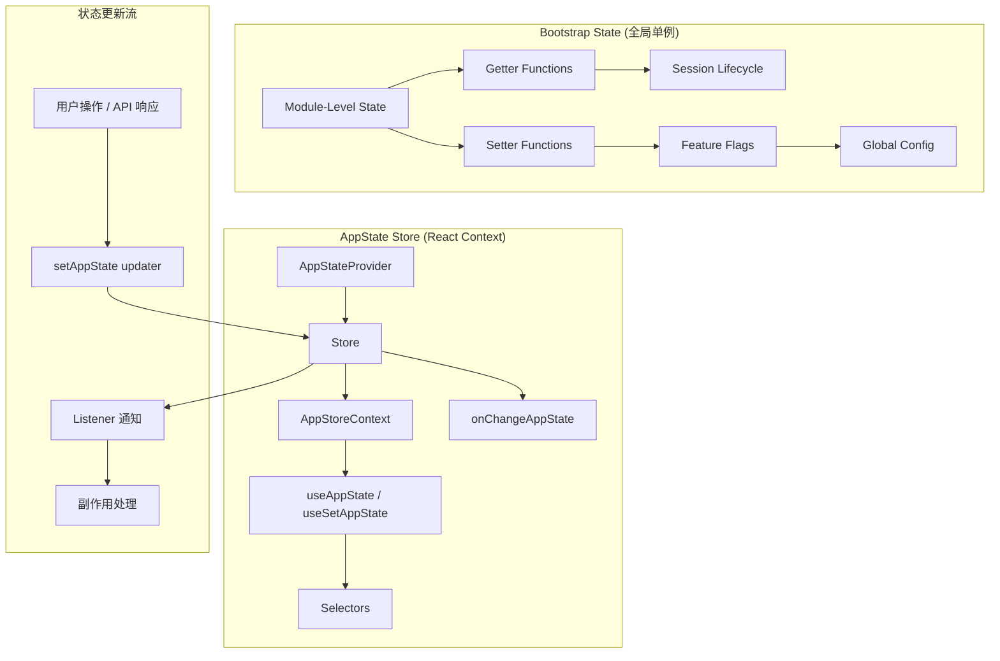

# State Management（状态管理）

> Claude Code 采用**双轨状态架构**：Bootstrap State 作为全局单例管理会话生命周期与全局配置，AppState Store 作为不可变状态管理 UI 与运行时状态。两者通过函数式更新模式、选择器模式和按 Agent 隔离机制，构建了一个高效、可预测、可测试的状态管理体系。

## 模块概述

| 文件 | 行数 | 职责 |
|------|------|------|
| `src/bootstrap/state.ts` | ~1,758 | Bootstrap State — 全局单例、模块级 getter/setter、会话生命周期、Feature Flag 状态 |
| `src/state/AppStateStore.ts` | ~569 | AppState 类型定义、默认状态工厂 |
| `src/state/store.ts` | ~34 | 通用 Store 工厂（类 Zustand 模式） |
| `src/state/AppState.tsx` | ~200 | AppStateProvider React Context、useAppState/useSetAppState Hooks |
| `src/state/selectors.ts` | ~76 | 选择器函数（派生状态计算） |
| `src/state/onChangeAppState.ts` | ~171 | 状态变更副作用处理 |
| `src/state/teammateViewHelpers.ts` | ~100 | Teammate 视图辅助函数 |
| `src/services/api/bootstrap.ts` | ~141 | Bootstrap API 数据获取与持久化 |
| **总计** | **~3,000+** | |

## 双轨状态架构设计

Claude Code 的状态管理采用**双轨架构**，将全局会话状态与 UI 运行时状态分离：

```
Bootstrap State (全局单例, ~1758行)
├── 模块级 getter/setter
├── 会话生命周期管理
├── Feature Flag 状态
└── 全局配置

AppState Store (不可变状态, ~50+字段)
├── DeepImmutable<T> 类型约束
├── 函数式更新 setAppState(prev => ({...prev, ...}))
├── 选择器模式 (selectors)
└── 按 Agent 隔离 (每个 subagent 独立副本)
```

### 架构全景



### 双轨设计原则

| 维度 | Bootstrap State | AppState Store |
|------|-----------------|----------------|
| **作用域** | 全局单例（进程级） | React Context（组件树级） |
| **可变性** | 可变（mutable） | 不可变（DeepImmutable<T>） |
| **更新方式** | 直接赋值 | 函数式更新 `setAppState(prev => next)` |
| **响应式** | 无（主动查询） | 有（useSyncExternalStore） |
| **主要用途** | 会话生命周期、成本追踪、Telemetry | UI 状态、任务管理、权限上下文 |
| **持久化** | 部分持久化（成本、配置） | 通过 onChangeAppState 持久化 |

## Bootstrap State 详解

### 全局单例设计

Bootstrap State 采用**模块级单例**模式，整个进程共享同一状态实例：

```typescript
// src/bootstrap/state.ts

// 状态类型定义 (~100+ 字段)
type State = {
  originalCwd: string
  projectRoot: string
  totalCostUSD: number
  totalAPIDuration: number
  sessionId: SessionId
  // ... 100+ 字段
}

// 初始状态工厂函数
function getInitialState(): State {
  return {
    originalCwd: resolvedCwd,
    projectRoot: resolvedCwd,
    totalCostUSD: 0,
    // ... 所有字段初始化
  }
}

// 全局单例实例 — 模块加载时创建
const STATE: State = getInitialState()
```

**设计特点**：

- **单例保证**：`const STATE` 在模块加载时创建，整个进程生命周期唯一
- **直接可变**：状态字段可直接修改（`STATE.totalCostUSD += cost`）
- **注释警示**：代码中有明确注释 `// DO NOT ADD MORE STATE HERE - BE JUDICIOUS WITH GLOBAL STATE`
- **测试隔离**：提供 `resetStateForTests()` 函数用于测试环境重置

### 模块级 getter/setter

Bootstrap State 通过**显式的 getter/setter 函数**暴露状态访问接口，而非直接导出状态对象：

```typescript
// Getter 模式
export function getSessionId(): SessionId {
  return STATE.sessionId
}

export function getTotalCostUSD(): number {
  return STATE.totalCostUSD
}

export function getProjectRoot(): string {
  return STATE.projectRoot
}

// Setter 模式
export function setProjectRoot(cwd: string): void {
  STATE.projectRoot = cwd.normalize('NFC')
}

export function setMainLoopModelOverride(model: ModelSetting | undefined): void {
  STATE.mainLoopModelOverride = model
}

// 累加器模式（用于计数器类字段）
export function addToTotalCostState(cost: number, modelUsage: ModelUsage, model: string): void {
  STATE.modelUsage[model] = modelUsage
  STATE.totalCostUSD += cost
}

export function addToToolDuration(duration: number): void {
  STATE.totalToolDuration += duration
  STATE.turnToolDurationMs += duration
  STATE.turnToolCount++
}
```

**设计优势**：

- **封装性**：隐藏内部状态结构，外部只能通过函数访问
- **可控性**：setter 函数可以添加验证、日志、副作用
- **可测试性**：可以 mock getter/setter 函数进行单元测试
- **可追踪性**：所有状态访问都有明确的调用点

### 会话生命周期管理

Bootstrap State 管理完整的会话生命周期：

```typescript
// 会话 ID 管理
export function getSessionId(): SessionId {
  return STATE.sessionId
}

export function regenerateSessionId(options: { setCurrentAsParent?: boolean } = {}): SessionId {
  if (options.setCurrentAsParent) {
    STATE.parentSessionId = STATE.sessionId
  }
  STATE.planSlugCache.delete(STATE.sessionId)
  STATE.sessionId = randomUUID() as SessionId
  STATE.sessionProjectDir = null
  return STATE.sessionId
}

// 原子切换会话 — sessionId 和 sessionProjectDir 始终同步变更
export function switchSession(sessionId: SessionId, projectDir: string | null = null): void {
  STATE.planSlugCache.delete(STATE.sessionId)
  STATE.sessionId = sessionId
  STATE.sessionProjectDir = projectDir
  sessionSwitched.emit(sessionId)
}

// 会话切换信号 — 供外部订阅
const sessionSwitched = createSignal<[id: SessionId]>()
export const onSessionSwitch = sessionSwitched.subscribe
```

**会话状态字段**：

| 字段 | 类型 | 说明 |
|------|------|------|
| `sessionId` | `SessionId` | 当前会话唯一 ID |
| `parentSessionId` | `SessionId \| undefined` | 父会话 ID（用于会话 lineage 追踪） |
| `sessionProjectDir` | `string \| null` | 会话转录文件所在目录 |
| `startTime` | `number` | 会话启动时间戳 |
| `lastInteractionTime` | `number` | 最后一次交互时间戳 |

### Feature Flag 状态

Bootstrap State 管理多种 Feature Flag 和运行时配置：

```typescript
// Feature Flag 相关字段
type State = {
  // 严格工具结果配对（HFI 模式）
  strictToolResultPairing: boolean
  
  // Kairos 模式（Assistant 模式）
  kairosActive: boolean
  
  // 计划模式退出标记
  hasExitedPlanMode: boolean
  needsPlanModeExitAttachment: boolean
  
  // 定时任务启用状态
  scheduledTasksEnabled: boolean
  
  // 会话权限绕过模式
  sessionBypassPermissionsMode: boolean
  
  // 会话信任接受标记
  sessionTrustAccepted: boolean
  
  // Beta 功能头标记（Sticky-on latch 模式）
  afkModeHeaderLatched: boolean | null
  fastModeHeaderLatched: boolean | null
  cacheEditingHeaderLatched: boolean | null
  thinkingClearLatched: boolean | null
}
```

**Sticky-on Latch 模式**：

某些 Beta 功能一旦激活就会**保持激活状态**，以防止 prompt cache 失效：

```typescript
// Sticky-on latch 设计 — 一旦激活就不再关闭
// 避免 mid-session 切换导致 ~50-70K token 的 prompt cache 失效
export function setAfkModeHeaderLatched(v: boolean): void {
  STATE.afkModeHeaderLatched = v
}

// 重置仅在 /clear 和 /compact 时发生
export function clearBetaHeaderLatches(): void {
  STATE.afkModeHeaderLatched = null
  STATE.fastModeHeaderLatched = null
  STATE.cacheEditingHeaderLatched = null
  STATE.thinkingClearLatched = null
}
```

### 全局配置

Bootstrap State 管理全局配置和 Telemetry 状态：

```typescript
// Telemetry 状态
type State = {
  meter: Meter | null
  sessionCounter: AttributedCounter | null
  locCounter: AttributedCounter | null
  prCounter: AttributedCounter | null
  commitCounter: AttributedCounter | null
  costCounter: AttributedCounter | null
  tokenCounter: AttributedCounter | null
  statsStore: { observe(name: string, value: number): void } | null
}

// Telemetry 初始化
export function setMeter(
  meter: Meter,
  createCounter: (name: string, options: MetricOptions) => AttributedCounter,
): void {
  STATE.meter = meter
  STATE.sessionCounter = createCounter('claude_code.session.count', { ... })
  STATE.locCounter = createCounter('claude_code.lines_of_code.count', { ... })
  // ... 其他计数器
}
```

### 成本与时长追踪

```typescript
// 成本追踪
export function addToTotalCostState(cost: number, modelUsage: ModelUsage, model: string): void {
  STATE.modelUsage[model] = modelUsage
  STATE.totalCostUSD += cost
}

export function getTotalCostUSD(): number {
  return STATE.totalCostUSD
}

// 时长追踪
export function getTotalDuration(): number {
  return Date.now() - STATE.startTime
}

export function getTotalAPIDuration(): number {
  return STATE.totalAPIDuration
}

// Token 预算追踪
let outputTokensAtTurnStart = 0
let currentTurnTokenBudget: number | null = null
let budgetContinuationCount = 0

export function snapshotOutputTokensForTurn(budget: number | null): void {
  outputTokensAtTurnStart = getTotalOutputTokens()
  currentTurnTokenBudget = budget
  budgetContinuationCount = 0
}

export function getTurnOutputTokens(): number {
  return getTotalOutputTokens() - outputTokensAtTurnStart
}
```

### 交互时间优化

Bootstrap State 实现了**延迟刷新**的交互时间更新机制，避免频繁调用 `Date.now()`：

```typescript
// 延迟刷新模式 — 避免每次按键都调用 Date.now()
let interactionTimeDirty = false

export function updateLastInteractionTime(immediate?: boolean): void {
  if (immediate) {
    flushInteractionTime_inner()
  } else {
    interactionTimeDirty = true  // 标记为"脏"，等待下次渲染时批量刷新
  }
}

// 在 Ink 渲染周期前调用 — 批量刷新
export function flushInteractionTime(): void {
  if (interactionTimeDirty) {
    flushInteractionTime_inner()
  }
}

function flushInteractionTime_inner(): void {
  STATE.lastInteractionTime = Date.now()
  interactionTimeDirty = false
}
```

### 滚动节流优化

```typescript
// 滚动节流 — 防止后台任务与滚动帧竞争事件循环
let scrollDraining = false
let scrollDrainTimer: ReturnType<typeof setTimeout> | undefined
const SCROLL_DRAIN_IDLE_MS = 150

export function markScrollActivity(): void {
  scrollDraining = true
  if (scrollDrainTimer) clearTimeout(scrollDrainTimer)
  scrollDrainTimer = setTimeout(() => {
    scrollDraining = false
    scrollDrainTimer = undefined
  }, SCROLL_DRAIN_IDLE_MS)
  scrollDrainTimer.unref?.()
}

export function getIsScrollDraining(): boolean {
  return scrollDraining
}

// 等待滚动空闲后再执行昂贵操作
export async function waitForScrollIdle(): Promise<void> {
  while (scrollDraining) {
    await new Promise(r => setTimeout(r, SCROLL_DRAIN_IDLE_MS).unref?.())
  }
}
```

## AppState Store 详解

### DeepImmutable 类型约束

AppState 使用 `DeepImmutable<T>` 类型约束确保状态不可变性：

```typescript
// src/state/AppStateStore.ts

// DeepImmutable<T> 类型约束 — 确保状态深度不可变
export type AppState = DeepImmutable<{
  settings: SettingsJson
  verbose: boolean
  mainLoopModel: ModelSetting
  toolPermissionContext: ToolPermissionContext
  tasks: { [taskId: string]: TaskState }
  mcp: {
    clients: MCPServerConnection[]
    tools: Tool[]
    commands: Command[]
    resources: Record<string, ServerResource[]>
  }
  // ... 50+ 字段
}> & {
  // 以下字段排除在 DeepImmutable 之外（包含函数类型）
  tasks: { [taskId: string]: TaskState }
  agentNameRegistry: Map<string, AgentId>
  // ... 其他可变字段
}
```

**设计说明**：

- `DeepImmutable<T>` 确保状态对象及其嵌套属性都是只读的
- `tasks` 等字段因包含函数类型（`TaskState` 中有回调函数）而排除在 `DeepImmutable` 之外
- 通过 TypeScript 类型系统在编译期捕获非法的状态修改

### Store 工厂（类 Zustand 模式）

Claude Code 实现了一个轻量级的 Store 工厂，模式类似于 Zustand：

```typescript
// src/state/store.ts

type Listener = () => void
type OnChange<T> = (args: { newState: T; oldState: T }) => void

export type Store<T> = {
  getState: () => T
  setState: (updater: (prev: T) => T) => void
  subscribe: (listener: Listener) => () => void
}

export function createStore<T>(initialState: T, onChange?: OnChange<T>): Store<T> {
  let state = initialState
  const listeners = new Set<Listener>()

  return {
    getState: () => state,

    setState: (updater: (prev: T) => T) => {
      const prev = state
      const next = updater(prev)
      if (Object.is(next, prev)) return  // 引用相等则跳过更新
      state = next
      onChange?.({ newState: next, oldState: prev })
      for (const listener of listeners) listener()
    },

    subscribe: (listener: Listener) => {
      listeners.add(listener)
      return () => listeners.delete(listener)  // 返回取消订阅函数
    },
  }
}
```

**核心设计**：

- **函数式更新**：`setState` 接收 `updater` 函数而非直接的值
- **引用优化**：`Object.is(next, prev)` 比较，避免不必要的更新
- **变更通知**：`onChange` 回调用于处理副作用
- **订阅模式**：标准的 `subscribe/unsubscribe` 模式

### AppStateProvider React Context

```typescript
// src/state/AppState.tsx

export const AppStoreContext = React.createContext<AppStateStore | null>(null)

export function AppStateProvider({ children, initialState, onChangeAppState }: Props) {
  const hasAppStateContext = useContext(HasAppStateContext)
  if (hasAppStateContext) {
    throw new Error("AppStateProvider can not be nested within another AppStateProvider")
  }

  // 创建 Store 实例（仅一次）
  const [store] = useState(() => createStore(initialState ?? getDefaultAppState(), onChangeAppState))

  // 挂载时检查 bypass permissions mode
  useEffect(() => {
    const { toolPermissionContext } = store.getState()
    if (toolPermissionContext.isBypassPermissionsModeAvailable && isBypassPermissionsModeDisabled()) {
      store.setState(prev => ({
        ...prev,
        toolPermissionContext: createDisabledBypassPermissionsContext(prev.toolPermissionContext)
      }))
    }
  }, [])

  // 设置变更监听
  const onSettingsChange = useEffectEvent(source => applySettingsChange(source, store.setState))
  useSettingsChange(onSettingsChange)

  return (
    <HasAppStateContext.Provider value={true}>
      <AppStoreContext.Provider value={store}>
        <MailboxProvider>
          <VoiceProvider>{children}</VoiceProvider>
        </MailboxProvider>
      </AppStoreContext.Provider>
    </HasAppStateContext.Provider>
  )
}
```

### Hooks API

```typescript
// 订阅状态切片 — 仅在选择值变化时重新渲染
export function useAppState<T>(selector: (state: AppState) => T): T {
  const store = useAppStore()
  const get = () => {
    const state = store.getState()
    return selector(state)
  }
  return useSyncExternalStore(store.subscribe, get, get)
}

// 获取 setAppState 更新器 — 不订阅任何状态
export function useSetAppState(): (updater: (prev: AppState) => AppState) => void {
  return useAppStore().setState
}

// 获取完整 Store — 用于传递给非 React 代码
export function useAppStateStore(): AppStateStore {
  return useAppStore()
}

// 安全版本 — 在 Provider 外部调用时返回 undefined
export function useAppStateMaybeOutsideOfProvider<T>(
  selector: (state: AppState) => T
): T | undefined {
  const store = useContext(AppStoreContext)
  const get = () => store ? selector(store.getState()) : undefined
  return useSyncExternalStore(
    store ? store.subscribe : NOOP_SUBSCRIBE,
    get
  )
}
```

**使用示例**：

```typescript
// 订阅单个字段 — 仅在该字段变化时重新渲染
const verbose = useAppState(s => s.verbose)
const model = useAppState(s => s.mainLoopModel)

// 获取更新器 — 不会因状态变化而重新渲染
const setAppState = useSetAppState()

// 更新状态 — 函数式更新模式
setAppState(prev => ({
  ...prev,
  verbose: !prev.verbose,
}))

// 选择子对象引用 — 避免创建新对象导致无效渲染
const { text, promptId } = useAppState(s => s.promptSuggestion)  // ✅ 正确
const suggestion = useAppState(s => ({ text: s.promptSuggestion.text }))  // ❌ 错误 — 每次都是新对象
```

### 选择器模式（Selectors）

```typescript
// src/state/selectors.ts

/**
 * 获取当前查看的 teammate 任务（如果有的话）
 */
export function getViewedTeammateTask(
  appState: Pick<AppState, 'viewingAgentTaskId' | 'tasks'>,
): InProcessTeammateTaskState | undefined {
  const { viewingAgentTaskId, tasks } = appState

  if (!viewingAgentTaskId) return undefined

  const task = tasks[viewingAgentTaskId]
  if (!task) return undefined
  if (!isInProcessTeammateTask(task)) return undefined

  return task
}

/**
 * 确定用户输入应该路由到哪个 Agent
 */
export type ActiveAgentForInput =
  | { type: 'leader' }
  | { type: 'viewed'; task: InProcessTeammateTaskState }
  | { type: 'named_agent'; task: LocalAgentTaskState }

export function getActiveAgentForInput(appState: AppState): ActiveAgentForInput {
  const viewedTask = getViewedTeammateTask(appState)
  if (viewedTask) {
    return { type: 'viewed', task: viewedTask }
  }

  const { viewingAgentTaskId, tasks } = appState
  if (viewingAgentTaskId) {
    const task = tasks[viewingAgentTaskId]
    if (task?.type === 'local_agent') {
      return { type: 'named_agent', task }
    }
  }

  return { type: 'leader' }
}
```

**选择器设计原则**：

- **纯函数**：无副作用，仅做数据提取
- **类型安全**：使用 `Pick<AppState, ...>` 限制所需的最小状态子集
- **判别联合**：返回判别联合类型（discriminated union）支持类型安全的输入路由

## 状态更新模式

### 函数式更新

所有 AppState 更新都使用函数式更新模式：

```typescript
// 基本模式
setAppState(prev => ({
  ...prev,
  fieldToUpdate: newValue,
}))

// 嵌套对象更新
setAppState(prev => ({
  ...prev,
  toolPermissionContext: {
    ...prev.toolPermissionContext,
    mode: newMode,
  },
}))

// 数组更新
setAppState(prev => ({
  ...prev,
  mcp: {
    ...prev.mcp,
    clients: prev.mcp.clients.filter(c => c.id !== removedId),
  },
}))

// 条件更新
setAppState(prev => ({
  ...prev,
  ...(condition ? { optionalField: value } : {}),
}))
```

### 状态变更副作用（onChangeAppState）

`onChangeAppState` 是状态变更的**单一副作用处理点**：

```typescript
// src/state/onChangeAppState.ts

export function onChangeAppState({ newState, oldState }: {
  newState: AppState
  oldState: AppState
}) {
  // 1. 权限模式变更 — 通知 CCR 和 SDK
  const prevMode = oldState.toolPermissionContext.mode
  const newMode = newState.toolPermissionContext.mode
  if (prevMode !== newMode) {
    const prevExternal = toExternalPermissionMode(prevMode)
    const newExternal = toExternalPermissionMode(newMode)
    if (prevExternal !== newExternal) {
      notifySessionMetadataChanged({
        permission_mode: newExternal,
        is_ultraplan_mode: /* ... */,
      })
    }
    notifyPermissionModeChanged(newMode)
  }

  // 2. Model 变更 — 同步到 settings
  if (newState.mainLoopModel !== oldState.mainLoopModel) {
    if (newState.mainLoopModel === null) {
      updateSettingsForSource('userSettings', { model: undefined })
      setMainLoopModelOverride(null)
    } else {
      updateSettingsForSource('userSettings', { model: newState.mainLoopModel })
      setMainLoopModelOverride(newState.mainLoopModel)
    }
  }

  // 3. 视图状态持久化
  if (newState.expandedView !== oldState.expandedView) {
    saveGlobalConfig(current => ({
      ...current,
      showExpandedTodos: newState.expandedView === 'tasks',
      showSpinnerTree: newState.expandedView === 'teammates',
    }))
  }

  // 4. 设置变更 — 清除认证相关缓存
  if (newState.settings !== oldState.settings) {
    clearApiKeyHelperCache()
    clearAwsCredentialsCache()
    clearGcpCredentialsCache()
    if (newState.settings.env !== oldState.settings.env) {
      applyConfigEnvironmentVariables()
    }
  }
}
```

**设计优势**：

- **单一职责**：所有副作用集中在一个函数中
- **差异检测**：通过 `newState` vs `oldState` 比较，仅在实际变更时触发
- **可追踪性**：所有状态变更的副作用都有明确的调用点

## 状态持久化与恢复

### Bootstrap State 持久化

```typescript
// 成本状态恢复
export function setCostStateForRestore({
  totalCostUSD,
  totalAPIDuration,
  totalAPIDurationWithoutRetries,
  totalToolDuration,
  totalLinesAdded,
  totalLinesRemoved,
  lastDuration,
  modelUsage,
}: { ... }): void {
  STATE.totalCostUSD = totalCostUSD
  STATE.totalAPIDuration = totalAPIDuration
  // ... 恢复所有字段

  // 调整 startTime 使 wall duration 累积
  if (lastDuration) {
    STATE.startTime = Date.now() - lastDuration
  }
}

// 成本状态重置
export function resetCostState(): void {
  STATE.totalCostUSD = 0
  STATE.totalAPIDuration = 0
  STATE.totalAPIDurationWithoutRetries = 0
  STATE.totalToolDuration = 0
  STATE.startTime = Date.now()
  STATE.totalLinesAdded = 0
  STATE.totalLinesRemoved = 0
  STATE.hasUnknownModelCost = false
  STATE.modelUsage = {}
  STATE.promptId = null
}
```

### Bootstrap API 数据持久化

```typescript
// src/services/api/bootstrap.ts

export async function fetchBootstrapData(): Promise<void> {
  try {
    const response = await fetchBootstrapAPI()
    if (!response) return

    const clientData = response.client_data ?? null
    const additionalModelOptions = response.additional_model_options ?? []

    // 仅在数据实际变更时持久化 — 避免每次启动都写入配置
    const config = getGlobalConfig()
    if (
      isEqual(config.clientDataCache, clientData) &&
      isEqual(config.additionalModelOptionsCache, additionalModelOptions)
    ) {
      logForDebugging('[Bootstrap] Cache unchanged, skipping write')
      return
    }

    logForDebugging('[Bootstrap] Cache updated, persisting to disk')
    saveGlobalConfig(current => ({
      ...current,
      clientDataCache: clientData,
      additionalModelOptionsCache: additionalModelOptions,
    }))
  } catch (error) {
    logError(error)
  }
}
```

### AppState 持久化

AppState 通过 `onChangeAppState` 实现选择性持久化：

```typescript
// 视图状态持久化
if (newState.expandedView !== oldState.expandedView) {
  saveGlobalConfig(current => ({
    ...current,
    showExpandedTodos: newState.expandedView === 'tasks',
    showSpinnerTree: newState.expandedView === 'teammates',
  }))
}

// verbose 状态持久化
if (newState.verbose !== oldState.verbose) {
  saveGlobalConfig(current => ({ ...current, verbose: newState.verbose }))
}

// tungstenPanelVisible 持久化（ant-only）
if (newState.tungstenPanelVisible !== oldState.tungstenPanelVisible) {
  saveGlobalConfig(current => ({ ...current, tungstenPanelVisible }))
}
```

## 子 Agent 状态隔离

### 按 Agent 隔离设计

每个 Subagent/Teammate 拥有独立的状态副本，避免状态污染：

```typescript
// AppState 中的 Agent 隔离字段
type AppState = {
  // 任务状态 — 按 taskId 隔离
  tasks: { [taskId: string]: TaskState }

  // Agent 名称注册表 — 按 name 路由
  agentNameRegistry: Map<string, AgentId>

  // 当前查看的 Agent 任务 ID
  viewingAgentTaskId?: string

  // 前置任务 ID — 其消息显示在主视图中
  foregroundedTaskId?: string

  // Team 上下文 — 按 team 隔离
  teamContext?: {
    teamName: string
    leadAgentId: string
    selfAgentId?: string
    teammates: { [teammateId: string]: { ... } }
  }

  // 收件箱 — 按 Agent 隔离消息
  inbox: {
    messages: Array<{
      id: string
      from: string
      text: string
      timestamp: string
      status: 'pending' | 'processing' | 'processed'
    }>
  }

  // Todo 列表 — 按 agentId 隔离
  todos: { [agentId: string]: TodoList }
}
```

### TaskState 隔离

每个任务（Task）拥有独立的状态树：

```typescript
// 任务状态更新示例
export function updateTaskState(
  taskId: string,
  setAppState: (updater: (prev: AppState) => AppState) => void,
  updater: (prev: TaskState) => TaskState,
): void {
  setAppState(prev => ({
    ...prev,
    tasks: {
      ...prev.tasks,
      [taskId]: updater(prev.tasks[taskId]),
    },
  }))
}

// 注册新任务
export function registerTask(task: TaskState, setAppState: SetAppState): void {
  setAppState(prev => ({
    ...prev,
    tasks: {
      ...prev.tasks,
      [task.id]: task,
    },
  }))
}

// 驱逐终止任务
export function evictTerminalTask(
  taskId: string,
  setAppState: SetAppState,
): void {
  setAppState(prev => {
    const task = prev.tasks[taskId]
    if (!task || !isTerminal(task)) return prev
    const { [taskId]: _, ...remaining } = prev.tasks
    return { ...prev, tasks: remaining }
  })
}
```

### Swarm Teammate 状态隔离

```typescript
// src/utils/swarm/reconnection.ts

// 初始化 teamContext
export function initializeTeamContext(
  setAppState: (updater: (prev: AppState) => AppState) => void,
  teamConfig: TeamConfig,
): void {
  setAppState(prev => ({
    ...prev,
    teamContext: {
      teamName: teamConfig.name,
      teamFilePath: teamConfig.filePath,
      leadAgentId: teamConfig.leadAgentId,
      selfAgentId: teamConfig.selfAgentId,
      selfAgentName: teamConfig.selfAgentName,
      isLeader: teamConfig.isLeader,
      selfAgentColor: teamConfig.selfAgentColor,
      teammates: {},
    },
  }))
}
```

### 输入路由隔离

通过选择器实现安全的输入路由：

```typescript
// 根据当前视图状态确定输入目标
const activeAgent = getActiveAgentForInput(appState)

switch (activeAgent.type) {
  case 'leader':
    // 输入发送到 leader agent
    break
  case 'viewed':
    // 输入发送到当前查看的 teammate
    break
  case 'named_agent':
    // 输入发送到指定名称的 agent
    break
}
```

## 状态字段完整索引

### Bootstrap State 字段分类

| 分类 | 字段 | 说明 |
|------|------|------|
| **会话标识** | `sessionId`, `parentSessionId`, `sessionProjectDir` | 会话 ID、父会话 ID、项目目录 |
| **路径状态** | `originalCwd`, `projectRoot`, `cwd` | 原始工作目录、项目根目录、当前目录 |
| **成本追踪** | `totalCostUSD`, `modelUsage`, `hasUnknownModelCost` | 总成本、按模型用量、未知成本标记 |
| **时长追踪** | `totalAPIDuration`, `totalToolDuration`, `startTime` | API 总时长、工具总时长、启动时间 |
| **Turn 统计** | `turnHookDurationMs`, `turnToolDurationMs`, `turnToolCount` | Turn 级 Hook/工具时长和计数 |
| **代码变更** | `totalLinesAdded`, `totalLinesRemoved` | 总新增/删除行数 |
| **Model 状态** | `mainLoopModelOverride`, `initialMainLoopModel`, `modelStrings` | Model 覆盖、初始 Model、Model 字符串 |
| **Feature Flags** | `kairosActive`, `strictToolResultPairing`, `scheduledTasksEnabled` | 各种功能开关 |
| **Beta Latches** | `afkModeHeaderLatched`, `fastModeHeaderLatched`, `cacheEditingHeaderLatched` | Sticky-on Beta 标记 |
| **Telemetry** | `meter`, `sessionCounter`, `costCounter`, `tokenCounter` | OpenTelemetry 指标 |
| **认证状态** | `sessionIngressToken`, `oauthTokenFromFd`, `apiKeyFromFd` | 各种认证令牌 |
| **插件状态** | `inlinePlugins`, `useCoworkPlugins` | 会话插件、cowork 插件标记 |
| **权限状态** | `sessionBypassPermissionsMode`, `sessionTrustAccepted` | 权限绕过、信任接受 |
| **计划模式** | `hasExitedPlanMode`, `needsPlanModeExitAttachment` | 计划模式退出标记 |
| **API 状态** | `lastAPIRequest`, `lastAPIRequestMessages`, `lastMainRequestId` | 最近 API 请求 |
| **错误日志** | `inMemoryErrorLog` | 内存错误日志（最多 100 条） |
| **技能追踪** | `invokedSkills` | 已调用技能（按 compaction 保留） |
| **慢操作** | `slowOperations` | 慢操作追踪（dev bar 显示） |
| **远程模式** | `isRemoteMode`, `directConnectServerUrl` | 远程模式标记、直连服务器 URL |
| **Prompt 缓存** | `promptCache1hAllowlist`, `promptCache1hEligible` | 1h Prompt 缓存白名单 |
| **Compaction** | `pendingPostCompaction` | Compaction 后标记 |

### AppState 字段分类

| 分类 | 字段 | 说明 |
|------|------|------|
| **设置** | `settings` | 用户/项目设置 |
| **Model** | `mainLoopModel`, `mainLoopModelForSession` | 主循环 Model |
| **视图状态** | `expandedView`, `isBriefOnly`, `verbose` | 视图展开、简要模式、详细模式 |
| **权限** | `toolPermissionContext` | 工具权限上下文 |
| **任务** | `tasks`, `foregroundedTaskId`, `viewingAgentTaskId` | 任务状态、前置任务、查看的 Agent |
| **MCP** | `mcp.clients`, `mcp.tools`, `mcp.commands`, `mcp.resources` | MCP 服务器连接、工具、命令、资源 |
| **插件** | `plugins.enabled`, `plugins.disabled`, `plugins.errors` | 启用/禁用插件、错误 |
| **通知** | `notifications.current`, `notifications.queue` | 当前通知、通知队列 |
| **远程** | `remoteSessionUrl`, `remoteConnectionStatus`, `remoteBackgroundTaskCount` | 远程会话 URL、连接状态、后台任务数 |
| **Bridge** | `replBridgeEnabled`, `replBridgeConnected`, `replBridgeSessionActive` | REPL Bridge 状态 |
| **Agent** | `agent`, `agentDefinitions`, `agentNameRegistry` | Agent 名称、定义、注册表 |
| **Team** | `teamContext` | Swarm 团队上下文 |
| **收件箱** | `inbox.messages` | Agent 间消息 |
| **Todo** | `todos` | 按 Agent 隔离的 Todo 列表 |
| **Prompt** | `promptSuggestion`, `promptSuggestionEnabled` | Prompt 建议 |
| **推测** | `speculation`, `speculationSessionTimeSavedMs` | 推测执行状态 |
| **文件历史** | `fileHistory` | 文件快照历史 |
| **认证** | `attribution`, `authVersion` | 提交归属、认证版本 |
| **Tungsten** | `tungstenPanelVisible`, `tungstenPanelAutoHidden` | Tmux 面板状态 |
| **Bagel** | `bagelActive`, `bagelUrl`, `bagelPanelVisible` | WebBrowser 工具状态 |
| **Ultraplan** | `ultraplanLaunching`, `ultraplanSessionUrl`, `isUltraplanMode` | Ultraplan 模式 |
| **Overlay** | `activeOverlays` | 活动覆盖层（Select 对话框等） |
| **Hooks** | `sessionHooks` | 会话 Hooks 状态 |

## 文件索引表格

### Bootstrap State 核心

| 文件 | 行数 | 职责 |
|------|------|------|
| `src/bootstrap/state.ts` | ~1,758 | 全局单例状态、getter/setter、会话生命周期、Feature Flag、成本追踪 |
| `src/services/api/bootstrap.ts` | ~141 | Bootstrap API 数据获取、OAuth/API Key 认证、磁盘缓存持久化 |

### AppState Store 核心

| 文件 | 行数 | 职责 |
|------|------|------|
| `src/state/AppStateStore.ts` | ~569 | AppState 类型定义、DeepImmutable 约束、默认状态工厂 |
| `src/state/store.ts` | ~34 | 通用 Store 工厂（getState/setState/subscribe） |
| `src/state/AppState.tsx` | ~200 | AppStateProvider、useAppState/useSetAppState Hooks、React Context |
| `src/state/selectors.ts` | ~76 | 选择器函数（派生状态计算、输入路由） |
| `src/state/onChangeAppState.ts` | ~171 | 状态变更副作用处理（模式同步、设置持久化、缓存清理） |
| `src/state/teammateViewHelpers.ts` | ~100 | Teammate 视图辅助函数 |

### 状态相关工具

| 文件 | 行数 | 职责 |
|------|------|------|
| `src/utils/settings/settings.ts` | ~300+ | 设置管理（与 AppState.settings 联动） |
| `src/utils/config.ts` | ~100+ | 全局配置持久化（与 onChangeAppState 联动） |
| `src/utils/cost-tracker.ts` | ~200+ | 成本追踪（与 Bootstrap State 联动） |
| `src/tasks/types.ts` | ~100+ | TaskState 类型定义 |
| `src/tasks/framework.ts` | ~300+ | 任务框架（registerTask/updateTaskState/evictTerminalTask） |

## 设计模式总结

### 1. 双轨状态架构

- **Bootstrap State**：全局单例，可变状态，模块级 getter/setter
- **AppState Store**：React Context，不可变状态，函数式更新

### 2. 不可变性保证

- `DeepImmutable<T>` 类型约束
- 函数式更新模式：`setAppState(prev => ({...prev, ...}))`
- `Object.is` 引用比较优化

### 3. 响应式订阅

- `useSyncExternalStore` 实现高效订阅
- 选择器模式避免不必要的重新渲染
- `useSetAppState` 返回稳定引用

### 4. 副作用集中化

- `onChangeAppState` 作为单一副作用处理点
- 差异检测（newState vs oldState）
- 按需持久化

### 5. Agent 隔离

- 按 taskId 隔离任务状态
- 按 agentId 隔离 Todo 列表
- 按 team 隔离 Swarm 上下文

### 6. 性能优化

- 延迟刷新（交互时间、滚动节流）
- Sticky-on Latch（Beta 功能头标记）
- 引用稳定性（EMPTY_SLOW_OPERATIONS）
