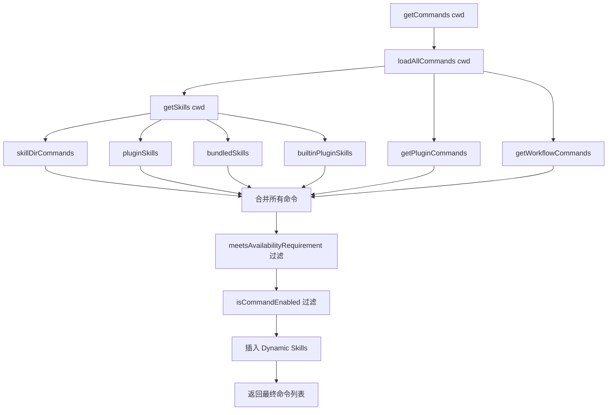
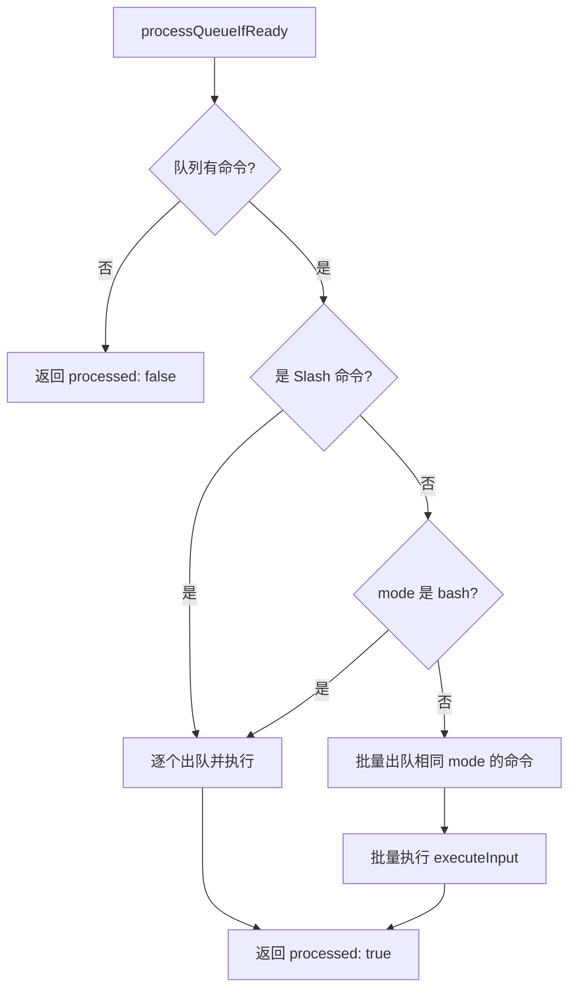
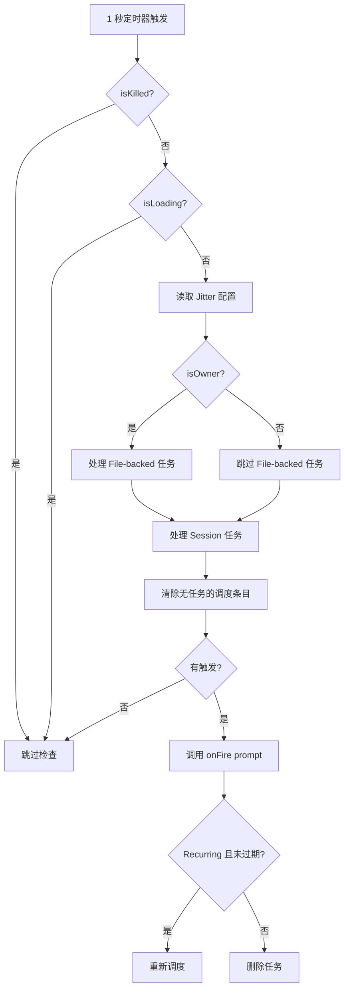
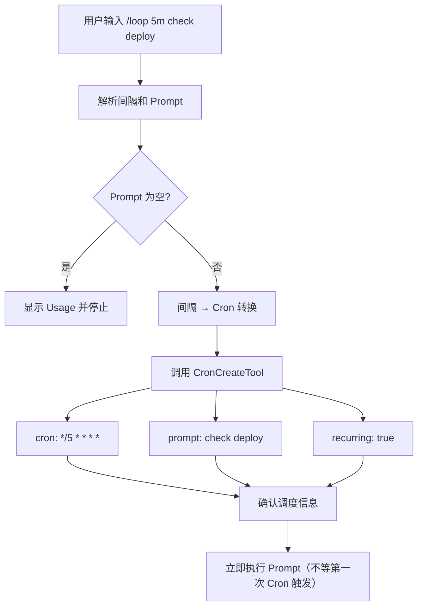

# 11. Commands System（命令系统）

## 1. 模块概述

Claude Code 的命令系统是一个多层次、可扩展的架构，涵盖 Slash Command（斜杠命令）、消息队列（Message Queue）、Cron 调度（Cron Scheduler）和 Loop 技能（Loop Skill）四大核心子系统。

### 文件清单

| 文件路径 | 行数 | 职责 |
|---------|------|------|
| `src/commands.ts` | 754 | 命令注册中心，聚合所有 Built-in、Skill、Plugin、Workflow 命令 |
| `src/types/command.ts` | 216 | Command 类型定义（PromptCommand、LocalCommand、LocalJSXCommand） |
| `src/utils/messageQueueManager.ts` | 547 | 消息队列管理器，优先级队列、批量处理、Agent 路由 |
| `src/utils/queueProcessor.ts` | 95 | 队列处理器，Slash 命令检测与路由 |
| `src/utils/cron.ts` | 308 | Cron 表达式解析与人类可读转换 |
| `src/utils/cronScheduler.ts` | 565 | Cron 调度器核心，文件监听、锁机制、Missed 任务处理 |
| `src/utils/cronTasks.ts` | 458 | 任务持久化（scheduled_tasks.json）、Jitter 防雪崩 |
| `src/utils/cronTasksLock.ts` | - | 调度器锁，防止多 Session 重复触发 |
| `src/utils/cronJitterConfig.ts` | - | GrowthBook 动态 Jitter 配置 |
| `src/skills/bundled/loop.ts` | 92 | Loop 技能，自然语言间隔解析与 Cron 转换 |
| `src/skills/bundled/index.ts` | 79 | Bundled Skills 初始化入口 |
| `src/utils/commandLifecycle.ts` | 21 | 命令生命周期通知（started/completed） |

### 核心职责

```
命令系统
├── Slash Command 系统
│   ├── 命令定义与类型（Prompt / Local / Local-JSX）
│   ├── 命令注册（Built-in / Skill / Plugin / Workflow）
│   ├── 命令路由（findCommand / getCommand）
│   └── 可用性过滤（Availability / Feature Flag）
├── 消息队列系统
│   ├── 优先级队列（now > next > later）
│   ├── 批量处理（相同 mode 批量出队）
│   ├── Agent 路由（agentId 寻址）
│   └── 可编辑模式管理
├── Cron 调度系统
│   ├── Cron 表达式解析（5 字段标准格式）
│   ├── 任务持久化（scheduled_tasks.json）
│   ├── Jitter 防雪崩机制
│   └── Missed 任务检测与恢复
└── Loop 技能
    ├── 自然语言间隔解析
    ├── 间隔 → Cron 转换
    └── 立即执行 + 周期调度
```

---

## 2. Slash Command 系统

### 2.1 命令类型定义

Claude Code 的 Slash Command 系统基于三种命令类型：

```typescript
// src/types/command.ts

// 类型 1: PromptCommand — 展开为文本发送给模型
type PromptCommand = {
  type: 'prompt'
  progressMessage: string          // 执行中显示的进度消息
  contentLength: number            // 命令内容长度（用于 Token 估算）
  source: SettingSource | 'builtin' | 'mcp' | 'plugin' | 'bundled'
  context?: 'inline' | 'fork'      // 执行上下文：内联 或 子 Agent
  agent?: string                   // fork 时使用的 Agent 类型
  paths?: string[]                 // 文件路径匹配（仅在模型触及相关文件后可见）
  getPromptForCommand(args: string, context: ToolUseContext): Promise<ContentBlockParam[]>
}

// 类型 2: LocalCommand — 本地执行，无 UI
type LocalCommand = {
  type: 'local'
  supportsNonInteractive: boolean
  load: () => Promise<LocalCommandModule>  // 懒加载
}

// 类型 3: LocalJSXCommand — 本地执行，带 Ink UI
type LocalJSXCommand = {
  type: 'local-jsx'
  load: () => Promise<LocalJSXCommandModule>  // 懒加载
}

// 联合类型
type Command = CommandBase & (PromptCommand | LocalCommand | LocalJSXCommand)
```

### 2.2 CommandBase 核心属性

```typescript
type CommandBase = {
  name: string                        // 命令名称
  aliases?: string[]                  // 别名
  description: string                 // 描述
  argumentHint?: string               // 参数提示（在 typeahead 中灰色显示）
  whenToUse?: string                  // 使用场景（来自 Skill 规范）
  isEnabled?: () => boolean           // 动态启用检查（Feature Flag 等）
  isHidden?: boolean                  // 是否在 typeahead/help 中隐藏
  availability?: CommandAvailability[] // 可用性限制（'claude-ai' | 'console'）
  loadedFrom?: 'commands_DEPRECATED' | 'skills' | 'plugin' | 'managed' | 'bundled' | 'mcp'
  kind?: 'workflow'                   // 区分 Workflow 支持的命令
  immediate?: boolean                 // 立即执行（绕过队列）
  isSensitive?: boolean               // 参数在对话历史中被脱敏
  disableModelInvocation?: boolean    // 禁止模型调用
  userInvocable?: boolean             // 用户可通过 /命令名 调用
}
```

### 2.3 命令注册架构

```typescript
// src/commands.ts — 命令注册中心

// 命令来源（按优先级排列）
const COMMANDS = memoize((): Command[] => [
  // 1. Built-in 命令（核心功能）
  addDir, advisor, agents, branch, btw, chrome, clear, color, compact,
  config, copy, desktop, context, cost, diff, doctor, effort, exit,
  fast, files, help, ide, init, mcp, memory, model, plugin, plan,
  permissions, privacySettings, hooks, session, skills, stats, status,
  theme, vim, feedback, review, securityReview, tasks, ...

  // 2. 条件加载的命令（Feature Flag 控制）
  ...(proactive ? [proactive] : []),           // PROACTIVE / KAIROS
  ...(briefCommand ? [briefCommand] : []),     // KAIROS / KAIROS_BRIEF
  ...(assistantCommand ? [assistantCommand] : []), // KAIROS
  ...(bridge ? [bridge] : []),                 // BRIDGE_MODE
  ...(voiceCommand ? [voiceCommand] : []),     // VOICE_MODE
  ...(forkCmd ? [forkCmd] : []),               // FORK_SUBAGENT
  ...(workflowsCmd ? [workflowsCmd] : []),     // WORKFLOW_SCRIPTS
  ...(torch ? [torch] : []),                   // TORCH
  ...(peersCmd ? [peersCmd] : []),             // UDS_INBOX

  // 3. 内部命令（仅 Ant 环境）
  ...(process.env.USER_TYPE === 'ant' && !process.env.IS_DEMO
    ? INTERNAL_ONLY_COMMANDS
    : []),
])
```

### 2.4 命令加载流程



### 2.5 命令查找与路由

```typescript
// src/commands.ts

// 查找命令（支持名称、别名）
export function findCommand(
  commandName: string,
  commands: Command[],
): Command | undefined {
  return commands.find(
    _ =>
      _.name === commandName ||
      getCommandName(_) === commandName ||
      _.aliases?.includes(commandName),
  )
}

// 获取命令（找不到则抛出 ReferenceError）
export function getCommand(commandName: string, commands: Command[]): Command {
  const command = findCommand(commandName, commands)
  if (!command) {
    throw ReferenceError(
      `Command ${commandName} not found. Available commands: ${commands
        .map(_ => {
          const name = getCommandName(_)
          return _.aliases ? `${name} (aliases: ${_.aliases.join(', ')})` : name
        })
        .sort((a, b) => a.localeCompare(b))
        .join(', ')}`,
    )
  }
  return command
}
```

### 2.6 可用性过滤

```typescript
// src/commands.ts — meetsAvailabilityRequirement

export function meetsAvailabilityRequirement(cmd: Command): boolean {
  if (!cmd.availability) return true  // 无限制 = 全局可用

  for (const a of cmd.availability) {
    switch (a) {
      case 'claude-ai':
        // Claude.ai OAuth 订阅用户（Pro/Max/Team/Enterprise）
        if (isClaudeAISubscriber()) return true
        break
      case 'console':
        // Console API Key 用户（直接 api.anthropic.com）
        // 排除 3P（Bedrock/Vertex/Foundry）和自定义 Base URL 用户
        if (
          !isClaudeAISubscriber() &&
          !isUsing3PServices() &&
          isFirstPartyAnthropicBaseUrl()
        )
          return true
        break
    }
  }
  return false
}
```

### 2.7 远程模式安全命令

```typescript
// src/commands.ts — REMOTE_SAFE_COMMANDS

// 在 --remote 模式下安全的命令（仅影响本地 TUI 状态）
export const REMOTE_SAFE_COMMANDS: Set<Command> = new Set([
  session,    // 显示远程会话 QR Code / URL
  exit,       // 退出 TUI
  clear,      // 清屏
  help,       // 显示帮助
  theme,      // 切换终端主题
  color,      // 切换 Agent 颜色
  vim,        // 切换 Vim 模式
  cost,       // 显示会话成本
  usage,      // 显示使用信息
  copy,       // 复制最后一条消息
  btw,        // 快速备注
  feedback,   // 发送反馈
  plan,       // 计划模式切换
  keybindings,// 快捷键管理
  statusline, // 状态行切换
  stickers,   // 贴纸
  mobile,     // 移动端 QR Code
])

// Bridge 模式下安全的 Local 命令（通过 Remote Control 桥接）
export const BRIDGE_SAFE_COMMANDS: Set<Command> = new Set([
  compact,      // 收缩上下文
  clear,        // 清空对话
  cost,         // 显示会话成本
  summary,      // 总结对话
  releaseNotes, // 显示变更日志
  files,        // 列出跟踪的文件
])

// Bridge 安全检查
export function isBridgeSafeCommand(cmd: Command): boolean {
  if (cmd.type === 'local-jsx') return false  // Ink UI 命令始终阻止
  if (cmd.type === 'prompt') return true      // Prompt 命令（Skills）安全
  return BRIDGE_SAFE_COMMANDS.has(cmd)        // Local 命令需显式白名单
}
```

---

## 3. 命令分类

### 3.1 会话管理类

| 命令 | 类型 | 描述 | 来源 |
|------|------|------|------|
| `/clear` | local-jsx | 清空对话 / 缓存 | builtin |
| `/compact` | local-jsx | 压缩上下文（减少 Token 使用） | builtin |
| `/resume` | local-jsx | 恢复之前的会话 | builtin |
| `/session` | local | 显示会话信息 / 远程会话 QR | builtin |
| `/rename` | local-jsx | 重命名当前会话 | builtin |
| `/exit` | local | 退出 TUI | builtin |
| `/rewind` | local-jsx | 回退到之前的对话点 | builtin |
| `/copy` | local | 复制最后一条消息 | builtin |

### 3.2 配置类

| 命令 | 类型 | 描述 | 来源 |
|------|------|------|------|
| `/config` | local-jsx | 查看/修改配置 | builtin |
| `/theme` | local | 切换终端主题 | builtin |
| `/color` | local | 切换 Agent 颜色 | builtin |
| `/model` | local-jsx | 切换模型 | builtin |
| `/vim` | local | 切换 Vim 模式 | builtin |
| `/keybindings` | local-jsx | 快捷键管理 | builtin |
| `/permissions` | local-jsx | 权限管理 | builtin |
| `/privacy-settings` | local-jsx | 隐私设置 | builtin |
| `/output-style` | local-jsx | 输出样式设置 | builtin |
| `/sandbox` | local-jsx | Sandbox 模式切换 | builtin |
| `/hooks` | local-jsx | Hook 配置 | builtin |
| `/plugin` | local-jsx | 插件管理 | builtin |
| `/reload-plugins` | local | 重新加载插件 | builtin |
| `/mcp` | local-jsx | MCP 服务器管理 | builtin |
| `/effort` | local-jsx | 设置努力程度 | builtin |
| `/statusline` | local | 状态行切换 | builtin |
| `/passes` | local-jsx | 设置 passes 数量 | builtin |
| `/fast` | local-jsx | 快速模式切换 | builtin |
| `/rate-limit-options` | local | 速率限制选项 | builtin |

### 3.3 工具类

| 命令 | 类型 | 描述 | 来源 |
|------|------|------|------|
| `/doctor` | local-jsx | 诊断环境配置问题 | builtin |
| `/skills` | local-jsx | 管理 Skills | builtin |
| `/memory` | local-jsx | 记忆管理 | builtin |
| `/tasks` | local-jsx | 任务管理 | builtin |
| `/agents` | local-jsx | Agent 管理 | builtin |
| `/ide` | local-jsx | IDE 集成管理 | builtin |
| `/chrome` | local-jsx | Chrome 集成 | builtin |
| `/mobile` | local | 移动端 QR Code | builtin |
| `/desktop` | local-jsx | 桌面应用相关 | builtin |
| `/share` | local | 分享会话 | builtin |
| `/export` | local-jsx | 导出会话 | builtin |
| `/login` | local-jsx | 登录 | builtin |
| `/logout` | local-jsx | 登出 | builtin |
| `/upgrade` | local-jsx | 升级 Claude Code | builtin |

### 3.4 信息类

| 命令 | 类型 | 描述 | 来源 |
|------|------|------|------|
| `/help` | local-jsx | 显示帮助信息 | builtin |
| `/status` | local-jsx | 显示当前状态 | builtin |
| `/cost` | local | 显示会话成本 | builtin |
| `/usage` | local | 显示使用统计 | builtin |
| `/stats` | local | 显示统计信息 | builtin |
| `/context` | local-jsx | 显示上下文信息 | builtin |
| `/diff` | local-jsx | 显示代码差异 | builtin |
| `/files` | local-jsx | 列出跟踪的文件 | builtin |
| `/release-notes` | local-jsx | 显示变更日志 | builtin |
| `/summary` | local-jsx | 总结对话 | builtin |
| `/insights` | prompt | 生成会话分析报告 | builtin |
| `/version` | local | 显示版本信息 | builtin |
| `/env` | local | 显示环境变量 | builtin |

### 3.5 文件操作类

| 命令 | 类型 | 描述 | 来源 |
|------|------|------|------|
| `/add-dir` | local-jsx | 添加工作目录 | builtin |
| `/branch` | local-jsx | Git 分支管理 | builtin |
| `/commit` | local | Git 提交 | builtin |
| `/commit-push-pr` | local | 提交、推送并创建 PR | builtin |
| `/review` | prompt | 代码审查 | builtin |
| `/ultrareview` | prompt | 深度代码审查 | builtin |
| `/security-review` | prompt | 安全审查 | builtin |
| `/pr_comments` | local-jsx | PR 评论管理 | builtin |
| `/autofix-pr` | prompt | 自动修复 PR | builtin |
| `/teleport` | local | 跳转到指定位置 | builtin |

### 3.6 内部/调试类

| 命令 | 类型 | 描述 | 来源 |
|------|------|------|------|
| `/heapdump` | local | 生成堆转储 | builtin |
| `/mock-limits` | local | 模拟限制（测试用） | builtin |
| `/debug-tool-call` | local-jsx | 调试 Tool Call | builtin |
| `/ant-trace` | local-jsx | Ant 追踪 | builtin |
| `/perf-issue` | local-jsx | 性能问题诊断 | builtin |
| `/ctx_viz` | local | 上下文可视化 | builtin |
| `/backfill-sessions` | local | 回填会话 | builtin |
| `/break-cache` | local | 破坏缓存 | builtin |

---

## 4. 消息队列管理器（Message Queue Manager）

### 4.1 架构概述

```typescript
// src/utils/messageQueueManager.ts

// 统一命令队列（模块级，独立于 React 状态）
// 所有命令 — 用户输入、任务通知、孤立权限 — 都通过这单一队列
// React 组件通过 useSyncExternalStore 订阅
// 非 React 代码（print.ts 流式循环）直接通过 getCommandQueue() 读取
const commandQueue: QueuedCommand[] = []

// 优先级确定出队顺序: 'now' > 'next' > 'later'
// 同一优先级内，FIFO（先进先出）
```

### 4.2 优先级队列

```typescript
// 优先级定义
type QueuePriority = 'now' | 'next' | 'later'

const PRIORITY_ORDER: Record<QueuePriority, number> = {
  now: 0,   // 最高优先级：立即处理
  next: 1,  // 中等优先级：用户输入默认
  later: 2, // 最低优先级：任务通知
}
```

**优先级使用场景**：

| 优先级 | 来源 | 说明 |
|--------|------|------|
| `now` | 紧急系统通知 | 需要立即处理的命令 |
| `next` | 用户输入（默认） | `enqueue()` 默认优先级 |
| `later` | 任务通知 | `enqueuePendingNotification()` 默认，避免饿死用户输入 |

### 4.3 核心 API

```typescript
// 入队操作
export function enqueue(command: QueuedCommand): void
//   默认优先级: 'next'
//   用途: 用户发起的命令（prompt, bash, orphaned-permission）

export function enqueuePendingNotification(command: QueuedCommand): void
//   默认优先级: 'later'
//   用途: 任务完成通知，确保不饿死用户输入

// 出队操作
export function dequeue(filter?: (cmd: QueuedCommand) => boolean): QueuedCommand | undefined
//   返回最高优先级的命令（可选过滤）
//   同优先级内 FIFO

export function dequeueAll(): QueuedCommand[]
//   清空队列并返回所有命令

export function dequeueAllMatching(predicate: (cmd: QueuedCommand) => boolean): QueuedCommand[]
//   移除并返回所有匹配的命令，保持优先级顺序
//   不匹配的命令保留在队列中

// 查看操作
export function peek(filter?: (cmd: QueuedCommand) => boolean): QueuedCommand | undefined
//   查看最高优先级的命令（不移除）

export function getCommandsByMaxPriority(maxPriority: QueuePriority): QueuedCommand[]
//   获取指定优先级及以上的所有命令（不移除）

// 删除操作
export function remove(commandsToRemove: QueuedCommand[]): void
//   通过引用身份移除特定命令

export function removeByFilter(predicate: (cmd: QueuedCommand) => boolean): QueuedCommand[]
//   移除匹配谓词的命令

export function clearCommandQueue(): void
//   清空队列（ESC 取消时使用）

// 状态查询
export function hasCommandsInQueue(): boolean
export function getCommandQueue(): QueuedCommand[]
export function getCommandQueueLength(): number

// React 集成
export const subscribeToCommandQueue = queueChanged.subscribe
export function getCommandQueueSnapshot(): readonly QueuedCommand[]
```

### 4.4 Agent 路由

```typescript
// 队列处理器中的 Agent 路由逻辑
// src/utils/queueProcessor.ts

// 此处理器运行在 REPL 主线程的 turn 之间。
// 跳过所有寻址到子 Agent 的命令 — 未经过滤的 peek() 如果返回
// 子 Agent 通知，会导致 targetMode 设置错误，dequeueAllMatching
// 找不到 agentId===undefined 的匹配项，返回 processed: false
// 且队列不变 → React effect 不再触发 → 排队的用户 prompt 永久停滞。
const isMainThread = (cmd: QueuedCommand) => cmd.agentId === undefined

const next = peek(isMainThread)  // 只看主线程的命令
```

**Agent 路由机制**：

```
消息入队
    │
    ├── agentId === undefined  → 路由到主 REPL 线程
    │
    └── agentId === "some-uuid" → 路由到指定 Agent
        │
        └── 该 Agent 的队列处理器消费
```

### 4.5 可编辑模式管理

```typescript
// 不可编辑的模式集合
const NON_EDITABLE_MODES = new Set<PromptInputMode>([
  'task-notification',  // 任务通知不可编辑
])

// 判断队列中的命令是否可编辑
export function isQueuedCommandEditable(cmd: QueuedCommand): boolean {
  return isPromptInputModeEditable(cmd.mode) && !cmd.isMeta
}

// 判断队列中的命令是否在预览中可见
export function isQueuedCommandVisible(cmd: QueuedCommand): boolean {
  // Channel 消息可见但不可编辑
  if (cmd.origin?.kind === 'channel') return true
  return isQueuedCommandEditable(cmd)
}

// 弹出所有可编辑命令并合并到输入缓冲区
export function popAllEditable(
  currentInput: string,
  currentCursorOffset: number,
): PopAllEditableResult | undefined
```

### 4.6 React 集成

```typescript
// React 组件通过 useSyncExternalStore 订阅队列变化
// src/hooks/useCommandQueue.ts

const snapshot = useSyncExternalStore(
  subscribeToCommandQueue,
  getCommandQueueSnapshot,
  getCommandQueueSnapshot,
)
```

---

## 5. 队列处理策略

### 5.1 处理器架构

```typescript
// src/utils/queueProcessor.ts

export function processQueueIfReady({
  executeInput,
}: ProcessQueueParams): ProcessQueueResult {
  // 1. 只看主线程的命令（agentId === undefined）
  const isMainThread = (cmd: QueuedCommand) => cmd.agentId === undefined
  const next = peek(isMainThread)
  if (!next) return { processed: false }

  // 2. Slash 命令和 Bash 命令逐个处理
  if (isSlashCommand(next) || next.mode === 'bash') {
    const cmd = dequeue(isMainThread)!
    void executeInput([cmd])
    return { processed: true }
  }

  // 3. 非 Slash 命令 + 相同 mode → 批量处理
  const targetMode = next.mode
  const commands = dequeueAllMatching(
    cmd => isMainThread(cmd) && !isSlashCommand(cmd) && cmd.mode === targetMode,
  )
  if (commands.length === 0) return { processed: false }

  void executeInput(commands)
  return { processed: true }
}
```

### 5.2 处理策略流程图



### 5.3 策略总结

```
消息队列处理策略
├── Slash 命令（以 / 开头）
│   └── 逐个处理（per-command 错误隔离、退出码、进度 UI）
├── Bash 命令
│   └── 逐个处理（per-command 错误隔离、退出码、进度 UI）
├── 非 Slash 命令 + 相同 mode
│   └── 批量处理（相同 mode 的命令一次性出队，每个成为独立用户消息）
├── 不同 mode 的命令
│   └── 永不混合（prompt vs task-notification 处理方式不同）
└── 带 agentId 的命令
    └── 路由到指定 Agent（主线程处理器跳过）
```

### 5.4 Slash 命令检测

```typescript
// queueProcessor.ts 中的检测
function isSlashCommand(cmd: QueuedCommand): boolean {
  if (typeof cmd.value === 'string') {
    return cmd.value.trim().startsWith('/')
  }
  // ContentBlockParam[] 时检查第一个 text block
  for (const block of cmd.value) {
    if (block.type === 'text') {
      return block.text.trim().startsWith('/')
    }
  }
  return false
}

// messageQueueManager.ts 中的检测（考虑 skipSlashCommands）
export function isSlashCommand(cmd: QueuedCommand): boolean {
  return (
    typeof cmd.value === 'string' &&
    cmd.value.trim().startsWith('/') &&
    !cmd.skipSlashCommands  // Bridge/CCR 消息不作为 Slash 命令
  )
}
```

---

## 6. Cron 调度系统

### 6.1 架构概述

```
Cron 调度系统
├── Cron 表达式解析（cron.ts）
│   ├── 5 字段标准格式解析
│   ├── 下一步运行时间计算
│   └── 人类可读转换（cronToHuman）
├── 任务持久化（cronTasks.ts）
│   ├── scheduled_tasks.json 文件存储
│   ├── Session 任务（内存中，进程退出即消失）
│   └── File 任务（持久化，跨进程存活）
├── 调度器核心（cronScheduler.ts）
│   ├── 1 秒检查定时器
│   ├── Chokidar 文件监听
│   ├── 调度器锁（防止多 Session 重复触发）
│   ├── Missed 任务检测与恢复
│   └── Jitter 防雪崩机制
└── Jitter 配置（cronJitterConfig.ts）
    └── GrowthBook 动态调优
```

### 6.2 Cron 表达式解析

```typescript
// src/utils/cron.ts

// 支持标准 5 字段 cron 子集:
//   minute hour day-of-month month day-of-week
//
// 字段语法: 通配符、N、步长（*/N）、范围（N-M）、列表（N,M,...）
// 不支持 L、W、? 或名称别名。所有时间使用进程本地时区。

export type CronFields = {
  minute: number[]
  hour: number[]
  dayOfMonth: number[]
  month: number[]
  dayOfWeek: number[]
}

// 支持的间隔格式
"every 5 minutes"  → */5 * * * *
"every 2 hours"    → 0 */2 * * *
"every 3 days"     → 0 0 */3 * *

// 解析示例
parseCronExpression("*/5 * * * *")
// → { minute: [0,5,10,...,55], hour: [0-23], dayOfMonth: [1-31], month: [1-12], dayOfWeek: [0-6] }

// 计算下一步运行时间（严格在 from 之后）
export function computeNextCronRun(fields: CronFields, from: Date): Date | null
//   向前逐分钟遍历，最多 366 天
//   当 dayOfMonth 和 dayOfWeek 都有限制时，任一匹配即可（OR 语义）
//   正确处理 DST（夏令时）
```

### 6.3 人类可读转换

```typescript
// src/utils/cron.ts — cronToHuman

export function cronToHuman(cron: string, opts?: { utc?: boolean }): string

// 转换示例
cronToHuman("*/5 * * * *")        → "Every 5 minutes"
cronToHuman("0 * * * *")          → "Every hour"
cronToHuman("0 */2 * * *")        → "Every 2 hours"
cronToHuman("0 0 */3 * *")        → "Every 3 days at midnight"
cronToHuman("30 9 * * *")         → "Every day at 9:30 AM"
cronToHuman("0 9 * * 1")          → "Every Monday at 9:00 AM"
cronToHuman("0 9 * * 1-5")        → "Weekdays at 9:00 AM"
```

### 6.4 任务数据结构

```typescript
// src/utils/cronTasks.ts

export type CronTask = {
  id: string                    // 8 位十六进制 UUID（短 ID，便于展示）
  cron: string                  // 5 字段 cron 表达式（本地时区）
  prompt: string                // 触发时要入队的 Prompt
  createdAt: number             // 创建时间戳（Epoch ms），用于 Missed 任务检测
  lastFiredAt?: number          // 最近一次触发时间（仅 Recurring 任务）
  recurring?: boolean           // 是否为循环任务
  permanent?: boolean           // 永久任务（不受 recurringMaxAgeMs 限制）
  durable?: boolean             // 运行时标志：false = Session 级（不写入磁盘）
  agentId?: string              // 运行时标志：路由到指定 teammate 的队列
}
```

### 6.5 任务持久化

```
scheduled_tasks.json 文件结构
{
  "tasks": [
    {
      "id": "a1b2c3d4",
      "cron": "*/5 * * * *",
      "prompt": "check the deploy",
      "createdAt": 1700000000000,
      "lastFiredAt": 1700000300000,
      "recurring": true
    }
  ]
}
```

**任务类型**：

| 类型 | durable | 存储位置 | 生命周期 |
|------|---------|----------|----------|
| One-shot | false | 内存（Session） | 触发后自动删除，进程退出即消失 |
| One-shot | true | scheduled_tasks.json | 触发后自动删除，跨进程存活 |
| Recurring | false | 内存（Session） | 持续触发，进程退出即消失 |
| Recurring | true | scheduled_tasks.json | 持续触发，直到手动删除或自动过期 |
| Permanent | true | scheduled_tasks.json | 永不过期（系统内置任务） |

### 6.6 任务操作 API

```typescript
// src/utils/cronTasks.ts

// 添加任务
export async function addCronTask(
  cron: string,
  prompt: string,
  recurring: boolean,
  durable: boolean,
  agentId?: string,
): Promise<string>  // 返回生成的短 ID

// 删除任务
export async function removeCronTasks(ids: string[], dir?: string): Promise<void>

// 标记任务已触发（批量写入 lastFiredAt）
export async function markCronTasksFired(
  ids: string[],
  firedAt: number,
  dir?: string,
): Promise<void>

// 列出所有任务（File + Session 合并）
export async function listAllCronTasks(dir?: string): Promise<CronTask[]>

// 计算下一步运行时间
export function nextCronRunMs(cron: string, fromMs: number): number | null

// 检测 Missed 任务
export function findMissedTasks(tasks: CronTask[], nowMs: number): CronTask[]
```

### 6.7 调度器核心

```typescript
// src/utils/cronScheduler.ts

// 调度器生命周期:
// 1. 轮询 getScheduledTasksEnabled() 直到为 true
//    （CronCreate 运行时或 skill on: trigger 触发时标志翻转）
// 2. 加载任务 + 监听文件 + 启动 1 秒检查定时器
// 3. 触发时调用 onFire(prompt)
// 4. stop() 清理所有资源

export type CronScheduler = {
  start: () => void
  stop: () => void
  getNextFireTime: () => number | null  // 最近一次触发的 Epoch ms
}

export function createCronScheduler(options: CronSchedulerOptions): CronScheduler
```

### 6.8 调度器锁机制

```
调度器锁（防止多 Session 重复触发）
├── tryAcquireSchedulerLock()
│   ├── 成功 → isOwner = true → 执行 check()
│   └── 失败 → isOwner = false → 进入 LOCK_PROBE_INTERVAL（5 秒）轮询
│
├── 非 Owner Session
│   ├── 每 5 秒尝试获取锁
│   ├── 获取成功 → 成为新 Owner → 停止轮询
│   └── 用于处理原 Owner 崩溃的情况
│
└── releaseSchedulerLock()
    └── Session 停止或崩溃时释放锁
```

### 6.9 Missed 任务处理

```typescript
// 启动时检测 Missed 任务
// src/utils/cronScheduler.ts — load(initial: true)

const missed = findMissedTasks(next, now).filter(
  t => !t.recurring && !missedAsked.has(t.id) && (!filter || filter(t)),
)
if (missed.length > 0) {
  // 构建通知（防止 Prompt 注入：用代码块包裹）
  onFire(buildMissedTaskNotification(missed))
  // 删除 Missed 任务（一次性任务）
  void removeCronTasks(missed.map(t => t.id), dir)
}

// 通知文本格式
// "The following one-shot scheduled task was missed while Claude was not running.
//  It has already been removed from .claude/scheduled_tasks.json.
//
//  Do NOT execute this prompt yet. First use the AskUserQuestion tool to ask
//  whether to run it now. Only execute if the user confirms.
//
//  [Every 5 minutes, created 2024-01-01 10:00:00]
//  ```
//  check the deploy
//  ```"
```

### 6.10 Jitter 防雪崩机制

```typescript
// src/utils/cronTasks.ts

export type CronJitterConfig = {
  recurringFrac: number       // Recurring 任务延迟占间隔的比例（默认 0.1）
  recurringCapMs: number      // Recurring 任务延迟上限（默认 15 分钟）
  oneShotMaxMs: number        // One-shot 任务提前最大值（默认 90 秒）
  oneShotFloorMs: number      // One-shot 任务提前最小值（默认 0）
  oneShotMinuteMod: number    // 触发 Jitter 的分钟模数（默认 30 → :00/:30）
  recurringMaxAgeMs: number   // Recurring 任务自动过期时间（默认 7 天）
}

export const DEFAULT_CRON_JITTER_CONFIG: CronJitterConfig = {
  recurringFrac: 0.1,
  recurringCapMs: 15 * 60 * 1000,    // 15 分钟
  oneShotMaxMs: 90 * 1000,           // 90 秒
  oneShotFloorMs: 0,
  oneShotMinuteMod: 30,              // :00 和 :30 触发 Jitter
  recurringMaxAgeMs: 7 * 24 * 60 * 60 * 1000,  // 7 天
}
```

**Jitter 工作原理**：

```
Recurring 任务（向前延迟）
├── 计算下次运行时间 t1
├── 计算再下次运行时间 t2
├── Jitter = jitterFrac(taskId) * 0.1 * (t2 - t1)
├── 上限 = 15 分钟
└── 最终 = t1 + Jitter

示例: 每小时任务
├── t1 = :00, t2 = 1:00 → 间隔 3600s
├── Jitter = taskId_hash * 0.1 * 3600 = 0~360s
└── 触发时间分布在 [:00, :06) 范围内

One-shot 任务（向后提前）
├── 仅在分钟 % 30 === 0 时触发（:00 和 :30）
├── Lead = taskId_hash * 90s = 0~90s
└── 最终 = t1 - Lead（但不早于创建时间）
```

### 6.11 自动过期机制

```typescript
// Recurring 任务自动过期检查
export function isRecurringTaskAged(
  t: CronTask,
  nowMs: number,
  maxAgeMs: number,
): boolean {
  if (maxAgeMs === 0) return false  // 0 = 永不过期
  return Boolean(t.recurring && !t.permanent && nowMs - t.createdAt >= maxAgeMs)
}

// 过期行为:
// 1. 最后一次触发
// 2. 记录 tengu_scheduled_task_expired 分析事件
// 3. 按 One-shot 路径删除（不再重新调度）
```

### 6.12 调度器检查循环



---

## 7. Loop 技能详解

### 7.1 概述

`/loop` 命令是 Claude Code 的用户友好型循环任务调度技能，允许用户以自然语言设置重复执行的任务。

```typescript
// src/skills/bundled/loop.ts

const DEFAULT_INTERVAL = '10m'  // 默认间隔 10 分钟

const USAGE_MESSAGE = `Usage: /loop [interval] <prompt>

Run a prompt or slash command on a recurring interval.

Intervals: Ns, Nm, Nh, Nd (e.g. 5m, 30m, 2h, 1d). Minimum granularity is 1 minute.
If no interval is specified, defaults to ${DEFAULT_INTERVAL}.

Examples:
  /loop 5m /babysit-prs
  /loop 30m check the deploy
  /loop 1h /standup 1
  /loop check the deploy          (defaults to 10m)
  /loop check the deploy every 20m`
```

### 7.2 输入解析规则

```
解析规则（按优先级）:

1. 前导 Token: 如果第一个空白分隔的 Token 匹配 ^\d+[smhd]$
   → 该 Token 为间隔，其余为 Prompt
   示例: "5m /babysit-prs" → 间隔 "5m", Prompt "/babysit-prs"

2. 尾部 "every" 子句: 如果输入以 "every <N><unit>" 或 "every <N> <unit-word>" 结尾
   → 提取为间隔并从 Prompt 中移除
   注意: "every" 后面必须是时间表达式
   示例: "check the deploy every 20m" → 间隔 "20m", Prompt "check the deploy"
   示例: "check every PR" → 间隔默认（"every" 后面不是时间）

3. 默认: 间隔为 DEFAULT_INTERVAL（10m），整个输入为 Prompt
   示例: "check the deploy" → 间隔 "10m", Prompt "check the deploy"
```

### 7.3 间隔 → Cron 转换表

| 间隔模式 | Cron 表达式 | 说明 |
|---------|-------------|------|
| `Nm` (N ≤ 59) | `*/N * * * *` | 每 N 分钟 |
| `Nm` (N ≥ 60) | `0 */H * * *` | 转换为小时（H = N/60，必须整除 24） |
| `Nh` (N ≤ 23) | `0 */N * * *` | 每 N 小时 |
| `Nd` | `0 0 */N * *` | 每 N 天，本地时区午夜 |
| `Ns` | 视为 `ceil(N/60)m` | Cron 最小粒度为 1 分钟 |

**不干净间隔处理**：

```
如果间隔不能整除其单位（例如 7m → */7 在 :56→:00 处有不均匀间隔；
90m → 1.5h，Cron 无法表达），选择最接近的干净间隔并告知用户。
```

### 7.4 执行流程



### 7.5 注册与启用

```typescript
// src/skills/bundled/index.ts

// /loop 的 isEnabled 委托给 isKairosCronEnabled()
// 与 Cron 工具相同的懒加载 per-invocation 模式
// 无条件注册；由 skill 自身的 isEnabled 回调决定可见性
if (feature('AGENT_TRIGGERS')) {
  const { registerLoopSkill } = require('./loop.js')
  registerLoopSkill()
}

// loop.ts 中的注册
export function registerLoopSkill(): void {
  registerBundledSkill({
    name: 'loop',
    description: 'Run a prompt or slash command on a recurring interval',
    whenToUse: 'When the user wants to set up a recurring task, poll for status, or run something repeatedly on an interval',
    argumentHint: '[interval] <prompt>',
    userInvocable: true,
    isEnabled: isKairosCronEnabled,
    async getPromptForCommand(args) { ... },
  })
}
```

---

## 8. 远程触发器

### 8.1 Schedule Remote Agents Skill

```typescript
// src/skills/bundled/scheduleRemoteAgents.ts
// 功能: 在远程 Agent 上调度 Cron 任务
// 触发条件: feature('AGENT_TRIGGERS_REMOTE')

// 与 /loop 类似，但面向远程 Agent 场景
// 通过 AGENT_TRIGGERS_REMOTE Feature Flag 控制
```

### 8.2 Bridge 模式命令

```typescript
// src/commands/bridge/index.ts
// 触发条件: feature('BRIDGE_MODE')

// Bridge 模式允许通过 Remote Control 桥接（移动/Web 客户端）发送命令
// 命令安全检查: isBridgeSafeCommand()
```

### 8.3 Remote Control Server

```typescript
// src/commands/remoteControlServer/index.ts
// 触发条件: feature('DAEMON') && feature('BRIDGE_MODE')

// 远程触发器的服务端组件
// 处理来自移动/Web 客户端的入队命令
```

### 8.4 Channel 消息

```typescript
// Channel 消息通过消息队列入队
// 来源标记: cmd.origin?.kind === 'channel'
// 在预览中可见但不可编辑（包含原始 XML）

// 触发条件: feature('KAIROS') || feature('KAIROS_CHANNELS')
```

---

## 9. 文件索引

### 9.1 核心命令文件

| 文件 | 行数 | 描述 |
|------|------|------|
| `src/commands.ts` | 754 | 命令注册中心 |
| `src/types/command.ts` | 216 | Command 类型定义 |
| `src/commands/add-dir/index.ts` | - | 添加目录命令 |
| `src/commands/clear/index.ts` | - | 清空命令 |
| `src/commands/compact/index.ts` | - | 上下文压缩命令 |
| `src/commands/config/index.ts` | - | 配置命令 |
| `src/commands/help/index.ts` | - | 帮助命令 |
| `src/commands/model/index.ts` | - | 模型切换命令 |
| `src/commands/skills/index.ts` | - | Skills 管理命令 |
| `src/commands/tasks/index.ts` | - | 任务管理命令 |
| `src/commands/agents/index.ts` | - | Agent 管理命令 |

### 9.2 队列与调度文件

| 文件 | 行数 | 描述 |
|------|------|------|
| `src/utils/messageQueueManager.ts` | 547 | 消息队列管理器 |
| `src/utils/queueProcessor.ts` | 95 | 队列处理器 |
| `src/utils/cron.ts` | 308 | Cron 表达式解析 |
| `src/utils/cronScheduler.ts` | 565 | Cron 调度器核心 |
| `src/utils/cronTasks.ts` | 458 | 任务持久化与 Jitter |
| `src/utils/cronTasksLock.ts` | - | 调度器锁 |
| `src/utils/cronJitterConfig.ts` | - | Jitter 配置 |
| `src/utils/commandLifecycle.ts` | 21 | 命令生命周期通知 |

### 9.3 Skills 文件

| 文件 | 行数 | 描述 |
|------|------|------|
| `src/skills/bundled/index.ts` | 79 | Bundled Skills 初始化 |
| `src/skills/bundled/loop.ts` | 92 | Loop 技能 |
| `src/skills/bundled/batch.ts` | - | Batch 技能 |
| `src/skills/bundled/verify.ts` | - | Verify 技能 |
| `src/skills/bundled/debug.ts` | - | Debug 技能 |
| `src/skills/bundled/stuck.ts` | - | Stuck 检测技能 |
| `src/skills/bundled/remember.ts` | - | Remember 技能 |
| `src/skills/bundled/simplify.ts` | - | Simplify 技能 |
| `src/skills/bundled/skillify.ts` | - | Skillify 技能 |
| `src/skills/bundled/keybindings.ts` | - | Keybindings 技能 |
| `src/skills/bundled/updateConfig.ts` | - | 配置更新技能 |
| `src/skills/bundled/scheduleRemoteAgents.ts` | - | 远程 Agent 调度技能 |

### 9.4 类型定义文件

| 文件 | 行数 | 描述 |
|------|------|------|
| `src/types/command.ts` | 216 | Command 类型定义 |
| `src/types/textInputTypes.ts` | - | QueuedCommand、QueuePriority 等 |
| `src/types/messageQueueTypes.ts` | - | QueueOperation、QueueOperationMessage |

---

## 10. 关键设计模式

### 10.1 懒加载

```typescript
// 命令实现通过 load() 懒加载
// 避免在启动时加载所有命令的重依赖

type LocalCommand = {
  type: 'local'
  load: () => Promise<LocalCommandModule>  // 懒加载
}

type LocalJSXCommand = {
  type: 'local-jsx'
  load: () => Promise<LocalJSXCommandModule>  // 懒加载
}

// 条件加载（Feature Flag）
const voiceCommand = feature('VOICE_MODE')
  ? require('./commands/voice/index.js').default
  : null
```

### 10.2 Memoization 缓存

```typescript
// 命令列表使用 memoize 缓存，按 cwd 区分
const COMMANDS = memoize((): Command[] => [...])
const builtInCommandNames = memoize((): Set<string> => ...)
const loadAllCommands = memoize(async (cwd: string): Promise<Command[]> => ...)

// 缓存失效
export function clearCommandsCache(): void {
  clearCommandMemoizationCaches()    // 清除命令 memoize 缓存
  clearPluginCommandCache()          // 清除插件缓存
  clearPluginSkillsCache()           // 清除 Plugin Skills 缓存
  clearSkillCaches()                 // 清除 Skill 缓存
}
```

### 10.3 错误隔离

```typescript
// Skill 加载失败不影响系统
const [skillDirCommands, pluginSkills] = await Promise.all([
  getSkillDirCommands(cwd).catch(err => {
    logError(toError(err))
    logForDebugging('Skill directory commands failed to load, continuing without them')
    return []
  }),
  getPluginSkills().catch(err => {
    logError(toError(err))
    logForDebugging('Plugin skills failed to load, continuing without them')
    return []
  }),
])

// Cron 任务解析失败时静默丢弃
if (!parseCronExpression(t.cron)) {
  logForDebugging(`[ScheduledTasks] skipping task ${t.id} with invalid cron '${t.cron}'`)
  continue  // 不会阻塞整个文件
}
```

### 10.4 防雪崩设计

```
Jitter 机制防止大量 Session 在同一时刻触发:

├── Recurring 任务: 向前延迟（比例 + 上限）
│   ├── 每小时任务 → 分布在 [:00, :06) 范围
│   └── 每分钟任务 → 分布在几秒范围内
│
└── One-shot 任务: 向后提前（仅整点/半点）
    ├── 默认: :00 和 :30 提前 0~90 秒
    └── 紧急模式: :00/:15/:30/:45 提前 30~300 秒
```

---

## 11. 总结

Claude Code 的命令系统是一个精心设计的多层次架构：

1. **Slash Command 系统** 提供了 80+ 个内置命令，支持 Prompt、Local、Local-JSX 三种类型，通过 Feature Flag 实现条件加载和动态扩展。

2. **消息队列管理器** 实现了优先级队列（now > next > later），支持批量处理、Agent 路由和可编辑模式管理，确保用户输入不会被系统通知饿死。

3. **队列处理策略** 区分了 Slash 命令（逐个处理）和普通命令（批量处理），保证了错误隔离和进度 UI 的正确性。

4. **Cron 调度系统** 提供了完整的定时任务能力，包括表达式解析、任务持久化、调度器锁、Missed 任务恢复和 Jitter 防雪崩机制。

5. **Loop 技能** 将复杂的 Cron 表达式转换为用户友好的自然语言间隔，降低了使用门槛。

6. **远程触发器** 支持 Bridge 模式、Channel 消息和远程 Agent 调度，实现了跨设备的命令执行。

整个系统通过 memoization 缓存、懒加载、错误隔离等设计模式保证了性能和鲁棒性。