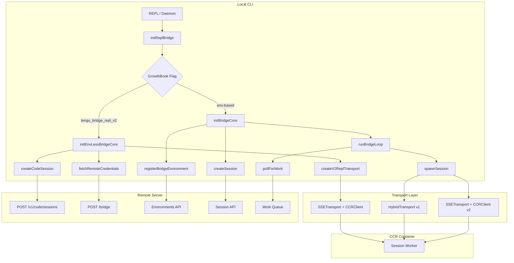
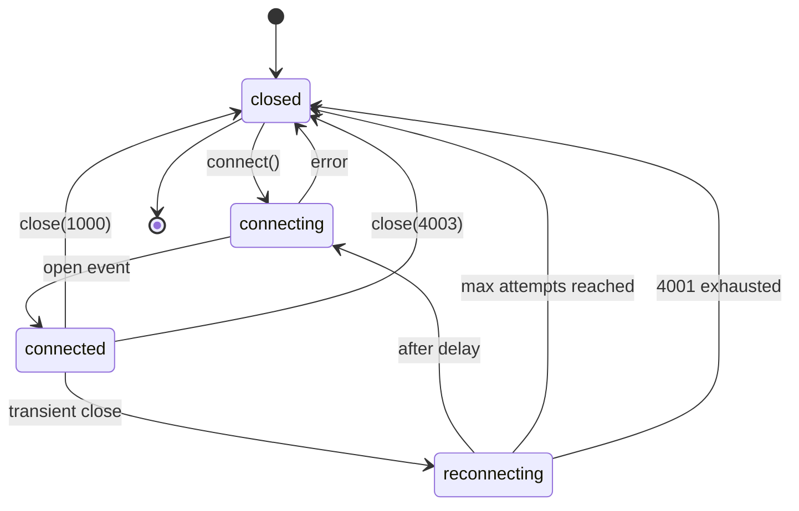
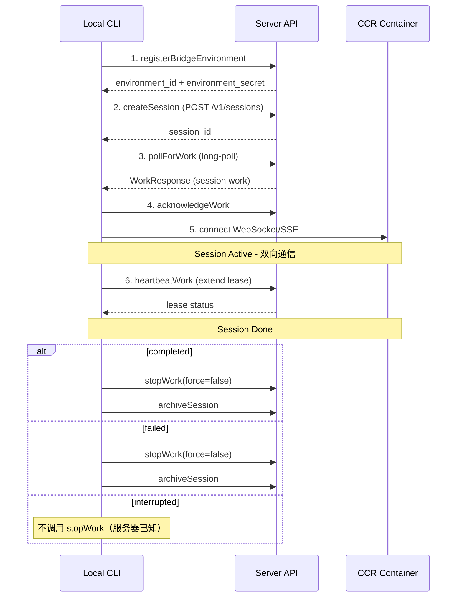
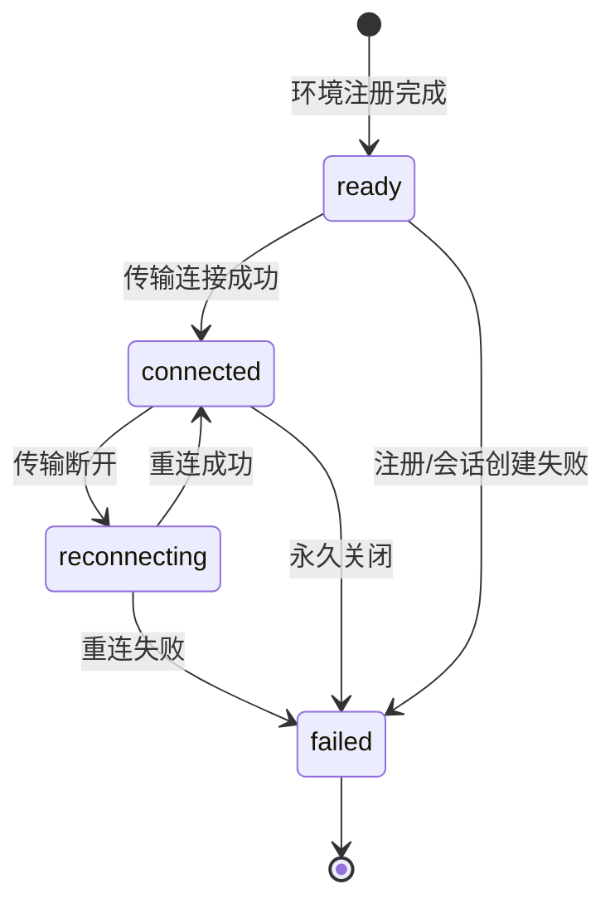
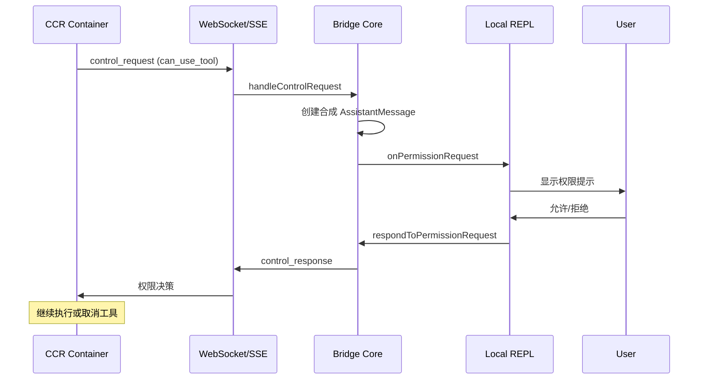

# 12. Bridge System（桥接系统）

## 1. 模块概述

Bridge 系统是 Claude Code 的远程通信基础设施，负责在本地 CLI 与远程 CCR（Claude Code Runtime）容器之间建立双向通信通道。它支持 WebSocket 和 SSE（Server-Sent Events）两种传输协议，涵盖会话管理、消息序列化、连接管理、心跳检测、自动重连和上游代理等核心功能。

### 文件清单

#### bridge/ 目录（31 文件，约 12,613 行）

| 文件路径 | 行数 | 职责 |
|---------|------|------|
| `src/bridge/types.ts` | 262 | 核心类型定义（BridgeConfig, BridgeApiClient, SessionHandle, SessionSpawner, BridgeLogger） |
| `src/bridge/bridgeMain.ts` | ~1,600 | Bridge 主循环（poll-for-work, session spawn, heartbeat, backoff） |
| `src/bridge/remoteBridgeCore.ts` | 1,008 | Env-less Bridge 核心（直接连接 Session-Ingress，无 Environments API 层） |
| `src/bridge/replBridge.ts` | ~2,200 | REPL Bridge 初始化（环境注册 → 会话创建 → 轮询循环 → 传输连接） |
| `src/bridge/replBridgeTransport.ts` | 370 | 传输抽象层（v1: HybridTransport / v2: SSETransport + CCRClient） |
| `src/bridge/bridgeApi.ts` | 539 | Bridge API 客户端（register, poll, ack, stopWork, heartbeat, deregister） |
| `src/bridge/bridgeMessaging.ts` | 461 | 消息处理（ingress 解析、echo 去重、control request/response） |
| `src/bridge/bridgeUI.ts` | ~400 | 终端 UI 渲染（状态行、多会话显示、QR 码） |
| `src/bridge/bridgeConfig.ts` | ~50 | Bridge 配置（GrowthBook flag 读取、base URL override） |
| `src/bridge/envLessBridgeConfig.ts` | ~100 | Env-less 配置（重试参数、心跳间隔、超时设置） |
| `src/bridge/sessionRunner.ts` | ~400 | 子进程会话生成器（spawn child claude process with SDK URL） |
| `src/bridge/workSecret.ts` | ~200 | Work Secret 解码、SDK URL 构建、Worker 注册 |
| `src/bridge/jwtUtils.ts` | ~150 | JWT 刷新调度器（proactive token refresh before expiry） |
| `src/bridge/flushGate.ts` | ~80 | 消息刷新门控（queue writes during history flush） |
| `src/bridge/capacityWake.ts` | ~60 | 容量唤醒信号（wake at-capacity sleep on session end） |
| `src/bridge/bridgeStatusUtil.ts` | ~80 | 状态工具（duration formatting, status text） |
| `src/bridge/bridgePermissionCallbacks.ts` | ~50 | 权限回调适配器 |
| `src/bridge/bridgePointer.ts` | ~100 | 崩溃恢复指针（crash-recovery pointer for session resume） |
| `src/bridge/bridgeDebug.ts` | ~100 | 调试工具（fault injection for ant testing） |
| `src/bridge/initReplBridge.ts` | ~200 | REPL Bridge 入口（bootstrap state gathering + core init） |
| `src/bridge/createSession.ts` | ~200 | Bridge 会话创建（POST /v1/sessions） |
| `src/bridge/codeSessionApi.ts` | ~150 | Code Session API（createCodeSession, fetchRemoteCredentials） |
| `src/bridge/replBridgeHandle.ts` | ~50 | REPL Bridge Handle 类型 |
| `src/bridge/inboundMessages.ts` | ~80 | 入站消息处理 |
| `src/bridge/inboundAttachments.ts` | ~50 | 入站附件处理 |
| `src/bridge/pollConfig.ts` | ~100 | 轮询配置（GrowthBook-backed poll interval getter） |
| `src/bridge/pollConfigDefaults.ts` | ~50 | 默认轮询配置常量 |
| `src/bridge/sessionIdCompat.ts` | ~80 | Session ID 兼容层（session_* ↔ cse_* 转换） |
| `src/bridge/trustedDevice.ts` | ~50 | 可信设备令牌 |
| `src/bridge/workSecret.ts` | ~200 | Work Secret 编解码 |
| `src/bridge/debugUtils.ts` | ~100 | 调试工具函数 |

#### remote/ 目录（4 文件，约 1,127 行）

| 文件路径 | 行数 | 职责 |
|---------|------|------|
| `src/remote/SessionsWebSocket.ts` | 404 | CCR Session WebSocket 客户端（连接、认证、重连、心跳） |
| `src/remote/RemoteSessionManager.ts` | 343 | 远程会话管理器（协调 WS 订阅 + HTTP POST + 权限流） |
| `src/remote/sdkMessageAdapter.ts` | 302 | SDK 消息适配器（SDKMessage → REPL Message 转换） |
| `src/remote/remotePermissionBridge.ts` | 78 | 远程权限桥接（合成 AssistantMessage、Tool stub） |

#### server/ 目录（3 文件，约 358 行）

| 文件路径 | 行数 | 职责 |
|---------|------|------|
| `src/server/types.ts` | 57 | Server 类型定义（ServerConfig, SessionState, SessionIndex） |
| `src/server/directConnectManager.ts` | 213 | Direct Connect 会话管理器（本地 WebSocket 直连） |
| `src/server/createDirectConnectSession.ts` | 88 | Direct Connect 会话创建（POST /sessions） |

#### upstreamproxy/ 目录（2 文件，约 740 行）

| 文件路径 | 行数 | 职责 |
|---------|------|------|
| `src/upstreamproxy/relay.ts` | 455 | CONNECT-over-WebSocket 中继（TCP → WS 隧道） |
| `src/upstreamproxy/upstreamproxy.ts` | 285 | 上游代理初始化（token 读取、CA 下载、环境变量注入） |

### 核心职责

```
Bridge System
├── Bridge 模式（远程通信核心）
│   ├── Env-Based Bridge（replBridge.ts + bridgeMain.ts）
│   │   ├── 环境注册（registerBridgeEnvironment）
│   │   ├── 会话创建（createSession）
│   │   ├── 工作轮询（pollForWork）
│   │   ├── 会话生成（spawn child process）
│   │   └── 心跳/重连（heartbeatWork, reconnectSession）
│   └── Env-Less Bridge（remoteBridgeCore.ts）
│       ├── 直接创建 Code Session（POST /v1/code/sessions）
│       ├── 获取 Bridge 凭证（POST /bridge）
│       ├── v2 传输连接（SSETransport + CCRClient）
│       └── JWT 刷新调度（proactive token refresh）
├── 传输层
│   ├── v1: HybridTransport（WebSocket 读取 + POST 写入）
│   ├── v2: SSETransport（SSE 读取）+ CCRClient（POST 写入 /worker/*）
│   └── SessionsWebSocket（Remote Session 专用 WS 客户端）
├── 消息系统
│   ├── 消息序列化/反序列化（JSON）
│   ├── Echo 去重（BoundedUUIDSet）
│   ├── FlushGate（历史消息刷新门控）
│   └── SDK Message 适配（SDKMessage ↔ REPL Message）
├── 会话管理
│   ├── 会话生命周期（create → active → done → archive）
│   ├── 多会话模式（worktree, same-dir, single-session）
│   ├── 崩溃恢复（bridgePointer）
│   └── 超时看门狗（per-session timeout）
├── 权限桥接
│   ├── 远程权限请求转发（control_request → local prompt）
│   ├── 权限响应回传（control_response → remote session）
│   └── 合成消息生成（synthetic AssistantMessage / Tool stub）
└── 上游代理（Upstream Proxy）
    ├── CONNECT-over-WebSocket 隧道
    ├── Protobuf 分块编码（UpstreamProxyChunk）
    ├── CA 证书注入
    └── 代理环境变量（HTTPS_PROXY, SSL_CERT_FILE）
```

---

## 2. Bridge 模式架构

### 2.1 整体设计

Bridge 系统有两种工作模式：

**模式一：Env-Based Bridge（基于环境的桥接）**

这是传统的 Bridge 模式，通过 Environments API 层进行工作分发：

```
┌─────────────────────┐         ┌──────────────────────┐         ┌─────────────────┐
│   Local CLI         │         │   Environments API   │         │   CCR Container │
│                     │         │   (Work Dispatch)    │         │                 │
│  1. registerEnv ──────────────────→ POST /environments            │
│  2. createSession ──────────────────→ POST /sessions              │
│  3. pollForWork  ←────────────────── GET /work (long-poll)       │
│  4. ackWork      ──────────────────→ POST /ack                   │
│  5. connect WS/SSE ←─────────────────────────────────────────────→│
│  6. heartbeat    ──────────────────→ POST /heartbeat             │
│  7. stopWork     ──────────────────→ POST /stop                  │
│  8. deregister   ──────────────────→ DELETE /environment         │
└─────────────────────┘         └──────────────────────┘         └─────────────────┘
```

**模式二：Env-Less Bridge（无环境层桥接）**

这是更轻量的 Bridge 模式，跳过 Environments API 层，直接连接 Session-Ingress：

```
┌─────────────────────┐         ┌──────────────────────┐         ┌─────────────────┐
│   Local CLI (REPL)  │         │   Session-Ingress    │         │   CCR Container │
│                     │         │   (Direct Connect)   │         │                 │
│  1. createCodeSession ────────────→ POST /v1/code/sessions     │
│  2. fetchBridgeCreds ─────────────→ POST /v1/code/sessions/{id}/bridge │
│  3. createV2Transport ←─────────── SSE + CCRClient             │
│  4. proactive refresh ────────────→ POST /bridge (new JWT)     │
│  5. 401 recovery   ──────────────→ OAuth refresh + rebuild     │
└─────────────────────┘         └──────────────────────┘         └─────────────────┘
```

### 2.2 架构图



### 2.3 两种模式对比

| 特性 | Env-Based Bridge | Env-Less Bridge |
|------|-----------------|-----------------|
| 入口文件 | `replBridge.ts` | `remoteBridgeCore.ts` |
| 环境注册 | 需要（registerBridgeEnvironment） | 不需要 |
| 工作分发 | pollForWork（长轮询） | 直接连接 |
| 认证方式 | OAuth 或 JWT | JWT（worker_jwt） |
| 传输协议 | v1: HybridTransport / v2: SSE+CCR | v2: SSE+CCR |
| 心跳机制 | heartbeatWork（via Environments API） | heartbeat（via CCRClient） |
| 重连策略 | reconnectSession + 环境重建 | 401 recovery + transport rebuild |
| 适用场景 | 多会话 Daemon 模式 | REPL 单会话模式 |
| GrowthBook Flag | 默认 | `tengu_bridge_repl_v2` |

---

## 3. WebSocket 传输层

### 3.1 SessionsWebSocket 客户端

`SessionsWebSocket` 是用于连接 CCR Session 的 WebSocket 客户端，位于 `src/remote/SessionsWebSocket.ts`。

#### 连接协议

```
1. 连接到 wss://api.anthropic.com/v1/sessions/ws/{sessionId}/subscribe?organization_uuid={orgUuid}
2. 通过 HTTP Header 认证：Authorization: Bearer {oauth_token}
3. 接收 SDKMessage 流
4. 发送 control_request / control_response
```

#### 连接管理

```typescript
// 核心参数
const RECONNECT_DELAY_MS = 2000           // 重连延迟
const MAX_RECONNECT_ATTEMPTS = 5          // 最大重连次数
const PING_INTERVAL_MS = 30000            // Ping 间隔（30秒）
const MAX_SESSION_NOT_FOUND_RETRIES = 3   // 4001 最大重试
```

#### 永久关闭代码

```typescript
const PERMANENT_CLOSE_CODES = new Set([
  4003, // unauthorized
])
```

#### 状态机



#### 心跳机制

```typescript
private startPingInterval(): void {
  this.pingInterval = setInterval(() => {
    if (this.ws && this.state === 'connected') {
      try {
        this.ws.ping?.()  // Bun & ws 都支持 ping
      } catch {
        // 忽略 ping 错误，close handler 会处理
      }
    }
  }, PING_INTERVAL_MS)  // 30 秒
}
```

#### 重连策略

```typescript
private handleClose(closeCode: number): void {
  // 永久关闭码：立即停止重连
  if (PERMANENT_CLOSE_CODES.has(closeCode)) {
    this.callbacks.onClose?.()
    return
  }
  
  // 4001 (session not found): 压缩期间可能短暂出现，有限重试
  if (closeCode === 4001) {
    this.sessionNotFoundRetries++
    if (this.sessionNotFoundRetries > MAX_SESSION_NOT_FOUND_RETRIES) {
      this.callbacks.onClose?.()
      return
    }
    this.scheduleReconnect(RECONNECT_DELAY_MS * this.sessionNotFoundRetries, ...)
    return
  }
  
  // 普通断开：指数退避重连
  if (previousState === 'connected' && this.reconnectAttempts < MAX_RECONNECT_ATTEMPTS) {
    this.reconnectAttempts++
    this.scheduleReconnect(RECONNECT_DELAY_MS, ...)
  }
}
```

### 3.2 HybridTransport（v1 传输）

v1 传输使用 `HybridTransport`，它组合了：
- **WebSocket 读取**：从 Session-Ingress WebSocket 接收消息
- **POST 写入**：通过 HTTP POST 发送消息到 Session-Ingress

```
┌──────────────┐    WebSocket    ┌──────────────────┐
│  HybridTrans │ ←────────────── │ Session-Ingress  │
│   (v1)       │ ─── POST ─────→ │                  │
└──────────────┘                 └──────────────────┘
```

### 3.3 SSETransport + CCRClient（v2 传输）

v2 传输使用 `SSETransport`（读取）+ `CCRClient`（写入）：
- **SSETransport**：通过 Server-Sent Events 从 CCR `/worker/*` 端点接收消息
- **CCRClient**：通过 HTTP POST 发送消息到 CCR `/worker/*` 端点

```
┌──────────────┐      SSE       ┌──────────────────┐
│  SSETransport│ ←───────────── │ CCR /worker/*    │
│  + CCRClient │ ─── POST ─────→ │                  │
└──────────────┘                 └──────────────────┘
```

#### 传输抽象层

`ReplBridgeTransport` 接口统一了 v1 和 v2 传输：

```typescript
export type ReplBridgeTransport = {
  write(message: StdoutMessage): Promise<void>
  writeBatch(messages: StdoutMessage[]): Promise<void>
  close(): void
  isConnectedStatus(): boolean
  getStateLabel(): string
  setOnData(callback: (data: string) => void): void
  setOnClose(callback: (closeCode?: number) => void): void
  setOnConnect(callback: () => void): void
  connect(): void
  getLastSequenceNum(): number           // SSE 序列号高水位标记
  reportState(state: SessionState): void // v2 only: PUT /worker state
  reportMetadata(metadata: Record<string, unknown>): void  // v2 only
  reportDelivery(eventId: string, status: 'processing' | 'processed'): void  // v2 only
  flush(): Promise<void>                 // v2 only: drain write queue
}
```

### 3.4 消息序列化

所有消息通过 JSON 序列化和反序列化：

```typescript
// 发送
this.ws.send(jsonStringify(response))

// 接收
const message: unknown = jsonParse(data)
```

#### 消息类型

```typescript
type SessionsMessage =
  | SDKMessage              // 助手消息、用户消息、系统消息
  | SDKControlRequest       // 控制请求（权限提示等）
  | SDKControlResponse      // 控制响应（权限决策）
  | SDKControlCancelRequest // 控制取消（服务器取消待处理权限）
```

---

## 4. SSE 流式传输

### 4.1 Server-Sent Events 实现

SSE 传输是 CCR v2 协议的核心读取通道，使用 `SSETransport` 类实现。

#### 连接流程

```
1. 创建 SSETransport（sessionUrl, ingressToken, epoch）
2. 调用 transport.connect()
3. 服务器推送 SSE 事件流
4. 客户端通过 Last-Event-ID / from_sequence_num 恢复
5. 心跳维持连接（heartbeat）
```

#### 序列号恢复

SSE 传输维护一个序列号高水位标记（high-water mark），用于在传输交换时恢复流：

```typescript
// replBridge.ts: 传输交换时保存序列号
if (transport) {
  const oldSeq = oldTransport.getLastSequenceNum()
  if (oldSeq > lastTransportSequenceNum) {
    lastTransportSequenceNum = oldSeq
  }
  oldTransport.close()
}

// 新传输从上次位置恢复
transport = await createV2ReplTransport({
  sessionUrl,
  ingressToken: fresh.worker_jwt,
  sessionId,
  epoch: fresh.worker_epoch,
  initialSequenceNum: lastTransportSequenceNum,  // 恢复点
  ...
})
```

#### 心跳机制

v2 传输使用 CCRClient 的心跳机制：

```typescript
// envLessBridgeConfig.ts 中的默认配置
heartbeat_interval_ms: 30_000        // 30 秒心跳
heartbeat_jitter_fraction: 0.3       // 30% 抖动
token_refresh_buffer_ms: 300_000     // JWT 过期前 5 分钟刷新
```

### 4.2 CCRClient 写入路径

v2 的写入通过 `CCRClient` 进行，使用 `SerialBatchEventUploader` 批量上传：

```
writeBatch(events)
  → CCRClient.writeEvent(event)
    → SerialBatchEventUploader.enqueue(event)
      → 后台异步批量 POST /worker/events
```

#### 状态报告

v2 传输支持向服务器报告 Worker 状态：

```typescript
transport.reportState('idle')         // 空闲
transport.reportState('running')      // 运行中
transport.reportState('requires_action')  // 等待权限
```

---

## 5. 会话管理

### 5.1 会话生命周期



### 5.2 认证机制

#### OAuth 认证（v1 路径）

```typescript
// SessionsWebSocket 通过 HTTP Header 认证
const headers = {
  Authorization: `Bearer ${accessToken}`,
  'anthropic-version': '2023-06-01',
}
```

#### JWT 认证（v2 路径）

```typescript
// Work Secret 包含 session_ingress_token (JWT)
const secret = decodeWorkSecret(work.secret)
// JWT 包含 session_id claim 和 worker role
// 用于 CCR /worker/* 端点认证
```

#### Trusted Device Token

```typescript
// Bridge 会话使用 SecurityTier=ELEVATED
// 需要可信设备令牌（GrowthBook: tengu_sessions_elevated_auth_enforcement）
headers['X-Trusted-Device-Token'] = deviceToken
```

### 5.3 状态同步

#### Bridge 状态机

```typescript
export type BridgeState = 'ready' | 'connected' | 'reconnecting' | 'failed'
```



#### 多会话显示

```typescript
// bridgeUI.ts: 状态行渲染
logger.updateSessionCount(active: number, max: number, mode: SpawnMode)
logger.updateSessionActivity(sessionId: string, activity: SessionActivity)
logger.setSessionTitle(sessionId: string, title: string)
```

### 5.4 超时管理

#### 会话超时看门狗

```typescript
// 默认 24 小时超时
const DEFAULT_SESSION_TIMEOUT_MS = 24 * 60 * 60 * 1000

// 每个会话独立的超时定时器
const timer = setTimeout(onSessionTimeout, timeoutMs, sessionId, ...)
sessionTimers.set(sessionId, timer)
```

#### 工作租约（Work Lease）

```typescript
// 工作项有 300 秒（5 分钟）TTL
// 心跳延长租约
api.heartbeatWork(environmentId, workId, sessionToken)
```

### 5.5 崩溃恢复

```typescript
// bridgePointer.ts: 崩溃恢复指针
await writeBridgePointer(dir, {
  sessionId: currentSessionId,
  environmentId,
  source: 'repl',
})

// 下次启动时读取
const prior = perpetual ? await readBridgePointer(dir) : null
if (prior?.source === 'repl') {
  // 尝试恢复之前的会话
  await tryReconnectInPlace(prior.environmentId, prior.sessionId)
}
```

---

## 6. 远程权限桥接

### 6.1 权限请求流



### 6.2 合成消息生成

当远程 CCR 触发权限请求时，本地没有真实的 `AssistantMessage`，需要合成：

```typescript
export function createSyntheticAssistantMessage(
  request: SDKControlPermissionRequest,
  requestId: string,
): AssistantMessage {
  return {
    type: 'assistant',
    uuid: randomUUID(),
    message: {
      id: `remote-${requestId}`,
      role: 'assistant',
      content: [{
        type: 'tool_use',
        id: request.tool_use_id,
        name: request.tool_name,
        input: request.input,
      }],
      // ... 其他字段
    },
  }
}
```

### 6.3 Tool Stub

对于本地未加载的工具（如 MCP 工具），创建最小 Tool stub：

```typescript
export function createToolStub(toolName: string): Tool {
  return {
    name: toolName,
    inputSchema: {} as Tool['inputSchema'],
    isEnabled: () => true,
    userFacingName: () => toolName,
    renderToolUseMessage: (input) => { /* 格式化输入 */ },
    call: async () => ({ data: '' }),
    needsPermissions: () => true,
    // ... 其他字段
  }
}
```

### 6.4 SDK 消息适配

`sdkMessageAdapter.ts` 将 CCR 的 SDKMessage 转换为 REPL 的 Message 类型：

| SDK 消息类型 | 转换结果 | 说明 |
|-------------|---------|------|
| `SDKAssistantMessage` | `AssistantMessage` | 助手回复 |
| `SDKPartialAssistantMessage` | `StreamEvent` | 流式输出 |
| `SDKResultMessage` (error) | `SystemMessage` | 错误结果 |
| `SDKResultMessage` (success) | `ignored` | 成功结果（静默） |
| `SDKSystemMessage` (init) | `SystemMessage` | 会话初始化 |
| `SDKSystemMessage` (status) | `SystemMessage` | 状态更新 |
| `SDKSystemMessage` (compact_boundary) | `SystemMessage` | 对话压缩边界 |
| `SDKToolProgressMessage` | `SystemMessage` | 工具进度 |
| `SDKMessage` (user) | `ignored` | 用户消息（本地已添加） |

---

## 7. 上游代理（Upstream Proxy）

### 7.1 架构概述

Upstream Proxy 在 CCR 容器内运行，为 Agent 子进程提供网络代理能力。它通过 CONNECT-over-WebSocket 隧道将 TCP 流量转发到远程服务器，并在中间注入企业凭证（如 Datadog API Key）。

```
┌─────────────────────────────────────────────────────────────┐
│                     CCR Container                           │
│                                                             │
│  Agent Subprocess                                           │
│  (curl / gh / python)                                       │
│       │                                                     │
│       │ HTTPS (via HTTPS_PROXY)                             │
│       ▼                                                     │
│  ┌─────────────┐      CONNECT        ┌──────────────────┐  │
│  │ Local Relay │ ──────────────────→ │  WebSocket       │  │
│  │ (127.0.0.1) │   over WebSocket    │  Tunnel          │  │
│  └─────────────┘                     └──────────────────┘  │
│                                              │              │
└──────────────────────────────────────────────┼──────────────┘
                                               │
                                               ▼
                                    ┌──────────────────────┐
                                    │  CCR Gateway         │
                                    │  (GKE L7)            │
                                    │                      │
                                    │  MITM TLS            │
                                    │  Inject Credentials  │
                                    │  (DD-API-KEY etc.)   │
                                    └──────────────────────┘
                                               │
                                               ▼
                                    ┌──────────────────────┐
                                    │  Real Upstream       │
                                    │  (api.datadoghq.com) │
                                    └──────────────────────┘
```

### 7.2 CONNECT-over-WebSocket 中继

由于 CCR ingress 是 GKE L7 且有 path-prefix 路由，不支持原生 CONNECT，因此使用 WebSocket 封装：

```typescript
// 协议：字节封装在 UpstreamProxyChunk protobuf 消息中
// message UpstreamProxyChunk { bytes data = 1; }
// 手动编码，避免引入 protobufjs 依赖

export function encodeChunk(data: Uint8Array): Uint8Array {
  // wire format: tag=0x0a (field 1, wire type 2) + varint length + bytes
  const len = data.length
  const varint: number[] = []
  let n = len
  while (n > 0x7f) {
    varint.push((n & 0x7f) | 0x80)
    n >>>= 7
  }
  varint.push(n)
  const out = new Uint8Array(1 + varint.length + len)
  out[0] = 0x0a
  out.set(varint, 1)
  out.set(data, 1 + varint.length)
  return out
}
```

### 7.3 中继工作流程

```
1. 监听 localhost 临时端口
2. 接受 TCP 连接（curl/gh/kubectl 等）
3. 解析 HTTP CONNECT 请求（累积到 CRLFCRLF）
4. 建立 WebSocket 隧道到 CCR Gateway
5. 第一个 chunk 携带 CONNECT 行 + Proxy-Authorization
6. 双向转发：客户端字节 ↔ WebSocket chunks
7. 心跳保活（30 秒空 chunk）
```

### 7.4 代理配置

```typescript
// NO_PROXY 列表：不经过代理的主机
const NO_PROXY_LIST = [
  'localhost', '127.0.0.1', '::1',
  '169.254.0.0/16',           // IMDS
  '10.0.0.0/8', '172.16.0.0/12', '192.168.0.0/16',  // RFC1918
  'anthropic.com', '.anthropic.com', '*.anthropic.com',  // Anthropic API
  'github.com', 'api.github.com', '*.github.com', '*.githubusercontent.com',
  'registry.npmjs.org', 'pypi.org', 'files.pythonhosted.org',
  'index.crates.io', 'proxy.golang.org',
].join(',')
```

### 7.5 环境变量注入

```typescript
export function getUpstreamProxyEnv(): Record<string, string> {
  return {
    HTTPS_PROXY: `http://127.0.0.1:${port}`,
    https_proxy: `http://127.0.0.1:${port}`,
    NO_PROXY: NO_PROXY_LIST,
    no_proxy: NO_PROXY_LIST,
    SSL_CERT_FILE: caBundlePath,
    NODE_EXTRA_CA_CERTS: caBundlePath,
    REQUESTS_CA_BUNDLE: caBundlePath,
    CURL_CA_BUNDLE: caBundlePath,
  }
}
```

### 7.6 安全机制

```typescript
// 1. prctl(PR_SET_DUMPABLE, 0) - 阻止同 UID ptrace
function setNonDumpable(): void {
  // Linux-only, Bun FFI to libc
  const rc = lib.symbols.prctl(PR_SET_DUMPABLE, 0n, 0n, 0n, 0n)
}

// 2. Token 文件在使用后删除
await unlink(tokenPath)  // 仅在 relay 启动成功后

// 3. CA 证书下载（MITM 代理需要信任）
const ccrCa = await fetch(`${baseUrl}/v1/code/upstreamproxy/ca-cert`)
const systemCa = await readFile('/etc/ssl/certs/ca-certificates.crt')
await writeFile(caBundlePath, systemCa + '\n' + ccrCa)
```

---

## 8. 安全机制

### 8.1 认证安全

| 机制 | 说明 |
|------|------|
| OAuth Bearer Token | 标准 OAuth 2.0 认证，用于 v1 路径 |
| JWT (worker_jwt) | 包含 session_id claim 和 worker role，用于 v2 路径 |
| Trusted Device Token | X-Trusted-Device-Token header，用于 ELEVATED 安全层级 |
| Session Ingress Token | base64url 编码的 JWT，用于 work acknowledgment |

### 8.2 传输安全

| 机制 | 说明 |
|------|------|
| WSS (WebSocket Secure) | 所有 WebSocket 连接使用 TLS |
| HTTPS | 所有 HTTP 请求使用 TLS |
| mTLS | 可选的双向 TLS（getWebSocketTLSOptions） |
| Protobuf 编码 | Upstream Proxy 使用二进制 protobuf 封装 |

### 8.3 会话安全

| 机制 | 说明 |
|------|------|
| Session ID 验证 | validateBridgeId() 防止路径遍历 |
| Foreign Session 拒绝 | 拒绝不属于当前环境的会话 ID |
| UUID 去重 | BoundedUUIDSet 防止消息重放 |
| 工作租约 | 300 秒 TTL，心跳延长 |

### 8.4 容器安全

| 机制 | 说明 |
|------|------|
| PR_SET_DUMPABLE | 阻止 ptrace 攻击 |
| Token 文件删除 | 使用后立即删除 |
| CA 证书注入 | MITM 代理的 TLS 信任链 |
| Fail-Open | 代理配置失败不影响正常会话 |

---

## 9. Direct Connect 模式

Direct Connect 是本地服务器模式，允许通过本地 HTTP 服务器管理 Claude Code 会话。

### 9.1 架构

```
┌──────────────┐    HTTP POST     ┌──────────────────┐
│   Client     │ ───────────────→ │  Local Server    │
│   (IDE/CLI)  │                  │  (:port)         │
└──────────────┘                  │                  │
                                  │  createSession   │
                                  │       ↓          │
                                  │  spawn claude    │
                                  │  subprocess      │
                                  │       ↓          │
                                  │  WebSocket       │
                                  │  (stdio relay)   │
                                  └──────────────────┘
```

### 9.2 会话状态

```typescript
export type SessionState =
  | 'starting'   // 子进程启动中
  | 'running'    // 运行中
  | 'detached'   // 已分离（客户端断开）
  | 'stopping'   // 停止中
  | 'stopped'    // 已停止
```

### 9.3 会话持久化

```typescript
// 持久化到 ~/.claude/server-sessions.json
export type SessionIndexEntry = {
  sessionId: string           // 服务器分配的会话 ID
  transcriptSessionId: string // 转录会话 ID（用于 --resume）
  cwd: string                 // 工作目录
  permissionMode?: string     // 权限模式
  createdAt: number           // 创建时间
  lastActiveAt: number        // 最后活跃时间
}
```

---

## 10. 轮询与心跳机制

### 10.1 工作轮询（Work Poll）

Env-Based Bridge 使用长轮询从 Environments API 获取工作项：

```typescript
// 轮询间隔配置（通过 GrowthBook 动态调整）
type PollIntervalConfig = {
  multisession_poll_interval_ms_at_capacity: number       // 满负载时
  multisession_poll_interval_ms_partial_capacity: number  // 部分负载时
  multisession_poll_interval_ms_not_at_capacity: number   // 空闲时
  non_exclusive_heartbeat_interval_ms: number             // 心跳间隔
  reclaim_older_than_ms: number                           // 工作项回收时间
}
```

### 10.2 心跳机制

```typescript
// 心跳所有活动工作项，延长租约
async function heartbeatActiveWorkItems(): Promise<'ok' | 'auth_failed' | 'fatal' | 'failed'> {
  for (const [sessionId] of activeSessions) {
    await api.heartbeatWork(environmentId, workId, ingressToken)
  }
}
```

### 10.3 退避策略

```typescript
const DEFAULT_BACKOFF: BackoffConfig = {
  connInitialMs: 2_000,       // 连接退避初始值
  connCapMs: 120_000,         // 连接退避上限（2 分钟）
  connGiveUpMs: 600_000,      // 连接放弃时间（10 分钟）
  generalInitialMs: 500,      // 通用退避初始值
  generalCapMs: 30_000,       // 通用退避上限（30 秒）
  generalGiveUpMs: 600_000,   // 通用放弃时间（10 分钟）
}
```

### 10.4 睡眠/唤醒检测

```typescript
// 检测系统睡眠/唤醒：如果轮询间隔远超预期，说明机器可能睡眠了
function pollSleepDetectionThresholdMs(backoff: BackoffConfig): number {
  return backoff.connCapMs * 2  // 2 × 连接退避上限
}
```

---

## 11. 多会话模式

### 11.1 Spawn Mode

```typescript
export type SpawnMode = 
  | 'single-session'  // 单会话模式：会话结束后 Bridge 退出
  | 'worktree'        // Worktree 模式：每个会话使用独立的 git worktree
  | 'same-dir'        // 同目录模式：所有会话共享 cwd（可能冲突）
```

### 11.2 容量管理

```typescript
// 最大会话数（通过 GrowthBook: tengu_ccr_bridge_multi_session 控制）
const SPAWN_SESSIONS_DEFAULT = 32

// 满负载时的行为
if (activeSessions.size >= config.maxSessions) {
  // 心跳循环（不轮询新工作）
  while (atCapacity) {
    await heartbeatActiveWorkItems()
    await sleep(heartbeatIntervalMs)
  }
  // 或者慢速轮询
  await sleep(atCapMs)
}
```

### 11.3 Worktree 隔离

```typescript
// Worktree 模式：为每个会话创建独立的 git worktree
if (spawnMode === 'worktree') {
  const wt = await createAgentWorktree(`bridge-${safeFilenameId(sessionId)}`)
  sessionDir = wt.worktreePath
  sessionWorktrees.set(sessionId, {
    worktreePath: wt.worktreePath,
    worktreeBranch: wt.worktreeBranch,
    gitRoot: wt.gitRoot,
  })
}
```

---

## 12. CCR v2 兼容性

### 12.1 Session ID 兼容层

CCR v2 使用 `cse_*` 前缀的基础设施层 ID，而 v1 API 返回 `session_*` 前缀的兼容层 ID：

```typescript
// session_* → cse_* （基础设施层）
export function toInfraSessionId(sessionId: string): string

// cse_* → session_* （兼容层）
export function toCompatSessionId(sessionId: string): string

// 比较底层 UUID，忽略前缀差异
export function sameSessionId(a: string, b: string): boolean
```

### 12.2 传输选择

```typescript
// 服务器通过 work secret 决定每会话的传输协议
const useCcrV2 = 
  secret.use_code_sessions === true ||     // 服务器驱动
  isEnvTruthy(process.env.CLAUDE_BRIDGE_USE_CCR_V2)  // 开发者覆盖

if (useCcrV2) {
  // v2: 注册 worker，获取 epoch
  workerEpoch = await registerWorker(sdkUrl, token)
  sdkUrl = buildCCRv2SdkUrl(apiBaseUrl, sessionId)
} else {
  // v1: Session-Ingress WebSocket
  sdkUrl = buildSdkUrl(sessionIngressUrl, sessionId)
}
```

---

## 13. 文件索引

### 完整文件列表

| 模块 | 文件路径 | 行数 | 核心功能 |
|------|---------|------|---------|
| **Bridge 核心** | `src/bridge/bridgeMain.ts` | ~1,600 | 主循环、会话管理、心跳 |
| | `src/bridge/remoteBridgeCore.ts` | 1,008 | Env-less Bridge 核心 |
| | `src/bridge/replBridge.ts` | ~2,200 | REPL Bridge 初始化 |
| **类型定义** | `src/bridge/types.ts` | 262 | 核心类型 |
| **API 客户端** | `src/bridge/bridgeApi.ts` | 539 | Bridge API 客户端 |
| **传输层** | `src/bridge/replBridgeTransport.ts` | 370 | 传输抽象层 |
| **消息处理** | `src/bridge/bridgeMessaging.ts` | 461 | 消息解析与去重 |
| **会话管理** | `src/bridge/sessionRunner.ts` | ~400 | 子进程生成 |
| | `src/bridge/createSession.ts` | ~200 | 会话创建 |
| | `src/bridge/codeSessionApi.ts` | ~150 | Code Session API |
| **配置** | `src/bridge/bridgeConfig.ts` | ~50 | Bridge 配置 |
| | `src/bridge/envLessBridgeConfig.ts` | ~100 | Env-less 配置 |
| | `src/bridge/pollConfig.ts` | ~100 | 轮询配置 |
| | `src/bridge/pollConfigDefaults.ts` | ~50 | 默认配置 |
| **工具** | `src/bridge/workSecret.ts` | ~200 | Work Secret 处理 |
| | `src/bridge/jwtUtils.ts` | ~150 | JWT 刷新调度 |
| | `src/bridge/flushGate.ts` | ~80 | 消息门控 |
| | `src/bridge/capacityWake.ts` | ~60 | 容量唤醒 |
| | `src/bridge/bridgeStatusUtil.ts` | ~80 | 状态工具 |
| | `src/bridge/sessionIdCompat.ts` | ~80 | ID 兼容层 |
| | `src/bridge/bridgePointer.ts` | ~100 | 崩溃恢复 |
| | `src/bridge/bridgeDebug.ts` | ~100 | 调试注入 |
| | `src/bridge/trustedDevice.ts` | ~50 | 可信设备 |
| **UI** | `src/bridge/bridgeUI.ts` | ~400 | 终端 UI |
| **Remote** | `src/remote/SessionsWebSocket.ts` | 404 | WS 客户端 |
| | `src/remote/RemoteSessionManager.ts` | 343 | 会话管理器 |
| | `src/remote/sdkMessageAdapter.ts` | 302 | 消息适配器 |
| | `src/remote/remotePermissionBridge.ts` | 78 | 权限桥接 |
| **Server** | `src/server/types.ts` | 57 | Server 类型 |
| | `src/server/directConnectManager.ts` | 213 | Direct Connect |
| | `src/server/createDirectConnectSession.ts` | 88 | 会话创建 |
| **Upstream Proxy** | `src/upstreamproxy/relay.ts` | 455 | WS 中继 |
| | `src/upstreamproxy/upstreamproxy.ts` | 285 | 代理初始化 |

### 模块统计

| 模块 | 文件数 | 总行数 | 占比 |
|------|--------|--------|------|
| `bridge/` | 31 | ~12,613 | 83.5% |
| `remote/` | 4 | ~1,127 | 7.5% |
| `upstreamproxy/` | 2 | ~740 | 4.9% |
| `server/` | 3 | ~358 | 2.4% |
| **总计** | **40** | **~14,838** | **100%** |

---

## 14. 关键设计决策

### 14.1 为什么需要两层 Bridge 模式？

- **Env-Based Bridge**：适用于多会话 Daemon 场景，通过 Environments API 实现工作分发和负载均衡
- **Env-Less Bridge**：适用于 REPL 单会话场景，减少 API 调用延迟，简化架构

### 14.2 为什么使用 WebSocket 隧道而非原生 CONNECT？

CCR ingress 是 GKE L7 负载均衡器，使用 path-prefix 路由。没有 `connect_matcher` 配置支持原生 CONNECT，因此使用 WebSocket 封装 TCP 字节流。

### 14.3 为什么手动编码 Protobuf？

`UpstreamProxyChunk` 只有一个 `bytes` 字段，手动编码仅需 10 行代码，避免了引入 `protobufjs` 运行时依赖。

### 14.4 为什么 v2 传输必须重建（而非仅刷新 JWT）？

每次调用 `POST /bridge` 都会 bump epoch（服务器端）。如果只刷新 JWT 而不重建 transport，CCRClient 会使用旧 epoch 发送心跳，导致 409 Conflict。

### 14.5 为什么 Fail-Open？

Upstream Proxy 的每个步骤都可能失败（token 读取、CA 下载、relay 启动）。设计上要求任何失败都不应破坏正常工作的会话，因此全部 fail-open。
