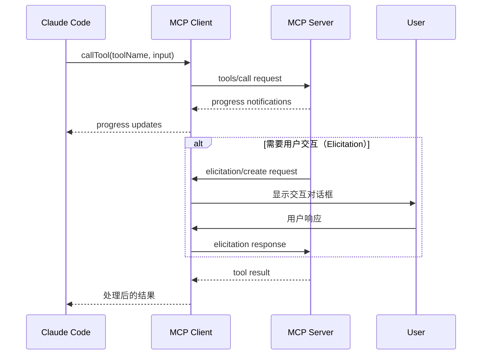
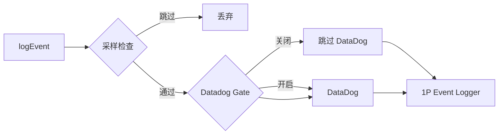
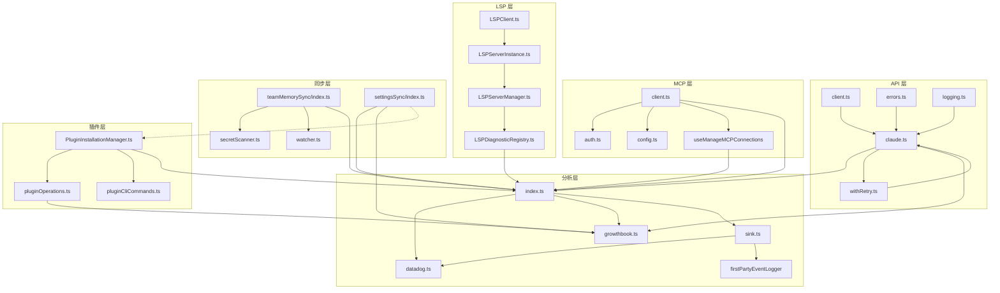

# 13. Services（服务层）

## 1. 模块概述

Services 层是 Claude Code 的核心业务逻辑层，包含 **127 个文件、53,495 行代码**。它涵盖了 API 客户端、MCP 集成、分析服务、LSP 服务、团队记忆同步、设置同步、插件系统、工具使用摘要等关键子模块。

### 模块统计

| 子模块 | 文件数 | 总行数 | 占比 |
|--------|--------|--------|------|
| `api/` | 20 | ~10,900 | 20.4% |
| `mcp/` | 23 | ~12,500 | 23.4% |
| `analytics/` | 9 | ~4,500 | 8.4% |
| `lsp/` | 7 | ~2,800 | 5.2% |
| `teamMemorySync/` | 5 | ~2,000 | 3.7% |
| `settingsSync/` | 2 | ~580 | 1.1% |
| `plugins/` | 3 | ~1,600 | 3.0% |
| `compact/` | ~5 | ~3,500 | 6.5% |
| `tools/` | ~4 | ~3,200 | 6.0% |
| 其他子模块 | ~25 | ~4,500 | 8.4% |
| 独立文件 | ~35 | ~6,000 | 11.2% |
| **总计** | **127** | **~53,495** | **100%** |

### 核心职责

```
Services
├── API 服务（api/）
│   ├── 客户端创建（client.ts）- 多 Provider 支持（Direct API, Bedrock, Vertex, Foundry）
│   ├── 查询引擎（claude.ts）- 消息构建、流式/非流式请求、Beta 头管理
│   ├── 重试逻辑（withRetry.ts）- 指数退避、Fast Mode 回退、529 错误处理
│   ├── 错误处理（errors.ts）- 错误分类、用户友好消息、媒体/PDF/工具错误
│   ├── 使用追踪（usage.ts）- 配额/用量查询
│   ├── 日志记录（logging.ts）- API 请求/响应日志、Token 统计
│   ├── 会话日志（sessionIngress.ts）- Transcript 上传、重试
│   ├── 缓存检测（promptCacheBreakDetection.ts）- Prompt 缓存命中率
│   ├── 文件 API（filesApi.ts）- 文件上传/下载
│   └── 其他（bootstrap, errors, errorUtils, grove, metricsOptOut, ...）
├── MCP 集成（mcp/）
│   ├── MCP 客户端（client.ts）- 连接管理、工具调用、资源读取
│   ├── 认证（auth.ts）- OAuth 流程、Token 管理
│   ├── 配置（config.ts）- 服务器配置解析、多源合并
│   ├── 连接管理（useManageMCPConnections.tsx）- React Hook 管理
│   ├── XAA 跨应用访问（xaa.ts, xaaIdpLogin.ts）- IdP 登录
│   ├── 诱导请求（elicitationHandler.ts）- 用户交互请求
│   ├── 通道管理（channelAllowlist, channelPermissions, channelNotification）
│   ├── 传输层（InProcessTransport, SdkControlTransport）
│   └── 工具（normalization, envExpansion, headersHelper, mcpStringUtils, utils）
├── 分析服务（analytics/）
│   ├── 公共 API（index.ts）- logEvent, logEventAsync, AnalyticsSink 接口
│   ├── DataDog（datadog.ts）- 批量日志、事件白名单、用户分桶
│   ├── GrowthBook（growthbook.ts）- Feature Flag、A/B 测试、动态配置
│   ├── 第一方事件（firstPartyEventLogger, firstPartyEventLoggingExporter）
│   ├── Sink（sink.ts, sinkKillswitch.ts）- 事件路由、Kill Switch
│   └── 元数据（metadata.ts）- 事件元数据构建
├── LSP 服务（lsp/）
│   ├── LSP 客户端（LSPClient.ts）- JSON-RPC 通信、子进程管理
│   ├── 服务器管理器（LSPServerManager.ts）- 多服务器管理、文件路由
│   ├── 服务器实例（LSPServerInstance.ts）- 单服务器生命周期
│   ├── 诊断注册表（LSPDiagnosticRegistry.ts）- 诊断收集/查询
│   ├── 配置（config.ts）- LSP 服务器配置
│   └── 被动反馈（passiveFeedback.ts）- 基于诊断的反馈
├── 团队记忆同步（teamMemorySync/）
│   ├── 主模块（index.ts）- Pull/Push/Sync 操作
│   ├── 密钥扫描（secretScanner.ts）- Gitleaks 模式检测
│   ├── 密钥防护（teamMemSecretGuard.ts）- 上传前检查
│   ├── 监听器（watcher.ts）- 文件变更监听
│   └── 类型定义（types.ts）- 同步结果类型
├── 设置同步（settingsSync/）
│   ├── 主模块（index.ts）- 上传/下载设置和记忆文件
│   └── 类型定义（types.ts）- 同步键、Schema
├── 插件系统（plugins/）
│   ├── 安装管理器（PluginInstallationManager.ts）- 后台安装
│   ├── 操作（pluginOperations.ts）- 安装/卸载/更新
│   └── CLI 命令（pluginCliCommands.ts）- /plugins 命令
├── 工具使用摘要（toolUseSummary/）
│   └── 生成器（toolUseSummaryGenerator.ts）- Haiku 模型生成摘要
├── 其他服务
│   ├── 通知（notifier.ts）- iTerm2/Kitty/Ghostty/终端铃
│   ├── 睡眠预防（preventSleep.ts）- macOS caffeinate
│   ├── 诊断追踪（diagnosticTracking.ts）- IDE 诊断集成
│   ├── 速率限制模拟（rateLimitMocking.ts, mockRateLimits.ts）- /mock-limits
│   ├── 内部日志（internalLogging.ts）- K8s/容器 ID 检测
│   ├── VCR 录制（vcr.ts）- API 请求/响应录制回放
│   ├── 语音服务（voice.ts, voiceKeyterms.ts, voiceStreamSTT.ts）
│   ├── 自动 Dream（autoDream/）- 自动整合配置
│   ├── 策略限制（policyLimits/）- 策略限制检查
│   ├── 远程管理设置（remoteManagedSettings/）
│   ├── 会话记忆（SessionMemory/）
│   ├── Prompt 建议（PromptSuggestion/）
│   ├── 提示系统（tips/）
│   ├── 离开摘要（awaySummary.ts）
│   ├── Claude AI 限制（claudeAiLimits.ts, claudeAiLimitsHook.ts）
│   └── Token 估算（tokenEstimation.ts）
└── 压缩服务（compact/）
    ├── 主压缩（compact.ts）
    ├── 自动压缩（autoCompact.ts）
    ├── 微压缩（microCompact.ts, cachedMicrocompact.ts）
    └── Prompt 构建（prompt.ts）
```

---

## 2. API 服务（api/）

API 服务是 Claude Code 与 Anthropic API 及其他云 Provider 交互的核心层，包含 20 个文件、约 10,900 行代码。

### 2.1 API 客户端（client.ts）

`client.ts`（389 行）负责创建和配置 Anthropic SDK 客户端实例，支持多 Provider 路由：

```typescript
// 支持的 Provider
- Direct API（api.anthropic.com）
- AWS Bedrock（@anthropic-ai/bedrock-sdk）
- GCP Vertex AI（@anthropic-ai/vertex-sdk）
- Azure Foundry（@anthropic-ai/foundry-sdk）
```

#### 认证方式

| Provider | 认证方式 | 环境变量 |
|----------|---------|---------|
| Direct API | API Key / OAuth Token | `ANTHROPIC_API_KEY` |
| AWS Bedrock | AWS Credentials / Bearer Token | `AWS_BEARER_TOKEN_BEDROCK` |
| GCP Vertex | Google Auth Library | `ANTHROPIC_VERTEX_PROJECT_ID` |
| Azure Foundry | API Key / Azure AD | `ANTHROPIC_FOUNDRY_API_KEY` |

#### 默认 Headers

```typescript
const defaultHeaders = {
  'x-app': 'cli',
  'User-Agent': getUserAgent(),
  'X-Claude-Code-Session-Id': getSessionId(),
  'x-claude-remote-container-id': containerId,      // 可选
  'x-claude-remote-session-id': remoteSessionId,    // 可选
  'x-client-app': clientApp,                        // 可选
}
```

#### 自定义 Headers

通过 `ANTHROPIC_CUSTOM_HEADERS` 环境变量支持注入自定义 Headers（格式：`Name: Value`，每行一个），常用于企业代理认证。

### 2.2 查询引擎（claude.ts）

`claude.ts`（3,419 行）是 API 服务中最大的文件，负责构建 API 请求、管理消息流、处理 Beta 特性。

#### 核心功能

```
queryModel()
├── 消息预处理
│   ├── normalizeMessagesForAPI()    - 消息规范化
│   ├── ensureToolResultPairing()    - 修复 tool_use/tool_result 不匹配
│   ├── stripAdvisorBlocks()         - 移除 Advisor 块（无 Beta 头时）
│   └── stripExcessMediaItems()      - 裁剪超限媒体（>100 项）
├── 系统提示构建
│   ├── getAttributionHeader()       - 指纹头
│   ├── getCLISyspromptPrefix()      - CLI 前缀
│   ├── ADVISOR_TOOL_INSTRUCTIONS    - Advisor 指令
│   └── CHROME_TOOL_SEARCH_INSTRUCTIONS - Chrome 工具搜索
├── 工具 Schema 构建
│   ├── toolToAPISchema()            - 转换为 API Schema
│   ├── deferLoading                   - 延迟加载标记（MCP/Deferred 工具）
│   └── ToolSearchTool               - 工具搜索工具
├── Beta 头管理
│   ├── Fast Mode                    - fast-mode-2025-12-19
│   ├── Context Management           - context-management-2025-10-22
│   ├── Cache Editing                - cache-editing-2025-06-19
│   ├── Prompt Caching Scope         - prompt-caching-scope-2025-07-22
│   ├── AFK Mode                   - afk-mode-2025-09-11
│   ├── Tool Search                - advanced-tool-use / tool-search-tool
│   └── Structured Outputs         - structured-outputs-2025-12-09
├── 缓存策略
│   ├── Prompt Caching             - ephemeral cache_control
│   ├── 1h TTL                     - 特定查询源 1 小时 TTL
│   └── Global Cache Scope         - system_prompt / none
├── 请求执行
│   ├── withStreamingVCR()         - VCR 录制/回放包装
│   ├── withRetry()                - 重试逻辑
│   └── 流式/非流式执行
└── 响应处理
    ├── 流式事件产出
    ├── Token 统计
    ├── 成本追踪
    └── 缓存状态更新
```

#### 消息规范化流程


#### Prompt 缓存策略

```typescript
// 缓存控制标记
export function getCacheControl({ scope, querySource }): {
  type: 'ephemeral'
  ttl?: '1h'        // 1 小时 TTL（特定查询源）
  scope?: 'global'   // 全局缓存（system_prompt 级别）
}

// 1h TTL 资格检查
// 1. 用户资格（ant 或未使用 overage 的订阅用户）
// 2. 查询源匹配 GrowthBook allowlist
// 3. Bedrock 用户可通过环境变量单独启用
```

### 2.3 重试逻辑（withRetry.ts）

`withRetry.ts`（822 行）实现了复杂的 API 重试策略：

#### 重试策略

```typescript
// 默认配置
const DEFAULT_MAX_RETRIES = 10
const BASE_DELAY_MS = 500
const MAX_529_RETRIES = 3
const FLOOR_OUTPUT_TOKENS = 3000

// 退避策略
delayMs = BASE_DELAY_MS * 2^(attempt-1) + jitter(25%)
// 最大退避：32 秒（正常模式）/ 5 分钟（持久模式）
```

#### 错误分类与处理

| 错误类型 | 处理方式 | 重试 |
|---------|---------|------|
| 429 Rate Limit | 检查 Retry-After / 快模式回退 | 是 |
| 529 Overloaded | 连续 3 次触发 fallback | 是（foreground） |
| 401 Unauthorized | 刷新 OAuth Token | 是 |
| 403 Token Revoked | 刷新 OAuth Token | 是 |
| 408 Timeout | 直接重试 | 是 |
| 409 Conflict | 直接重试 | 是 |
| 5xx Server Error | 直接重试 | 是 |
| ECONNRESET/EPIPE | 禁用 Keep-Alive 后重试 | 是 |
| 400 Context Overflow | 调整 max_tokens 后重试 | 是 |
| Mock Rate Limit | 抛出模拟错误 | 否 |

#### Fast Mode 回退

```
Fast Mode 429/529
├── Retry-After < 20s → 等待并重试（保持 Fast Mode）
├── Retry-After >= 20s → 触发冷却（切换到标准速度）
│   └── 最小冷却：10 分钟
│   └── 默认冷却：30 分钟
└── Overage Disabled → 永久禁用 Fast Mode
```

#### 持久重试模式（Persistent Retry）

通过 `CLAUDE_CODE_UNATTENDED_RETRY` 环境变量启用，用于无人值守会话：

```typescript
// 持久模式配置
const PERSISTENT_MAX_BACKOFF_MS = 5 * 60 * 1000      // 5 分钟最大退避
const PERSISTENT_RESET_CAP_MS = 6 * 60 * 60 * 1000   // 6 小时上限
const HEARTBEAT_INTERVAL_MS = 30_000                  // 30 秒心跳

// 心跳机制：每 30 秒产出 SystemAPIErrorMessage 保持宿主活跃
```

#### Foreground 查询源

只有 foreground 查询源才会重试 529 错误，避免在容量级联期间放大请求：

```typescript
const FOREGROUND_529_RETRY_SOURCES = new Set([
  'repl_main_thread', 'repl_main_thread:outputStyle:*',
  'sdk', 'agent:custom', 'agent:default', 'agent:builtin',
  'compact', 'hook_agent', 'hook_prompt',
  'verification_agent', 'side_question',
  'auto_mode', 'bash_classifier',
])
```

### 2.4 错误处理（errors.ts）

`errors.ts`（1,207 行）负责将 API 错误转换为用户友好的 AssistantMessage：

#### 错误分类器

```typescript
export function classifyAPIError(error: unknown): string {
  // 返回类型：
  // 'aborted', 'api_timeout', 'repeated_529', 'capacity_off_switch',
  // 'rate_limit', 'server_overload', 'prompt_too_long', 'pdf_too_large',
  // 'pdf_password_protected', 'image_too_large', 'tool_use_mismatch',
  // 'unexpected_tool_result', 'duplicate_tool_use_id', 'invalid_model',
  // 'credit_balance_low', 'invalid_api_key', 'token_revoked',
  // 'oauth_org_not_allowed', 'auth_error', 'bedrock_model_access',
  // 'server_error', 'client_error', 'ssl_cert_error', 'connection_error', 'unknown'
}
```

#### 错误消息映射

| 错误场景 | 用户消息 |
|---------|---------|
| API Key 无效 | `Invalid API key · Fix external API key` |
| OAuth Token 过期 | `Not logged in · Please run /login` |
| Token 被撤销 | `OAuth token revoked · Please run /login` |
| 组织被禁用 | `Your ANTHROPIC_API_KEY belongs to a disabled organization` |
| 速率限制 | 基于 header 的详细限制信息 |
| Prompt 过长 | `Prompt is too long` |
| PDF 过大 | `PDF too large (max N pages, X MB)` |
| 图片过大 | `Image was too large` |
| 工具并发错误 | `API Error: 400 due to tool use concurrency issues` |
| 服务器过载（529） | `Repeated 529 Overloaded errors` |
| 容量关闭开关 | `Opus is experiencing high load, please use /model to switch to Sonnet` |

### 2.5 使用追踪（usage.ts）

`usage.ts`（63 行）查询 Claude AI 订阅用户的用量信息：

```typescript
type Utilization = {
  five_hour?: RateLimit       // 5 小时速率限制
  seven_day?: RateLimit       // 7 天速率限制
  seven_day_oauth_apps?: RateLimit
  seven_day_opus?: RateLimit  // 7 天 Opus 限制
  seven_day_sonnet?: RateLimit // 7 天 Sonnet 限制
  extra_usage?: ExtraUsage    // 额外用量
}
```

### 2.6 会话日志（sessionIngress.ts）

`sessionIngress.ts`（514 行）负责将 Transcript 日志上传到 Session Ingress 服务：

- 每会话顺序写入（防止并发覆盖）
- 最多 10 次重试，指数退避
- 支持 Teleport 模式的 OAuth 认证

### 2.7 缓存检测（promptCacheBreakDetection.ts）

`promptCacheBreakDetection.ts`（727 行）检测 Prompt 缓存命中/未命中：

- 计算系统提示、工具 Schema、查询源的哈希
- 跟踪缓存键变化
- 记录缓存中断原因（模型切换、工具变更、Beta 头变化等）

---

## 3. MCP 集成服务（mcp/）

MCP（Model Context Protocol）集成服务是 Claude Code 连接外部 MCP 服务器的桥梁，包含 23 个文件、约 12,500 行代码。

### 3.1 MCP 客户端（client.ts）

`client.ts`（3,348 行）是 MCP 子系统中最大的文件，负责：

#### 传输层支持

| 传输类型 | 说明 |
|---------|------|
| `stdio` | 标准输入输出（子进程） |
| `sse` | Server-Sent Events |
| `sse-ide` | IDE 扩展专用 SSE |
| `http` | Streamable HTTP |
| `ws` | WebSocket |
| `sdk` | SDK 内部传输 |

#### 核心功能

```
MCPClient
├── 连接管理
│   ├── connect()              - 建立连接（含超时/重试）
│   ├── disconnect()           - 优雅断开
│   └── reconnect()            - 自动重连
├── 工具管理
│   ├── listTools()            - 获取工具列表
│   ├── createMCPTool()        - 创建 MCPTool 包装器
│   └── callTool()             - 调用工具（含进度/取消）
├── 资源管理
│   ├── listResources()        - 获取资源列表
│   └── readResource()         - 读取资源内容
├── Prompt 管理
│   └── listPrompts()          - 获取 Prompt 列表
├── 认证
│   ├── handleOAuth()          - OAuth 认证流程
│   └── handleAuthError()      - 401 错误处理
├── 诱导请求（Elicitation）
│   └── handleElicitation()    - 用户交互请求
├── Root 列表
│   └── handleListRoots()      - 提供可访问目录列表
└── 通知
    ├── channelNotification    - 通道通知
    └── maybeNotifyIDEConnected - IDE 连接通知
```

#### 工具调用流程



#### 图片处理

MCP 工具返回的图片会自动调整大小和下采样：

```typescript
// 图片限制
- 最大尺寸：通过 maybeResizeAndDownsampleImageBuffer() 处理
- 格式转换：支持多种图片格式
- 二进制内容：通过 persistBinaryContent() 持久化
```

### 3.2 MCP 认证（auth.ts）

`auth.ts`（2,465 行）实现了完整的 MCP OAuth 认证流程：

#### OAuth 流程

```
1. 发现 Auth Server 元数据（/.well-known/oauth-authorization-server）
2. 注册 OAuth Client（动态客户端注册）
3. 启动本地回调服务器（localhost:port/callback）
4. 打开浏览器进行用户授权
5. 接收授权码并交换 Token
6. 存储 Token（Keychain / 加密存储）
7. 自动 Token 刷新
```

#### Token 管理

- Token 存储在系统 Keychain 中
- 自动检测过期并刷新
- 支持多服务器 Token 隔离
- Token 刷新锁（防止并发刷新）

### 3.3 XAA 跨应用访问（xaa.ts）

`xaa.ts`（511 行）和 `xaaIdpLogin.ts`（487 行）实现了 Cross-App Access（SEP-990）：

- 通过 IdP（Identity Provider）进行企业级认证
- 共享 IdP 连接配置（issuer, clientId, callbackPort）
- 支持 SAML/OIDC 企业身份提供商

### 3.4 MCP 配置（config.ts）

`config.ts`（1,578 行）管理 MCP 服务器配置：

#### 配置来源（优先级从高到低）

| 来源 | 说明 |
|------|------|
| `enterprise` | 企业管理配置 |
| `managed` | 远程管理配置 |
| `dynamic` | 动态配置（API 下发） |
| `local` | 本地项目配置（.claude/mcp.json） |
| `project` | 项目级配置 |
| `user` | 用户级配置（~/.claude/mcp.json） |
| `claudeai` | Claude.ai 同步配置 |

#### 配置 Schema

```typescript
type McpServerConfig = {
  // stdio 服务器
  type: 'stdio'
  command: string
  args: string[]
  env?: Record<string, string>

  // SSE 服务器
  type: 'sse'
  url: string
  headers?: Record<string, string>
  headersHelper?: string
  oauth?: McpOAuthConfig

  // 环境变量扩展
  envExpansion?: boolean
}
```

### 3.5 连接管理（useManageMCPConnections.tsx）

`useManageMCPConnections.tsx`（1,141 行）是 React Hook，管理 MCP 连接的生命周期：

- 连接状态追踪（connecting, connected, disconnected, error）
- 自动重连（指数退避）
- 连接池管理
- 服务器健康检查

### 3.6 MCP 工具与资源

MCP 工具通过 `MCPTool` 类包装，集成到 Claude Code 的工具系统中：

```typescript
class MCPTool implements Tool {
  name: string                    // mcp__server__toolName
  inputSchema: ToolInputSchema
  call(): Promise<ToolResult>     - 调用 MCP 工具
  renderToolUseMessage(): string  - 渲染用户可见消息
  needsPermissions(): boolean     - 是否需要权限
}
```

资源通过 `ReadMcpResourceTool` 和 `ListMcpResourcesTool` 暴露。

### 3.7 通道管理

| 文件 | 职责 |
|------|------|
| `channelAllowlist.ts` | 通道白名单管理 |
| `channelPermissions.ts` | 通道权限检查 |
| `channelNotification.ts` | 通道通知（316 行） |

### 3.8 传输层

| 文件 | 职责 |
|------|------|
| `InProcessTransport.ts` | 进程内传输（IDE 扩展） |
| `SdkControlTransport.ts` | SDK 控制传输 |

---

## 4. 分析服务（analytics/）

分析服务负责事件追踪、A/B 测试和遥测，包含 9 个文件、约 4,500 行代码。

### 4.1 公共 API（index.ts）

`index.ts`（173 行）是分析服务的入口，设计为**零依赖**以避免导入循环：

```typescript
// 核心接口
export type AnalyticsSink = {
  logEvent(eventName, metadata): void
  logEventAsync(eventName, metadata): Promise<void>
}

// 事件记录（同步/异步）
export function logEvent(eventName, metadata): void
export async function logEventAsync(eventName, metadata): Promise<void>

// Sink 附加（幂等）
export function attachAnalyticsSink(newSink: AnalyticsSink): void

// 安全类型标记
export type AnalyticsMetadata_I_VERIFIED_THIS_IS_NOT_CODE_OR_FILEPATHS = never
export type AnalyticsMetadata_I_VERIFIED_THIS_IS_PII_TAGGED = never
```

#### 事件队列机制

```
启动阶段（Sink 未就绪）
├── 事件进入 eventQueue
└── 不阻塞启动路径

Sink 附加后
├── drain 队列（queueMicrotask，异步）
└── 后续事件直接发送到 Sink
```

#### PII 保护

```typescript
// _PROTO_* 前缀的字段路由到特权列（仅 1P 后端可见）
// 在发送到一般访问后端（如 Datadog）前被 stripProtoFields() 剥离
```

### 4.2 DataDog（datadog.ts）

`datadog.ts`（307 行）负责将事件发送到 DataDog 日志服务：

#### 批量处理

```typescript
const MAX_BATCH_SIZE = 100              // 最大批量大小
const DEFAULT_FLUSH_INTERVAL_MS = 15000 // 刷新间隔（15 秒）
const NETWORK_TIMEOUT_MS = 5000         // 网络超时
```

#### 事件白名单

只有白名单中的事件才会发送到 DataDog（约 40 个事件类型）：

```typescript
const DATADOG_ALLOWED_EVENTS = new Set([
  'tengu_api_error', 'tengu_api_success',
  'tengu_tool_use_success', 'tengu_tool_use_error',
  'tengu_query_error', 'tengu_exit',
  'tengu_init', 'tengu_started',
  'tengu_oauth_success', 'tengu_oauth_error',
  'tengu_team_mem_sync_pull', 'tengu_team_mem_sync_push',
  // ... 更多
])
```

#### 用户分桶

```typescript
// 将用户 ID 哈希到 30 个桶中
// 用于估算受影响用户数，同时保护隐私
const NUM_USER_BUCKETS = 30
const getUserBucket = memoize((): number => {
  const userId = getOrCreateUserID()
  const hash = createHash('sha256').update(userId).digest('hex')
  return parseInt(hash.slice(0, 8), 16) % NUM_USER_BUCKETS
})
```

#### 基数控制

为降低 DataDog 基数，对高基数字段进行规范化：

| 字段 | 规范化规则 |
|------|-----------|
| `toolName` | `mcp__*` → `mcp` |
| `model` | 非 ant 用户规范化到已知模型名 |
| `version` | 开发版本截断为 `X.Y.Z-dev.YYYYMMDD` |

### 4.3 GrowthBook（growthbook.ts）

`growthbook.ts`（1,155 行）是 Feature Flag 和 A/B 测试客户端：

#### 架构

```
GrowthBook Client
├── 初始化
│   ├── getGrowthBookClient()     - 创建/获取客户端（memoized）
│   ├── initializeGrowthBook()    - 阻塞初始化
│   └── remoteEval: true          - 服务端评估
├── 特性获取
│   ├── getFeatureValue_DEPRECATED()    - 阻塞（已弃用）
│   ├── getFeatureValue_CACHED_MAY_BE_STALE() - 缓存（可能过期）
│   ├── getDynamicConfig_BLOCKS_ON_INIT()   - 阻塞动态配置
│   └── getDynamicConfig_CACHED_MAY_BE_STALE() - 缓存动态配置
├── 门控检查
│   ├── checkSecurityRestrictionGate()    - 安全门控（等待 re-init）
│   ├── checkGate_CACHED_OR_BLOCKING()    - 缓存或阻塞门控
│   └── checkStatsigFeatureGate_CACHED_MAY_BE_STALE() - Statsig 迁移
├── 刷新
│   ├── setupPeriodicGrowthBookRefresh()  - 定期刷新
│   ├── refreshGrowthBookFeatures()       - 轻量刷新
│   └── refreshGrowthBookAfterAuthChange() - 认证变更后刷新
└── 覆盖
    ├── CLAUDE_INTERNAL_FC_OVERRIDES      - 环境变量覆盖（ant）
    └── growthBookOverrides               - 配置覆盖（ant /config Gates）
```

#### 刷新间隔

| 用户类型 | 间隔 |
|---------|------|
| 外部用户 | 6 小时 |
| Ant 内部 | 20 分钟 |

#### 缓存策略

```
内存（remoteEvalFeatureValues） → 磁盘（cachedGrowthBookFeatures） → 默认值
```

### 4.4 第一方事件日志

| 文件 | 行数 | 职责 |
|------|------|------|
| `firstPartyEventLogger.ts` | 449 | 1P 事件日志记录器、采样、实验暴露 |
| `firstPartyEventLoggingExporter.ts` | 806 | Protobuf 导出器、_PROTO_* 字段处理 |

### 4.5 Sink 管理

| 文件 | 行数 | 职责 |
|------|------|------|
| `sink.ts` | 114 | Sink 实现、Datadog Gate、事件采样 |
| `sinkKillswitch.ts` | ~30 | Kill Switch（动态关闭特定 Sink） |

#### Sink 路由



### 4.6 元数据（metadata.ts）

`metadata.ts`（973 行）构建事件元数据：

- 环境上下文（平台、版本、架构）
- 用户上下文（userType、subscriptionType）
- 模型上下文（provider、model）
- Beta 特性列表

---

## 5. LSP 服务（lsp/）

LSP（Language Server Protocol）服务为 Claude Code 提供 IDE 级别的代码分析能力，包含 7 个文件、约 2,800 行代码。

### 5.1 LSP 客户端（LSPClient.ts）

`LSPClient.ts`（447 行）封装了与 LSP 服务器的 JSON-RPC 通信：

```typescript
export type LSPClient = {
  readonly capabilities: ServerCapabilities | undefined
  readonly isInitialized: boolean
  start(command, args, options): Promise<void>
  initialize(params): Promise<InitializeResult>
  sendRequest<TResult>(method, params): Promise<TResult>
  sendNotification(method, params): Promise<void>
  onNotification(method, handler): void
  onRequest(method, handler): void
  stop(): Promise<void>
}
```

#### 通信模型

```
Claude Code ──stdio──→ LSP Server 子进程
     │                      │
     ├── MessageConnection  │
     │   ├── StreamMessageReader   ← 读取 stdout
     │   └── StreamMessageWriter   → 写入 stdin
     └── JSON-RPC 消息格式
```

#### 崩溃处理

```typescript
// onCrash 回调：服务器意外退出（非零退出码）时触发
// 允许所有者传播崩溃状态以便下次使用时重启
```

### 5.2 LSP 服务器管理器（LSPServerManager.ts）

`LSPServerManager.ts`（420 行）管理多个 LSP 服务器实例：

```typescript
export type LSPServerManager = {
  initialize(): Promise<void>
  shutdown(): Promise<void>
  getServerForFile(filePath): LSPServerInstance | undefined
  ensureServerStarted(filePath): Promise<LSPServerInstance | undefined>
  sendRequest<T>(filePath, method, params): Promise<T | undefined>
  getAllServers(): Map<string, LSPServerInstance>
  openFile(filePath, content): Promise<void>
  changeFile(filePath, content): Promise<void>
  saveFile(filePath): Promise<void>
  closeFile(filePath): Promise<void>
  isFileOpen(filePath): boolean
}
```

#### 文件路由

```
文件路径 → 扩展名匹配 → LSP 服务器实例
  .ts/.tsx  → TypeScript LSP
  .py       → Python LSP
  .rs       → Rust LSP
  ...
```

### 5.3 LSP 服务器实例（LSPServerInstance.ts）

`LSPServerInstance.ts`（511 行）管理单个 LSP 服务器的生命周期：

- 启动/停止/重启
- 文件同步（didOpen, didChange, didSave, didClose）
- 请求路由
- 崩溃恢复

### 5.4 诊断注册表（LSPDiagnosticRegistry.ts）

`LSPDiagnosticRegistry.ts`（386 行）收集和查询 LSP 诊断：

```typescript
// 诊断类型
interface Diagnostic {
  message: string
  severity: 'Error' | 'Warning' | 'Info' | 'Hint'
  range: { start: { line, character }, end: { line, character } }
  source?: string
  code?: string
}
```

### 5.5 被动反馈（passiveFeedback.ts）

`passiveFeedback.ts`（328 行）基于 LSP 诊断提供被动反馈：

- 检测编译错误
- 在工具执行后检查诊断变化
- 向 Claude 报告问题

### 5.6 LSP 初始化状态

```typescript
type InitializationStatus =
  | { status: 'not-started' }
  | { status: 'pending' }
  | { status: 'complete' }
  | { status: 'failed', error: string }
```

---

## 6. 团队记忆同步服务（teamMemorySync/）

团队记忆同步服务在团队成员间共享 CLAUDE.md 文件，包含 5 个文件、约 2,000 行代码。

### 6.1 架构概述

```
本地文件系统 ←→ Team Memory API ←→ 团队成员
     │                                    │
     ├── .claude/team-memory/             ├── 相同 git remote
     │   ├── prompts/                     ├── 相同 org
     │   └── memories/                    └── OAuth 认证
     └── 文件变更监听
```

### 6.2 API 契约

| 端点 | 方法 | 说明 |
|------|------|------|
| `/api/claude_code/team_memory?repo={owner/repo}` | GET | 获取完整数据（含 entryChecksums） |
| `/api/claude_code/team_memory?repo={owner/repo}&view=hashes` | GET | 仅获取元数据 + entryChecksums |
| `/api/claude_code/team_memory?repo={owner/repo}` | PUT | 上传条目（upsert 语义） |

### 6.3 同步语义

```
Pull（拉取）
├── 服务器获胜（server wins per-key）
├── ETag 缓存（304 Not Modified）
└── 并行写入（改善 p99 延迟）

Push（推送）
├── Delta 上传（仅变更的键）
├── 乐观锁（If-Match ETag）
├── 412 冲突解决
│   ├── 探测 GET ?view=hashes
│   ├── 刷新 serverChecksums
│   ├── 重新计算 delta
│   └── 重试（最多 2 次）
└── 批量拆分（MAX_PUT_BODY_BYTES = 200KB）

本地获胜（local wins on conflict）
└── 推送由本地编辑触发，不应被静默丢弃
```

### 6.4 密钥扫描（secretScanner.ts）

`secretScanner.ts`（324 行）使用 Gitleaks 模式扫描文件中的密钥：

```typescript
// PSR M22174: 上传前扫描所有文件
// 检测到密钥的文件被跳过（不上传）
// 仅报告第一个匹配项（减少信息泄露）
```

### 6.5 SyncState

```typescript
export type SyncState = {
  lastKnownChecksum: string | null    // 服务器 ETag
  serverChecksums: Map<string, string> // 每键内容哈希
  serverMaxEntries: number | null      // 服务器最大条目数（从 413 学习）
}
```

### 6.6 监听器（watcher.ts）

`watcher.ts`（387 行）监听文件系统变更并自动同步：

- 使用 chokidar 监听 `.claude/team-memory/` 目录
- 防抖处理（避免频繁同步）
- 自动 Pull/Push

---

## 7. 设置同步服务（settingsSync/）

设置同步服务在 Claude Code 环境间同步用户设置和记忆文件，包含 2 个文件、581 行代码。

### 7.1 同步键

```typescript
const SYNC_KEYS = {
  USER_SETTINGS: 'user_settings',           // 全局用户设置
  USER_MEMORY: 'user_memory',               // 全局用户记忆
  projectSettings: (id) => `project:${id}:settings`,  // 项目设置
  projectMemory: (id) => `project:${id}:memory`,      // 项目记忆
}
```

### 7.2 双向同步

```
Interactive CLI（交互式 CLI）
└── uploadUserSettingsInBackground()
    ├── 获取远程设置
    ├── 比较变更（pickBy）
    └── 增量上传（仅变更条目）

CCR 模式（Claude Code Runtime）
└── downloadUserSettings()
    ├── 获取远程设置
    ├── applyRemoteEntriesToLocal()
    │   ├── 写入用户设置
    │   ├── 写入用户记忆
    │   ├── 写入项目设置
    │   └── 写入项目记忆
    └── 失效缓存（resetSettingsCache + clearMemoryFileCaches）
```

### 7.3 安全机制

- `markInternalWrite()` 标记内部写入，防止触发变更检测
- 文件大小限制（500KB）
- OAuth 认证要求
- Fail-open 设计（不阻塞启动）

---

## 8. 插件系统（plugins/）

插件系统管理 Claude Code 的插件和市场安装，包含 3 个文件、约 1,600 行代码。

### 8.1 安装管理器（PluginInstallationManager.ts）

`PluginInstallationManager.ts`（184 行）负责后台插件安装：

```
启动流程
├── reconcileMarketplaces()
│   ├── diffMarketplaces()    - 比较已安装和声明的市场
│   └── 安装新市场/更新
├── 新安装 → auto-refresh plugins（修复首次缓存未命中）
└── 仅更新 → 设置 needsRefresh + 通知 /reload-plugins
```

### 8.2 插件操作（pluginOperations.ts）

`pluginOperations.ts`（1,088 行）实现具体的插件操作：

- 安装/卸载/更新插件
- Marketplace 管理
- 依赖解析
- 状态追踪

### 8.3 CLI 命令（pluginCliCommands.ts）

`pluginCliCommands.ts`（344 行）提供 `/plugins` 命令：

- `/plugins list` - 列出已安装插件
- `/plugins install` - 安装插件
- `/plugins uninstall` - 卸载插件
- `/plugins update` - 更新插件
- `/reload-plugins` - 重新加载插件

---

## 9. 工具使用摘要服务（toolUseSummary/）

`toolUseSummaryGenerator.ts`（112 行）使用 Haiku 模型生成工具批次的可读摘要：

```typescript
// 系统提示
"Write a short summary label describing what these tool calls accomplished.
It appears as a single-line row in a mobile app and truncates around 30 characters..."

// 示例输出
- "Searched in auth/"
- "Fixed NPE in UserService"
- "Created signup endpoint"
- "Read config.json"
- "Ran failing tests"
```

---

## 10. 其他关键服务

### 10.1 通知服务（notifier.ts）

`notifier.ts`（156 行）支持多种通知渠道：

| 渠道 | 说明 |
|------|------|
| `auto` | 自动检测终端类型 |
| `iterm2` | iTerm2 通知 |
| `iterm2_with_bell` | iTerm2 + 铃声 |
| `kitty` | Kitty 终端通知 |
| `ghostty` | Ghostty 终端通知 |
| `terminal_bell` | 终端铃声 |
| `notifications_disabled` | 禁用通知 |

支持通过 `executeNotificationHooks()` 执行自定义通知钩子。

### 10.2 睡眠预防（preventSleep.ts）

`preventSleep.ts`（165 行）防止 macOS 在 Claude 工作时休眠：

```typescript
// 使用 caffeinate 命令
const CAFFEINATE_TIMEOUT_SECONDS = 300    // 5 分钟超时
const RESTART_INTERVAL_MS = 4 * 60 * 1000 // 4 分钟重启

// 引用计数管理
startPreventSleep()  // refCount++
stopPreventSleep()   // refCount--
// refCount === 0 时停止 caffeinate
```

### 10.3 诊断追踪（diagnosticTracking.ts）

`diagnosticTracking.ts`（397 行）集成 IDE 诊断：

- 通过 MCP 客户端获取诊断
- 跟踪基线诊断
- 检测文件变更后的新诊断
- 限制摘要大小（4,000 字符）

### 10.4 速率限制模拟（rateLimitMocking.ts / mockRateLimits.ts）

仅供 Ant 员工使用，通过 `/mock-limits` 命令模拟速率限制：

- 模拟 429 响应
- 模拟 Fast Mode 限制
- 模拟各种速率限制 Header

### 10.5 VCR 录制（vcr.ts）

`vcr.ts`（406 行）录制和回放 API 请求/响应：

- 用于测试和调试
- 支持流式和非流式模式
- 通过 `withVCR()` 和 `withStreamingVCR()` 包装

### 10.6 内部日志（internalLogging.ts）

`internalLogging.ts`（90 行）检测运行环境：

- Kubernetes 命名检测（`/var/run/secrets/kubernetes.io/serviceaccount/namespace`）
- OCI 容器 ID 检测（`/proc/self/mountinfo`）
- 仅 Ant 内部启用

### 10.7 Claude AI 限制（claudeAiLimits.ts）

`claudeAiLimits.ts`（515 行）处理 Claude AI 订阅用户的速率限制：

- 解析速率限制 Header
- 生成用户友好的限制消息
- Overage（额外用量）状态管理
- Fast Mode 限制处理

### 10.8 压缩服务（compact/）

压缩服务管理对话上下文长度：

| 文件 | 行数 | 职责 |
|------|------|------|
| `compact.ts` | 1,705 | 主压缩逻辑 |
| `autoCompact.ts` | 351 | 自动压缩触发 |
| `microCompact.ts` | 530 | 微压缩（增量压缩） |
| `cachedMicrocompact.ts` | ~300 | 缓存微压缩 |
| `prompt.ts` | 374 | 压缩 Prompt 构建 |
| `apiMicrocompact.ts` | ~100 | API 级微压缩 |
| `sessionMemoryCompact.ts` | 630 | 会话记忆压缩 |

### 10.9 会话记忆（SessionMemory/）

| 文件 | 行数 | 职责 |
|------|------|------|
| `sessionMemory.ts` | 495 | 会话记忆管理 |
| `prompts.ts` | 324 | 记忆提取 Prompt |
| `sessionMemoryUtils.ts` | ~100 | 工具函数 |

### 10.10 Prompt 建议（PromptSuggestion/）

| 文件 | 行数 | 职责 |
|------|------|------|
| `promptSuggestion.ts` | 523 | Prompt 建议生成 |
| `speculation.ts` | 991 | 推测性建议 |

### 10.11 策略限制（policyLimits/）

| 文件 | 行数 | 职责 |
|------|------|------|
| `index.ts` | 663 | 策略限制检查 |
| `types.ts` | ~50 | 类型定义 |

### 10.12 提示系统（tips/）

| 文件 | 行数 | 职责 |
|------|------|------|
| `tipRegistry.ts` | 686 | 提示注册表 |
| `tipScheduler.ts` | ~200 | 提示调度器 |
| `tipHistory.ts` | ~100 | 提示历史 |

### 10.13 自动 Dream（autoDream/）

| 文件 | 行数 | 职责 |
|------|------|------|
| `autoDream.ts` | 324 | 自动整合逻辑 |
| `config.ts` | ~50 | 配置 |
| `consolidationLock.ts` | ~50 | 整合锁 |
| `consolidationPrompt.ts` | ~50 | 整合 Prompt |

### 10.14 远程管理设置（remoteManagedSettings/）

`remoteManagedSettings/`（638 行）从远程服务器获取管理设置。

### 10.15 OAuth 客户端（oauth/）

`oauth/client.ts`（566 行）管理 OAuth 客户端逻辑。

### 10.16 语音服务

| 文件 | 行数 | 职责 |
|------|------|------|
| `voice.ts` | 525 | 语音输入主逻辑 |
| `voiceKeyterms.ts` | ~100 | 关键词提取 |
| `voiceStreamSTT.ts` | 544 | 流式语音转文本 |

### 10.17 离开摘要（awaySummary.ts）

生成用户离开期间的会话摘要。

### 10.18 Token 估算（tokenEstimation.ts）

`tokenEstimation.ts`（495 行）估算消息的 Token 数量。

---

## 11. 服务间协作关系

### 11.1 核心依赖图



### 11.2 关键协作流程

#### API 请求流程

```
用户输入 → claude.ts queryModel()
  → normalizeMessagesForAPI()
  → toolToAPISchema()（含 MCP 工具）
  → withRetry() 执行请求
    → getAnthropicClient()（client.ts）
    → 处理响应
      → logAPISuccessAndDuration()（logging.ts）
      → logEvent()（analytics/index.ts）
      → 错误时 → getAssistantMessageFromError()（errors.ts）
```

#### MCP 工具调用流程

```
Claude 决定调用 MCP 工具
  → MCPTool.call()
    → MCPClient.callTool()（mcp/client.ts）
      → 检查认证（auth.ts）
      → 发送 JSON-RPC 请求
      → 处理进度通知
      → 返回结果
    → 记录 tengu_tool_use_success 事件
```

#### 设置同步 → 插件安装流程

```
CCR 启动
  → downloadUserSettings()（settingsSync）
    → fetchUserSettings()
    → applyRemoteEntriesToLocal()
      → resetSettingsCache()
      → clearMemoryFileCaches()
  → installPluginsAndApplyMcpInBackground()
    → performBackgroundPluginInstallations()
      → reconcileMarketplaces()
```

#### 分析事件流程

```
任意服务调用 logEvent()
  → 检查 Sink 是否附加
    ├── 未附加 → 进入 eventQueue
    └── 已附加 → sink.logEvent()
      → shouldSampleEvent()（采样检查）
      → shouldTrackDatadog()（DataDog Gate）
        ├── 开启 → trackDatadogEvent()
        └── 关闭 → 跳过
      → logEventTo1P()（第一方事件）
```

---

## 12. 文件索引

### 完整文件列表

| 模块 | 文件路径 | 行数 | 核心功能 |
|------|---------|------|---------|
| **API 服务** | `src/services/api/client.ts` | 389 | API 客户端创建（多 Provider） |
| | `src/services/api/claude.ts` | 3,419 | 查询引擎（消息构建、流式请求） |
| | `src/services/api/withRetry.ts` | 822 | 重试逻辑（指数退避、Fast Mode 回退） |
| | `src/services/api/errors.ts` | 1,207 | 错误处理与分类 |
| | `src/services/api/errorUtils.ts` | ~100 | 错误工具函数 |
| | `src/services/api/usage.ts` | 63 | 用量/配额查询 |
| | `src/services/api/logging.ts` | 788 | API 请求/响应日志 |
| | `src/services/api/sessionIngress.ts` | 514 | Transcript 日志上传 |
| | `src/services/api/promptCacheBreakDetection.ts` | 727 | Prompt 缓存检测 |
| | `src/services/api/filesApi.ts` | 748 | 文件上传/下载 |
| | `src/services/api/bootstrap.ts` | ~100 | API 引导 |
| | `src/services/api/dumpPrompts.ts` | ~100 | Prompt 转储 |
| | `src/services/api/emptyUsage.ts` | ~50 | 空用量查询 |
| | `src/services/api/adminRequests.ts` | ~50 | 管理员请求 |
| | `src/services/api/grove.ts` | 357 | Grove 服务 |
| | `src/services/api/referral.ts` | ~100 | 推荐系统 |
| | `src/services/api/ultrareviewQuota.ts` | ~50 | UltraReview 配额 |
| | `src/services/api/overageCreditGrant.ts` | ~50 | Overage 信用 |
| | `src/services/api/firstTokenDate.ts` | ~50 | 首 Token 日期 |
| | `src/services/api/metricsOptOut.ts` | ~50 | 指标退出 |
| **MCP 服务** | `src/services/mcp/client.ts` | 3,348 | MCP 客户端（连接、工具、资源） |
| | `src/services/mcp/auth.ts` | 2,465 | OAuth 认证流程 |
| | `src/services/mcp/config.ts` | 1,578 | 服务器配置管理 |
| | `src/services/mcp/useManageMCPConnections.tsx` | 1,141 | React 连接管理 |
| | `src/services/mcp/xaa.ts` | 511 | 跨应用访问 |
| | `src/services/mcp/xaaIdpLogin.ts` | 487 | IdP 登录 |
| | `src/services/mcp/utils.ts` | 575 | MCP 工具函数 |
| | `src/services/mcp/elicitationHandler.ts` | 313 | 诱导请求处理 |
| | `src/services/mcp/envExpansion.ts` | ~100 | 环境变量扩展 |
| | `src/services/mcp/headersHelper.ts` | ~100 | Headers 辅助 |
| | `src/services/mcp/normalization.ts` | ~100 | 工具名规范化 |
| | `src/services/mcp/mcpStringUtils.ts` | ~100 | 字符串工具 |
| | `src/services/mcp/oauthPort.ts` | ~100 | OAuth 端口管理 |
| | `src/services/mcp/officialRegistry.ts` | ~100 | 官方注册表 |
| | `src/services/mcp/claudeai.ts` | ~100 | Claude.ai 集成 |
| | `src/services/mcp/channelAllowlist.ts` | ~100 | 通道白名单 |
| | `src/services/mcp/channelPermissions.ts` | ~100 | 通道权限 |
| | `src/services/mcp/channelNotification.ts` | 316 | 通道通知 |
| | `src/services/mcp/InProcessTransport.ts` | ~100 | 进程内传输 |
| | `src/services/mcp/SdkControlTransport.ts` | ~100 | SDK 控制传输 |
| | `src/services/mcp/vscodeSdkMcp.ts` | ~100 | VS Code SDK MCP |
| | `src/services/mcp/types.ts` | 258 | MCP 类型定义 |
| | `src/services/mcp/MCPConnectionManager.tsx` | ~300 | 连接管理器 |
| **分析服务** | `src/services/analytics/index.ts` | 173 | 公共 API（零依赖） |
| | `src/services/analytics/datadog.ts` | 307 | DataDog 日志 |
| | `src/services/analytics/growthbook.ts` | 1,155 | Feature Flag 客户端 |
| | `src/services/analytics/sink.ts` | 114 | Sink 实现 |
| | `src/services/analytics/sinkKillswitch.ts` | ~30 | Kill Switch |
| | `src/services/analytics/config.ts` | ~50 | 分析配置 |
| | `src/services/analytics/metadata.ts` | 973 | 事件元数据 |
| | `src/services/analytics/firstPartyEventLogger.ts` | 449 | 1P 事件日志 |
| | `src/services/analytics/firstPartyEventLoggingExporter.ts` | 806 | Protobuf 导出 |
| **LSP 服务** | `src/services/lsp/LSPClient.ts` | 447 | LSP 客户端 |
| | `src/services/lsp/LSPServerManager.ts` | 420 | 服务器管理器 |
| | `src/services/lsp/LSPServerInstance.ts` | 511 | 服务器实例 |
| | `src/services/lsp/LSPDiagnosticRegistry.ts` | 386 | 诊断注册表 |
| | `src/services/lsp/config.ts` | ~100 | LSP 配置 |
| | `src/services/lsp/passiveFeedback.ts` | 328 | 被动反馈 |
| | `src/services/lsp/manager.ts` | ~100 | 管理器入口 |
| **团队记忆同步** | `src/services/teamMemorySync/index.ts` | 1,256 | Pull/Push/Sync |
| | `src/services/teamMemorySync/secretScanner.ts` | 324 | 密钥扫描 |
| | `src/services/teamMemorySync/teamMemSecretGuard.ts` | ~100 | 密钥防护 |
| | `src/services/teamMemorySync/watcher.ts` | 387 | 文件监听 |
| | `src/services/teamMemorySync/types.ts` | ~100 | 类型定义 |
| **设置同步** | `src/services/settingsSync/index.ts` | 581 | 设置上传/下载 |
| | `src/services/settingsSync/types.ts` | ~50 | 类型定义 |
| **插件系统** | `src/services/plugins/PluginInstallationManager.ts` | 184 | 后台安装 |
| | `src/services/plugins/pluginOperations.ts` | 1,088 | 插件操作 |
| | `src/services/plugins/pluginCliCommands.ts` | 344 | CLI 命令 |
| **工具使用摘要** | `src/services/toolUseSummary/toolUseSummaryGenerator.ts` | 112 | 摘要生成 |
| **通知** | `src/services/notifier.ts` | 156 | 多终端通知 |
| **睡眠预防** | `src/services/preventSleep.ts` | 165 | macOS caffeinate |
| **诊断追踪** | `src/services/diagnosticTracking.ts` | 397 | IDE 诊断集成 |
| **速率限制** | `src/services/rateLimitMocking.ts` | 50 | 速率限制门面 |
| | `src/services/mockRateLimits.ts` | 882 | 模拟实现 |
| | `src/services/rateLimitMessages.ts` | 344 | 限制消息 |
| **内部日志** | `src/services/internalLogging.ts` | 90 | K8s/容器检测 |
| **VCR** | `src/services/vcr.ts` | 406 | API 录制回放 |
| **语音** | `src/services/voice.ts` | 525 | 语音输入 |
| | `src/services/voiceKeyterms.ts` | ~100 | 关键词 |
| | `src/services/voiceStreamSTT.ts` | 544 | 流式 STT |
| **压缩** | `src/services/compact/compact.ts` | 1,705 | 主压缩 |
| | `src/services/compact/autoCompact.ts` | 351 | 自动压缩 |
| | `src/services/compact/microCompact.ts` | 530 | 微压缩 |
| | `src/services/compact/prompt.ts` | 374 | 压缩 Prompt |
| | `src/services/compact/sessionMemoryCompact.ts` | 630 | 会话记忆压缩 |
| **会话记忆** | `src/services/SessionMemory/sessionMemory.ts` | 495 | 会话记忆 |
| | `src/services/SessionMemory/prompts.ts` | 324 | 记忆 Prompt |
| | `src/services/SessionMemory/sessionMemoryUtils.ts` | ~100 | 工具函数 |
| **Prompt 建议** | `src/services/PromptSuggestion/promptSuggestion.ts` | 523 | 建议生成 |
| | `src/services/PromptSuggestion/speculation.ts` | 991 | 推测建议 |
| **自动 Dream** | `src/services/autoDream/autoDream.ts` | 324 | 自动整合 |
| | `src/services/autoDream/config.ts` | ~50 | 配置 |
| **策略限制** | `src/services/policyLimits/index.ts` | 663 | 策略检查 |
| | `src/services/policyLimits/types.ts` | ~50 | 类型定义 |
| **提示系统** | `src/services/tips/tipRegistry.ts` | 686 | 提示注册 |
| | `src/services/tips/tipScheduler.ts` | ~200 | 提示调度 |
| | `src/services/tips/tipHistory.ts` | ~100 | 提示历史 |
| **远程管理** | `src/services/remoteManagedSettings/index.ts` | 638 | 远程设置 |
| **OAuth** | `src/services/oauth/client.ts` | 566 | OAuth 客户端 |
| **其他** | `src/services/awaySummary.ts` | ~100 | 离开摘要 |
| | `src/services/claudeAiLimits.ts` | 515 | Claude AI 限制 |
| | `src/services/claudeAiLimitsHook.ts` | ~100 | 限制 Hook |
| | `src/services/tokenEstimation.ts` | 495 | Token 估算 |
| | `src/services/mcpServerApproval.tsx` | ~100 | MCP 审批 |

---

## 13. 关键设计决策

### 13.1 为什么分析服务零依赖？

`analytics/index.ts` 被设计为无外部依赖，避免导入循环。事件在 Sink 附加前进入内存队列，Sink 附加后通过 `queueMicrotask` 异步排空。

### 13.2 为什么团队记忆使用本地获胜策略？

Push 由本地编辑触发，如果因为队友同时推送而静默丢弃本地编辑，用户会丢失正在进行的工作。因此冲突时本地版本覆盖服务器版本。

### 13.3 为什么 MCP 支持多种传输类型？

不同的使用场景需要不同的传输协议：
- `stdio`：本地工具（如文件系统、Git）
- `sse`/`http`：远程服务（如数据库、API）
- `sse-ide`：IDE 扩展集成
- `sdk`：SDK 内部通信

### 13.4 为什么 GrowthBook 使用 remoteEval？

RemoteEval 允许服务端动态评估 Feature Flag，无需客户端下载完整规则集。这对于安全门控和 A/B 测试至关重要。

### 13.5 为什么设置同步使用 Fail-Open 设计？

设置同步失败不应阻塞 Claude Code 启动。所有错误路径都使用 fail-open，确保即使同步服务完全不可用，用户仍可正常使用。

### 13.6 为什么 Prompt 缓存使用 Sticky-on Latch？

Beta 头一旦发送，就会在服务端建立缓存键。如果中途移除，会导致 ~50-70K Token 的缓存失效。因此使用 latch 机制：一旦发送，会话期间持续发送。
