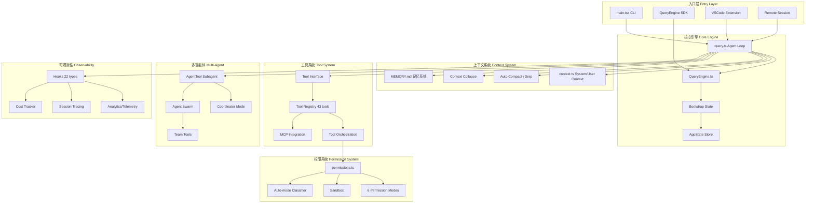

# Claude Code — 源码架构分析 (`src/`)

本文档提供 Claude Code 代码库 `src/` 目录的全面架构概览。

## 项目概述

| 指标 | 数值 |
|---|---|
| **总文件数** | 1,884 |
| **总代码行数** | ~512,664 |
| **子目录数** | 35 |
| **顶层文件数** | 18 |

Claude Code 是一个基于 TypeScript 的终端 Agent 应用，构建在 Bun 运行时之上，采用 React + Ink 渲染 TUI。它是一个多层架构的应用，结合了 CLI 入口、Agent Loop 核心、React TUI 界面、工具/插件生态系统以及广泛的服务集成（MCP、API、Analytics、Memory 等）。

其架构设计遵循三大核心原则：

- **分层解耦**：各层职责清晰，通过明确定义的接口通信
- **流式驱动**：以 async generator 为核心的流式数据处理模型
- **不可变状态**：DeepImmutable<T> 约束下的函数式状态管理

---

## 架构全景图



---

## 架构分层概览

```
┌─────────────────────────────────────────────────────────────────┐
│                         TUI Layer                               │
│  ink/ ── components/ ── hooks/ ── screens/ ── keybindings/     │
│  moreright/ ── outputStyles/ ── vim/ ── voice/                  │
├─────────────────────────────────────────────────────────────────┤
│                      Command & Entry Layer                      │
│  main.tsx ── commands/ ── entrypoints/ ── cli/ ── replLauncher  │
│  dialogLaunchers.tsx ── interactiveHelpers.tsx                  │
├─────────────────────────────────────────────────────────────────┤
│                        Core Agent Layer                         │
│  query.ts ── QueryEngine.ts ── coordinator/ ── query/           │
├─────────────────────────────────────────────────────────────────┤
│                       Tool & Permission Layer                   │
│  Tool.ts ── tools.ts ── tools/ ── schemas/                      │
├─────────────────────────────────────────────────────────────────┤
│                   Context & State Layer                         │
│  context.ts ── history.ts ── state/ ── bootstrap/               │
│  context/ ── constants/ ── types/                               │
├─────────────────────────────────────────────────────────────────┤
│                   Memory & Knowledge Layer                      │
│  memdir/ ── skills/ ── services/SessionMemory/                  │
│  services/MagicDocs/ ── services/PromptSuggestion/              │
├─────────────────────────────────────────────────────────────────┤
│                   Bridge & Remote Layer                         │
│  bridge/ ── remote/ ── server/ ── upstreamproxy/                │
├─────────────────────────────────────────────────────────────────┤
│                       Service Layer                             │
│  services/ (API, MCP, analytics, LSP, voice, settings, …)      │
├─────────────────────────────────────────────────────────────────┤
│                  Infrastructure & Utilities                     │
│  utils/ ── migrations/ ── plugins/ ── native-ts/                │
│  setup.ts ── cost-tracker.ts ── Task.ts ── tasks/               │
└─────────────────────────────────────────────────────────────────┘
```

---

## 模块目录导航

### 1. 入口层 Entry Layer

| 文件 | 行数 | 描述 |
|---|---|---|
| `main.tsx` | ~3000+ | CLI 入口点 — 引导应用启动、解析参数、初始化状态、启动 TUI 或 SDK 模式 |
| `replLauncher.tsx` | 22 | REPL (Read-Eval-Print Loop) 启动入口 |
| `setup.ts` | 477 | 应用设置与初始化工具 |
| `ink.ts` | 85 | Ink TUI 框架配置 |

| 目录 | 文件数 | 行数 | 描述 |
|---|---|---|---|
| `cli/` | 19 | 12,353 | CLI 传输层、参数解析、stdin/stdout 处理器、终端设置 |
| `entrypoints/` | 8 | 4,051 | 入口点定义 — 不同运行模式（CLI、SDK、Remote 等） |
| `commands/` | 189 | 26,428 | 斜杠命令实现（100+ 命令：`/help`、`/cost`、`/compact` 等） |

#### 入口架构

```
src/main.tsx (~3000行)
├── 参数解析 (argparse)
├── Feature Flag 门控 (feature() from bun:bundle)
├── 环境检测 (USER_TYPE, CLAUDE_CODE_ENTRYPOINT)
├── 初始化 (迁移、设置、插件)
├── 交互式 REPL 模式
└── 无头模式 (-p/--print)
```

#### 多客户端入口点检测

| 客户端 | 检测方式 |
|--------|----------|
| CLI | 直接执行 |
| SDK | `CLAUDE_CODE_ENTRYPOINT=sdk` |
| VSCode | Extension 调用 |
| Desktop | Electron 进程 |
| Remote | WebSocket 会话 |
| GitHub Actions | CI 环境检测 |

---

### 2. 核心引擎层 Core Agent Layer

| 文件 | 行数 | 描述 |
|---|---|---|
| `query.ts` | 1,729 | **Agent Loop 核心** — 编排主对话循环：发送提示、处理响应、处理工具调用、管理上下文窗口 |
| `QueryEngine.ts` | 1,295 | **SDK 封装** — Agent Loop 之上的高层 API，提供对 Claude Code 的编程访问 |

| 目录 | 文件数 | 行数 | 描述 |
|---|---|---|---|
| `query/` | 4 | 652 | Query 配置 — 系统提示词、模型选择、参数默认值 |
| `coordinator/` | 1 | 369 | Coordinator 模式 — 管理多步骤编排和子 Agent 委派 |

---

### 3. 上下文与状态层 Context & State Layer

| 文件 | 行数 | 描述 |
|---|---|---|
| `context.ts` | 189 | 系统和用户上下文定义 — 环境、项目配置、用户偏好 |
| `history.ts` | 464 | 消息历史管理 — 对话轮次跟踪、compact/summarize 逻辑 |
| `Task.ts` | 125 | 任务模型定义 |
| `tasks.ts` | 39 | 任务管理入口 |
| `cost-tracker.ts` | 323 | 成本跟踪 — Token 使用量、API 成本计算、预算监控 |
| `costHook.ts` | 22 | 成本跟踪 React Hook |
| `projectOnboardingState.ts` | 83 | 项目引导状态管理 |

| 目录 | 文件数 | 行数 | 描述 |
|---|---|---|---|
| `state/` | 6 | 1,190 | AppState 管理 — 全局应用状态、reducers、selectors |
| `bootstrap/` | 1 | ~1,758 | 全局状态 Bootstrap — 初始化、配置加载、环境检测 |
| `context/` | 9 | 1,004 | React Context Providers — 主题、认证、会话、设置上下文 |
| `constants/` | 21 | 2,648 | 应用常量 — 模型 ID、默认配置、Feature Flags |
| `types/` | 11 | 3,446 | TypeScript 类型定义 — 共享接口、枚举、工具类型 |

#### 双轨状态架构

```
Bootstrap State (全局单例, ~1758行)
├── 模块级 getter/setter
├── 会话生命周期管理
├── Feature Flag 状态
└── 全局配置

AppState Store (不可变状态, 50+ 字段)
├── DeepImmutable<T> 类型约束
├── 函数式更新 setAppState(prev => ({...prev, ...}))
├── 选择器模式 (selectors)
└── 按 Agent 隔离 (每个 subagent 独立副本)
```

---

### 4. 工具与权限层 Tool & Permission Layer

| 文件 | 行数 | 描述 |
|---|---|---|
| `Tool.ts` | 792 | **Tool 接口** — 基础工具类、权限系统、工具结果类型、输入 Schema |
| `tools.ts` | 389 | **Tool 注册表** — 工具发现、注册和生命周期管理 |

| 目录 | 文件数 | 行数 | 描述 |
|---|---|---|---|
| `tools/` | 184 | 50,828 | **工具实现** — 43+ 工具，包括 Bash、Read、Write、Edit、Grep、Glob、Notebook、WebFetch 等 |
| `schemas/` | 1 | 222 | 工具输入输出的 JSON Schema 定义 |

---

### 5. 记忆与知识层 Memory & Knowledge Layer

| 目录 | 文件数 | 行数 | 描述 |
|---|---|---|---|
| `memdir/` | 8 | 1,736 | 记忆目录管理 — 项目记忆文件、CLAUDE.md 加载、跨项目记忆 |
| `skills/` | 20 | 4,066 | 内置 Skills — 按需加载的专用领域指令 |
| `services/SessionMemory/` | 3 | — | 会话级记忆 — 短期上下文持久化 |
| `services/MagicDocs/` | 2 | — | Magic Docs — 自动生成文档 |
| `services/PromptSuggestion/` | 2 | — | Prompt 建议 — 上下文感知的提示推荐 |

---

### 6. TUI 层 TUI Layer

| 目录 | 文件数 | 行数 | 描述 |
|---|---|---|---|
| `ink/` | 96 | 19,842 | **TUI 渲染引擎** — Ink 的定制版本（React for CLI），处理终端渲染、布局、输入 |
| `components/` | 389 | 81,546 | **React UI 组件库** — 完整组件库：消息、工具输出、状态栏、对话框等 |
| `hooks/` | 104 | 19,204 | **React Hooks** — 自定义 Hook：状态、副作用、键盘处理、动画 |
| `screens/` | 3 | 5,977 | 屏幕级组件 — 全页面布局（主屏幕、设置、引导） |
| `keybindings/` | 14 | 3,159 | 键盘快捷键系统 — 键映射定义、组合键处理、Vim 模式支持 |
| `moreright/` | 1 | 25 | UI 工具 — 右侧面板辅助函数 |
| `outputStyles/` | 1 | 98 | 输出样式定义 — 终端输出的格式化、颜色、主题 |
| `vim/` | 5 | 1,513 | Vim 模式 — Vim 键绑定和命令模式模拟 |
| `voice/` | 1 | 54 | 语音功能入口 |

---

### 7. 桥接与远程层 Bridge & Remote Layer

| 目录 | 文件数 | 行数 | 描述 |
|---|---|---|---|
| `bridge/` | 31 | 12,613 | **远程通信** — WebSocket 传输、SSE 流式传输、消息序列化、连接管理 |
| `remote/` | 4 | 1,127 | 远程会话管理 — SDK 消息适配器、远程权限桥接、会话 WebSocket |
| `server/` | 3 | 358 | 服务器工具 — HTTP 服务器设置、健康检查 |
| `upstreamproxy/` | 2 | 740 | 上游代理 — 请求转发、代理配置 |

---

### 8. 服务层 Service Layer

| 目录 | 文件数 | 行数 | 描述 |
|---|---|---|---|
| `services/` (根) | 130 | 53,680 | **服务层** — 全面的服务集成 |

核心服务子模块：

| 子模块 | 描述 |
|---|---|
| `services/api/` | API 客户端 — 会话入口、重试逻辑、用量跟踪、错误处理、Claude API 集成 |
| `services/mcp/` | MCP (Model Context Protocol) — 服务器连接、OAuth、认证、配置、传输层、elicitation |
| `services/analytics/` | Analytics — DataDog、GrowthBook、第一方事件日志、指标 |
| `services/lsp/` | LSP (Language Server Protocol) — 客户端、服务器管理器、诊断注册表 |
| `services/voice*` | 语音服务 — 流式 STT、关键词检测、语音管道 |
| `services/autoDream/` | Auto Dream — 后台整合、配置 |
| `services/tips/` | Tips 系统 — 提示注册表、调度器、历史记录 |
| `services/teamMemorySync/` | 团队记忆同步 — 密钥扫描、监听器、类型定义 |
| `services/settingsSync/` | 设置同步 — 跨设备设置同步 |
| `services/plugins/` | 插件安装管理器 |
| `services/toolUseSummary/` | 工具使用摘要生成 |
| `services/notifier.ts` | 通知服务 |
| `services/preventSleep.ts` | 睡眠阻止服务 |
| `services/diagnosticTracking.ts` | 诊断跟踪 |
| `services/claudeAiLimits.ts` | Claude AI 速率限制处理 |
| `services/internalLogging.ts` | 内部日志服务 |

---

### 9. 命令层 Commands Layer

| 目录 | 文件数 | 行数 | 描述 |
|---|---|---|---|
| `commands/` | 189 | 26,428 | **斜杠命令定义** — 100+ 命令按类别组织 |

命令类别包括：
- **会话 Session**：`/clear`、`/compact`、`/continue`、`/resume`
- **配置 Configuration**：`/config`、`/theme`、`/model`
- **工具 Tools**：`/tools`、`/mcp`
- **信息 Information**：`/help`、`/cost`、`/stats`
- **文件操作 File operations**：`/read`、`/edit`
- **以及更多…**

---

### 10. 状态与任务管理 State & Task Management

| 目录 | 文件数 | 行数 | 描述 |
|---|---|---|---|
| `tasks/` | 12 | 3,286 | 任务管理 — 任务创建、生命周期、子任务委派、任务状态机 |
| `assistant/` | 1 | 87 | 会话历史 — 助手端对话跟踪 |

---

### 11. Buddy 与伴侣 Buddy & Companion

| 目录 | 文件数 | 行数 | 描述 |
|---|---|---|---|
| `buddy/` | 6 | 1,298 | 伴侣/Buddy 功能 — AI 助手人格、对话辅助工具 |

---

### 12. 基础设施与工具层 Infrastructure & Utilities

| 目录 | 文件数 | 行数 | 描述 |
|---|---|---|---|
| `utils/` | 564 | 180,472 | **工具函数库** — 最大的模块：字符串操作、文件 I/O、路径处理、格式化、验证、异步辅助函数以及数百个领域专用工具 |
| `migrations/` | 11 | 603 | 数据迁移 — Schema 版本控制、配置迁移脚本 |
| `plugins/` | 2 | 182 | 插件系统 — 插件加载器、插件接口 |
| `native-ts/` | 4 | 4,081 | 原生 TypeScript 绑定 — 平台特定的原生代码接口 |

---

## 模块依赖图

```
                    ┌──────────┐
                    │  main.tsx │
                    └─────┬────┘
                          │
              ┌───────────┼───────────┐
              ▼           ▼           ▼
        ┌──────────┐ ┌────────┐ ┌──────────┐
        │  cli/    │ │ ink/   │ │entrypoints│
        └─────┬────┘ └───┬────┘ └──────────┘
              │          │
              ▼          ▼
        ┌──────────────────────┐
        │    commands/         │
        │  dialogLaunchers     │
        │  interactiveHelpers  │
        └──────────┬───────────┘
                   │
          ┌────────┼────────┐
          ▼        ▼        ▼
    ┌─────────┐ ┌──────┐ ┌────────┐
    │ query.ts│ │Tool.ts│ │context │
    └────┬────┘ └──┬───┘ └───┬────┘
         │         │         │
         ▼         ▼         ▼
    ┌──────────────────────────────┐
    │       QueryEngine.ts         │
    │       coordinator/           │
    └──────────────┬───────────────┘
                   │
          ┌────────┼────────────────┐
          ▼        ▼                ▼
    ┌─────────┐ ┌──────┐    ┌──────────┐
    │ tools/  │ │history│    │ services/│
    └────┬────┘ └───┬───┘    └────┬─────┘
         │          │              │
         ▼          ▼              ▼
    ┌──────────────────────────────────┐
    │         state/                   │
    │         bootstrap/               │
    │         memdir/                  │
    │         skills/                  │
    └──────────────────────────────────┘
                   │
          ┌────────┼────────┐
          ▼        ▼        ▼
    ┌─────────┐ ┌──────┐ ┌────────┐
    │ bridge/ │ │remote│ │ utils/ │
    └─────────┘ └──────┘ └────────┘
```

---

## 关键文件索引

| 组件 | 核心文件 | 行数 |
|------|----------|------|
| **入口** | `src/main.tsx` | ~3000+ |
| **Agent Loop** | `src/query.ts` | 1,729 |
| **Query Engine** | `src/QueryEngine.ts` | 1,295 |
| **Tool 接口** | `src/Tool.ts` | 792 |
| **Tool 注册** | `src/tools.ts` | 389 |
| **Tool 编排** | `src/services/tools/toolOrchestration.ts` | 188 |
| **权限引擎** | `src/utils/permissions/permissions.ts` | 1,486 |
| **权限模式** | `src/utils/permissions/PermissionMode.ts` | 141 |
| **Hooks** | `src/utils/hooks.ts` | 5,022 |
| **Agent Tool** | `src/tools/AgentTool/AgentTool.tsx` | ~1,400 |
| **Run Agent** | `src/tools/AgentTool/runAgent.ts` | ~973 |
| **Coordinator** | `src/coordinator/coordinatorMode.ts` | 369 |
| **Swarm 权限** | `src/utils/swarm/permissionSync.ts` | 928 |
| **Memory** | `src/memdir/memdir.ts` | 507 |
| **State** | `src/bootstrap/state.ts` | ~1,758 |
| **AppState** | `src/state/AppStateStore.ts` | 569 |

---

## 文件统计

### 顶层文件

| 文件 | 行数 |
|---|---|
| `main.tsx` | 4,683 |
| `commands.ts` | 754 |
| `query.ts` | 1,729 |
| `QueryEngine.ts` | 1,295 |
| `Tool.ts` | 792 |
| `tools.ts` | 389 |
| `history.ts` | 464 |
| `setup.ts` | 477 |
| `context.ts` | 189 |
| `cost-tracker.ts` | 323 |
| `interactiveHelpers.tsx` | 365 |
| `Task.ts` | 125 |
| `dialogLaunchers.tsx` | 132 |
| `ink.ts` | 85 |
| `projectOnboardingState.ts` | 83 |
| `tasks.ts` | 39 |
| `costHook.ts` | 22 |
| `replLauncher.tsx` | 22 |
| **总计** | **11,967** |

### 子目录 (按行数排序)

| 目录 | 文件数 | 行数 | 占比 |
|---|---|---|---|
| `utils/` | 564 | 180,472 | 35.2% |
| `components/` | 389 | 81,546 | 15.9% |
| `services/` | 130 | 53,680 | 10.5% |
| `tools/` | 184 | 50,828 | 9.9% |
| `commands/` | 189 | 26,428 | 5.2% |
| `ink/` | 96 | 19,842 | 3.9% |
| `hooks/` | 104 | 19,204 | 3.7% |
| `bridge/` | 31 | 12,613 | 2.5% |
| `cli/` | 19 | 12,353 | 2.4% |
| `native-ts/` | 4 | 4,081 | 0.8% |
| `skills/` | 20 | 4,066 | 0.8% |
| `tasks/` | 12 | 3,286 | 0.6% |
| `keybindings/` | 14 | 3,159 | 0.6% |
| `types/` | 11 | 3,446 | 0.7% |
| `constants/` | 21 | 2,648 | 0.5% |
| `screens/` | 3 | 5,977 | 1.2% |
| `entrypoints/` | 8 | 4,051 | 0.8% |
| `bootstrap/` | 1 | 1,758 | 0.3% |
| `memdir/` | 8 | 1,736 | 0.3% |
| `vim/` | 5 | 1,513 | 0.3% |
| `buddy/` | 6 | 1,298 | 0.3% |
| `state/` | 6 | 1,190 | 0.2% |
| `remote/` | 4 | 1,127 | 0.2% |
| `context/` | 9 | 1,004 | 0.2% |
| `upstreamproxy/` | 2 | 740 | 0.1% |
| `query/` | 4 | 652 | 0.1% |
| `migrations/` | 11 | 603 | 0.1% |
| `coordinator/` | 1 | 369 | 0.1% |
| `server/` | 3 | 358 | 0.1% |
| `schemas/` | 1 | 222 | <0.1% |
| `plugins/` | 2 | 182 | <0.1% |
| `outputStyles/` | 1 | 98 | <0.1% |
| `assistant/` | 1 | 87 | <0.1% |
| `voice/` | 1 | 54 | <0.1% |
| `moreright/` | 1 | 25 | <0.1% |
| **总计** | **1,884** | **512,664** | **100%** |

---

## 核心设计理念总结

### 1. 分层解耦 Layered Decoupling

架构采用清晰的分层设计，每层职责单一且通过明确定义的接口通信：

- **入口层**：负责参数解析、环境检测、模式选择
- **引擎层**：Agent Loop 核心逻辑，流式驱动
- **上下文层**：系统/用户上下文、会话历史、状态管理
- **工具层**：工具注册、执行、权限控制
- **服务层**：外部系统集成（API、MCP、Analytics）
- **TUI 层**：终端渲染、用户交互

### 2. 流式驱动 Streaming-Driven

- 以 **async generator** 为核心的数据处理模型
- 所有 I/O 操作均为流式：API 响应、工具输出、TUI 渲染
- 支持实时反馈，无需等待完整响应

### 3. 不可变状态 Immutable State

- **DeepImmutable<T>** 类型约束确保状态不可变性
- 函数式更新模式：`setAppState(prev => ({...prev, ...}))`
- 选择器模式 (selectors) 避免不必要的重渲染
- 按 Agent 隔离：每个 subagent 拥有独立状态副本

### 4. 多客户端统一架构

通过**入口点检测**实现一套代码支持多种运行模式：

| 模式 | 入口点标识 |
|------|------------|
| CLI | 直接执行 |
| SDK | `CLAUDE_CODE_ENTRYPOINT=sdk` |
| VSCode | Extension 调用 |
| Remote | WebSocket 会话 |
| GitHub Actions | CI 环境检测 |

### 5. 可扩展的工具系统

- **Tool Registry** 管理 43+ 内置工具
- **MCP Integration** 支持外部工具扩展
- **Tool Orchestration** 编排复杂工具调用链
- 统一的权限控制模型

---

## 快速参考：关键入口点

| 用途 | 文件 |
|---|---|
| 启动 CLI | `main.tsx` |
| Agent Loop 逻辑 | `query.ts` |
| SDK 集成 | `QueryEngine.ts` |
| Tool 接口 | `Tool.ts` |
| Tool 注册表 | `tools.ts` |
| 命令定义 | `commands/` |
| TUI 引擎 | `ink/` |
| 状态管理 | `state/`, `bootstrap/` |
| API 客户端 | `services/api/` |
| MCP 集成 | `services/mcp/` |
| 远程/桥接 | `bridge/`, `remote/` |
| 工具函数 | `utils/` |
